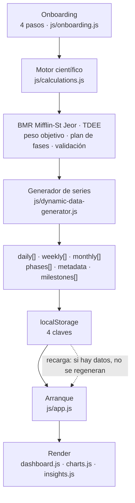

# TransformLab

Aplicación web de página única que genera una proyección día a día de una transformación física a partir de un
perfil corporal introducido en un asistente de cuatro pasos. Calcula un plan por fases (adaptación, recomposición,
definición, volumen, transición, mantenimiento) y lo presenta en un panel con tarjetas de métricas, una gráfica
Chart.js multi-eje y un panel de insights. Funciona íntegramente en el navegador: sin backend, sin build y sin
cuentas de usuario.

> **Estado:** proyecto personal en desarrollo, no apto para uso real · **Última revisión:** 1 de agosto de 2026 ·
> **Versión auditada:** v3.1 (árbol de trabajo local, `main @ 264c1db`) · **`origin/main`:** v4.0 (`d0afa49`), sin auditar

---

## Aviso de estado

> **Las proyecciones que muestra la aplicación son actualmente incorrectas en su configuración por defecto.**
>
> El motor de composición corporal contiene un defecto que afecta a todo usuario que no introduzca una medición
> de masa muscular por bioimpedancia — es decir, la ruta que sigue el asistente por omisión.
> `Calculations.calculateTargetWeight` limita el "otro tejido magro" al rango [2, 10] kg (`js/calculations.js:191`),
> mientras que el propio asistente estima el músculo como el 48 % de la masa magra
> (`Calculations.estimateMuscleFromComposition`, `js/calculations.js:222`), con lo que ese tejido vale realmente
> 22-35 kg. El clamp descuenta entre 12 y 25 kg de tejido magro que existe, lo que rebaja el peso objetivo
> entre 17 y 35 kg.
>
> Prueba de identidad ejecutada sobre el código (pedir como objetivo la composición **actual** debería devolver el
> peso **actual**): hombre de 80 kg y 20 % de grasa → **50,9 kg** (IMC 15,7); mujer de 60 kg y 28 % → **42,6 kg**;
> hombre de 95 kg y 30 % → **59,9 kg**.
>
> El proyecto no tiene tests, ni `.gitignore`, ni `LICENSE`, ni ficheros de dependencias. La auditoría registra
> **5 defectos críticos**, todos con efecto directo sobre las cifras que se muestran al usuario.
> Detalle completo en [docs/AUDITORIA.md](docs/AUDITORIA.md).

> **Alcance: esta documentación describe el árbol de trabajo local, `main @ 264c1db` (v3.1).** El árbol local está
> tres commits por detrás de `origin/main` (`d0afa49`), que es la v4.0. Consecuencia práctica: quien clone el
> repositorio obtiene la v4.0, no lo que se describe aquí; para reproducir esta documentación hay que situarse en
> `264c1db`, y para trabajar sobre el producto publicado hay que hacer `git pull`.
>
> **El defecto crítico está confirmado también en la v4.0 publicada.** Verificado ejecutando
> `git show origin/main:js/calculations.js` en Node: el clamp `Math.max(2, Math.min(10, calculatedOtherLean))`
> sigue presente y la prueba de identidad devuelve cifras idénticas a las de v3.1 (80 kg / 20 % → 50,9 kg;
> 60 kg / 28 % → 42,6 kg; 95 kg / 30 % → 59,9 kg; 70 kg / 12 % → 45,0 kg). También sobrevive la rama muerta de
> `calculateCaloricTarget` (punto 2 de «Estado del código»): con `'recomp'` el déficit es de 138 kcal, con
> `'recomposition'` —el valor que realmente llega— es 0. El resto de hallazgos **no** se ha verificado contra la v4.0: entre v3.1 y v4.0,
> `js/calculations.js` cambió +333 líneas y `js/dynamic-data-generator.js` +162, así que no deben darse por
> válidos allí sin comprobarlos.

---

## Cómo ejecutarlo

No hay build, ni instalación de dependencias, ni proceso de arranque. Basta con servir el directorio como
ficheros estáticos:

```bash
cd /ruta/a/transformLab
python3 -m http.server 8000
```

Y abrir <http://localhost:8000>.

**Por qué un servidor y no abrir `index.html` con `file://`:** `file://` funciona para cargar y ejecutar la
aplicación (no hay ninguna llamada de red propia y todas las rutas son relativas), pero el comportamiento de
`localStorage` bajo origen opaco varía entre navegadores; para trabajar y para reproducir el estado real usa
`python3 -m http.server 8000`. Con un servidor HTTP local el origen es estable (`http://localhost:8000`) y el
comportamiento es el mismo que en producción.

**Requisitos:**

- Navegador moderno con soporte de ES6 (`const`/`let`, clases, plantillas de cadena, módulos no requeridos).
- Conexión a internet en la primera carga: Chart.js se descarga desde el CDN de jsDelivr y la tipografía Outfit
  desde Google Fonts (`index.html:25-26`). Sin red, la gráfica no se dibuja y la aplicación muestra el mensaje
  genérico de error.

---

## Estructura del proyecto

```text
transformLab/
├── index.html                          164 líneas · única página; carga 7 scripts en orden fijo
├── styles_new.css                    2 704 líneas · hoja de estilos completa de la aplicación
├── README.md                           263 líneas · este documento
├── robots.txt                            5 líneas
├── .DS_Store                                       versionado por error (no hay .gitignore)
│
├── js/
│   ├── calculations.js                 659 líneas · [1] motor científico (BMR, TDEE, fases, validación)
│   ├── dynamic-data-generator.js       737 líneas · [2] generación de series diaria/semanal/mensual
│   ├── onboarding.js                   963 líneas · [3] asistente de 4 pasos y persistencia del perfil
│   ├── app.js                          742 líneas · [4] estado global, navegación, arranque
│   ├── dashboard.js                    686 líneas · [5] render de tarjetas, timeline y fases
│   ├── charts.js                       607 líneas · [6] gráfica Chart.js multi-eje
│   ├── insights.js                     194 líneas · [7] panel de observaciones
│   └── milestones.js                   895 líneas · NO SE CARGA en este árbol (sí en origin/main)
│
├── css/
│   └── milestones.css                1 381 líneas · NO SE CARGA — código muerto
│
├── docs/                                           diez documentos técnicos (ver la tabla Documentación)
│
├── aesthetic_milestones_complete.json     76 KB   · NO SE CARGA — ningún fichero lo referencia
└── test-calculation.js                 182 líneas · NO SE CARGA — script suelto de Node, no es un test automatizado
```

**El árbol de arriba corresponde al árbol de trabajo local (v3.1).** `origin/main` (v4.0) incluye además cinco módulos
que aquí no existen — `js/router.js`, `js/checkin.js`, `js/nutrition.js`, `js/training.js` y
`js/body-visualizer.js` — y su `index.html` carga trece scripts en lugar de siete.

Sobre el código muerto, con la distinción entre árbol local y `origin/main` hecha explícita:

- `js/milestones.js` (895 líneas) no se carga en este árbol, pero **sí** en `origin/main`
  (`git show origin/main:index.html`, línea 247). No es código muerto en el producto publicado.
- `css/milestones.css` (1 381 líneas) y `aesthetic_milestones_complete.json` (76 KB) no tienen ninguna referencia
  ni en este árbol ni en `origin/main`; verificado con `git grep` sobre ambas revisiones.

La generación de hitos que sí se usa en v3.1 vive dentro de `js/dynamic-data-generator.js:573`.

La rama `claude/silly-yonath` **está fusionada y publicada**: llegó a `main` por el PR #1
(merge `d0afa49`) y es lo que hoy sirve `origin/main`. No es una rama huérfana ni corre riesgo de perderse; el
trabajo de reintegración ya está hecho. Lo que procede en este árbol no es eliminar ni reintegrar nada, sino
`git pull`.

---

## Cómo funciona en una página



1. **Onboarding.** El asistente recoge datos personales, composición actual, objetivos y preferencias. Si el
   usuario no aporta masa muscular medida, se autorrellena con el 48 % de la masa magra
   (`js/onboarding.js:521`, `:681`, `:790`).
2. **Cálculo.** `Calculations` deriva BMR y TDEE, calcula el peso objetivo, decide la secuencia de fases y sus
   duraciones (`calculatePhaseDurations`, `js/calculations.js:293`) y valida los datos.
3. **Generación.** `DataGenerator.generateTransformationData` (`js/dynamic-data-generator.js:15`) interpola la
   evolución día a día dentro de cada fase y agrega las vistas semanal y mensual.
4. **Persistencia.** El perfil y las series generadas se serializan a `localStorage`.
5. **Render.** `app.js` carga el estado, calcula la posición temporal actual y delega en `dashboard.js`,
   `charts.js` e `insights.js`.

El detalle de módulos, dependencias y contratos está en [docs/ARQUITECTURA.md](docs/ARQUITECTURA.md).

---

## Datos y privacidad

**La aplicación no realiza ninguna llamada de red.** No hay `fetch`, ni `XMLHttpRequest`, ni telemetría, ni
analítica. Las únicas peticiones salientes son la descarga de Chart.js y de la tipografía declaradas en el HTML.
Los datos de salud introducidos nunca salen del navegador.

Todo el estado vive en cuatro claves de `localStorage`, en texto plano, sin cifrar, sin número de versión y sin
caducidad:

| Clave | Contenido | Escrita en |
|---|---|---|
| `transformlab_userProfile` | Perfil completo: sexo, edad, altura, peso, % de grasa, objetivos | `js/onboarding.js:57` |
| `transformlab_generatedData` | Series diaria, semanal y mensual, fases, metadatos e hitos | `js/app.js:166` |
| `transformlab_prefs` | Preferencias de vista (granularidad, métricas activas) | `js/app.js:442` |
| `transformlab_startDate` | Fecha de inicio del plan, en ISO | `js/app.js:447` |

**Cómo borrarlo.** El botón «Reiniciar configuración» (`resetProfile()`, `js/app.js:216`) pide confirmación y
elimina `transformlab_userProfile`, `transformlab_generatedData` y `transformlab_prefs`. **No borra
`transformlab_startDate`**, que queda huérfana. Para un borrado completo, desde la consola del navegador:

```js
['transformlab_userProfile','transformlab_generatedData','transformlab_prefs','transformlab_startDate']
  .forEach(k => localStorage.removeItem(k));
```

---

## Estado del código

Auditoría multi-agente de 7 áreas con verificación adversarial: 138 hallazgos emitidos, **130 confirmados**.

| Severidad | Nº | | Tipo | Nº |
|---|---:|---|---|---:|
| Crítica | 5 | | BUG | 62 |
| Alta | 21 | | DEUDA | 34 |
| Media | 59 | | RIESGO | 25 |
| Baja | 45 | | MEJORA | 9 |
| **Total** | **130** | | **Total** | **130** |

Consecuencias prácticas más importantes, en lenguaje llano:

1. **El peso objetivo que ve el usuario es entre 17 y 35 kg más bajo de lo que corresponde** siempre que no haya
   datos de bioimpedancia. El mismo clamp se repite en el generador (`js/dynamic-data-generator.js:24`), de modo
   que también hunde la serie diaria completa, no solo la cifra objetivo.
2. **La fase de recomposición no aplica ningún déficit calórico.** El `case 'recomp'` de `calculateCaloricTarget`
   (`js/calculations.js:117`) es una rama muerta: el generador invoca la función con `phase.type`
   (`js/dynamic-data-generator.js:181`), cuyo valor real es `'recomposition'`. La fase cae en el `default` y
   recibe calorías de mantenimiento.
3. **La validación de seguridad puede desactivarse por completo.** Si `sex` toma un valor no reconocido,
   `MIN_SAFE_FAT[sex]` y `MAX_FAT[sex]` son `undefined` (`js/calculations.js:454-455`) y toda comparación de
   porcentaje de grasa da `false`: un objetivo del 2 % de grasa corporal pasa la validación sin un solo error.
4. **Sin bioimpedancia, el asistente puede volverse imposible de completar.** El peso objetivo artificialmente
   bajo dispara el error bloqueante de `js/calculations.js:496`, y con perfiles de complexión pequeña casi
   ningún objetivo de definición es aceptado.

El defecto crítico se introdujo **al corregir otro defecto**. El commit inicial se titula «TransformLab v3.1 -
Fixed target calculations» (`d424451`) y el clamp `[2, 10]` ya está en él; los comentarios de
`js/calculations.js:166` («FIXED: Now correctly handles measured muscle mass by preserving the "other lean
tissue"») y de `js/dynamic-data-generator.js:89`, `:123` y `:138` («FIXED: Uses otherLeanTissue instead of
incorrect 0.48 ratio») lo identifican como el arreglo que da nombre a la versión. Se sustituyó el ratio 0,48 por
`otherLeanTissue` con un clamp, sin advertir que el asistente sigue alimentando `muscleKg` con ese mismo ratio
(`js/onboarding.js:521`, `:681`, `:790`). El arreglo y el punto que lo invalida conviven en el mismo commit.

Las fórmulas de libro sí son correctas y están verificadas: `calculateBMR(80, 180, 30, 'male')` devuelve
1780 kcal, exactamente Mifflin-St Jeor; los multiplicadores de actividad (1,2 / 1,375 / 1,55 / 1,725 / 1,9) y las
tasas de pérdida de grasa (0,5 / 0,75 / 1 % del peso corporal por semana, Aragon 2017) coinciden con la
bibliografía. El problema no está en las ecuaciones, sino en el modelo de composición corporal que las alimenta.

Catálogo completo en [docs/CATALOGO-DE-HALLAZGOS.md](docs/CATALOGO-DE-HALLAZGOS.md).

---

## Documentación

| Documento | Contenido |
|---|---|
| [docs/ARQUITECTURA.md](docs/ARQUITECTURA.md) | Módulos, orden de carga, acoplamiento por globals, flujo de datos y puntos de extensión. |
| [docs/MODELO-DE-DATOS.md](docs/MODELO-DE-DATOS.md) | Estructuras de `userProfile`, `daily`/`weekly`/`monthly`, `phases`, `metadata` y esquema de `localStorage`. |
| [docs/METODOLOGIA-CIENTIFICA.md](docs/METODOLOGIA-CIENTIFICA.md) | Ecuaciones empleadas, referencias bibliográficas, supuestos del modelo y dónde se desvía del papel. |
| [docs/AUDITORIA.md](docs/AUDITORIA.md) | Metodología de la auditoría, alcance por áreas y análisis de los 5 defectos críticos. |
| [docs/CATALOGO-DE-HALLAZGOS.md](docs/CATALOGO-DE-HALLAZGOS.md) | Los 130 hallazgos confirmados con fichero, línea, escenario de fallo y arreglo propuesto. |
| [docs/DEUDA-TECNICA.md](docs/DEUDA-TECNICA.md) | Código muerto, ausencia de tests y de tooling, riesgos de dependencias, divergencia con `origin/main`. |
| [docs/GUIA-DE-DESARROLLO.md](docs/GUIA-DE-DESARROLLO.md) | Cómo trabajar en el proyecto: convenciones, depuración, verificación manual y orden sugerido de arreglos. |
| [docs/REFERENCIA-INTERNA.md](docs/REFERENCIA-INTERNA.md) | Referencia interna de CSS, contenedores del DOM y funciones globales. |
| [docs/HISTORIAL-Y-RAMAS.md](docs/HISTORIAL-Y-RAMAS.md) | Historial de versiones y estado de las ramas. |
| [docs/VERIFICACION-MANUAL.md](docs/VERIFICACION-MANUAL.md) | Guion de prueba de humo reproducible. |

---

## Stack y dependencias

- **HTML5 + CSS3 + JavaScript ES6 vanilla.** Sin framework, sin bundler, sin transpilador, sin gestor de paquetes
  (no existe `package.json`). Los módulos son objetos literales expuestos en `window` y cargados por orden en
  `index.html:156-162`.
- **Chart.js** — CDN de jsDelivr, `index.html:26`, **sin versión fijada y sin integridad SRI**, en modo
  render-blocking. Cualquier cambio mayor aguas arriba llega directamente a la aplicación.
- **Google Fonts (Outfit)** — `index.html:25`, con `preconnect`.
- **Sin backend, sin base de datos, sin autenticación.**
- El HTML declara `v3.0` en el pie (`index.html:150`) mientras `js/calculations.js:4` declara `v3.1`.

Superficie de riesgo relevante para quien toque el render: 38 usos de `innerHTML` repartidos entre
`onboarding.js` (15), `milestones.js` (9), `dashboard.js` (8), `app.js` (2), `charts.js` (2) e `insights.js` (2).
No hay `eval`, ni `new Function`, ni `document.write`.

## Licencia

**No hay fichero `LICENSE` en el repositorio.** En ausencia de una licencia explícita, el código queda bajo
derechos de autor por defecto: *todos los derechos reservados*. Nadie salvo el titular tiene permiso para copiar,
modificar, distribuir ni reutilizar este código. Si la intención es abrirlo, hay que añadir un `LICENSE` explícito.
