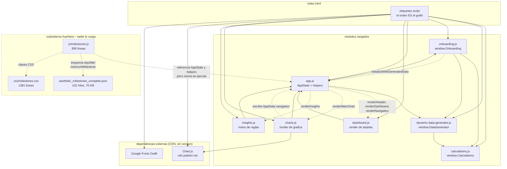
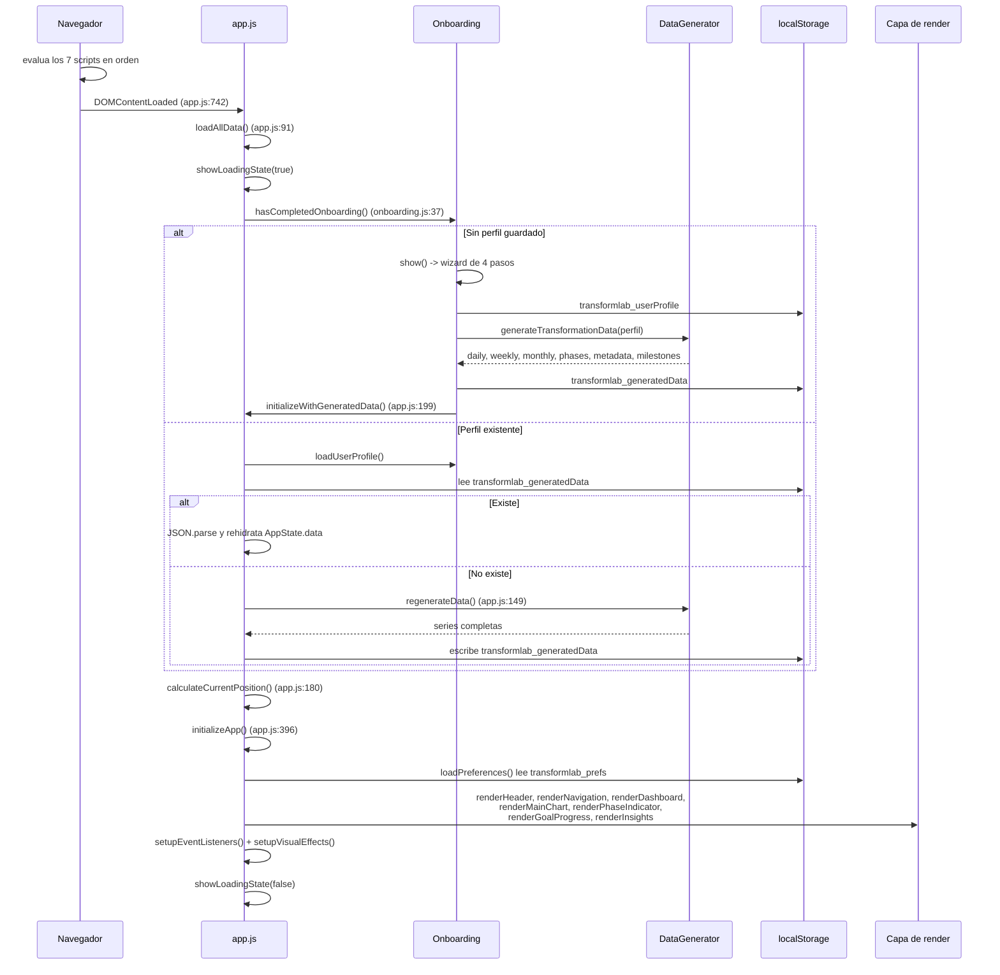

# Arquitectura

Este documento describe cómo está construido TransformLab: qué módulos existen, cómo se comunican entre sí, en qué orden se ejecutan y qué consecuencias tienen las decisiones estructurales del proyecto.

> **Estado:** funcional con defectos críticos conocidos en el motor de cálculo · **Última revisión:** 1 de agosto de 2026 · **Versión auditada:** v3.1, commit `264c1db`

Documentos relacionados: [README](../README.md) · [Modelo de datos](MODELO-DE-DATOS.md) · [Metodología científica](METODOLOGIA-CIENTIFICA.md) · [Auditoría](AUDITORIA.md) · [Catálogo de hallazgos](CATALOGO-DE-HALLAZGOS.md) · [Deuda técnica](DEUDA-TECNICA.md) · [Guía de desarrollo](GUIA-DE-DESARROLLO.md)

> ### ⚠️ Alcance de este documento
>
> Todo lo que sigue describe el **árbol de trabajo local, `main` @ `264c1db` (v3.1)**. Ése es el código que se ha leído, ejecutado y medido para escribir estas páginas.
>
> **Ese árbol no es la versión publicada.** `git status -sb` informa de `## main...origin/main [behind 3]`: `origin/main` está en `d0afa49` y contiene tres commits que aquí no existen —`a701308` (*Upgrade TransformLab v3.1 → v4.0: multi-screen platform with real data*), `72e8e13` (*fix: router timing, milestone normalization, SVG gradient IDs*) y el merge `d0afa49` del PR #1. La rama `claude/silly-yonath` **está fusionada y publicada**: es el `main` remoto, no una rama abandonada.
>
> La v4.0 **no se ha auditado**. Las secciones §1 a §9 no la describen. Lo que sí está verificado sobre ella —trece scripts, enrutador, cuatro módulos funcionales nuevos— se resume en [§10](#10-la-arquitectura-publicada-v40).
>
> Lo que **sí sobrevive a la actualización**: el defecto crítico del peso objetivo y la rama muerta de `calculateCaloricTarget` siguen presentes en `origin/main`, comprobados ejecutando `git show origin/main:js/calculations.js` en Node con resultados idénticos a los de v3.1. La prioridad número uno del plan de remediación no cambia.

---

## 1. Visión general

TransformLab es una **aplicación de página única servida como ficheros estáticos**. No hay build, ni framework, ni bundler, ni backend, ni proceso de servidor: `index.html` (164 líneas) se abre directamente y carga una hoja de estilos y siete scripts clásicos.

```html
<!-- index.html:156-162 -->
<script src="js/calculations.js"></script>
<script src="js/dynamic-data-generator.js"></script>
<script src="js/onboarding.js"></script>
<script src="js/app.js"></script>
<script src="js/dashboard.js"></script>
<script src="js/charts.js"></script>
<script src="js/insights.js"></script>
```

No son módulos ES. No hay `import`, no hay `export`, no hay `type="module"`. Cada fichero se evalúa en el ámbito global y publica lo que quiere compartir colgándolo de `window`:

| Publicado en `window` | Fichero | Punto de publicación |
|---|---|---|
| `Calculations` | `js/calculations.js` | `calculations.js:658` |
| `DataGenerator` | `js/dynamic-data-generator.js` | `dynamic-data-generator.js:736` |
| `Onboarding` | `js/onboarding.js` | `onboarding.js:962` |
| `AppState`, `METRIC_COLORS`, `PHASE_COLORS` y ~40 funciones globales | `js/app.js` | declaraciones de nivel superior (`app.js:8`, `app.js:54`, `app.js:79`) |
| `renderHeader`, `renderDashboard`, `renderMainChart`, `renderInsights`, … | `dashboard.js`, `charts.js`, `insights.js` | declaraciones de nivel superior |

`js/app.js`, `js/dashboard.js`, `js/charts.js` y `js/insights.js` ni siquiera usan un objeto contenedor: declaran funciones y constantes sueltas en el ámbito global, que quedan accesibles desde cualquier otro fichero.

### Implicaciones de este modelo

- **El orden de las etiquetas `<script>` es el grafo de dependencias.** No está escrito en ningún otro sitio. `dynamic-data-generator.js` invoca `Calculations` en su cuerpo (`dynamic-data-generator.js:39`), así que debe cargarse después; `charts.js` lee `AppState` y `METRIC_COLORS`, así que debe ir después de `app.js`. Reordenar las etiquetas rompe la aplicación sin ningún aviso en tiempo de carga.
- **Hay referencias hacia delante que sólo funcionan por temporización.** `app.js` llama a `renderHeader()`, `renderMainChart()` y `renderInsights()` (`app.js:401-407`), definidas en ficheros que se cargan *después*. Funciona porque esas llamadas ocurren dentro del manejador de `DOMContentLoaded` (`app.js:742`), cuando todos los scripts ya se evaluaron. La misma técnica se usa en sentido inverso: `onboarding.js:883` comprueba `typeof initializeWithGeneratedData === 'function'` antes de llamarla, porque `app.js` se carga después que él.
- **No hay encapsulación ni frontera de módulo.** Cualquier fichero puede leer y escribir el estado de cualquier otro. `charts.js:410-418` escribe directamente en `AppState.navigation` desde el manejador de clic del gráfico; `dynamic-data-generator.js:51` muta `userProfile.target.weight`, un objeto que pertenece al onboarding y que ya se había persistido.
- **No hay árbol de dependencias explícito ni gestor de paquetes.** No existe `package.json`. Las dos únicas dependencias externas —Chart.js y la fuente Outfit— se declaran como etiquetas en `index.html` (`index.html:25-26`), sin versión fijada.
- **No hay tests ni sistema de pruebas.** `test-calculation.js` es un script suelto de Node que reimplementa las fórmulas en lugar de importar `calculations.js`, por lo que no puede detectar regresiones en el código real (ver [Deuda técnica](DEUDA-TECNICA.md)).

---

## 2. Mapa de módulos

Los siete módulos que `index.html` carga y ejecuta:

| Fichero | Líneas | Responsabilidad | Expone | Consume |
|---|---:|---|---|---|
| `js/calculations.js` | 659 | Motor científico puro: fórmulas metabólicas, composición corporal, plan de fases y validación. | `Calculations` | — |
| `js/dynamic-data-generator.js` | 737 | Convierte un perfil en la proyección completa: fases con fechas, serie diaria, agregados semanales y mensuales, metadatos e hitos. | `DataGenerator` | `Calculations` |
| `js/onboarding.js` | 963 | Asistente de 4 pasos, validación de entrada, persistencia del perfil y arranque de la primera generación. | `Onboarding` | `Calculations`, `DataGenerator`, `initializeWithGeneratedData` |
| `js/app.js` | 742 | Estado global `AppState`, ciclo de vida, navegación, preferencias, helpers de fecha y formato, modal de ajustes. | `AppState`, `METRIC_COLORS`, `PHASE_COLORS`, helpers, `initializeApp`, `regenerateData` | `Onboarding`, `DataGenerator`, funciones de render de los tres ficheros siguientes |
| `js/dashboard.js` | 686 | Render de cabecera, cuatro tarjetas de métricas, indicador de fase, progreso hacia objetivos, marcadores de fase y export a Markdown. | `renderDashboard`, `renderHeader`, `renderNavigation`, `renderPhaseIndicator`, `renderGoalProgress`, `exportProjectData` | `AppState`, helpers y paletas de `app.js` |
| `js/charts.js` | 607 | Gráfico Chart.js multi-eje, plugins de fondo de fase y marcadores de hito, tooltip y panel de hover. | `renderMainChart`, `updateChartHighlight`, `updateHoverPanel` | `AppState`, helpers y paletas de `app.js`, `Chart` (CDN) |
| `js/insights.js` | 194 | Motor de reglas que deriva hasta cinco mensajes del estado actual. | `renderInsights`, `generateInsights` | `AppState`, `formatNumber` |

Fuera de este conjunto quedan `js/milestones.js` (895), `css/milestones.css` (1.381) y `aesthetic_milestones_complete.json` (76 KB), que **nadie carga ni referencia en este árbol** —en `origin/main` el primero sí se carga: ver [§7.4](#74-por-qué-está-ahí-y-qué-pasó-después) y [§10](#10-la-arquitectura-publicada-v40).

### 2.1 `js/calculations.js` — motor científico

Objeto literal `Calculations` (`calculations.js:18`) con constantes y funciones sin estado. Contiene los multiplicadores de actividad, las tasas de ganancia muscular y de pérdida de grasa, y los umbrales de grasa esencial y segura (`calculations.js:25-63`). Las funciones principales son `calculateBMR` (`calculations.js:79`, Mifflin-St Jeor), `calculateTDEE` (`calculations.js:91`), `calculateCaloricTarget` (`calculations.js:104`), `calculateTargetWeight` (`calculations.js:174`), `calculatePhaseDurations` (`calculations.js:293`) y `validateInputs` (`calculations.js:448`). Es el único módulo sin dependencias: no toca el DOM, no lee `AppState` y no escribe en localStorage.

Es también donde viven los tres defectos más graves del proyecto. `calculateTargetWeight` limita el "otro tejido magro" al rango [2, 10] kg (`calculations.js:191`) asumiendo que `muscleKg` procede de una medición de bioimpedancia; como el onboarding rellena ese campo con una estimación del 48 % de la masa magra, el valor real es de 22-35 kg y el recorte devuelve pesos objetivo entre 17 y 35 kg por debajo de lo correcto. El `case 'recomp'` de `calculateCaloricTarget` (`calculations.js:117`) es una rama muerta, porque quien la invoca pasa `phase.type`, cuyo valor es `'recomposition'`. Y con un valor de `sex` no reconocido, toda la validación de porcentaje de grasa se desactiva silenciosamente (`calculations.js:454`). Detalle completo en [Metodología científica](METODOLOGIA-CIENTIFICA.md) y [Catálogo de hallazgos](CATALOGO-DE-HALLAZGOS.md).

### 2.2 `js/dynamic-data-generator.js` — generador de la proyección

Objeto literal `DataGenerator` (`dynamic-data-generator.js:7`). `generateTransformationData` (`dynamic-data-generator.js:15`) es la única puerta de entrada real: calcula el tejido magro no muscular, recalcula el peso objetivo, pide el plan de fases a `Calculations` y encadena `generatePhases` (`:91`), `generateDailyData` (`:229`), `generateWeeklyData` (`:339`), `generateMonthlyData` (`:413`), `generateMetadata` (`:489`) y `generateMilestones` (`:573`).

La proyección se calcula **entera y por adelantado**: se generan explícitamente los 300-700 objetos diarios del plan, y las series semanal y mensual son agregaciones sobre ese array. Los valores intermedios de cada fase son interpolación lineal entre la composición de inicio y la de fin (`dynamic-data-generator.js:565`), más una fluctuación diaria sintética que incluye `Math.random()` (`calculations.js:651`) y hace la generación no determinista.

### 2.3 `js/onboarding.js` — asistente y persistencia del perfil

Objeto literal `Onboarding` (`onboarding.js:6`) con estado propio: `currentStep`, `totalSteps` y `userData`. `show()` (`onboarding.js:71`) reinicia el estado y monta el overlay; `renderOverlay()` (`:87`) crea el contenedor una sola vez y registra los dos botones de navegación; `renderStep()` (`:157`) reemplaza el `innerHTML` del contenido y vuelve a registrar los listeners del paso. Los cuatro pasos son `renderProfileStep` (`:193`), `renderInitialStep` (`:267`), `renderTargetStep` (`:317`) y `renderConfirmStep` (`:375`).

Es el punto donde se materializa el defecto crítico del peso objetivo: `setupTargetListeners` pasa siempre `this.userData.initial` como tercer argumento de `calculateTargetWeight` (`onboarding.js:562`, y de nuevo en `onboarding.js:809`), y ese `initial.muscleKg` es una estimación producida por `estimateMuscleFromComposition` en `onboarding.js:521`, `onboarding.js:681` y `onboarding.js:790`. `complete()` (`onboarding.js:845`) guarda el perfil, genera la proyección, la persiste y llama a `initializeWithGeneratedData`.

### 2.4 `js/app.js` — estado y orquestación

Define `AppState` (`app.js:8-51`), las paletas `METRIC_COLORS` (`app.js:54`) y `PHASE_COLORS` (`app.js:79`), y orquesta el ciclo de vida con `loadAllData` (`app.js:91`), `regenerateData` (`app.js:149`), `calculateCurrentPosition` (`app.js:180`), `initializeWithGeneratedData` (`app.js:199`) e `initializeApp` (`app.js:396`). Aporta además los helpers que toda la capa de render usa sin declararlos: `getCurrentData` (`app.js:453`), `getDayData`/`getWeekData`/`getMonthData` (`app.js:475-485`), `formatNumber` (`app.js:529`), `formatChange` (`app.js:534`), `getChangeClass` (`app.js:546`). La navegación (`setGranularity` en `app.js:561`, `navigateTo` en `app.js:576`) y el registro de listeners globales (`setupEventListeners`, `app.js:628`) también viven aquí.

`regenerateData` (`app.js:149`) duplica la lógica de generación y guardado de `Onboarding.complete()`, y vuelve a llamar a `DataGenerator.generateMilestones` (`app.js:154`) sobre unos hitos que `generateTransformationData` ya había producido.

### 2.5 `js/dashboard.js` — tarjetas, cabecera y export

Funciones globales sin objeto contenedor. `renderDashboard` (`dashboard.js:325`) es el agregador y llama a `renderHeader` (`:9`), `renderMetricCards` (`:332`), `renderPhaseIndicator` (`:499`) y `renderGoalProgress` (`:576`). `renderNavigation` (`:229`) actualiza la barra temporal y delega en `renderPhaseMarkers` (`:291`). `exportProjectData` (`dashboard.js:76`) construye un informe Markdown por concatenación de cadenas y lo descarga con `Blob` + un `<a download>` sintético; es la única forma de sacar datos de la aplicación.

Cada función discrimina por granularidad con su propia cadena de acceso (`current.physical` / `current.endOfWeek.physical` / `current.endOfMonth.physical`), repetida sin factorizar en `renderHeader`, `renderMetricCards` y `renderGoalProgress`. Esas cadenas no son idénticas entre módulos, lo que produce campos vacíos en la tarjeta Físico (`dashboard.js:382` y `dashboard.js:387`).

### 2.6 `js/charts.js` — gráfica

`renderMainChart` (`charts.js:9`) destruye la instancia previa (`charts.js:16-18`), construye los datasets a partir de `AppState.ui.visibleMetrics`, decide si hace falta el eje secundario `y1` (`charts.js:67`) y crea el `Chart` (`charts.js:74`) con dos plugins definidos en línea: `createPhaseBackgrounds` (`charts.js:232`), que pinta bandas de color por fase en `beforeDraw`, y `createMilestoneMarkers` (`charts.js:535`), que dibuja los hitos en `afterDatasetsDraw`. `calculateMilestonePositions` (`charts.js:463`) resuelve en qué índice se dispara cada hito y se recalcula en cada frame de dibujo. `handleChartClick` (`charts.js:402`) escribe en `AppState.navigation` y `updateChartHighlight` (`charts.js:429`) reestiliza los puntos sin recrear el gráfico.

### 2.7 `js/insights.js` — motor de reglas

`generateInsights` (`insights.js:42`) lee `AppState`, aplica cuatro bloques de reglas (fase actual, cambios semanales significativos, bienestar y progreso acumulado) y recorta a cinco resultados (`insights.js:181`). `renderInsights` (`insights.js:9`) pinta el panel. **Sólo se llama una vez en toda la vida de la página**, desde `initializeApp` (`app.js:407`): ningún camino de navegación vuelve a invocarla, de modo que el panel queda congelado en el estado del arranque mientras el usuario navega.

---

## 3. Grafo de dependencias



Las flechas continuas son llamadas directas; las punteadas, acoplamientos por global resueltos en tiempo de ejecución. El bloque discontinuo de la derecha no tiene ninguna arista entrante desde el árbol vivo: es código y datos inertes **en este árbol**. En `origin/main` (v4.0) `index.html` sí carga `js/milestones.js`, de modo que allí el grafo tiene una arista más y el bloque deja de estar huérfano; ver [§10](#10-la-arquitectura-publicada-v40).

---

## 4. Ciclo de vida de la aplicación

### 4.1 Secuencia



### 4.2 Paso a paso

1. **Carga de scripts.** El navegador evalúa los siete ficheros en orden. Cada uno declara sus globales; nadie ejecuta lógica de arranque salvo el registro del listener de `DOMContentLoaded` en `app.js:742`.
2. **`DOMContentLoaded` → `loadAllData()`** (`app.js:91`). Muestra el overlay de carga y entra en un `try/catch` que envuelve todo lo que sigue.
3. **Comprobación de onboarding.** `Onboarding.hasCompletedOnboarding()` (`onboarding.js:37`) sólo comprueba que la clave `transformlab_userProfile` exista; no valida su contenido. Si falta, se oculta el overlay y se abre el wizard (`app.js:96-99`), y `loadAllData` termina ahí.
4. **Rama wizard.** Los cuatro pasos acumulan datos en `Onboarding.userData`. `complete()` (`onboarding.js:845`) persiste el perfil, llama a `generateTransformationData`, persiste el resultado y pasa el control a `initializeWithGeneratedData` (`app.js:199`), que rellena `AppState`, recalcula la posición y llama a `initializeApp()`. **Nota:** `generateTransformationData` muta `userProfile.target.weight` (`dynamic-data-generator.js:51`) *después* de que `complete()` haya guardado el perfil, de modo que el perfil persistido y los datos persistidos pueden discrepar en ese campo.
5. **Rama perfil existente.** Se carga el perfil y se fija `AppState.startDate`. Si existe `transformlab_generatedData` se hace `JSON.parse` y se copian las seis ramas a `AppState.data` (`app.js:114-124`), **sin validar forma ni coherencia con el perfil**. Si no existe, se llama a `regenerateData()` (`app.js:149`).
6. **`calculateCurrentPosition()`** (`app.js:180`). Calcula los días transcurridos desde `startDate` y fija `currentDay`, `currentWeek` y `currentMonth`, recortados al rango disponible.
7. **`initializeApp()`** (`app.js:396`). Llama a `loadPreferences()` y después a las siete funciones de render, `setupEventListeners()` y `setupVisualEffects()`.

### 4.3 Puntos frágiles del arranque

- **Si Chart.js no cargó.** `renderMainChart` ejecuta `new Chart(...)` (`charts.js:74`) sin comprobar que el global exista. En la rama de perfil existente, el `ReferenceError` cae en el `catch` de `loadAllData` (`app.js:140-142`) y el usuario ve *"Error cargando datos. Por favor, reconfigura tu perfil"* con un botón que llama a `resetProfile()` (`app.js:216`) y **borra el perfil y toda la proyección**. Un fallo de red del CDN se presenta al usuario como una invitación a destruir sus datos. En la rama del wizard, `initializeWithGeneratedData` no está dentro de ningún `try`, así que la excepción sale sin capturar y el dashboard queda a medio pintar.
- **Si el JSON de localStorage está corrupto.** El `JSON.parse` de `app.js:116` no tiene protección propia; la excepción llega al mismo `catch` y produce la misma pantalla de error con el mismo botón destructivo. Si el JSON es sintácticamente válido pero le falta la rama `daily`, el fallo se produce una línea más abajo, al leer `AppState.data.daily.length` en el `console.log` de `app.js:130`. No hay versión de esquema en ninguna de las claves, así que un perfil generado por una versión anterior se acepta sin comprobación.
- **`initializeApp()` no es idempotente.** Puede ejecutarse dos veces en la misma carga de página: una desde `loadAllData()` y otra desde `initializeWithGeneratedData()` cuando el usuario usa "Editar perfil completo" (`app.js:226`) y vuelve a completar el wizard. `setupEventListeners()` (`app.js:628`) registra funciones flecha anónimas, que el navegador no puede deduplicar: cada botón de granularidad, cada flecha de navegación y el manejador global de teclado quedan registrados dos veces, y una pulsación de flecha avanza dos posiciones. `setupVisualEffects()` (`app.js:723`) arranca además un segundo bucle `requestAnimationFrame` perpetuo sobre el mismo elemento.
- **Doble render en cada inicialización.** `initializeApp` llama a `renderHeader`, `renderPhaseIndicator` y `renderGoalProgress` (`app.js:401`, `:405`, `:406`) y también a `renderDashboard` (`app.js:403`), que a su vez vuelve a llamar a las tres (`dashboard.js:326-329`). Esas tres funciones reconstruyen su `innerHTML` dos veces por arranque.
- **`loadPreferences()` pisa la fecha de inicio.** Se ejecuta dentro de `initializeApp`, es decir, *después* de `calculateCurrentPosition()`, y sobrescribe `AppState.startDate` con el contenido de `transformlab_startDate` si esa clave existe (`app.js:431-434`). En `main` ninguna ruta escribe esa clave —`saveStartDate` (`app.js:445`) no se invoca desde ningún sitio—, pero una instalación antigua que la tuviera guardada desincronizaría la fecha respecto a la posición ya calculada.

---

## 5. Estado global

Todo el estado de la aplicación vive en un único objeto literal, `AppState` (`app.js:8-51`). No es reactivo: nadie observa sus cambios y no hay invalidación. La sincronización con el DOM depende de que cada manejador recuerde llamar a la lista correcta de funciones de render.

| Rama | Campo | Escribe | Lee |
|---|---|---|---|
| raíz | `userProfile` | `loadAllData` (`app.js:110`), `initializeWithGeneratedData` (`app.js:200`), `showSettingsModal` (`app.js:335`) | `regenerateData` (`app.js:150`), `renderHeader` (`dashboard.js:43`), `exportProjectData` (`dashboard.js:77`) |
| raíz | `startDate` | `loadAllData` (`app.js:111`), `loadPreferences` (`app.js:433`), `showSettingsModal` (`app.js:336`), `saveStartDate` (`app.js:446`, nunca invocada) | `calculateCurrentPosition` (`app.js:181`), `getDateForDay` (`app.js:234`), `renderHeader` (`dashboard.js:38`) |
| `data` | `daily`, `weekly`, `monthly` | `loadAllData` (`app.js:117-119`), `regenerateData` (`app.js:157-159`), `initializeWithGeneratedData` (`app.js:203-205`) | `getCurrentData` y helpers (`app.js:453-501`), `renderMainChart` (`charts.js:26-39`), `generateInsights` (`insights.js:53-68`) |
| `data` | `phases` | los mismos tres puntos | `renderPhaseMarkers` (`dashboard.js:295`), `renderPhaseIndicator` (`dashboard.js:506`), `createPhaseBackgrounds` (`charts.js:239`), `generateInsights` (`insights.js:74`) |
| `data` | `metadata` | los mismos tres puntos | `renderMetricCards` (`dashboard.js:451`), `renderGoalProgress` (`dashboard.js:580`), `generateInsights` (`insights.js:151`), `exportProjectData` (`dashboard.js:83`) |
| `data` | `milestones` | los mismos tres puntos | `calculateMilestonePositions` (`charts.js:464`), `exportProjectData` (`dashboard.js:85`) |
| `navigation` | `granularity` | `loadPreferences` (`app.js:423`), `setGranularity` (`app.js:562`) | prácticamente toda la capa de render |
| `navigation` | `currentDay`, `currentWeek`, `currentMonth` | `calculateCurrentPosition` (`app.js:191-193`), `navigateTo` (`app.js:581-591`), `navigateToToday` (`app.js:618-619`), `handleChartClick` (`charts.js:410-418`, sin recorte de rango) | `getCurrentData` (`app.js:454`), `renderHeader`, `renderNavigation`, `renderPhaseIndicator`, `generateInsights` |
| `ui` | `visibleMetrics` | `loadPreferences` (`app.js:424`), `toggleMetric` (`app.js:703-710`) | `renderMainChart` (`charts.js:21`) |
| `charts` | `main` | `renderMainChart` (`charts.js:74`) | `renderMainChart` (`charts.js:16`), `updateChartHighlight` (`charts.js:430`) |
| `config` | `animationDuration` | — (valor fijo) | `renderMainChart` (`charts.js:80`) |

### Campos declarados que nadie usa

Seis campos se declaran y nunca se leen ni se escriben fuera de la propia declaración:

- `navigation.currentPhase` (`app.js:31`)
- `navigation.currentIndex` (`app.js:32`)
- `ui.chartType` (`app.js:38`)
- `ui.theme` (`app.js:39`)
- `ui.sidebarOpen` (`app.js:40`)
- `config.dateFormat` (`app.js:49`) — el locale `'es-ES'` está incrustado literalmente en cada llamada a `toLocaleDateString` del proyecto (once ocurrencias entre `app.js`, `dashboard.js`, `dynamic-data-generator.js` y `onboarding.js`), no se lee de este campo.

`AppState.charts` es un objeto genérico del que sólo se usa la clave `main`. Y `js/milestones.js`, si llegara a cargarse, escribiría una rama adicional `AppState.data.aestheticMilestones` (`milestones.js:62`) que ningún otro fichero lee.

### Persistencia

Cuatro claves de localStorage, sin cifrar, sin versión de esquema y sin caducidad:

| Clave | Escribe | Lee |
|---|---|---|
| `transformlab_userProfile` | `Onboarding.saveUserProfile` (`onboarding.js:57`) | `Onboarding.loadUserProfile` (`onboarding.js:46`), `hasCompletedOnboarding` (`onboarding.js:38`) |
| `transformlab_generatedData` | `Onboarding.complete` (`onboarding.js:866`), `regenerateData` (`app.js:166`) | `loadAllData` (`app.js:114`) |
| `transformlab_prefs` | `savePreferences` (`app.js:442`) | `loadPreferences` (`app.js:419`) |
| `transformlab_startDate` | `saveStartDate` (`app.js:447`) — función nunca invocada | `loadPreferences` (`app.js:431`) |

Ninguna lectura ni escritura está protegida con `try/catch` salvo el `JSON.parse` de preferencias (`app.js:421-427`) y el bloque general de `loadAllData`. En modo incógnito con almacenamiento bloqueado, o al superar la cuota con una proyección larga, la escritura lanza y el flujo se interrumpe.

---

## 6. Modelo de renderizado

No hay motor de plantillas, ni componentes, ni diffing. El patrón único es **reconstrucción completa de `innerHTML` con template literals**. Hay 38 usos de `innerHTML` en el proyecto (15 en `onboarding.js`, 9 en `milestones.js`, 8 en `dashboard.js`, 2 en `app.js`, 2 en `charts.js`, 2 en `insights.js`). No hay `eval`, ni `new Function`, ni `document.write`.

### Qué se reconstruye y cuándo

| Interacción | Manejador | Se reconstruye |
|---|---|---|
| Flecha ‹ / › o teclas ←/→ | `navigateRelative` → `navigateTo` (`app.js:576`) | `renderDashboard` (6 contenedores) + `renderNavigation` + `updateChartHighlight` |
| Clic en la barra temporal | `handleTimelineClick` (`app.js:679`) | lo mismo |
| Botón Día/Semana/Mes | `setGranularity` (`app.js:561`) | `renderDashboard` + `renderMainChart` (gráfico destruido y recreado) + `renderNavigation` |
| Botón de métrica | `toggleMetric` (`app.js:702`) | `renderMainChart` |
| Clic sobre un punto del gráfico | `handleChartClick` (`charts.js:402`) | `renderDashboard` + `renderNavigation` |
| Hover sobre el gráfico | `updateHoverPanel` (`charts.js:343`) | el panel de hover completo, en cada movimiento del ratón |
| Guardar en el modal de ajustes | `showSettingsModal` (`app.js:327-355`) | regenera toda la proyección y repinta seis contenedores |

`renderDashboard` (`dashboard.js:325`) sustituye el `innerHTML` de `headerInfo`, `physicalCard`, `performanceCard`, `wellbeingCard`, `metabolicCard`, `phaseIndicator` y `goalProgress`. Cada reconstrucción descarta los nodos existentes, vuelve a serializar todos los valores a texto y vuelve a escribir los colores como estilos en línea (`style="color: ${METRIC_COLORS.weight}"`, `dashboard.js:371`), porque la paleta vive en JavaScript y no en variables CSS.

### Cómo se re-registran los listeners

Hay tres estrategias distintas conviviendo:

1. **Registro único sobre nodos estáticos de `index.html`.** `setupEventListeners` (`app.js:628`) se ejecuta una vez por `initializeApp` y engancha los botones que el render nunca destruye. Sobrevive a los repintados, pero se duplica si `initializeApp` se ejecuta dos veces (ver [§4.3](#43-puntos-frágiles-del-arranque)).
2. **`onclick` en línea dentro del HTML generado.** Es la solución para los botones que sí se destruyen en cada repintado: `exportProjectData()` y `showSettingsModal()` en la cabecera (`dashboard.js:61` y `dashboard.js:64`), `editProfile()` y `resetProfile()` en el modal de ajustes (`app.js:302` y `app.js:305`), `Onboarding.showFatGuide()` en el paso 2 (`onboarding.js:290`). El atributo se regenera con el marcado, así que no hay listeners huérfanos, pero obliga a que esas funciones sean globales e impide adoptar una política CSP estricta.
3. **Re-registro explícito tras cada render.** El wizard vuelve a llamar a `setupProfileListeners`/`setupInitialListeners`/`setupTargetListeners` (`onboarding.js:474`, `:511`, `:549`) después de cada `innerHTML`, porque los nodos anteriores han desaparecido.

`charts.js:169` registra `canvas.addEventListener('mouseleave', resetHoverPanel)` en cada `renderMainChart`; al ser una referencia a función con nombre sobre el mismo nodo y tipo de evento, el navegador no la duplica.

### Coste y riesgos

- **XSS de origen almacenado.** Todos los datos del perfil se interpolan sin escapar. `renderHeader` inyecta `profile.initial.weight` y `profile.target.weight` (`dashboard.js:45`), el modal de ajustes inyecta edad, altura y composición (`app.js:280-290`), el paso 4 del wizard inyecta el perfil completo (`onboarding.js:409-429`). Los valores llegan de `parseFloat`/`parseInt`, así que por la interfaz sólo entran números; el vector real es la manipulación directa de localStorage por otro contenido servido desde el mismo origen, o un perfil restaurado desde una copia manipulada. El impacto es limitado por el hecho de que no hay sesión, credenciales ni backend, pero la ejecución sería en el contexto de la página y con acceso a los datos de salud del usuario.
- **Listeners duplicados.** Ver [§4.3](#43-puntos-frágiles-del-arranque). No es un riesgo teórico: el camino "Editar perfil completo" lo produce de forma reproducible.
- **Pérdida de foco y de estado de la interfaz.** Reemplazar `innerHTML` destruye el nodo enfocado. Cada repintado del wizard recrea los `<input>`, así que cualquier estado no volcado a `Onboarding.userData` (selección de texto, posición del cursor, foco de teclado) se pierde. En el dashboard el efecto es menor porque los contenedores repintados no contienen campos de formulario, pero un usuario que navegue con teclado pierde la posición del foco en cada flecha.
- **Trabajo redundante.** Cada movimiento del ratón sobre la gráfica reconstruye el panel de hover completo; cada frame de dibujo recalcula desde cero las posiciones de todos los hitos (`charts.js:542`); cada cambio de granularidad destruye y recrea la instancia de Chart.js con todos sus datos.
- **Sin estilos de foco de teclado.** El CSS anula el `outline` nativo en varios puntos sin sustituirlo, de modo que la navegación por teclado sobre la interfaz repintada es invisible (ver [Deuda técnica](DEUDA-TECNICA.md)).

---

## 7. El subsistema de hitos

Es la pieza que más desconcierta al llegar nuevo al repositorio, porque **hay dos sistemas de hitos y, en este árbol, sólo uno está conectado**. En `origin/main` los dos están cargados a la vez y conviven de verdad: ver [§7.4](#74-por-qué-está-ahí-y-qué-pasó-después).

### 7.1 El sistema vivo

`DataGenerator.generateMilestones` (`dynamic-data-generator.js:573`) genera hitos en tiempo de ejecución a partir del perfil: uno por cada 2 % de grasa a perder, uno por cada 1,5 kg de músculo a ganar, uno por cada fase completada y varios estéticos por umbral de grasa (abdominales, vascularidad, definición facial y de brazos), con desplazamiento de umbral para perfiles femeninos (`dynamic-data-generator.js:582`). El resultado se guarda en `AppState.data.milestones` y lo consumen dos sitios:

- `charts.js:463-607`: `calculateMilestonePositions` evalúa `triggerType`/`triggerValue` contra la serie visible y `createMilestoneMarkers` dibuja una línea discontinua y un emoji por hito sobre el canvas.
- `dashboard.js:184-192`: la tabla de hitos del informe Markdown exportado.

Su esquema:

```js
// dynamic-data-generator.js:592-601
{
  id, category,          // 'definition' | 'size' | 'phase' | 'abs' | 'vascularity' | 'face' | 'arms'
  name, description,
  triggerType,           // 'fatPct' | 'muscleKg' | 'day'
  triggerValue,
  progressRequired,      // porcentaje de progreso del plan
  visibility,            // 'subtle' | 'notable' | 'very_notable'
  estimatedDay           // asignado en dynamic-data-generator.js:673-679
}
```

Incluso este camino tiene desajustes: la tabla de colores e iconos de `charts.js:546-552` y `charts.js:584-590` sólo contempla `definition`, `size`, `phase`, `aesthetic` y `strength`, mientras que el generador emite además `abs`, `vascularity`, `face` y `arms` —que caen al color y al icono por defecto— y nunca emite `aesthetic` ni `strength`.

### 7.2 El sistema huérfano

`js/milestones.js` (895 líneas), `css/milestones.css` (1.381 líneas) y `aesthetic_milestones_complete.json` (102 hitos, 76 KB) **no están referenciados desde ningún punto de este árbol**: ni desde `index.html`, ni desde ningún `.js` o `.css` cargado. Ninguna de las nueve funciones que `milestones.js` publica en `window` (`milestones.js:887-895`) se invoca desde fuera del propio fichero. Los catorce contenedores que busca por ID —`milestonesTimeline`, `nextMilestonePanel`, `milestoneStats`, `categoryProgressTable`, `milestonesModal`, `milestoneDetailModal`, `galleryContent`, entre otros— no existen en `index.html`. Y el JSON no se carga en ningún sitio: el proyecto no hace ni una sola llamada de red (cero `fetch`, cero `XMLHttpRequest`).

Son 2.276 líneas de código fuente y 76 KB de datos inertes, más de un tercio del contenido versionado **en este árbol**. En `origin/main` la situación es distinta y conviene no confundirlas: allí `js/milestones.js` sí se carga (`index.html:247` de esa versión), mientras que `css/milestones.css` sigue sin estar enlazado desde ningún sitio y el JSON sigue sin cargarse —`git grep milestones.css origin/main` no devuelve ninguna coincidencia, y v4.0 tampoco hace ninguna llamada de red.

### 7.3 Los dos modelos de datos son incompatibles

`milestones.js` está escrito contra el esquema del JSON, no contra el del generador:

| Concepto | Sistema vivo (`DataGenerator`) | Sistema huérfano (`milestones.js` + JSON) |
|---|---|---|
| Momento del hito | `estimatedDay`, `progressRequired` | `day` (`milestones.js:87`, `:107`, `:121`, `:169`) y `date`/`dateFormatted` precalculados |
| Título | `name` | `title` (`milestones.js:177`, `:258`, `:336`) |
| Disparador | `triggerType` + `triggerValue` | `fatPct_trigger` / `muscle_trigger` (`milestones.js:323`) |
| Visibilidad | `'subtle'`, `'notable'`, `'very_notable'` | `'sutil'`, `'notable'`, `'muy_notable'` (`milestones.js:138`, `:149-151`) |
| Categorías | 7 valores en inglés técnico | 13 valores en español por grupo muscular (`milestones.js:7-22`) |
| Contexto | se resuelve en el momento de pintar | `week`, `phase`, `phaseType` y `metricsAtMilestone` incrustados en cada hito |

`loadMilestones` (`milestones.js:43`) lee `AppState.data.milestones` —es decir, los hitos del generador— y los procesa como si tuvieran `m.day` y `m.title`. Reconectar el fichero tal cual no dejaría el sistema "a medias": produciría `NaN` en las fechas y `undefined` en los títulos, y reventaría en la galería.

El JSON, además, es **contenido personal fijo**: el plan de un único usuario, de 485 días entre el 2026-02-02 y el 2027-06-01, con las fechas de calendario y el día de la semana ya calculados y las métricas de cada hito incrustadas. Es estructuralmente incompatible con una aplicación que deriva fases y fechas del perfil que introduce cada usuario.

`milestones.js` también aporta una segunda implementación del plugin de marcadores del gráfico (`getMilestonesChartPlugin`, `milestones.js:823`), con paleta de categorías distinta a la de `charts.js`.

### 7.4 Por qué está ahí, y qué pasó después

El subsistema es el residuo de un trabajo que **ya se terminó y se publicó**. La rama `claude/silly-yonath` se fusionó mediante el PR #1 (merge `d0afa49`) y es hoy `origin/main`; no es una rama huérfana ni corre riesgo de perderse. Lo que ocurre es que este árbol de trabajo está tres commits por detrás de ella.

En esa versión publicada `index.html` sí carga `js/milestones.js` y lo conecta a una vista dedicada (`view-milestones`), de modo que allí **los dos sistemas de hitos coexisten realmente**, cargados en la misma página:

- El sistema vivo sigue haciendo lo de siempre: `DataGenerator.generateMilestones` alimenta `AppState.data.milestones`, y `charts.js` dibuja los marcadores sobre el canvas del dashboard.
- El antiguo `milestones.js` gana un objeto `MilestonesModule` con un método `_normalize` que traduce el esquema del generador al que esperan sus funciones de render: `estimatedDay` → `day`, `name` → `title`, `triggerType`/`triggerValue` → `fatPct_trigger`/`muscle_trigger`, y las etiquetas de visibilidad del inglés al español (`subtle` → `sutil`, `very_notable` → `muy_notable`). Es decir, la incompatibilidad de esquemas descrita en [§7.3](#73-los-dos-modelos-de-datos-son-incompatibles) se resolvió con una capa de adaptación, no cambiando ninguno de los dos modelos. Las tablas de color e icono de `milestones.js` se ampliaron con las siete categorías del generador.
- El fichero conserva además su segunda implementación del plugin de marcadores (`getMilestonesChartPlugin`), que sigue sin usarse.

Lo que **no** cambió: `css/milestones.css` sigue sin estar enlazado desde `index.html` en `origin/main`, y `aesthetic_milestones_complete.json` sigue sin cargarse —v4.0 no hace ninguna llamada de red—. El JSON continúa siendo contenido personal fijo, estructuralmente incompatible con una aplicación multiusuario.

Por tanto, la recomendación correcta para este árbol ya no es «integrar el subsistema o eliminarlo», sino **`git pull`**: el trabajo de reintegración está hecho y publicado. La decisión que sí sigue abierta afecta a la hoja de estilos y al JSON, y está registrada en [Deuda técnica](DEUDA-TECNICA.md).

---

## 8. Decisiones arquitectónicas y sus consecuencias

| Decisión | Por qué se sostiene en este proyecto | Qué cuesta |
|---|---|---|
| **Vanilla sin build** — HTML, CSS y JS ES6 servidos tal cual | Se abre con doble clic o con cualquier servidor estático. No hay `node_modules`, ni pipeline que mantener, ni versiones de herramientas que envejezcan. El fichero que se lee es exactamente el que se ejecuta, lo que hace la depuración inmediata. | Sin transpilación no hay comprobación estática, ni linter, ni tipos, ni minificación, ni tree-shaking. Nadie detecta que `case 'recomp'` (`calculations.js:117`) es inalcanzable, ni que 2.276 líneas nunca se cargan. Sin gestor de dependencias no hay `npm audit` ni actualizaciones controladas. |
| **Globales en `window` en lugar de módulos ES** | Cero configuración: basta añadir una etiqueta `<script>`. Con siete ficheros y un solo autor, el coste cognitivo es asumible y el acoplamiento es visible de un vistazo. | El grafo de dependencias es implícito y sólo existe en el orden de `index.html:156-162`. Cualquier fichero puede mutar el estado de cualquier otro: `charts.js:410-418` escribe en `AppState.navigation` sin recorte de rango. No se puede probar una pieza aislada (`test-calculation.js` acabó reimplementando las fórmulas en vez de importarlas). Todo nombre global es un choque potencial. |
| **localStorage como única persistencia** | Sin backend no hay servidor que operar, ni base de datos, ni autenticación, ni coste. Los datos de salud no salen nunca del navegador: cero telemetría, cero analítica, cero llamadas de red. Es la propiedad de privacidad más fuerte del proyecto. | Es síncrono y bloquea el hilo principal al serializar proyecciones de cientos de días. Sin versión de esquema, un perfil antiguo rompe el arranque. Sin `try/catch`, el modo incógnito o la cuota agotada dejan al usuario en la pantalla de error. Está atado a un navegador y un dispositivo: borrar los datos del sitio destruye el plan sin posibilidad de recuperación. Y no está cifrado: cualquier contenido del mismo origen lo lee. |
| **Generar la proyección completa por adelantado** | La navegación es instantánea: cambiar de día, semana o granularidad es indexar un array ya construido. La gráfica dispone de la serie entera sin recalcular. El modelo es fácil de razonar: una única función determina toda la trayectoria. | Se generan y serializan cientos de objetos diarios que el usuario quizá nunca mire. Toda la proyección es un bloque monolítico: cualquier cambio de perfil obliga a regenerarla entera (`app.js:342`). Y como la generación incluye `Math.random()` (`calculations.js:651`), dos regeneraciones del mismo perfil no producen los mismos números. |
| **`innerHTML` como motor de plantillas** | Escribir un template literal es directo y legible, no requiere librería, y el resultado es HTML plano que se inspecciona con las herramientas del navegador. Para tarjetas pequeñas que se repintan enteras, es la solución más corta. | Sin escapado, todo dato interpolado es una vía de XSS de origen almacenado (38 usos de `innerHTML`). Cada repintado destruye nodos, foco y listeners, obliga a reconstruir los manejadores o a usar `onclick` en línea, y esos atributos en línea impiden adoptar una CSP estricta. El marcado y la lógica quedan entrelazados en cadenas de texto que ninguna herramienta puede analizar. |
| **CDN sin versión ni SRI** | Una línea (`index.html:26`) y no hay nada que instalar ni actualizar. Se aprovecha la caché compartida del CDN. | `https://cdn.jsdelivr.net/npm/chart.js` sin versión sirve **siempre la última mayor publicada**: una versión con cambios incompatibles rompe la aplicación sin que se toque una línea del repositorio. Sin atributo `integrity` no hay verificación de lo que se ejecuta. La etiqueta es bloqueante en `<head>`, así que retrasa el primer pintado. Y sin CDN no hay gráfica: el fallo se presenta como "reconfigura tu perfil" y ofrece borrarlo todo. |

---

## 9. Límites conocidos de la arquitectura

- **Monoperfil.** Las claves de localStorage son fijas y sin espacio de nombres (`transformlab_userProfile`, `transformlab_generatedData`). Sólo cabe un perfil por navegador. Crear un segundo plan exige `resetProfile()` (`app.js:216`), que destruye el anterior sin copia de seguridad ni exportación previa. No hay comparación entre planes ni historial de planes anteriores.
- **No hay histórico real: es una proyección, no un registro.** Todo lo que la aplicación muestra —peso, grasa, músculo, fuerza, bienestar— es el resultado de interpolar entre la composición de inicio y la de fin de cada fase (`dynamic-data-generator.js:248-264`). No existe ningún mecanismo para introducir una medición real: ni pesaje diario, ni registro de entrenamiento, ni check-in. Las "fluctuaciones diarias" son una función sinusoidal más ruido aleatorio (`calculations.js:647-653`), no datos. Los insights que dicen *"Ganaste X kg de músculo esta semana"* (`insights.js:93`) describen el modelo, no al usuario. Es la limitación conceptual más importante del proyecto y conviene tenerla presente al leer cualquier pantalla.
- **Sin sincronización entre dispositivos.** localStorage está confinado al par navegador–origen. Un plan creado en el ordenador no existe en el móvil. La única vía de transporte es el informe Markdown de `exportProjectData` (`dashboard.js:76`), que es un documento de lectura: no hay importación, así que no permite mover un plan de un dispositivo a otro.
- **Sin capacidad offline real.** No hay Service Worker ni manifiesto de aplicación web. Los ficheros propios funcionan desde disco, pero la gráfica depende de Chart.js desde `cdn.jsdelivr.net` y la tipografía de `fonts.googleapis.com` (`index.html:25-26`). Sin conexión, la aplicación arranca, calcula y pinta el dashboard, pero `renderMainChart` lanza y —en la rama de perfil existente— el usuario acaba en la pantalla de error con el botón de borrado. El CDN no es una optimización: es un requisito de funcionamiento.
- **Sin accesibilidad ni internacionalización.** El locale `'es-ES'` está incrustado en cada llamada de formato de fecha, los textos están escritos en línea en las plantillas y el CSS anula el `outline` de foco sin sustituirlo. No hay soporte de `prefers-reduced-motion` pese a haber animaciones continuas.

---

## 10. La arquitectura publicada (v4.0)

Esta sección describe, sin auditarla, en qué se diferencia `origin/main` (`d0afa49`) del árbol descrito en §1–§9. Todo lo que sigue se ha comprobado con `git show origin/main:<fichero>`; nada de ello ha pasado por la auditoría, y no debe leerse como una validación de la v4.0. Cualquier afirmación adicional sobre esa versión debe verificarse del mismo modo antes de escribirla.

El salto son tres commits y 3.125 líneas añadidas sobre 282 eliminadas en 14 ficheros, de las cuales 1.017 corresponden a `styles_new.css` y 333 a `js/calculations.js`.

### 10.1 De siete scripts a trece

`index.html` pasa de 164 a 253 líneas y carga trece scripts propios en este orden:

```html
<!-- origin/main, index.html:239-251 -->
<script src="js/calculations.js"></script>
<script src="js/dynamic-data-generator.js"></script>
<script src="js/router.js"></script>
<script src="js/onboarding.js"></script>
<script src="js/app.js"></script>
<script src="js/dashboard.js"></script>
<script src="js/charts.js"></script>
<script src="js/insights.js"></script>
<script src="js/milestones.js"></script>
<script src="js/checkin.js"></script>
<script src="js/nutrition.js"></script>
<script src="js/training.js"></script>
<script src="js/body-visualizer.js"></script>
```

El modelo de carga **no cambia**: siguen siendo scripts clásicos evaluados en el ámbito global, sin `type="module"`, sin build y sin `package.json`. Cada módulo nuevo publica un objeto en `window` (`Router`, `CheckinModule`, `NutritionModule`, `TrainingModule`, `BodyVisualizer`, `MilestonesModule`), y el orden de las etiquetas sigue siendo el único lugar donde existe el grafo de dependencias. Lo que crece es el número de nodos de ese grafo: de siete a trece.

### 10.2 El enrutador y la carcasa de aplicación

El marcado deja de ser un panel único. `index.html` pasa a un `.app-shell` con una barra lateral fija de seis entradas (`.sidebar-nav-item` con `data-view`) y un `.app-main` que contiene seis contenedores `.app-view`: `view-dashboard`, `view-checkin`, `view-nutrition`, `view-training`, `view-milestones` y `view-body`. Todo el dashboard descrito en §2 y §6 queda dentro del primero, como una vista entre seis.

`js/router.js` (112 líneas) es el módulo nuevo más pequeño y el de mayor consecuencia arquitectónica. Define un objeto `Router` con:

- **`VIEWS`**, un mapa de las seis vistas con su etiqueta, su icono y una bandera `requiresData`.
- **`navigateTo(viewId, save = true)`**, que quita la clase `active` de todos los `.app-view`, se la pone al `view-<id>` de destino, sincroniza el estado activo de la barra lateral, oculta la barra temporal (`.nav-bar`) cuando la vista no es el dashboard, persiste la elección en `localStorage` bajo `transformlab_activeView` y emite un `CustomEvent('viewchange', { detail: { from, to } })` en `window`.
- **`init()`**, que restaura la última vista guardada —con reserva a `dashboard` si la clave no es válida— y engancha los manejadores de la barra lateral y del botón hamburguesa móvil (`sidebarToggle`).

El acoplamiento con el resto de la aplicación se resuelve en `initializeApp` (`js/app.js` de esa versión), que registra el oyente de `viewchange` **antes** de llamar a `Router.init()` —para no perder el evento de la vista restaurada— y despacha desde él: `dashboard` repinta cabecera, navegación, tarjetas, gráfica e insights; cada una de las otras cinco llama al `render()` de su módulo, siempre precedido de una comprobación `typeof … !== 'undefined'`.

Esto introduce **una capa de ciclo de vida que en v3.1 no existía**. En v3.1 todo se pinta una vez al arrancar y se repinta desde los manejadores de navegación; en v4.0 hay además render bajo demanda al entrar en una vista, y la comunicación entre el enrutador y los módulos es por evento en lugar de por llamada directa. Es el primer punto del proyecto donde el acoplamiento deja de ser «una global llama a otra».

### 10.3 Los cuatro módulos funcionales nuevos

| Módulo | Líneas | Objeto global | Qué hace |
|---|---:|---|---|
| `js/checkin.js` | 325 | `CheckinModule` | Formulario de check-in semanal: peso (obligatorio), % de grasa y cintura opcionales, cuatro deslizadores de autoevaluación (energía, sueño, adherencia, motivación) y notas. Persiste el histórico en `transformlab_checkins` y compara cada registro con la proyección en `_analyseDeviation`. |
| `js/nutrition.js` | 250 | `NutritionModule` | Deriva macros y calorías de la fase actual (`calculateMacros`), calcula variantes de refeed (`refeedMacros`), dibuja un donut en SVG construido a mano y ofrece copiar el plan al portapapeles. |
| `js/training.js` | 256 | `TrainingModule` | Rutina por fase y nivel, sugerencia de carga por ejercicio (`suggestWeight`) y registro de sesiones en `transformlab_trainingLog`. |
| `js/body-visualizer.js` | 191 | `BodyVisualizer` | Silueta en SVG generada a partir del porcentaje de grasa y el progreso muscular (`buildSilhouetteSVG`), con panel comparativo inicio / actual / objetivo. |

Los cuatro renderizan con el mismo patrón de §6 —reconstrucción completa de `innerHTML` con template literals— sobre el `view-content` de su vista. Ninguno introduce una capa de plantillas ni de componentes.

### 10.4 Qué implica el cambio

- **La persistencia pasa de cuatro claves a siete.** A `transformlab_userProfile`, `transformlab_generatedData`, `transformlab_prefs` y `transformlab_startDate` se suman `transformlab_activeView`, `transformlab_checkins` y `transformlab_trainingLog`. Siguen siendo claves planas, sin espacio de nombres por perfil, sin versión de esquema y sin cifrar: los límites de §9 sobre monoperfil, migración y sincronización se aplican igual, ahora sobre más datos.
- **Aparece el primer dato real del usuario.** El check-in semanal es un mecanismo de registro, no de proyección: rompe por primera vez la limitación descrita en §9 («no hay histórico real»), aunque la proyección sigue siendo el eje del dashboard y la conciliación entre lo medido y lo proyectado es precisamente la parte que no se ha auditado.
- **El estado global crece pero no cambia de naturaleza.** Sigue sin haber reactividad ni invalidación: cada módulo repinta su vista entera cuando el enrutador se lo indica. Lo que antes era «recordar llamar a la función de render correcta» ahora es «recordar despachar la vista correcta».
- **Lo que no se ha tocado.** No hay build, ni gestor de dependencias, ni tests. Chart.js sigue viniendo del CDN sin versión ni SRI. Y, sobre todo, **el motor de cálculo conserva los dos defectos comprobados**: el recorte `Math.max(2, Math.min(10, calculatedOtherLean))` de `calculateTargetWeight` y la rama muerta `case 'recomp'` de `calculateCaloricTarget` siguen presentes en `origin/main`, con desviaciones del peso objetivo idénticas a las de v3.1. El resto de hallazgos del motor y del generador **no se ha verificado contra v4.0**: `js/calculations.js` cambió 333 líneas y `js/dynamic-data-generator.js` 162 entre las dos versiones, así que ni se confirman ni se descartan allí.
