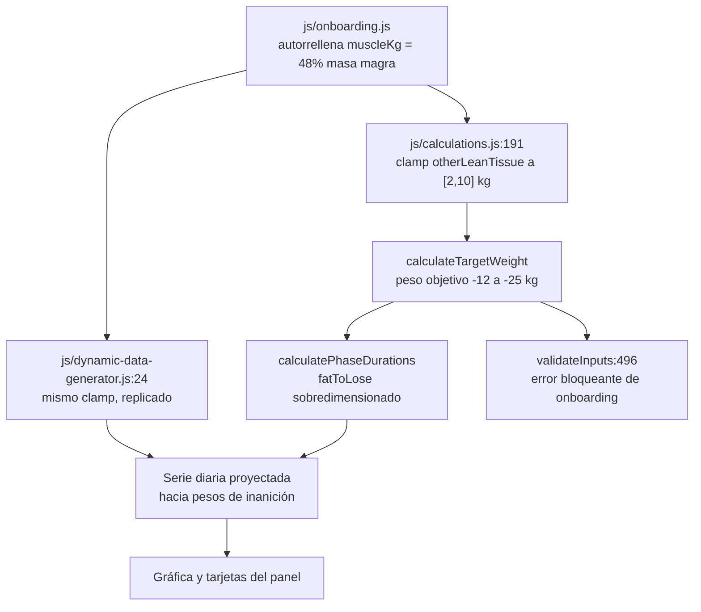

# Auditoría técnica de TransformLab

> ## ⚠️ AUDITORÍA HISTÓRICA DE LA v3.1/v4.0 — NO DESCRIBE EL CÓDIGO ACTUAL
>
> **Esto no es documentación de la v5.** Describe el árbol de la v3.1 (con
> reverificaciones puntuales contra la v4.0), que hoy vive congelado en
> `legacy/` como referencia de solo lectura. Las rutas `js/…` que aparecen aquí
> **no existen** en este repositorio: la v5 se reconstruyó desde cero en `src/`.
>
> **Para qué sigue sirviendo, y es mucho:** es el mapa de minas del port. Cada
> ficha explica un defecto concreto con su escenario de fallo, y `CLAUDE.md` §1
> exige leerla antes de portar la pieza correspondiente. Por eso no se borra.
>
> **Qué NO hay que hacer con él:** tomarlo como estado actual, ni como plan de
> trabajo pendiente. El plan vivo es `PLAN-V5.md`. Marcado como histórico en
> M7-9 (8 de agosto de 2026), cuando se comprobó que la cabecera anterior decía
> «vigente / remediación no iniciada» sobre un árbol que ya no existía.

Informe ejecutivo de la auditoría del código de TransformLab: alcance, método, recuento de hallazgos y ficha detallada de los 26 hallazgos de severidad crítica y alta.

> **Estado:** HISTÓRICO — auditoría de la v3.1; la remediación fue la reconstrucción v5, no una corrección in situ · **Última revisión:** 1 de agosto de 2026 · **Versión auditada:** v3.1, árbol de trabajo local en `main` @ `264c1db`, tres commits por detrás de `origin/main` (`d0afa49`, v4.0), que **no** se ha auditado — ver [§3.4](#34-alcance-no-cubierto)

Documentos relacionados: [ARQUITECTURA.md](ARQUITECTURA.md) · [MODELO-DE-DATOS.md](MODELO-DE-DATOS.md) · [METODOLOGIA-CIENTIFICA.md](METODOLOGIA-CIENTIFICA.md) · [CATALOGO-DE-HALLAZGOS.md](CATALOGO-DE-HALLAZGOS.md) · [DEUDA-TECNICA.md](DEUDA-TECNICA.md) · [GUIA-DE-DESARROLLO.md](GUIA-DE-DESARROLLO.md)

---

## 1. Resumen ejecutivo

Se ha auditado la totalidad del **árbol de trabajo local** en la rama `main`, commit `264c1db`: 164 líneas de `index.html`, 4.085 líneas de CSS (`styles_new.css` y `css/milestones.css`), 5.483 líneas de JavaScript repartidas en ocho módulos, el script suelto `test-calculation.js`, el fichero `aesthetic_milestones_complete.json` y la configuración del repositorio. La aplicación es una SPA sin build, sin framework y sin backend: siete scripts cargados por orden en `index.html:156-162`, todo el estado en `localStorage` y una única dependencia de terceros en tiempo de ejecución, Chart.js servido desde jsDelivr.

El trabajo se organizó en siete áreas (motor científico, generador de datos, estado y onboarding, capa de render, sistema de hitos, frontend craft, ingeniería y seguridad). Cada área recibió un auditor especializado y, después, un verificador escéptico independiente cuyo encargo era intentar refutar cada hallazgo ejecutando el código, no confirmarlo. De los 138 hallazgos planteados, 130 sobrevivieron a esa verificación adversarial; 8 fueron refutados y descartados. De los 130 confirmados, 24 llevan además una corrección de matiz aplicada por el verificador (cifras del escenario de fallo ajustadas, severidad rebajada o alcance del defecto redefinido), que se ha incorporado al texto de este informe.

El veredicto es asimétrico y conviene enunciarlo con precisión. La capa de presentación está construida con oficio: un panel oscuro coherente, un sistema de fases bien concebido como concepto de producto, una gráfica multi-eje no trivial y un onboarding de cuatro pasos con validación en cada uno. Las fórmulas fisiológicas de libro son correctas y verificables: `calculateBMR(80, 180, 30, 'male')` devuelve 1780 kcal, exactamente Mifflin-St Jeor; los multiplicadores de actividad (1.2 / 1.375 / 1.55 / 1.725 / 1.9) y las tasas de pérdida de grasa del 0,5 / 0,75 / 1 % del peso corporal por semana están correctamente implementadas.

El problema no está en las fórmulas, sino en el modelo de composición corporal que las alimenta. La aplicación mantiene dos definiciones incompatibles de "músculo": `estimateMuscleFromComposition` (`js/calculations.js:222-225`) devuelve el 48 % de la masa magra, mientras que `calculateTargetWeight` (`js/calculations.js:191`) y `generateTransformationData` (`js/dynamic-data-generator.js:24`) asumen que ese mismo dato viene de una bioimpedancia y limitan el "otro tejido magro" al rango [2, 10] kg. Como el onboarding autorrellena siempre el músculo con la estimación del 48 %, el resto magro real vale 22-35 kg y el recorte destruye entre 12 y 25 kg de masa magra. La prueba de identidad lo demuestra sin ambigüedad: pedir como objetivo la composición **actual** debería devolver el peso **actual**, y no lo hace. Un hombre de 80 kg y 20 % de grasa recibe 50,9 kg (IMC 15,7); uno de 95 kg y 30 %, 59,9 kg. Esta es la ruta por defecto: le ocurre a todo usuario que no disponga de báscula de bioimpedancia, es decir, a la mayoría. El defecto invalida la salida principal del producto —el peso objetivo, el plan de fases dimensionado contra él y la proyección diaria que se dibuja en la gráfica— y arrastra consigo un segundo efecto que bloquea el onboarding: con un peso objetivo artificialmente bajo, la validación de plausibilidad muscular de `js/calculations.js:496` emite un error que impide terminar el asistente a usuarios de complexión pequeña.

Conviene contar cómo llegó ese defecto al código, porque es el hallazgo más explicativo del informe: **el recorte se introdujo como el arreglo de otro defecto, y quedó invalidado en el mismo commit**. El commit inicial del repositorio, `d424451`, se titula literalmente "TransformLab v3.1 - Fixed target calculations", y el recorte `Math.max(2, Math.min(10, calculatedOtherLean))` ya está presente en él. Los comentarios que lo acompañan lo identifican sin ambigüedad como ese arreglo: `js/calculations.js:166` anuncia "*FIXED: Now correctly handles measured muscle mass by preserving the 'other lean tissue'*", y `js/dynamic-data-generator.js:89`, `:123` y `:138` repiten "*FIXED: Uses otherLeanTissue instead of incorrect 0.48 ratio*". El diagnóstico de partida era correcto: reconstruir el peso dividiendo el músculo entre 0,48 es un modelo pobre, y sustituirlo por un tejido magro no muscular conservado es mejor modelo. Lo que no se advirtió es que el onboarding sigue alimentando `muscleKg` con ese mismo ratio 0,48 (`js/onboarding.js:521`, `:681`, `:790`, todas ellas llamadas a `estimateMuscleFromComposition`). El arreglo asume una entrada medida; el punto que lo invalida, que la sigue produciendo estimada, no se tocó. Ambos conviven en el mismo commit desde el primer día del repositorio. El corolario práctico es que el defecto no se corrige tocando sólo el recorte: hay que unificar la definición de "músculo" en los dos extremos a la vez.

Lo que sí está sano merece constar con el mismo detalle. El proyecto **no realiza ninguna llamada de red**: cero `fetch`, cero `XMLHttpRequest`, cero telemetría, cero analítica, cero píxeles de seguimiento. Los datos de salud del usuario —peso, porcentaje de grasa, edad, sexo, altura— nunca salen del navegador. No hay `eval`, ni `new Function`, ni `document.write`. La superficie de dependencias de terceros se reduce a Chart.js y a la tipografía Outfit de Google Fonts. Esto sitúa el riesgo de privacidad en un mínimo poco frecuente para una aplicación que maneja datos de salud, y convierte los hallazgos de seguridad restantes (38 usos de `innerHTML` sin escapar y un script de CDN sin versión ni SRI) en problemas acotados: el vector de XSS almacenado exige que el propio usuario introduzca la carga en su propio dispositivo.

En términos de prioridad, la remediación tiene un orden natural: el modelo de composición corporal primero —cuatro de los cinco hallazgos críticos son el mismo defecto observado desde cuatro puntos distintos del pipeline—, después la coherencia del generador de fases, y sólo entonces la capa de render y la deuda de repositorio. El plan priorizado está en [DEUDA-TECNICA.md](DEUDA-TECNICA.md).

Una precisión de alcance que condiciona la lectura de todo lo anterior: lo auditado es el árbol de trabajo local, `main` @ `264c1db` (v3.1). El `main` publicado va tres commits por delante, en `d0afa49` (v4.0), y **no** se ha auditado; los detalles están en [§3.4](#34-alcance-no-cubierto). Eso no rebaja la prioridad del defecto de composición corporal: se comprobó específicamente sobre `origin/main` que el recorte sigue en pie y que la prueba de identidad devuelve exactamente los mismos valores que en v3.1.

---

## 2. Cuadro de mando

### 2.1 Por severidad

| Severidad | Hallazgos | % |
|---|---:|---:|
| Crítica | 5 | 3,8 % |
| Alta | 21 | 16,2 % |
| Media | 59 | 45,4 % |
| Baja | 45 | 34,6 % |
| **Total confirmado** | **130** | **100 %** |

Planteados: 138. Refutados por los verificadores y descartados: 8.

### 2.2 Por tipo

| Tipo | Hallazgos | Definición |
|---|---:|---|
| BUG | 62 | El código hace algo distinto de lo que declara hacer, con efecto observable |
| DEUDA | 34 | Funciona, pero encarece cada cambio futuro (duplicación, código muerto, ausencia de convenciones) |
| RIESGO | 25 | No falla hoy, pero puede fallar por causas externas o degradar seguridad/privacidad |
| MEJORA | 9 | Oportunidad sin defecto asociado |

### 2.3 Severidad cruzada con tipo

| | BUG | RIESGO | DEUDA | MEJORA | Total |
|---|---:|---:|---:|---:|---:|
| Crítica | 5 | 0 | 0 | 0 | 5 |
| Alta | 14 | 4 | 3 | 0 | 21 |
| Media | 31 | 14 | 14 | 0 | 59 |
| Baja | 12 | 7 | 17 | 9 | 45 |
| **Total** | **62** | **25** | **34** | **9** | **130** |

Los 5 hallazgos críticos son, sin excepción, bugs de comportamiento. Las 9 mejoras son todas de severidad baja, lo que refleja que la auditoría se centró en defectos y no en propuestas de producto.

### 2.4 Por área

| Área | Crít. | Alta | Media | Baja | Total | Ficheros principales |
|---|---:|---:|---:|---:|---:|---|
| Frontend craft | 0 | 1 | 19 | 5 | 25 | `index.html`, `styles_new.css` |
| Estado y onboarding | 1 | 4 | 6 | 9 | 20 | `js/onboarding.js`, `js/app.js` |
| Generador de datos | 1 | 4 | 8 | 7 | 20 | `js/dynamic-data-generator.js` |
| Motor científico | 3 | 2 | 8 | 7 | 20 | `js/calculations.js` |
| Capa de render | 0 | 5 | 8 | 5 | 18 | `js/dashboard.js`, `js/charts.js`, `js/insights.js` |
| Sistema de hitos | 0 | 2 | 3 | 9 | 14 | `js/milestones.js`, `css/milestones.css`, JSON |
| Ingeniería y seguridad | 0 | 3 | 7 | 3 | 13 | repositorio, dependencias |
| **Total** | **5** | **21** | **59** | **45** | **130** | |

La distribución es engañosa si se lee sólo por volumen. *Frontend craft* encabeza el recuento con 25 hallazgos, pero 24 de ellos son de severidad media o baja (accesibilidad, foco de teclado, `prefers-reduced-motion`, duplicación de CSS). La densidad de gravedad está concentrada en el eje motor científico + generador de datos: 4 de los 5 críticos y 6 de los 21 altos.

### 2.5 Puntos calientes por fichero

| Fichero | Crít. | Alta | Media | Baja | Total |
|---|---:|---:|---:|---:|---:|
| `js/calculations.js` | 3 | 3 | 8 | 7 | 21 |
| `js/dynamic-data-generator.js` | 1 | 3 | 7 | 6 | 17 |
| `styles_new.css` | 0 | 0 | 13 | 3 | 16 |
| `js/app.js` | 0 | 2 | 5 | 8 | 15 |
| `index.html` | 0 | 4 | 5 | 2 | 11 |
| `js/milestones.js` | 0 | 0 | 3 | 7 | 10 |
| `js/onboarding.js` | 1 | 2 | 4 | 3 | 10 |
| `js/charts.js` | 0 | 0 | 4 | 4 | 8 |
| `js/dashboard.js` | 0 | 4 | 3 | 1 | 8 |
| `js/insights.js` | 0 | 1 | 1 | 0 | 2 |
| `test-calculation.js` | 0 | 0 | 2 | 0 | 2 |
| `aesthetic_milestones_complete.json` | 0 | 1 | 0 | 1 | 2 |
| `css/milestones.css` | 0 | 0 | 1 | 1 | 2 |
| `.DS_Store` | 0 | 0 | 1 | 0 | 1 |
| `.git/FETCH_HEAD` | 0 | 1 | 0 | 0 | 1 |
| `.claude/worktrees/silly-yonath` | 0 | 0 | 1 | 0 | 1 |
| `README.md` (ausente) | 0 | 0 | 1 | 0 | 1 |
| `package.json` (ausente) | 0 | 0 | 0 | 1 | 1 |
| `robots.txt` | 0 | 0 | 0 | 1 | 1 |

Las dos últimas entradas con "(ausente)" son hallazgos sobre ficheros que **no existen** en el repositorio y cuya falta se considera un defecto; se les asigna el nombre que tendrían. La fila `README.md` está **parcialmente cerrada**: `README.md` y `docs/` se añadieron junto con esta documentación; queda pendiente únicamente `LICENSE`.

Normalizado por tamaño, `js/calculations.js` (659 líneas) concentra 21 hallazgos, uno cada 31 líneas, y es además donde se acumula la gravedad. `styles_new.css` acumula 16 hallazgos en 2.704 líneas, uno cada 169, y ninguno pasa de severidad media.



---

## 3. Metodología

### 3.1 Procedimiento

La auditoría se ejecutó en dos pasadas sobre el mismo árbol de código.

1. **Pasada de auditoría.** Siete agentes, uno por área, con acceso de lectura al repositorio y capacidad de ejecutar código en Node. Cada uno recibió el encargo de leer íntegramente los ficheros de su área y documentar todo hallazgo con fichero, línea, escenario de fallo concreto, evidencia citada del fuente y corrección propuesta.
2. **Pasada de verificación adversarial.** Siete verificadores independientes, uno por área, cuyo encargo explícito era **refutar** cada hallazgo, no confirmarlo. Un hallazgo sólo se daba por bueno si el verificador no conseguía tumbarlo. Los que sobrevivieron con imprecisiones en el escenario o en las cifras recibieron una corrección de matiz que se conserva junto al hallazgo.

### 3.2 Técnicas empleadas

- **Lectura completa del fuente.** No se auditó por muestreo: los ocho módulos JavaScript, las dos hojas de estilo y el HTML se leyeron línea a línea.
- **Ejecución del código en Node.** Los hallazgos del motor científico y del generador de datos se comprobaron ejecutando las funciones reales con perfiles concretos. Es así como se estableció, por ejemplo, que `calculateCaloricTarget(2759, 'recomp')` devuelve un déficit de 138 kcal mientras `calculateCaloricTarget(2759, 'recomposition')` —el valor que realmente llega— devuelve 0.
- **Pruebas de identidad y barridos.** Para `calculateTargetWeight` se aplicó la prueba de identidad (pedir como objetivo la composición actual) y, para la validación del onboarding, un barrido exhaustivo de la rejilla de objetivos que el asistente admite.
- **Rastreo de referencias por `grep` exhaustivo.** Para determinar qué código se ejecuta realmente y cuál está muerto se rastreó símbolo a símbolo, no sólo por nombre de fichero.
- **Inspección del repositorio.** Estado de `git`, referencias remotas, contenido versionado y ausencia de ficheros de convención.

### 3.3 Alcance cubierto

| Cubierto | Cómo |
|---|---|
| Corrección de las fórmulas fisiológicas | Contraste contra Mifflin-St Jeor y contra la literatura de referencia declarada en el propio código |
| Coherencia del pipeline de generación de datos | Ejecución del pipeline completo con perfiles reales y examen de la serie diaria resultante |
| Flujo de estado y persistencia | Lectura de las cuatro claves de `localStorage` y de todos los caminos de escritura y lectura |
| Capa de render y sincronización de vistas | Trazado de todas las rutas de navegación y de qué funciones de render invoca cada una |
| Código muerto | `grep` símbolo a símbolo sobre los 9 identificadores exportados a `window` y las 31 funciones declaradas en `js/milestones.js` |
| Superficie de red y privacidad | Búsqueda exhaustiva de `fetch`, `XMLHttpRequest`, `WebSocket`, `navigator.sendBeacon`, `eval`, `new Function` |
| Dependencias de terceros | Inspección de las cabeceras que devuelve el CDN y de la API contra la que está escrito `js/charts.js` |
| Higiene de repositorio | Ficheros versionados, `.gitignore`, historial, referencias remotas |

### 3.4 Alcance NO cubierto

Esta lista es parte del informe, no una nota al pie. Sin ella, el lector podría atribuir a la auditoría una cobertura que no tiene.

- **No hay pruebas en navegador real.** Ni un solo hallazgo se validó abriendo `index.html` en Chrome, Firefox o Safari. Los escenarios de fallo de la capa de render se derivan de la lectura del código y de la ejecución de sus funciones en Node, no de observación directa. Los hallazgos que dependen del comportamiento del motor de renderizado, del layout responsive o de la interacción táctil son, por tanto, razonados y no observados.
- **No hay pruebas con usuarios.** No se ha medido comprensión, tasa de finalización del onboarding ni ninguna otra métrica de uso.
- **No se auditó la v4.0 publicada, que es el `main` real del proyecto.** Es la limitación más importante de este informe y merece enunciarse entera.

  Lo auditado es el **árbol de trabajo local**, `main` @ `264c1db`, que corresponde a la v3.1. Tras ejecutar `git fetch`, `git status -sb` informa de `## main...origin/main [behind 3]`: el `main` publicado está en `d0afa49` y el local va **tres commits por detrás**. Los tres que faltan son `a701308` ("Upgrade TransformLab v3.1 → v4.0: multi-screen platform with real data"), `72e8e13` ("fix: router timing, milestone normalization, SVG gradient IDs") y el propio `d0afa49` ("Merge pull request #1 from dacarpena/claude/silly-yonath"). Es decir: la rama `claude/silly-yonath` **no está huérfana ni sin fusionar** —se integró mediante el PR #1 y *es* el `main` publicado—, y los ficheros `js/router.js`, `js/checkin.js`, `js/nutrition.js`, `js/training.js` y `js/body-visualizer.js` existen en `origin/main` aunque no en el árbol local. En v4.0, `index.html` carga trece scripts propios en este orden: `calculations.js`, `dynamic-data-generator.js`, `router.js`, `onboarding.js`, `app.js`, `dashboard.js`, `charts.js`, `insights.js`, `milestones.js`, `checkin.js`, `nutrition.js`, `training.js`, `body-visualizer.js`.

  **Los dos defectos que sí se comprobaron sobre v4.0 sobreviven intactos.** Ejecutando en Node el fichero obtenido con `git show origin/main:js/calculations.js`: el recorte `Math.max(2, Math.min(10, calculatedOtherLean))` sigue presente, y la prueba de identidad devuelve exactamente los mismos valores que en v3.1 —80 kg / 20 % → 50,9 kg; 60 kg / 28 % → 42,6 kg; 95 kg / 30 % → 59,9 kg; 70 kg / 12 % → 45,0 kg—. La rama muerta del objetivo calórico también persiste: `calculateCaloricTarget(2759, 'recomp')` devuelve un déficit de 138 kcal y `calculateCaloricTarget(2759, 'recomposition')` devuelve 0. Por tanto, la prioridad número uno del plan de remediación no cambia.

  **El resto de hallazgos no se ha verificado contra v4.0 y no debe darse por válido allí.** Entre `264c1db` y `d0afa49`, `js/calculations.js` cambia en +333 líneas y `js/dynamic-data-generator.js` en +162, además de las modificaciones en `index.html`, `js/app.js`, `js/charts.js`, `js/dashboard.js`, `js/insights.js`, `js/milestones.js` y `styles_new.css`. Ninguno de los 130 hallazgos se refiere al código de los cinco módulos nuevos. Cualquier afirmación sobre v4.0 que no figure en los dos párrafos anteriores debe comprobarse con `git show origin/main:<fichero>` antes de darla por buena.

  La consecuencia operativa está en A-17: la primera acción antes de abrir la remediación es actualizar el árbol local con `git pull`, no auditar más sobre este *snapshot*.
- **No hay revisión de accesibilidad con lector de pantalla real.** Los hallazgos de accesibilidad (ausencia de estilos de foco, falta de `prefers-reduced-motion`, marcado sin roles) proceden del análisis estático del HTML y el CSS. No se ha ejecutado VoiceOver, NVDA ni JAWS, ni se ha medido contraste con herramienta instrumentada.
- **No hay medición de rendimiento instrumentada.** Los hallazgos sobre re-render completo por `innerHTML` o sobre el bucle `requestAnimationFrame` duplicado describen el mecanismo, no un perfil medido. No hay datos de Lighthouse, ni de DevTools Performance, ni de consumo de memoria.
- **No hay revisión de seguridad ofensiva.** No se intentó explotar el vector de XSS almacenado; se documentó su existencia y su superficie.

### 3.5 Hallazgos refutados

Ocho de los 138 hallazgos planteados fueron descartados tras la verificación. El caso más ilustrativo aparece como corrección dentro de A-12: el auditor afirmaba que tras editar el perfil las flechas del teclado avanzaban dos semanas por pulsación, porque `setupEventListeners()` vuelve a registrar `document.addEventListener('keydown', handleKeyboard)` en `js/app.js:645`. El verificador lo refutó: por especificación DOM, un segundo `addEventListener` con el mismo tipo, la misma referencia de callback y la misma fase de captura se descarta. El hallazgo sobrevivió, pero con el escenario corregido: lo que sí se duplica son los listeners registrados con funciones anónimas.

---

## 4. Los 5 hallazgos críticos

Los cinco críticos son bugs, y cuatro de ellos son manifestaciones del mismo defecto raíz —el conflicto entre las dos definiciones de "músculo"— observado desde el onboarding (C-1), desde el generador (C-2), desde el motor (C-3) y desde la validación (C-4). El quinto (C-5) es el fallo silencioso que se produce cuando ese defecto lleva el peso objetivo fuera de rango.

### C-1 · El peso objetivo mostrado y persistido es absurdamente bajo

| | |
|---|---|
| **Severidad** | Crítica |
| **Tipo** | BUG |
| **Fichero** | `js/onboarding.js:562` (y `js/onboarding.js:809`) |
| **Área** | Estado y onboarding |
| **Ficha en el catálogo** | [EST-01](CATALOGO-DE-HALLAZGOS.md#est-01) |

**Qué ocurre.** El asistente pasa siempre `this.userData.initial` como tercer argumento de `Calculations.calculateTargetWeight`, tanto al recalcular en vivo el campo del paso 3 (`js/onboarding.js:562`) como al validar ese paso (`js/onboarding.js:809`). Con ese tercer argumento presente, `calculateTargetWeight` toma siempre la rama que deriva `otherLeanTissue = masaMagraInicial − muscleKg` y lo recorta a [2, 10] kg (`js/calculations.js:191`). Pero el músculo inicial procede de `estimateMuscleFromComposition`, que devuelve el 48 % de la masa magra (`js/calculations.js:222-225`), por lo que el resto magro es siempre el 52 % restante: unos 31 kg en un hombre de 75 kg. El recorte descarta unos 21 kg de masa magra. La rama alternativa —`targetMuscleKg / 0.48`, `js/calculations.js:200`—, que sí es coherente con el modelo del 48 %, nunca se ejecuta desde el onboarding.

**Cómo se manifiesta.** Un hombre de 75 kg y 20 % de grasa (músculo autoestimado 28,8 kg) que en el paso 3 pide 12 % de grasa y 30 kg de músculo ve en el campo de sólo lectura "Peso objetivo (calculado)" el valor **45,5 kg**: masa magra 60, resto magro 31,2 recortado a 10, y (30 + 10) / 0,88 = 45,5. El valor coherente con el propio modelo de la aplicación sería 30 / 0,48 / 0,88 = 71,0 kg. Ese 45,5 se persiste en el perfil y la cabecera del panel acaba mostrando "75 kg → 45,5 kg"; a partir de ahí `calculatePhaseDurations` dimensiona todo el plan contra ese peso irreal.

**Evidencia.**

```javascript
// js/onboarding.js:559-569
if (fat && muscle && fat >= 5 && muscle >= 20) {
    // FIXED: Pass initial composition to correctly calculate target weight
    // when user provides measured muscle mass (DEXA/bioimpedance)
    const weight = Calculations.calculateTargetWeight(muscle, fat, this.userData.initial);
    if (weight && weight > 40) {
        weightInput.value = weight;
        this.userData.target.weight = weight;
    } else {
        weightInput.value = '';
        this.userData.target.weight = null;
    }
```

El comentario declara la intención —usar la composición medida cuando el usuario aporte DEXA o bioimpedancia—, pero la condición que lo activa no comprueba el origen del dato: en `js/calculations.js:184` basta con que `muscleKg`, `weight` y `fatPct` existan, y los tres existen siempre porque `validateStep(2)` fuerza el músculo en `js/onboarding.js:789-791` y el input viene prerellenado con la estimación en `js/onboarding.js:296`.

**Corrección propuesta.** Marcar el origen del dato en el perfil (`initial.muscleSource = 'measured' | 'estimated'`) y hacer que `calculateTargetWeight` lo consulte: si es estimado, usar la rama proporcional `targetMuscleKg / 0.48` sin recorte; si es medido, sustituir el rango absoluto [2, 10] kg por uno proporcional a la masa magra (por ejemplo, 40-60 %). Añadir además en el paso 3 una comprobación de coherencia que avise cuando el peso objetivo se desvíe más de un 15 % del peso inicial.

---

### C-2 · El recorte de `otherLeanTissue` hunde toda la proyección diaria

| | |
|---|---|
| **Severidad** | Crítica |
| **Tipo** | BUG |
| **Fichero** | `js/dynamic-data-generator.js:24` |
| **Área** | Generador de datos |
| **Ficha en el catálogo** | [GEN-01](CATALOGO-DE-HALLAZGOS.md#gen-01) |

**Qué ocurre.** El generador replica el mismo recorte del motor, con el mismo efecto y sobre toda la serie. `otherLeanTissue` —huesos, órganos, agua, piel, sangre: todo el tejido magro que no es músculo, en torno al 50 % de la masa magra en una persona real— se limita a un máximo de 10 kg. Como el músculo llega estimado al 48 %, el valor calculado ronda siempre el 52 % de la masa magra y el recorte **siempre** se activa, incluso con los datos que genera la propia aplicación. A partir de ahí, la fase de recomposición reconstruye el peso como `(músculo + 10) / (1 − grasa/100)` (`js/dynamic-data-generator.js:125`) y la de volumen mediante una reconstrucción aditiva distinta (`js/dynamic-data-generator.js:142`), y ese peso absurdamente bajo se encadena al resto de fases.

**Cómo se manifiesta.** Perfil de 85 kg, 25 % de grasa y 30,6 kg de músculo —exactamente el valor que la aplicación estima por defecto: 63,75 × 0,48—, con objetivo 78 kg / 15 % / 34 kg. Ejecutado el pipeline: `calculatedOtherLean` vale 33,15 y se recorta a 10. La fase de recomposición termina en 51,7 kg partiendo de 84,5, es decir 33 kg en 90 días, con saltos diarios de hasta −1,17 kg. La fase de definición termina en 40,2 kg y 5 % de grasa, valor que sólo se detiene porque salta el guardarraíl de `js/dynamic-data-generator.js:175`. El usuario ve una gráfica que le proyecta bajar a 40 kg.

**Evidencia.**

```javascript
// js/dynamic-data-generator.js:18-24
// Calculate "other lean tissue" from initial measured composition
// This is preserved throughout the transformation (bones, organs, water, etc.)
const initialLeanMass = initial.weight * (1 - initial.fatPct / 100);
const calculatedOtherLean = initialLeanMass - initial.muscleKg;

// Clamp to physiologically reasonable range (2-10 kg)
const otherLeanTissue = Math.max(2, Math.min(10, calculatedOtherLean));
```

El comentario "*This is preserved throughout the transformation*" describe correctamente la intención del modelo —el tejido magro no muscular se conserva—, pero el recorte de la línea siguiente lo invalida: no conserva el valor, lo sustituye por 10.

**Corrección propuesta.** Eliminar el recorte absoluto y sustituirlo por una comprobación relativa coherente con el estimador de la aplicación: conservar `otherLeanTissue = masaMagra − muscleKg` y validar que quede dentro de un rango proporcional (35-65 % de la masa magra) en lugar de un rango absoluto de 2-10 kg. El mismo cambio debe aplicarse en `js/calculations.js:191`, que duplica la lógica. Mientras el recorte exista duplicado en dos ficheros, cualquier arreglo parcial dejará la aplicación en un estado incoherente consigo misma.

---

### C-3 · `calculateTargetWeight` produce pesos objetivo de IMC ~15 en la ruta por defecto

| | |
|---|---|
| **Severidad** | Crítica |
| **Tipo** | BUG |
| **Fichero** | `js/calculations.js:191` |
| **Área** | Motor científico |
| **Ficha en el catálogo** | [MOT-01](CATALOGO-DE-HALLAZGOS.md#mot-01) |

**Qué ocurre.** Es el defecto raíz enunciado desde el propio motor. La función asume que `muscleKg` procede de una bioimpedancia, donde el músculo equivale aproximadamente a la masa magra menos unos 3 kg de hueso, y por eso recorta el resto magro a [2, 10] kg. Pero el dato que recibe es la estimación del 48 %, con lo que el resto magro real vale 20-35 kg y el recorte descuenta del peso objetivo entre 12 y 25 kg de tejido que sí existe.

**Cómo se manifiesta.** La prueba de identidad es la demostración limpia: pedir como objetivo la composición **actual** debe devolver el peso **actual**. No lo hace.

| Perfil | Peso real | Devuelto | Desvío | IMC resultante |
|---|---:|---:|---:|---:|
| Hombre 80 kg / 20 % grasa | 80,0 kg | 50,9 kg | −29,1 kg | 15,7 |
| Mujer 60 kg / 28 % grasa | 60,0 kg | 42,6 kg | −17,4 kg | — |
| Hombre 95 kg / 30 % grasa | 95,0 kg | 59,9 kg | −35,1 kg | — |
| Hombre 70 kg / 12 % grasa | 70,0 kg | 45,0 kg | −25,0 kg | — |

Con músculo realmente medido (60,5 kg para el hombre de 80 kg) la misma llamada devuelve exactamente 80 kg: la función es correcta para la entrada que espera y catastrófica para la que recibe. Y `validateInputs` da `isValid: true` con cero avisos para un peso objetivo de 50,6 kg.

**Evidencia.**

```javascript
// js/calculations.js:183-201
// If we have current composition with measured muscle, preserve other lean tissue
if (currentComposition && currentComposition.muscleKg && currentComposition.weight && currentComposition.fatPct) {
    const currentLeanMass = currentComposition.weight * (1 - currentComposition.fatPct / 100);
    const calculatedOtherLean = currentLeanMass - currentComposition.muscleKg;

    // Clamp otherLeanTissue to physiologically reasonable range (2-10 kg)
    // Bones alone are 3-5 kg, organs add another 3-5 kg
    // If calculated value is outside this range, user's data may be inconsistent
    otherLeanTissue = Math.max(2, Math.min(10, calculatedOtherLean));

    if (Math.abs(calculatedOtherLean - otherLeanTissue) > 1) {
        console.warn('⚠️ Other lean tissue adjusted from', calculatedOtherLean.toFixed(2), 'to', otherLeanTissue, 'kg (data may be inconsistent)');
    }

    targetLeanMass = targetMuscleKg + otherLeanTissue;
} else {
    // Fallback: estimate using typical ratio (muscle ≈ 48% of lean mass)
    targetLeanMass = targetMuscleKg / 0.48;
}
```

Los dos modelos incompatibles conviven en el mismo bloque `if/else`: la rama `if` asume músculo medido, la rama `else` declara explícitamente el 48 %, y el onboarding fuerza siempre la primera. El `console.warn` de la línea 194 se dispara en la práctica totalidad de las sesiones y su mensaje culpa a los datos del usuario ("*data may be inconsistent*") de una incoherencia que es del propio modelo.

**Corrección propuesta.** Unificar la definición de "músculo". Opción mínima: marcar el origen del dato y usar la rama proporcional cuando sea estimado. Opción correcta: que `estimateMuscleFromComposition` devuelva tejido magro blando (masa magra menos ~3,5 kg) para que ambas rutas hablen del mismo tejido, y sustituir el recorte duro por un aviso visible al usuario, nunca por una corrección silenciosa del dato.

---

### C-4 · Onboarding inalcanzable: sin bioimpedancia no se puede fijar un objetivo de pérdida de grasa

| | |
|---|---|
| **Severidad** | Crítica |
| **Tipo** | BUG |
| **Fichero** | `js/calculations.js:496` |
| **Área** | Motor científico |
| **Ficha en el catálogo** | [MOT-02](CATALOGO-DE-HALLAZGOS.md#mot-02) |

**Qué ocurre.** Consecuencia directa del defecto anterior combinada con la comprobación `target.muscleKg > targetWeight * 0.55`. Como el peso objetivo sale artificialmente bajo, casi cualquier objetivo de músculo supera el 55 % de él; y como el onboarding exige `targetMuscle >= 30` kg (`js/onboarding.js:802`) mientras el músculo estimado de una mujer ronda los 20 kg, el incremento porcentual supera siempre el 30 %. Se disparan las dos condiciones a la vez y se emite un error bloqueante que impide terminar el asistente.

**Cómo se manifiesta.** Mujer de 60 kg, 28 % de grasa, 165 cm, 40 años, sin bioimpedancia (músculo estimado 20,7 kg). Sobre la rejilla completa de objetivos que el propio asistente admite (grasa 16-40 %, músculo 30-100 kg, paso 1) hay 1.775 combinaciones y sólo 323 pasan la validación. El porcentaje de grasa objetivo **mínimo aceptado es el 27 %**, apenas un punto por debajo de su 28 % actual, diferencia que ni siquiera activa la fase de definición, porque `needsCut` exige `initial.fatPct > target.fatPct + 2` (`js/calculations.js:315`). En la práctica, la aplicación le impide definir cualquier objetivo de pérdida de grasa. Si intenta 22 % con 30 kg de músculo obtiene un peso objetivo de 51,3 kg (IMC 18,8) y el error literal "La masa muscular objetivo (30kg) es fisiológicamente improbable para un peso de 51.3kg".

**Evidencia.**

```javascript
// js/calculations.js:491-500
// Only error if muscle is physiologically impossible for TARGET weight
// AND the increase is extreme (>30% more than current measured muscle)
const maxMuscleForTargetWeight = targetWeight * 0.55;
const muscleIncreasePercent = initial.muscleKg > 0 ? (target.muscleKg / initial.muscleKg - 1) * 100 : 0;

if (target.muscleKg > maxMuscleForTargetWeight && muscleIncreasePercent > 30) {
    errors.push(`La masa muscular objetivo (${target.muscleKg}kg) es fisiológicamente improbable para un peso de ${targetWeight}kg`);
} else if (muscleIncreasePercent > 20 && muscleGainNeeded > 3) {
    warnings.push(`Ganar ${muscleGainNeeded.toFixed(1)}kg de músculo (+${muscleIncreasePercent.toFixed(0)}%) requerirá tiempo y dedicación`);
}
```

El comentario acota deliberadamente el error a lo "fisiológicamente imposible", pero el `targetWeight` contra el que compara viene ya corrompido por C-3, de modo que la salvaguarda dispara contra objetivos perfectamente razonables.

**Corrección propuesta.** Arreglar primero `calculateTargetWeight` (C-3). Después, comparar el músculo objetivo contra la **masa magra objetivo** usando el mismo modelo con el que se estimó el músculo inicial, en lugar de contra un 55 % fijo del peso; y alinear el mínimo de 30 kg del asistente con el músculo estimado del propio usuario (por ejemplo, mínimo = 0,7 × músculo actual) en vez de una constante pensada para varones.

---

### C-5 · Si `target.weight` es `null`, el plan calcula que hay que perder el 100 % de la grasa corporal

| | |
|---|---|
| **Severidad** | Crítica |
| **Tipo** | BUG |
| **Fichero** | `js/calculations.js:297` |
| **Área** | Motor científico |
| **Ficha en el catálogo** | [MOT-03](CATALOGO-DE-HALLAZGOS.md#mot-03) |

**Qué ocurre.** `calculateTargetWeight` devuelve `null` cuando el peso resultante cae fuera del rango 40-150 kg (`js/calculations.js:207-210`), situación frecuente precisamente por C-3. El onboarding guarda entonces `target.weight = null` (`js/onboarding.js:568`) y sigue adelante llamando a `validateInputs` y al plan de fases. En `calculatePhaseDurations`, la expresión `target.weight * target.fatPct / 100` evalúa `null * 15 / 100`, que en JavaScript **no es `NaN` sino 0**. No salta ninguna alarma: el motor concluye silenciosamente que la grasa objetivo es 0 kg y dimensiona una fase de definición para llegar al 0 % de grasa corporal.

**Cómo se manifiesta.** Con `initial = {weight: 80, fatPct: 25, muscleKg: 30.7}` y `target = {fatPct: 15, muscleKg: 33, weight: null}`, `calculatePhaseDurations` devuelve `summary.fatToLose = 20.0` kg —exactamente toda la grasa del usuario, 80 × 0,25— y una fase de "Definición" de 210 días, con `totalDays = 448`. El usuario recibe un plan de 64 semanas cuyo destino es el 0 % de grasa corporal. En los casos realmente alcanzables, `validateInputs` acompaña el plan con el aviso literal "El peso objetivo calculado (nullkg) parece inusual", que confirma que el sistema sabe que algo va mal y aun así continúa.

**Evidencia.**

```javascript
// js/calculations.js:296-298
// Calculate what needs to change
const fatToLose = (initial.weight * initial.fatPct / 100) - (target.weight * target.fatPct / 100);
const muscleToGain = target.muscleKg - initial.muscleKg;
```

No hay ninguna guarda de entrada en la función. El aviso de `js/calculations.js:501-503` se emite como *warning*, no como error bloqueante, y no impide que el plan se genere y se persista:

```javascript
// js/calculations.js:501-503
if (targetWeight < 40 || targetWeight > 150) {
    warnings.push(`El peso objetivo calculado (${targetWeight}kg) parece inusual. Verifica tus datos.`);
}
```

**Corrección propuesta.** Guarda de entrada en `calculatePhaseDurations`: si `!Number.isFinite(target.weight)` o `!Number.isFinite(initial.weight)`, devolver `{ phases: [], totalDays: 0, error: 'datos insuficientes' }` en lugar de calcular. Y en `validateInputs`, cuando `targetWeight === null`, empujar un **error bloqueante** en vez de un aviso y no invocar el plan de fases. El principio general: un dato ausente debe detener el cálculo, nunca colarse como cero.

---

## 5. Los 21 hallazgos de severidad alta

Agrupados por área. Las fichas son compactas: cabecera, qué ocurre, cómo se manifiesta y corrección propuesta, con la evidencia citada en línea.

### 5.1 Motor científico (2)

#### A-1 · La fase de recomposición recibe calorías de mantenimiento

| Severidad | Tipo | Fichero | Área | Ficha en el catálogo |
|---|---|---|---|---|
| Alta | BUG | `js/calculations.js:117` | Motor científico | [MOT-04](CATALOGO-DE-HALLAZGOS.md#mot-04) |

**Qué ocurre.** `calculateCaloricTarget` tiene un `case 'recomp'` que aplica un déficit del 5 %, pero el tipo de fase que genera `calculatePhaseDurations` es `'recomposition'` (`js/calculations.js:324`) y `js/dynamic-data-generator.js:181` invoca la función con `phase.type`. La comparación nunca coincide, el flujo cae al `default` (mantenimiento, déficit 0) y la rama del 5 % es código muerto.

**Cómo se manifiesta.** Hombre de 80 kg / 180 cm / 30 años / actividad moderada: TDEE 2.759 kcal. `calculateCaloricTarget(2759, 'recomposition')` devuelve `{target: 2759, deficit: 0}`, mientras la propia fase declara `expectedFatLoss = 4.5` kg en 90 días, que exigiría unas 385 kcal/día de déficit. La tarjeta metabólica muestra 2.759 kcal/día mientras la gráfica muestra al usuario perdiendo 4,5 kg de grasa comiendo a mantenimiento. Comprobado por ejecución: `calculateCaloricTarget(2759, 'recomp')` sí devuelve un déficit de 138 kcal, pero nadie llama a la función con ese valor.

**Corrección propuesta.** Renombrar el `case` a `'recomposition'` —o aceptar ambos— y, mejor, derivar el déficit del `expectedFatLoss` de la propia fase (`déficitDiario = expectedFatLoss * 7700 / días`) para que calorías y composición no puedan divergir. Nota de matiz del verificador: `'adaptation'` y `'transition'` también caen al `default`, pero no existe para ellos un `case` dedicado que quede muerto, y recibir mantenimiento es defendible en esas fases.

#### A-2 · El objetivo calórico puede quedar por debajo del metabolismo basal

| Severidad | Tipo | Fichero | Área | Ficha en el catálogo |
|---|---|---|---|---|
| Alta | RIESGO | `js/calculations.js:104` | Motor científico | [MOT-05](CATALOGO-DE-HALLAZGOS.md#mot-05) |

**Qué ocurre.** `calculateCaloricTarget` aplica un déficit porcentual (20 % por defecto) sin comprobar el valor absoluto resultante ni contra el BMR ni contra ningún suelo mínimo. El único límite existente, `deficit = Math.min(deficit, 1000)` (`js/calculations.js:110`), sólo entra en juego con un TDEE superior a 5.000 kcal, es decir, nunca en la práctica: es código muerto que aparenta una salvaguarda inexistente.

**Cómo se manifiesta.** Mujer de 50 kg, 155 cm, 60 años, sedentaria —todos los valores dentro de los rangos que admite el asistente—: BMR 1.007,75 kcal, TDEE 1.209 kcal, y `calculateCaloricTarget(1209, 'cut')` devuelve 967 kcal/día, un 4 % **por debajo** de su metabolismo basal y muy por debajo del suelo de 1.200 kcal habitual en pautas clínicas. La aplicación lo presenta como recomendación sin ningún aviso.

**Corrección propuesta.** Sustituir el tope inoperante por un suelo real, `target = Math.max(target, Math.round(bmr), sexo === 'female' ? 1200 : 1500)`, y, cuando el suelo recorte el déficit, reducir proporcionalmente la tasa de pérdida usada en el plan de fases para que las duraciones sigan siendo coherentes. Requiere pasar el BMR o el sexo a la función, que hoy sólo recibe el TDEE.

### 5.2 Generador de datos (4)

#### A-3 · La pérdida de grasa se contabiliza dos veces entre recomposición y definición

| Severidad | Tipo | Fichero | Área | Ficha en el catálogo |
|---|---|---|---|---|
| Alta | BUG | `js/calculations.js:334` | Generador de datos | [GEN-05](CATALOGO-DE-HALLAZGOS.md#gen-05) |

**Qué ocurre.** `calculatePhaseDurations` dimensiona la fase de definición con `const remainingFatToLose = Math.max(0, fatToLose - 2)`, usando el `fatToLose` **total** (inicial contra objetivo) sin descontar la grasa que la fase de recomposición ya ha eliminado (`recompDays / 30 * 1.5` kg, `js/calculations.js:327`). El `2` es además una constante mágica que no se corresponde con la fase de adaptación, que sólo retira 0,3 kg de grasa (`js/calculations.js:309`).

**Cómo se manifiesta.** Perfil 85 kg / 25 % → 78 kg / 15 %: `fatToLose` = 9,55 kg. La recomposición planifica 4,5 kg y la definición otros 7,55, total 12,05 kg contra los 9,55 necesarios. La serie baja hasta el 11,0 % de grasa al final de la definición —cuatro puntos por debajo de lo que pidió el usuario— y después vuelve a subir hasta el 15 %. La gráfica muestra al usuario adelgazando más de lo que pidió y engordando después. Con el recorte de `otherLeanTissue` activo (C-2), la grasa llega a −3,6 % y salta el capado al 5 %.

**Corrección propuesta.** Llevar un acumulador `fatLossPlanned` y calcular `remainingFatToLose = Math.max(0, fatToLose - fatLossPlanned)`. Aplicar el mismo tratamiento al músculo entre recomposición y volumen, donde `js/calculations.js:353` usa la constante mágica análoga `0.5`.

#### A-4 · La aritmética de fechas mezcla UTC y hora local

| Severidad | Tipo | Fichero | Área | Ficha en el catálogo |
|---|---|---|---|---|
| Alta | BUG | `js/dynamic-data-generator.js:239` | Generador de datos | [GEN-02](CATALOGO-DE-HALLAZGOS.md#gen-02) |

**Qué ocurre.** `new Date('2026-01-01')` se interpreta como medianoche UTC, pero `setDate()` y `getDate()` operan en hora **local** y la salida se produce con `toISOString()`, otra vez UTC. En `Europe/Madrid`, la medianoche UTC es la 01:00 local en invierno; al sumar días hasta pasar el cambio de horario, esa hora pasa a ser CEST = 23:00 UTC del día anterior, y `toISOString().split('T')[0]` devuelve la fecha del día previo. El mismo patrón aparece en `js/dynamic-data-generator.js:107`, `:216` y `:493`.

**Cómo se manifiesta.** Con `TZ=Europe/Madrid` y fecha de inicio 2026-01-01 —el caso típico del plan de Año Nuevo—, los días 88 y 89 de la serie comparten `date = '2026-03-29'`, y desde el día 89 el campo `date` va un día por detrás de `dateFormatted`. En cascada, `generateMonthlyData` agrupa por `date.substring(0,7)` y produce un mes `'2026-03'` con 32 días, y la fecha de fin del plan queda un día antes de la real. En el cambio de otoño ocurre lo simétrico: se salta una fecha.

**Corrección propuesta.** Trabajar con fechas civiles sin componente horaria: parsear `'YYYY-MM-DD'` a año/mes/día con `new Date(y, m-1, d)` (medianoche local) y formatear con una función propia en lugar de `toISOString()`. Alternativa: hacer toda la aritmética en UTC con `setUTCDate`/`getUTCDate`/`getUTCDay` y formatear con `timeZone: 'UTC'`.

#### A-5 · Los hitos estéticos se generan con `estimatedDay = NaN`

| Severidad | Tipo | Fichero | Área | Ficha en el catálogo |
|---|---|---|---|---|
| Alta | BUG | `js/dynamic-data-generator.js:675` | Generador de datos | [GEN-03](CATALOGO-DE-HALLAZGOS.md#gen-03) |

**Qué ocurre.** Los hitos de las categorías estéticas (abdominales, vascularidad, rostro, brazos) se insertan sin el campo `progressRequired`, a diferencia de los de grasa, músculo y fase. El bucle de asignación de día calcula `m.estimatedDay = Math.round((m.progressRequired / 100) * totalDays)` para todo hito con `triggerType === 'fatPct'`, lo que produce `NaN`. Además, la ordenación previa de `js/dynamic-data-generator.js:669` los evalúa como 0 mediante `a.progressRequired || 0`, con lo que todos los hitos estéticos quedan al principio de la lista, antes incluso del primer hito de la fase de adaptación.

**Cómo se manifiesta.** Perfil 85 kg / 25 % / 55 kg → 78 kg / 15 % / 58 kg: se generan 19 hitos, de los cuales 7 —todos los estéticos— salen con `estimatedDay = NaN` y encabezan la lista. Al persistirse con `JSON.stringify`, `NaN` se convierte en `null`, de modo que tras recargar la página el campo es `null`. El export a Markdown lo enmascara con `|| '-'` (`js/dashboard.js:189`), pero el dato del modelo es inválido.

**Corrección propuesta.** Calcular y asignar `progressRequired` también en los hitos estéticos, o mejor, sustituir todo el cálculo de `estimatedDay` por una búsqueda sobre la serie diaria ya generada, lo que elimina la dependencia de ese campo (ver A-6).

#### A-6 · `estimatedDay` asume progreso lineal y contradice el día real de cruce

| Severidad | Tipo | Fichero | Área | Ficha en el catálogo |
|---|---|---|---|---|
| Alta | BUG | `js/dynamic-data-generator.js:675` | Generador de datos | [GEN-04](CATALOGO-DE-HALLAZGOS.md#gen-04) |

**Qué ocurre.** `generateMilestones` no consulta la serie diaria: reparte los hitos linealmente sobre el total de días. Pero la proyección no es lineal —la grasa cae rápido durante la definición y **vuelve a subir** en volumen—, de modo que el día estimado no guarda relación con los datos. Agrava el problema que `js/charts.js:464-529` posicione los marcadores de la gráfica por un camino distinto (buscando el primer punto de la serie que cruza `triggerValue`): el mismo hito tiene dos días diferentes según dónde se mire.

**Cómo se manifiesta.** Perfil 85 kg / 25 % / 55 kg → 78 kg / 15 % / 58 kg. El hito "15 % grasa corporal" recibe `estimatedDay = 352`, pero la serie diaria cruza el 15 % el día 148, rebota hasta el 11 % y vuelve a subir: 204 días de desviación. El hito "23 % grasa corporal" declara el día 70 y la serie lo cruza el día 43. La tabla de hitos del export muestra fechas que la gráfica contradice visualmente.

**Corrección propuesta.** Derivar `estimatedDay` de la serie ya generada: pasar `dailyData` a `generateMilestones` y usar `dailyData.find(d => d.physical.fatPct <= m.triggerValue)?.day` (o `>=` para músculo), de modo que el día estimado y el marcador de la gráfica procedan de la misma fuente. El orden del pipeline ya lo permite: la generación de hitos ocurre después de `generateDailyData`.

### 5.3 Capa de render (5)

#### A-7 · Los insights se congelan: `renderInsights()` se llama una sola vez

| Severidad | Tipo | Fichero | Área | Ficha en el catálogo |
|---|---|---|---|---|
| Alta | BUG | `js/insights.js:9` | Capa de render | [REN-01](CATALOGO-DE-HALLAZGOS.md#ren-01) |

**Qué ocurre.** `renderInsights()` depende de `AppState.navigation` —lee `currentDay`, `currentWeek`, `currentMonth` y la granularidad—, pero la única invocación de todo el código cargado está en `js/app.js:407`, dentro de `initializeApp()`. Ni `navigateTo()`, ni `setGranularity()`, ni `handleChartClick()` (`js/charts.js:421-422`), ni el guardado del modal de ajustes la vuelven a llamar. La única otra referencia a un re-render de insights está en `js/milestones.js`, que `index.html` no carga.

**Cómo se manifiesta.** El usuario abre la aplicación en la semana 1, en fase "Adaptación"; el panel muestra "Estás en la fase Adaptación". Navega con la flecha derecha hasta la semana 30, ya en fase "Definición": las tarjetas, el indicador de fase y la gráfica se actualizan, pero el panel de insights sigue mostrando los textos de la semana 1, avisos obsoletos incluidos. El contraste es directo: `initializeApp()` invoca siete funciones de render, mientras `navigateTo()` (`js/app.js:594-596`) invoca sólo tres.

**Corrección propuesta.** Añadir `renderInsights()` dentro de `renderDashboard()` (`js/dashboard.js:325-330`), junto a `renderHeader`, `renderMetricCards`, `renderPhaseIndicator` y `renderGoalProgress`, y eliminar la llamada suelta de `initializeApp`. Así todos los caminos de navegación quedan cubiertos por una sola función.

#### A-8 · El indicador de fase no avanza en granularidad semanal o mensual

| Severidad | Tipo | Fichero | Área | Ficha en el catálogo |
|---|---|---|---|---|
| Alta | BUG | `js/dashboard.js:516` | Capa de render | [REN-02](CATALOGO-DE-HALLAZGOS.md#ren-02) |

**Qué ocurre.** `renderPhaseIndicator()` calcula el día dentro de la fase con `current.dayInPhase` y, si no existe, con `currentDay - phase.startDay + 1`. Los objetos de `weekly[]` y `monthly[]` no tienen la propiedad `dayInPhase` —sólo `daily[]` la tiene—, así que en semanal y mensual siempre cae al segundo camino. Pero `navigateTo()` en semanal actualiza únicamente `currentWeek` (`js/app.js:586-588`) y en mensual únicamente `currentMonth`: `currentDay` conserva el valor que le asignó `calculateCurrentPosition()` al arrancar.

**Cómo se manifiesta.** El fallo no es sólo congelación, sino un valor sistemáticamente incorrecto. Con un usuario recién configurado (`currentDay = 1`), en cualquier fase posterior a la primera la expresión da negativo y `Math.max(1, ...)` la fuerza a 1: la tarjeta muestra siempre "Semana 1 de M" con la barra casi a 0 %. En el caso simétrico, un usuario a mitad de plan (`currentDay = 200`) que navegue hacia atrás a "Adaptación" (`startDay = 1`) obtiene 200/14, recortado por `Math.min(100, ...)` al 100 %: la fase inicial aparece completada al 100 %. Contraste demostrativo: el clic sobre la gráfica sí escribe `currentDay = index * 7 + 1` (`js/charts.js:414`) y entonces la barra sí se mueve. Dos rutas de navegación con comportamiento distinto.

**Corrección propuesta.** Derivar el día global del objeto actual en lugar de leer `currentDay`: en semanal usar `current.endDay`, en mensual derivarlo de `current.endDate` contra `AppState.startDate`, y en diario `current.day`. Alternativa: hacer que `navigateTo()` mantenga `currentDay` sincronizado en los tres casos.

#### A-9 · `TypeError` en `renderNavigation` al entrar en vista mensual cerca del final del plan

| Severidad | Tipo | Fichero | Área | Ficha en el catálogo |
|---|---|---|---|---|
| Alta | BUG | `js/dashboard.js:259` | Capa de render | [REN-03](CATALOGO-DE-HALLAZGOS.md#ren-03) |

**Qué ocurre.** `renderNavigation()` accede a `monthData.monthName` sin comprobar que `monthData` exista, mientras que `renderHeader()` sí se protege con `monthData?.monthName` (`js/dashboard.js:30-33`). `currentMonth` lo fija `js/app.js:193` como `Math.ceil(currentDay / 30)`, pero `monthly[]` no agrupa por bloques de 30 días sino por mes de calendario (`js/dynamic-data-generator.js:417-424`). Cuando el plan incluye meses de 31 días, el índice calculado supera la longitud real del array y `getMonthData()` devuelve `undefined`.

**Cómo se manifiesta.** Un plan de 365 días desde 2026-01-01 tiene 12 meses reales y `ceil(365/30) = 13`; uno de 485 días tiene 16 y el cálculo da 17. Con el proceso ya terminado, el usuario pulsa el botón "Mes" o la tecla 3 y obtiene `TypeError: Cannot read properties of undefined (reading 'monthName')`, que aborta `setGranularity` antes de `savePreferences()` y deja la interfaz incoherente. El camino peor no es ese: si se recarga la página con la preferencia `monthly` ya guardada, la excepción se produce dentro del `try` de `loadAllData()`, la captura el `catch` de `js/app.js:140-142` y `showError()` sustituye todo `#mainContent` por "Error cargando datos. Por favor, reconfigura tu perfil." La aplicación queda inutilizable.

**Corrección propuesta.** Dos cambios: proteger `renderNavigation` con el mismo encadenamiento opcional y un valor de respaldo (`monthData?.monthName` seguido de `|| 'Mes ' + currentMonth`) que ya emplea `renderHeader`, y corregir la causa raíz recortando en `js/app.js:193` contra la longitud real del array, o mejor, buscando el índice del mes cuyo rango de fechas contiene el día actual.

#### A-10 · La tarjeta Físico muestra el cambio de grasa sin número: "↓ kg"

| Severidad | Tipo | Fichero | Área | Ficha en el catálogo |
|---|---|---|---|---|
| Alta | BUG | `js/dashboard.js:387` | Capa de render | [REN-04](CATALOGO-DE-HALLAZGOS.md#ren-04) |

**Qué ocurre.** En la cuarta métrica de la tarjeta Físico falta la llamada a `formatChange()`. Las otras tres interpolan `${getChangeIcon(x)} ${formatChange(x)}`; la de Grasa interpola sólo el icono seguido de la unidad, perdiendo el valor. Comparación directa: `js/dashboard.js:377` escribe `${getChangeIcon(changes.muscleKg)} ${formatChange(changes.muscleKg)} kg`, mientras `js/dashboard.js:387` escribe `${getChangeIcon(changes.fatKg)} kg`.

**Cómo se manifiesta.** Con cualquier perfil y en cualquier granularidad, la métrica "Grasa" renderiza literalmente "↓ kg" o "→ kg" en lugar de "↓ −0.14 kg". El dato existe en `changes.fatKg` y se calcula correctamente; simplemente no se imprime. Visible en el 100 % de las sesiones.

**Corrección propuesta.** Sustituir por `${getChangeIcon(changes.fatKg)} ${formatChange(changes.fatKg)} kg`. Es un cambio de una línea.

#### A-11 · El delta de "% Grasa" siempre se muestra como "--"

| Severidad | Tipo | Fichero | Área | Ficha en el catálogo |
|---|---|---|---|---|
| Alta | BUG | `js/dashboard.js:382` | Capa de render | [REN-05](CATALOGO-DE-HALLAZGOS.md#ren-05) |

**Qué ocurre.** `renderMetricCards` lee `changes.fatPct`, pero el generador nunca produce esa clave: `dailyChange`, `weeklyChange` y `monthlyChange` contienen exclusivamente `{weight, fatKg, muscleKg}` (`js/dynamic-data-generator.js:315-319`, `:395-399` y `:474-478`). `formatChange(undefined)` devuelve `'--'` y `getChangeIcon(undefined)` devuelve `'→'`, de modo que el widget queda permanentemente en estado neutro.

**Cómo se manifiesta.** Cualquier usuario, cualquier semana: la métrica "% Grasa" muestra siempre "→ --%" con clase `neutral`, incluso durante una fase de definición en la que el porcentaje está bajando claramente, cosa visible en el propio valor de la métrica justo encima. El usuario no puede distinguir progreso de estancamiento en la métrica más importante del proceso.

**Corrección propuesta.** Añadir `fatPct` a los tres objetos de cambio del generador, o calcularlo en el render a partir del punto anterior. Lo mínimo aceptable es no pintar el widget cuando el dato no existe, en lugar de mostrar un "--" permanente que parece un fallo de datos.

### 5.4 Estado y onboarding (4)

#### A-12 · `initializeApp()` no es idempotente: los listeners se duplican tras editar el perfil

| Severidad | Tipo | Fichero | Área | Ficha en el catálogo |
|---|---|---|---|---|
| Alta | BUG | `js/app.js:396` | Estado y onboarding | [EST-02](CATALOGO-DE-HALLAZGOS.md#est-02) |

**Qué ocurre.** `initializeApp()` llama a `setupEventListeners()` y `setupVisualEffects()`, y ninguna de las dos elimina registros previos. La ruta "Editar perfil completo" → `Onboarding.show()` → `complete()` → `initializeWithGeneratedData()` → `initializeApp()` las vuelve a ejecutar en la **misma carga de página**, sobre los mismos nodos del DOM, porque los botones de `index.html` nunca se recrean.

**Cómo se manifiesta.** Tras editar el perfil, cada clic en el botón `›` avanza dos semanas, cada clic en un botón de granularidad ejecuta `setGranularity` dos veces con dos renders completos de la gráfica, y cada `.metric-toggle` ejecuta `toggleMetric` dos veces, con lo que el botón deja de alternar la métrica —la quita y la vuelve a añadir— y sólo produce dos renders. Además se acumula un segundo bucle `requestAnimationFrame` no cancelable moviendo `#cursorGlow` (`js/app.js:729-735`), que se duplica en cada reedición del perfil. **Matiz del verificador:** los atajos de teclado **no** se duplican, porque `js/app.js:645` registra la misma referencia de función y el DOM descarta el registro repetido.

**Corrección propuesta.** Hacer `initializeApp()` idempotente con un indicador `AppState._initialized` que salte `setupEventListeners`/`setupVisualEffects` en llamadas posteriores, o registrar los listeners una sola vez en el arranque, fuera de `initializeApp`. Para el bucle de glow, guardar el identificador de `requestAnimationFrame` y cancelarlo antes de arrancar uno nuevo.

#### A-13 · Volver al paso 2 y cambiar la composición no recalcula ni el músculo ni el peso objetivo

| Severidad | Tipo | Fichero | Área | Ficha en el catálogo |
|---|---|---|---|---|
| Alta | BUG | `js/onboarding.js:525` | Estado y onboarding | [EST-03](CATALOGO-DE-HALLAZGOS.md#est-03) |

**Qué ocurre.** Dos congelaciones de estado al navegar hacia atrás. (1) En la primera visita al paso 2 el input de músculo está vacío y `updateMuscleEstimate` actualiza `userData.initial.muscleKg` gracias a la condición `if (!muscleInput.value)`; al volver desde el paso 3, `renderInitialStep` pinta el valor almacenado en el input (`value="${estimated || ''}"`, `js/onboarding.js:296`), la condición pasa a ser falsa y el músculo ya no se recalcula aunque cambien el peso o el porcentaje de grasa. (2) `validateStep(3)` sólo recalcula el peso objetivo si es *falsy* (`js/onboarding.js:808`), y `updateTargetValidation()` nunca lo recalcula.

**Cómo se manifiesta.** El usuario introduce 75 kg / 20 % (músculo automático 28,8), avanza al paso 3, fija objetivos, vuelve al paso 2 y corrige su peso a 95 kg. El input de músculo sigue mostrando 28,8 mientras el texto de ayuda inmediatamente debajo dice "Estimación basada en tu composición: ~36.5kg", y `userData.initial.muscleKg` se queda en 28,8. Al avanzar, el paso 3 conserva el peso objetivo calculado con la composición antigua y el paso 4 confirma un plan basado en un resto magro erróneo.

**Corrección propuesta.** Guardar un indicador `initial.muscleIsManual` que se ponga a `true` sólo cuando el usuario teclee en el input, y recalcular siempre que sea `false`, reflejando el valor en el propio campo. En `validateStep(3)` y al entrar en `renderTargetStep`, recalcular `target.weight` incondicionalmente a partir de la composición inicial vigente.

#### A-14 · Si Chart.js no carga, el usuario recibe "reconfigura tu perfil" y un botón que borra sus datos

| Severidad | Tipo | Fichero | Área | Ficha en el catálogo |
|---|---|---|---|---|
| Alta | BUG | `js/app.js:140` | Estado y onboarding | [EST-04](CATALOGO-DE-HALLAZGOS.md#est-04) |

**Qué ocurre.** `initializeApp()` se invoca **dentro** del `try` de `loadAllData()` (`js/app.js:138`), y su cuarta llamada es `renderMainChart()`, que ejecuta `new Chart(ctx, ...)` (`js/charts.js:74`) sin comprobar `typeof Chart !== 'undefined'`. Cualquier `ReferenceError` allí lo captura el `catch` genérico, que muestra un mensaje culpando a los datos del usuario y sustituye `#mainContent` por un estado de error cuya única acción disponible es `resetProfile()`, un borrado destructivo.

**Cómo se manifiesta.** Basta un bloqueo de `cdn.jsdelivr.net` —bloqueador de anuncios, red corporativa, caída del CDN o cambio incompatible en la versión mayor no fijada— para que el usuario vea "Error cargando datos. Por favor, reconfigura tu perfil." y un botón "Reiniciar configuración". Al pulsarlo pierde perfil, datos generados y preferencias sin que hubiera nada corrupto. Como la excepción se produce antes de `setupEventListeners()`, la navegación y los atajos de teclado tampoco quedan registrados.

**Corrección propuesta.** Sacar `initializeApp()` fuera del `try` de carga de datos y envolver cada render en su propio `try/catch` con degradación (mostrar "gráfico no disponible" en lugar de tumbar la aplicación). Añadir una guarda `if (typeof Chart === 'undefined')` al principio de `renderMainChart`. Fijar la versión del CDN y diferenciar el mensaje de error de datos del de recursos externos.

#### A-15 · El mínimo de 30 kg de músculo objetivo bloquea a usuarios de complexión pequeña

| Severidad | Tipo | Fichero | Área | Ficha en el catálogo |
|---|---|---|---|---|
| Alta | BUG | `js/onboarding.js:802` | Estado y onboarding | [EST-05](CATALOGO-DE-HALLAZGOS.md#est-05) |

**Qué ocurre.** `validateStep(3)` exige `targetMuscle >= 30` kg, un umbral fijo sin relación con el sexo, la altura ni el músculo inicial —que el paso 2 acepta desde 20 kg—. Para una persona de complexión pequeña, el músculo autoestimado queda muy por debajo de 30 kg, así que el asistente la obliga a declarar una ganancia muscular enorme, que a su vez dispara el error de plausibilidad de `validateInputs` (C-4).

**Cómo se manifiesta.** Mujer de 55 kg y 30 % de grasa: músculo autoestimado 55 × 0,7 × 0,48 = 18,5 kg. Quiere mantener músculo y bajar al 24 % de grasa. Si introduce 18,5 kg salta "Introduce una masa muscular objetivo válida (30-100 kg)". Si introduce el mínimo permitido, 30 kg, el peso objetivo sale 52,6 kg, `maxMuscle` = 28,9 kg y el incremento es del 62 %, con lo que `validateInputs` devuelve el error de masa muscular improbable y el paso 4 queda bloqueado sin salida.

**Corrección propuesta.** Sustituir el mínimo fijo por un rango relativo al usuario —`min = Math.max(15, initial.muscleKg * 0.7)`, `max = initial.muscleKg * 1.5` o un tope absoluto por sexo—, reflejar esos valores en los atributos `min`/`max` del input y en el texto de ayuda, y prerellenar el campo con `initial.muscleKg` para que "mantener músculo" sea la opción por defecto.

### 5.5 Frontend craft (1)

#### A-16 · Chart.js se carga sin versión fijada, sin SRI y en modo bloqueante

| Severidad | Tipo | Fichero | Área | Ficha en el catálogo |
|---|---|---|---|---|
| Alta | RIESGO | `index.html:26` | Frontend craft | [FRO-01](CATALOGO-DE-HALLAZGOS.md#fro-01) |

**Qué ocurre.** La etiqueta es `<script src="https://cdn.jsdelivr.net/npm/chart.js"></script>`: sin `@versión`, sin `integrity`, sin `crossorigin` y sin `defer`/`async`, dentro de `<head>`. jsDelivr resuelve esa URL al último *release* publicado en npm, de modo que una futura versión mayor de Chart.js que cambie la API de escalas, plugins o tooltips rompe `js/charts.js` sin que nadie toque el repositorio. Al no haber `package.json`, build ni *lockfile*, no existe ningún otro punto donde la versión quede registrada. Al estar en `<head>` sin `defer`, además bloquea el parseo del documento.

**Cómo se manifiesta.** El día en que Chart.js publique una versión mayor incompatible, todo usuario que abra `index.html` la recibirá y la gráfica principal dejará de pintarse, sin ningún despliegue ni cambio de código de por medio, y sin forma de reproducir la versión que funcionaba. Este hallazgo es la vertiente de disponibilidad; A-18 documenta la misma etiqueta desde la perspectiva de cadena de suministro.

**Corrección propuesta.** Fijar versión y añadir SRI y `defer`. Mejor aún, dado que no hay backend: descargar el fichero a `vendor/chart.umd.min.js` y servirlo desde el mismo origen, eliminando la dependencia de un tercero en tiempo de ejecución.

### 5.6 Ingeniería y seguridad (3)

#### A-17 · El árbol de trabajo local va tres commits por detrás del `main` publicado

| Severidad | Tipo | Fichero | Área | Ficha en el catálogo |
|---|---|---|---|---|
| Alta | RIESGO | `.git/FETCH_HEAD` | Ingeniería y seguridad | [ING-01](CATALOGO-DE-HALLAZGOS.md#ing-01) |

**Qué ocurre.** Antes de ejecutar `fetch`, `git status` informaba de que la rama estaba al día con `origin/main`, porque la referencia de seguimiento local apuntaba a `264c1db` y el último `fetch` registrado en `.git/FETCH_HEAD` era del 24 de enero de 2026. Ejecutado el `fetch`, el estado real es `## main...origin/main [behind 3]`: `origin/main` está en `d0afa49` y faltan tres commits en el árbol local —`a701308` (v3.1 → v4.0), `72e8e13` (correcciones de *router*, normalización de hitos e identificadores de gradiente SVG) y el propio `d0afa49`, el commit de fusión del PR #1—. **Matiz del verificador:** git nunca informó falsamente; compara HEAD contra una caché local que sólo se actualiza con `fetch`. El defecto es de flujo de trabajo, no de la herramienta.

**Cómo se manifiesta.** El árbol auditado **no es el estado publicado del proyecto**: va una versión mayor por detrás. La consecuencia principal es de alcance del propio informe —lo que se describe en estas páginas es la v3.1, y buena parte de los hallazgos no se ha verificado contra la v4.0 (ver [§3.4](#34-alcance-no-cubierto))—, no de riesgo de pérdida de trabajo. Conviene deshacer aquí un malentendido: la rama `claude/silly-yonath` **no está huérfana ni pendiente de fusión**; se integró mediante el PR #1 y es exactamente lo que hoy publica `main`. Sí queda un riesgo real de historial: un `git push` desde este árbol sería rechazado por *non-fast-forward*, y la reacción habitual —`git push --force`— sobrescribiría `d0afa49` y devolvería el repositorio publicado a la v3.1, destruyendo los tres commits.

**Corrección propuesta.** `git pull --ff-only` sobre `main` para colocar el árbol local en `d0afa49`. El trabajo de reintegración del que hablan A-19 y A-20 ya está hecho y publicado: no hay nada que decidir sobre integrar o descartar, sólo que actualizar. Nunca `--force` sobre `main`; si alguna vez hiciera falta sobrescribir, `--force-with-lease`. Esta sigue siendo la acción obligatoria previa a cualquier trabajo de remediación, porque determina sobre qué código se aplican los arreglos.

**Nota de severidad.** Se mantiene en **alta**, pero por un motivo distinto del que se le atribuyó al plantearlo. No es alta porque haya trabajo publicado en peligro de perderse —no lo hay—, sino porque cualquier remediación aplicada sobre este *snapshot* se escribiría contra una base que ya no es la publicada, y porque `js/calculations.js` y `js/dynamic-data-generator.js` cambian sustancialmente entre ambos puntos (+333 y +162 líneas), lo que garantiza conflictos si se corrige aquí y se porta después.

#### A-18 · Chart.js sin versión ni control de integridad: superficie de cadena de suministro

| Severidad | Tipo | Fichero | Área | Ficha en el catálogo |
|---|---|---|---|---|
| Alta | RIESGO | `index.html:26` | Ingeniería y seguridad | [ING-02](CATALOGO-DE-HALLAZGOS.md#ing-02) |

**Qué ocurre.** Misma etiqueta que A-16, examinada desde el ángulo de seguridad. jsDelivr devuelve hoy la versión 4.5.1 (cabecera `x-jsd-version: 4.5.1`) con `cache-control: max-age=604800`: un cambio de versión en npm se propaga a todos los navegadores en un máximo de 7 días, y durante esa ventana distintos usuarios estarán ejecutando versiones distintas simultáneamente, de modo que cualquier fallo será irreproducible. `js/charts.js` está escrito contra la API v3/v4 (usa `scales` como objeto y el array `plugins:` en el constructor).

**Cómo se manifiesta.** Sin `integrity`, si la cuenta npm de Chart.js o el CDN se vieran comprometidos, el navegador ejecutaría el JavaScript alterado sin objeción, con acceso completo al DOM y a los datos de salud almacenados en `localStorage`. Es la **única** vía por la que código de terceros puede entrar en la aplicación, precisamente porque no hay ninguna otra llamada de red.

**Corrección propuesta.** Fijar versión y añadir SRI: `<script src="https://cdn.jsdelivr.net/npm/chart.js@4.5.1/dist/chart.umd.min.js" integrity="sha384-..." crossorigin="anonymous"></script>`, obteniendo el hash con `curl -s <url> | openssl dgst -sha384 -binary | openssl base64 -A`. Alternativa preferible en un proyecto sin build: descargar el fichero a `vendor/` y versionarlo, lo que elimina de golpe el riesgo de rotura, el de cadena de suministro y la dependencia de red externa, a cambio de unos 200 KB en el repositorio.

**Nota de alcance.** Comprobado sobre `git show origin/main:index.html`: en la v4.0 publicada la etiqueta sigue sin versión, sin `integrity` y sin `crossorigin`, y además aparece **dos veces** —líneas 26 y 238 de ese fichero—, de modo que el documento solicita el mismo script duplicado. El hallazgo, por tanto, no está resuelto aguas arriba, y la corrección debe aplicarse sobre la v4.0 eliminando la etiqueta redundante.

#### A-19 · En el *snapshot* local, un tercio del contenido versionado es código que `index.html` nunca carga

| Severidad | Tipo | Fichero | Área | Ficha en el catálogo |
|---|---|---|---|---|
| Alta | DEUDA | `index.html:162` | Ingeniería y seguridad | [ING-03](CATALOGO-DE-HALLAZGOS.md#ing-03) |

**Qué ocurre.** `index.html` carga siete scripts (`index.html:156-162`) y una hoja de estilos (`index.html:27`). Quedan fuera del árbol de ejecución tres artefactos versionados: `js/milestones.js` (895 líneas), `css/milestones.css` (1.381 líneas) y `aesthetic_milestones_complete.json` (76 KB). Son 138.096 de los 395.264 bytes versionados: el 35 %.

**Cómo se manifiesta.** Quien audite, refactorice o corrija un bug en `js/milestones.js` invierte el esfuerzo en código que no se ejecuta, y su corrección no tiene efecto observable. Peor: al probar el arreglo y ver que no cambia nada, puede concluir que el bug está en otro sitio. El mismo error se comete al asumir que `aesthetic_milestones_complete.json` es la fuente de los hitos, cuando en realidad los genera `DataGenerator.generateMilestones()` en tiempo de ejecución.

**Matiz del verificador, corregido tras el `fetch`.** El código **sólo está muerto en este *snapshot***, no en el producto. En el `main` publicado (`d0afa49`, v4.0) `index.html` carga trece scripts propios, y `js/milestones.js` es uno de ellos: comprobado con `git show origin/main:index.html`, la etiqueta está en la línea 247. Este hallazgo no describe, por tanto, una decisión pendiente del proyecto, sino un artefacto de la desincronización de A-17. Lo que sí conserva su filo es la consecuencia práctica: quien edite `js/milestones.js` en este árbol trabaja sobre una versión que aguas arriba ya recibió cambios —el fichero está modificado entre `264c1db` y `d0afa49`— y su trabajo entrará en conflicto.

**Nota de severidad.** Se **rebaja de alta a media** como hallazgo de deuda del producto, y se reencuadra como hallazgo de *snapshot*. La justificación es directa: el argumento que sostenía la severidad alta —"un tercio del repositorio es código que nadie ejecuta y sobre el que no hay decisión tomada"— ya no se sostiene, porque la decisión está tomada y publicada. Lo que queda es el riesgo de trabajar sobre un árbol obsoleto, que ya está contabilizado en A-17 y no debe puntuarse dos veces. *El recuento de las tablas de §2 no se ha reajustado: refleja la clasificación con la que se cerró la verificación adversarial y se conserva para que las cifras del informe sigan siendo trazables.*

**Corrección propuesta.** Ya no procede "eliminar o reintegrar": el trabajo de reintegración está hecho y publicado. La acción correcta es **actualizar el árbol local** con `git pull --ff-only` (A-17) y verificar sobre la v4.0 si queda algo pendiente. Lo descrito en A-20 y A-21 sobre lo que exigiría la reintegración conserva valor como inventario de requisitos, útil para comprobar qué resolvió realmente `a701308` y qué no.

### 5.7 Sistema de hitos (2)

#### A-20 · Código huérfano en el *snapshot* local: 2.276 líneas y 138 KB que nunca se ejecutan

| Severidad | Tipo | Fichero | Área | Ficha en el catálogo |
|---|---|---|---|---|
| Alta | DEUDA | `index.html:156` | Sistema de hitos | [HIT-01](CATALOGO-DE-HALLAZGOS.md#hit-01) |

**Qué ocurre.** Es el mismo hecho que A-19, verificado desde el lado del módulo y con mayor granularidad. No hay ninguna etiqueta `<script>` para `js/milestones.js` ni `<link>` para `css/milestones.css`, ni carga dinámica alguna. Verificado símbolo a símbolo: las 31 funciones de nivel superior de `js/milestones.js`, de las que 9 se exportan a `window` (`js/milestones.js:887-895`), tienen cero referencias fuera del propio fichero, y los catorce identificadores de contenedor que busca por `getElementById` (`milestonesTimeline`, `nextMilestonePanel`, `milestoneStats`, `categoryProgressTable`, `milestonesModal`, `milestoneDetailModal`, `galleryContent`, `galleryFilterCategory`, `galleryFilterState`, `galleryFilterVisibility`, `gallerySearch`, `milestoneFilterCategory`, `milestoneFilterVisibility`, `milestonePreview`) no aparecen en `index.html`. El total muerto equivale a cerca del 23 % de las 9.750 líneas de JavaScript y CSS del proyecto.

**Cómo se manifiesta.** Además del esfuerzo invertido en vano, hay una trampa para quien intente reactivar el módulo: añadir la etiqueta `<script>` produce una pantalla sin cambios —los renders retornan por contenedor inexistente— más un `TypeError` en cuanto se invoque la galería.

**Corrección propuesta.** Sobre este árbol habría dos caminos, sin dejarlo a medias. **Eliminar:** borrar los tres artefactos y limpiar las reglas huérfanas de `styles_new.css`; no se pierde funcionalidad, porque la única función viva hoy —marcadores de hitos en la gráfica— la cubre `js/charts.js`. **Reintegrar:** añadir script y hoja de estilos, crear en `index.html` los catorce contenedores que el módulo interroga (siete de presentación dentro de una `section.milestones-row` —regla ya existente en `styles_new.css:1272`— y siete de filtro y búsqueda dentro de los dos modales), llamar a `loadMilestones()` tras la generación de datos, y resolver además la incompatibilidad de esquema descrita en A-21. Quien intente la reintegración creando sólo los siete de presentación se quedará a mitad: los renders de galería y de filtros seguirán retornando por contenedor inexistente.

**Nota de alcance y de severidad.** Como en A-19, el hecho descrito es propio del *snapshot* local, no del producto: en `origin/main` (v4.0) `index.html` sí carga `js/milestones.js` (línea 247 de ese fichero). La severidad **se rebaja de alta a media** por la misma razón —la decisión sobre el módulo está tomada y publicada—, y el inventario de catorce contenedores conserva su utilidad como lista de comprobación para verificar qué resolvió realmente `a701308`. Advertencia expresa: `js/milestones.js` cambió entre `264c1db` y `d0afa49`, de modo que el recuento de funciones e identificadores de arriba corresponde a la versión local y **no** se ha verificado sobre la v4.0.

#### A-21 · `aesthetic_milestones_complete.json` es el plan personal de un único usuario

| Severidad | Tipo | Fichero | Área | Ficha en el catálogo |
|---|---|---|---|---|
| Alta | DEUDA | `aesthetic_milestones_complete.json:1` | Sistema de hitos | [HIT-02](CATALOGO-DE-HALLAZGOS.md#hit-02) |

**Qué ocurre.** El JSON no es un catálogo reutilizable de hitos: es la instancia completa de un plan concreto. `metadata.period` fija `startDate` 2026-02-02, `endDate` 2027-06-01 y `totalDays` 485. Cada uno de los 102 hitos lleva precalculados `date`, `dateFormatted`, `dayOfWeek`, `week`, una `phase` con nombres de fase propios de ese plan ("Corte 1", "Bulking 1", "Mini-corte", "Bulking 2", "Definición Final") y un `metricsAtMilestone` con pesos y porcentajes concretos hasta la centésima. De los catorce campos, sólo cuatro son genuinamente reutilizables (`category`, `muscle_group`, `title`, `description`) más los umbrales `fatPct_trigger` y `muscle_trigger`.

**Cómo se manifiesta.** Si alguien reactivara el sistema haciendo `fetch` de este fichero, cualquier usuario que empezara su plan en agosto de 2026 con 70 kg vería tarjetas fechadas en febrero de 2026 —fechas ya pasadas—, etiquetadas con fases que su plan no tiene y con métricas ajenas que contradicen su propio panel.

**Corrección propuesta.** Su valor real es editorial: 102 descripciones anatómicas cuidadas frente a las ~15 plantillas genéricas de `getFatMilestoneDescription`/`getAestheticDescription`. Si se quiere aprovechar, convertirlo en catálogo despersonalizado conservando sólo `{category, muscle_group, title, description, visibility, fatPct_trigger, muscle_trigger}` y sustituyendo `day` por un progreso relativo o por umbrales de composición, dejando que la aplicación derive fecha, semana, fase y métricas del plan de cada usuario. Si no, borrarlo: hoy son 76 KB versionados y jamás solicitados.

---

## 6. Impacto en el usuario final

Traducción de los hallazgos técnicos a lo que una persona observa usando la aplicación.

| Lo que el usuario ve | Por qué ocurre | Hallazgos |
|---|---|---|
| Un peso objetivo imposible: "75 kg → 45,5 kg", IMC 15-16 | El recorte de `otherLeanTissue` a 10 kg descarta 20-30 kg de masa magra real, porque el músculo llega estimado al 48 % y no medido por bioimpedancia | C-1, C-3 |
| La gráfica proyecta bajar a 40 kg y 5 % de grasa | El mismo recorte, replicado en el generador, se propaga a toda la serie diaria con saltos de hasta 1,17 kg/día | C-2 |
| No puede terminar el asistente: "La masa muscular objetivo es fisiológicamente improbable" | El peso objetivo corrompido hace que casi cualquier objetivo supere el 55 % de él, y el mínimo fijo de 30 kg de músculo agrava el problema en personas de complexión pequeña | C-4, A-15 |
| Un plan de 64 semanas cuyo destino es el 0 % de grasa | `null * fatPct / 100` evalúa a 0 en JavaScript y el motor concluye que la grasa objetivo es cero, sin lanzar ningún error | C-5 |
| El plan no cuadra con el objetivo: adelgaza cuatro puntos por debajo de lo pedido y luego vuelve a engordar | La grasa a perder se contabiliza dos veces entre recomposición y definición | A-3 |
| "Vas a perder 4,5 kg de grasa" junto a "2.759 kcal/día", que es su mantenimiento | El `case 'recomp'` nunca coincide con el tipo real `'recomposition'` y la fase cae al `default` | A-1 |
| Una recomendación de 967 kcal/día, por debajo del metabolismo basal | El déficit es porcentual y el único tope existente sólo actúa con TDEE superior a 5.000 kcal | A-2 |
| El panel de insights nunca cambia: sigue hablando de la fase inicial en la semana 30 | `renderInsights()` sólo se invoca en `initializeApp()`; ninguna ruta de navegación la vuelve a llamar | A-7 |
| El indicador de fase se queda en "Semana 1 de M" con la barra a 0 %, o marca una fase pasada al 100 % | Al navegar en semanal o mensual, `currentDay` no se actualiza y el cálculo del día dentro de la fase usa un valor obsoleto | A-8 |
| El botón "Hoy" lleva a la mitad del plan, no a hoy | `navigateToToday()` conserva código de demostración: fija la posición en `Math.floor(getTotalDays() / 2)` en lugar de reutilizar `calculateCurrentPosition()` | media, `js/app.js:615` |
| El cambio de "% Grasa" muestra siempre "→ --%" | El generador nunca produce la clave `fatPct` en los objetos de cambio | A-11 |
| El cambio de "Grasa" muestra "↓ kg" sin número | Falta la llamada a `formatChange()` en esa única interpolación | A-10 |
| "Error cargando datos. Por favor, reconfigura tu perfil." y un botón que borra todo | Cualquier excepción de render dentro del `try` de carga —incluido un Chart.js que no llega desde el CDN— acaba en un `catch` genérico cuya única acción ofrecida es el reset destructivo | A-14, A-9, A-16 |
| Tras editar el perfil, la flecha avanza dos semanas por clic y el ventilador se acelera | `initializeApp()` no es idempotente: duplica listeners anónimos y arranca un segundo bucle `requestAnimationFrame` | A-12 |
| Al volver atrás en el asistente, el músculo estimado no se actualiza y el texto de ayuda contradice al campo | El input ya tiene valor y la condición `if (!muscleInput.value)` impide el recálculo | A-13 |
| Las fechas del plan se descuadran un día a partir de finales de marzo | Aritmética de fechas que mezcla UTC y hora local a través del cambio de horario | A-4 |

Los dos primeros bloques de esta tabla son los que determinan si el producto cumple su promesa. Un usuario que llegue a la aplicación sin báscula de bioimpedancia —el caso mayoritario— recibe un objetivo y una proyección que no debería seguir.

---

## 7. Lo que funciona bien

Esta sección no es un contrapeso de cortesía: son cosas concretas que la auditoría verificó y que están correctamente resueltas.

**Las fórmulas fisiológicas de base son correctas y comprobables.** `calculateBMR(80, 180, 30, 'male')` devuelve 1.780 kcal, exactamente Mifflin-St Jeor sin desviaciones. Los multiplicadores de actividad (1.2 sedentario, 1.375 ligero, 1.55 moderado, 1.725 alto, 1.9 muy alto) son los valores canónicos. Las tasas de pérdida de grasa —0,5 / 0,75 / 1 % del peso corporal por semana— corresponden a la referencia declarada en el propio código. El defecto del motor no está en las fórmulas de libro sino en el modelo de composición corporal que las alimenta, lo cual es una distinción práctica importante: se puede arreglar el modelo sin tocar la física.

**El sistema de fases es un buen concepto de producto.** Descomponer una transformación en adaptación, recomposición, definición, volumen, transición y mantenimiento, con duraciones derivadas de la magnitud del cambio pedido, es una decisión de diseño acertada y poco común en aplicaciones de este tipo, que suelen ofrecer una línea recta desde el peso actual hasta el objetivo. Los bugs documentados en A-1 y A-3 son errores de implementación dentro de un armazón conceptual sólido.

**Ausencia total de telemetría y de superficie de red.** Cero `fetch`, cero `XMLHttpRequest`, cero `sendBeacon`, cero analítica, cero píxeles de seguimiento. Los datos de salud —peso, porcentaje de grasa, edad, sexo, altura— nunca abandonan el navegador. Tampoco hay `eval`, `new Function` ni `document.write`. En una categoría de producto donde la exfiltración de datos de salud es la norma, esto es una decisión que merece constar y conservarse en cualquier evolución futura.

**El diseño visual del panel oscuro está resuelto.** La paleta, la tipografía Outfit, la jerarquía de las tarjetas de métricas y la gráfica multi-eje con fondos de fase forman un conjunto coherente. Los 25 hallazgos del área de *frontend craft* son casi todos de accesibilidad y de mantenibilidad del CSS —foco de teclado, `prefers-reduced-motion`, duplicación de reglas—, no de composición visual: ninguno alcanza severidad alta salvo el de la etiqueta del CDN, que no es una cuestión de diseño.

**La organización por responsabilidades de los ficheros es clara.** Sin bundler ni módulos ES, el proyecto mantiene una separación legible: `calculations.js` sólo hace fisiología, `dynamic-data-generator.js` sólo genera la serie, `onboarding.js` sólo gestiona el asistente, `dashboard.js`/`charts.js`/`insights.js` sólo pintan. El orden de carga en `index.html:156-162` respeta las dependencias. Un desarrollador nuevo sabe dónde buscar sin leer un mapa.

**El onboarding valida mucho, aunque valide mal en algunos puntos.** `validateStep` comprueba rango de peso, altura, edad, porcentaje de grasa contra mínimos seguros por sexo, y `validateInputs` añade otra docena de comprobaciones con errores y avisos diferenciados. Los defectos documentados (el mínimo fijo de 30 kg de A-15, la desactivación de la validación de grasa con un valor de `sex` no reconocido en `js/calculations.js:454`) son fallos de umbral y de guarda dentro de un esfuerzo de validación que existe y es sustancial. Es mucho más barato corregir umbrales que construir la validación desde cero.

**La generación es determinista salvo por un punto identificado.** El pipeline completo, desde el perfil hasta la serie diaria, es reproducible; la única fuente de no determinismo es `addDailyFluctuation` (`js/calculations.js:651`), y está localizada y documentada como hallazgo de severidad media. Esto hace que el motor sea auditable y testeable en cuanto se le añada una suite de pruebas.

---

## 8. Conclusión y siguiente paso

TransformLab es un producto con una capa de presentación bien ejecutada, un armazón conceptual acertado y un motor cuyas fórmulas de referencia están correctamente implementadas, montado sobre un modelo de composición corporal que se contradice a sí mismo. Ese único conflicto —dos definiciones incompatibles de "músculo" conviviendo en `js/calculations.js`— genera cuatro de los cinco hallazgos críticos e invalida la salida principal de la aplicación en su configuración por defecto, que es la que usa la mayoría de los usuarios. No es un problema de arquitectura ni de volumen de código: es un defecto acotado, reproducible en cinco líneas de Node y corregible sin reescribir nada.

El resto del inventario —21 hallazgos altos, 59 medios y 45 bajos— dibuja un proyecto joven con la deuda esperable de un desarrollo sin pruebas, sin `README` y sin `.gitignore`, con dos commits en el árbol local y cinco en el publicado: sincronización de render incompleta, módulos fuera del árbol de ejecución de este *snapshot*, dependencias sin fijar y accesibilidad pendiente. Nada de eso es estructural.

Dos acciones preceden a cualquier otra. **Primera:** actualizar el árbol local con `git pull --ff-only` para colocarlo en `d0afa49`, el `main` realmente publicado, y rehacer sobre la v4.0 la parte del inventario que no se ha verificado allí (A-17, [§3.4](#34-alcance-no-cubierto)). Corregir sobre este *snapshot* significa escribir parches contra una base obsoleta en los dos ficheros donde se concentra la gravedad. **Segunda:** unificar la definición de "músculo" entre `estimateMuscleFromComposition`, `calculateTargetWeight` y `generateTransformationData`, y añadir una prueba de identidad como red de seguridad permanente: pedir como objetivo la composición actual debe devolver el peso actual, en los cuatro perfiles de la tabla de C-3. Ese segundo trabajo no depende del primero para su diagnóstico —el recorte y sus cuatro desvíos se comprobaron idénticos sobre `origin/main`— pero sí para dónde se aplica.

El catálogo completo de los 130 hallazgos, incluidos los 59 de severidad media y los 45 de severidad baja que este informe sólo agrega en las tablas de recuento, está en [CATALOGO-DE-HALLAZGOS.md](CATALOGO-DE-HALLAZGOS.md). El plan de remediación priorizado, con orden de ejecución, dependencias entre arreglos y criterio de aceptación, está en [DEUDA-TECNICA.md](DEUDA-TECNICA.md).
