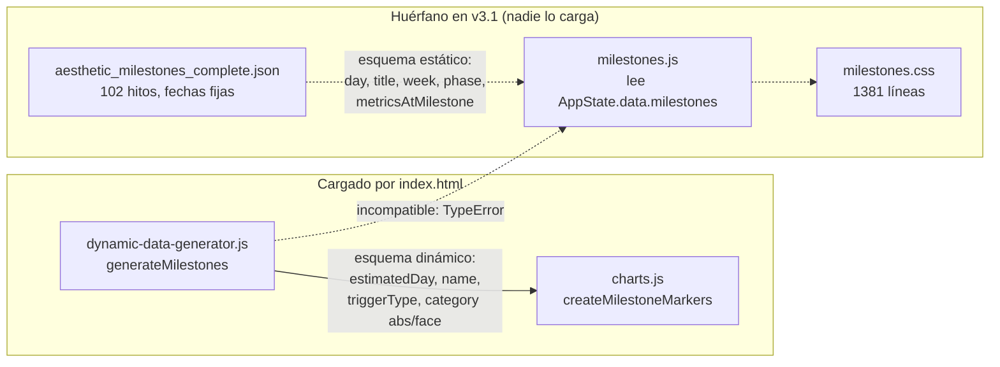

# Catálogo de hallazgos

> ## ⚠️ AUDITORÍA HISTÓRICA DE LA v3.1/v4.0 — NO DESCRIBE EL CÓDIGO ACTUAL
>
> **Esto no es documentación de la v5.** Describe el árbol de la v3.1 (con
> reverificaciones puntuales contra la v4.0), que hoy vive congelado en
> `legacy/` como referencia de solo lectura. Las rutas `js/…` que aparecen aquí
> **no existen** en este repositorio: la v5 se reconstruyó desde cero en `src/`.
>
> **Para qué sigue sirviendo, y es mucho:** es el mapa de minas del port. Cada
> ficha explica un defecto concreto con su escenario de fallo, y `CLAUDE.md` §1
> exige leerla antes de portar la pieza correspondiente. Por eso no se borra.
>
> **Qué NO hay que hacer con él:** tomarlo como estado actual, ni como plan de
> trabajo pendiente. El plan vivo es `PLAN-V5.md`. Marcado como histórico en
> M7-9 (8 de agosto de 2026), cuando se comprobó que la cabecera anterior decía
> «vigente / remediación no iniciada» sobre un árbol que ya no existía.

Registro completo y navegable de los 130 hallazgos confirmados sobre TransformLab, con su identificador estable, ubicación en el código, escenario de fallo y corrección propuesta.

> **Estado:** HISTÓRICO (v3.1/v4.0) · **Última revisión:** 1 de agosto de 2026 · **Versión auditada:** v3.1, commit `264c1db`

> **Alcance.** Los 130 hallazgos describen el **árbol de trabajo local**, `main` @ `264c1db` (v3.1). No describen la v4.0 publicada: `origin/main` está en `d0afa49` y el árbol local va tres commits por detrás (`git status -sb` devuelve `## main...origin/main [behind 3]`). Los dos únicos defectos reejecutados contra la v4.0 —el clamp de `otherLeanTissue` a [2,10] kg y la rama muerta `case 'recomp'`— siguen allí sin cambios, de modo que la prioridad del plan de remediación no varía; el resto de fichas **no** se ha verificado contra la v4.0 y no debe darse por válido allí. Ver `ING-01`.

## Cómo se usa este catálogo

Este documento es la referencia exhaustiva. Recoge los 130 hallazgos que sobrevivieron a la verificación adversarial de la auditoría, incluidos los de severidad baja. [`docs/AUDITORIA.md`](AUDITORIA.md) no lo sustituye: desarrolla con contexto los 5 críticos y los 21 altos y explica el método; aquí está todo lo demás, en formato de ficha corta y buscable.

Cada hallazgo tiene un identificador estable formado por un prefijo de área y un número correlativo. La numeración dentro de cada área sigue orden de severidad descendente, de modo que `MOT-01` es siempre el más grave del motor científico.

| Prefijo | Área | Ámbito |
|---|---|---|
| `MOT` | motor-cientifico | `js/calculations.js`, `test-calculation.js` |
| `GEN` | generador-datos | `js/dynamic-data-generator.js` y el pipeline de proyección |
| `EST` | estado-y-onboarding | `js/onboarding.js`, `js/app.js`, persistencia en localStorage |
| `REN` | capa-render | `js/dashboard.js`, `js/charts.js`, `js/insights.js` |
| `HIT` | sistema-hitos | `js/milestones.js`, `css/milestones.css`, `aesthetic_milestones_complete.json` |
| `FRO` | frontend-craft | `styles_new.css`, `index.html`, accesibilidad y responsive |
| `ING` | ingenieria-y-seguridad | repositorio, dependencias, despliegue, privacidad |

Severidades: **Crítica** (dato núcleo erróneo o aplicación rota), **Alta** (funcionalidad visible incorrecta), **Media** (defecto real de alcance acotado), **Baja** (cosmético, latente o deuda de segundo orden). Tipos: **BUG** (comportamiento incorrecto demostrable), **RIESGO** (fallo latente o superficie de exposición), **DEUDA** (código muerto, duplicado o incoherente sin fallo activo), **MEJORA** (funciona, pero el modelo o la práctica son mejorables).

Los números de línea corresponden al working tree del commit `264c1db` y se han verificado abriendo los ficheros. Cuando el verificador escéptico corrigió una cifra, un escenario o una severidad del auditor original, esa corrección está incorporada en el texto de la ficha, no anotada aparte.

Distribución:

| | Crítica | Alta | Media | Baja | Total |
|---|---|---|---|---|---|
| BUG | 5 | 14 | 31 | 12 | 62 |
| RIESGO | 0 | 4 | 14 | 7 | 25 |
| DEUDA | 0 | 3 | 14 | 17 | 34 |
| MEJORA | 0 | 0 | 0 | 9 | 9 |
| **Total** | **5** | **21** | **59** | **45** | **130** |

## Índice general

| ID | Severidad | Tipo | Ubicación | Título |
|---|---|---|---|---|
| `MOT-01` | Crítica | BUG | `js/calculations.js:191` | calculateTargetWeight produce pesos objetivo absurdos (IMC ~15) en la ruta por defecto de la app |
| `MOT-02` | Crítica | BUG | `js/calculations.js:496` | Onboarding inalcanzable: sin bioimpedancia el usuario no puede fijar ningún objetivo de pérdida de grasa |
| `MOT-03` | Crítica | BUG | `js/calculations.js:297` | Si target.weight es null, el plan calcula que hay que perder el 100% de la grasa corporal |
| `GEN-01` | Crítica | BUG | `js/dynamic-data-generator.js:24` | El clamp de otherLeanTissue a 2-10 kg destruye el modelo de composición y hunde toda la proyección |
| `EST-01` | Crítica | BUG | `js/onboarding.js:562` | El peso objetivo mostrado y persistido es absurdamente bajo: el clamp de 'otras masas magras' a 10 kg contradice el modelo del 48% |
| `MOT-04` | Alta | BUG | `js/calculations.js:117` | La fase de recomposición recibe calorías de mantenimiento: el case 'recomp' nunca se ejecuta |
| `MOT-05` | Alta | RIESGO | `js/calculations.js:104` | El objetivo calórico puede quedar por debajo del metabolismo basal, sin suelo de seguridad |
| `GEN-02` | Alta | BUG | `js/dynamic-data-generator.js:239` | La aritmética de fechas mezcla UTC y hora local: el cambio a horario de verano duplica un día y desplaza todas las fechas posteriores |
| `GEN-03` | Alta | BUG | `js/dynamic-data-generator.js:675` | Los hitos estéticos se generan con estimatedDay = NaN |
| `GEN-04` | Alta | BUG | `js/dynamic-data-generator.js:675` | estimatedDay se calcula asumiendo progreso lineal y contradice el día en que la serie cruza realmente el umbral |
| `GEN-05` | Alta | BUG | `js/calculations.js:334` | La pérdida de grasa se contabiliza dos veces entre recomposición y definición: el plan sobrepasa el objetivo y luego lo deshace |
| `EST-02` | Alta | BUG | `js/app.js:396` | initializeApp() no es idempotente: tras 'Editar perfil completo' se duplican todos los listeners y se acumula un segundo bucle de animación |
| `EST-03` | Alta | BUG | `js/onboarding.js:525` | Retroceder al paso 2 y cambiar la composición no recalcula ni el músculo auto-estimado ni el peso objetivo |
| `EST-04` | Alta | BUG | `js/app.js:140` | Si Chart.js del CDN no carga, el usuario recibe 'reconfigura tu perfil' y un botón que borra todos sus datos |
| `EST-05` | Alta | BUG | `js/onboarding.js:802` | El mínimo de 30 kg de músculo objetivo impide completar el onboarding a usuarios de complexión pequeña |
| `REN-01` | Alta | BUG | `js/insights.js:9` | Los insights se congelan: renderInsights() sólo se llama una vez en toda la vida de la app |
| `REN-02` | Alta | BUG | `js/dashboard.js:516` | El indicador de fase no avanza al navegar en granularidad semanal o mensual (usa currentDay obsoleto) |
| `REN-03` | Alta | BUG | `js/dashboard.js:259` | TypeError en renderNavigation al entrar en vista mensual cerca del final del plan |
| `REN-04` | Alta | BUG | `js/dashboard.js:387` | La tarjeta Físico muestra el cambio de grasa sin número: '↓ kg' |
| `REN-05` | Alta | BUG | `js/dashboard.js:382` | El delta de '% Grasa' siempre se muestra como '--' porque los objetos de cambio no tienen fatPct |
| `HIT-01` | Alta | DEUDA | `index.html:156` | Código huérfano en este árbol: 2.276 líneas y 138 KB del sistema de hitos no se cargan ni se ejecutan |
| `HIT-02` | Alta | DEUDA | `aesthetic_milestones_complete.json:1` | aesthetic_milestones_complete.json es el plan personal de un único usuario, con fechas de calendario fijas, incompatible con una app multi-perfil |
| `FRO-01` | Alta | RIESGO | `index.html:26` | Chart.js se carga desde un CDN sin versión fijada y sin integridad SRI, en modo render-blocking |
| `ING-01` | Alta | RIESGO | `.git/FETCH_HEAD` | El main local está desincronizado del main real de GitHub y git informa de que está al día |
| `ING-02` | Alta | RIESGO | `index.html:26` | Chart.js se carga desde CDN sin versión fijada ni control de integridad (SRI) |
| `ING-03` | Alta | DEUDA | `index.html:162` | El 35% del contenido versionado es código muerto que index.html no carga en este árbol |
| `MOT-06` | Media | BUG | `js/calculations.js:454` | Un sexo no reconocido desactiva por completo la validación de porcentaje de grasa |
| `MOT-07` | Media | BUG | `js/calculations.js:565` | Las métricas de rendimiento pueden salir negativas: agilidad -8 sobre una escala 0-10 |
| `MOT-08` | Media | BUG | `js/calculations.js:334` | Las expectativas por fase no suman el objetivo: restas mágicas de 2 kg de grasa y 0.5 kg de músculo |
| `MOT-09` | Media | BUG | `js/calculations.js:651` | addDailyFluctuation no es determinista y rompe la conservación de masa diaria |
| `MOT-10` | Media | BUG | `js/calculations.js:315` | Perder músculo o estar ya en el objetivo produce un plan vacío de 58 días |
| `MOT-11` | Media | DEUDA | `js/calculations.js:501` | validateInputs no puede detectar un peso objetivo fuera de rango y muestra el texto 'nullkg' |
| `MOT-12` | Media | DEUDA | `js/calculations.js:457` | Rangos de validación incoherentes entre el onboarding y el motor |
| `MOT-13` | Media | DEUDA | `test-calculation.js:39` | test-calculation.js no ejecuta el código que dice verificar y no tiene asserts |
| `GEN-06` | Media | BUG | `js/dynamic-data-generator.js:51` | generateTransformationData sobrescribe silenciosamente el peso objetivo del usuario y muta el perfil ya guardado |
| `GEN-07` | Media | BUG | `js/dynamic-data-generator.js:461` | En los datos mensuales, `phase` y `phaseType` pueden referirse a fases distintas |
| `GEN-08` | Media | BUG | `js/dynamic-data-generator.js:532` | metadata.initialComposition/targetComposition llevan strength y aesthetics hardcodeados que contradicen las series generadas |
| `GEN-09` | Media | RIESGO | `js/calculations.js:651` | Math.random() en la fluctuación diaria hace la generación no determinista y el último día no aterriza en el objetivo |
| `GEN-10` | Media | BUG | `js/dynamic-data-generator.js:291` | En zonas horarias con offset UTC negativo, dateFormatted y dayOfWeek van un día por detrás de date |
| `GEN-11` | Media | RIESGO | `js/dynamic-data-generator.js:345` | La última semana parcial se presenta como una semana completa |
| `GEN-12` | Media | RIESGO | `js/dynamic-data-generator.js:419` | Los meses son de calendario pero la navegación los indexa como bloques de 30 días |
| `GEN-13` | Media | RIESGO | `js/dynamic-data-generator.js:168` | Los guardarraíles de fase capan valores imposibles en silencio y la fase de mantenimiento fuerza el objetivo de golpe |
| `EST-06` | Media | BUG | `js/app.js:615` | El botón 'Hoy' navega al punto medio del plan en lugar de a la fecha actual |
| `EST-07` | Media | RIESGO | `js/onboarding.js:866` | Ninguna escritura ni lectura de localStorage está protegida: modo incógnito, cuota o JSON corrupto dejan al usuario atrapado |
| `EST-08` | Media | RIESGO | `js/app.js:110` | Sin versionado de esquema ni validación de forma del perfil guardado: un perfil antiguo rompe el arranque con TypeError o RangeError |
| `EST-09` | Media | BUG | `js/onboarding.js:778` | El paso 2 no valida la masa muscular introducida: admite valores superiores a la masa magra o al propio peso |
| `EST-10` | Media | RIESGO | `js/app.js:257` | Abrir dos veces el modal de ajustes genera IDs duplicados y deja un overlay huérfano que bloquea la interfaz |
| `EST-11` | Media | BUG | `js/app.js:233` | Las fechas 'YYYY-MM-DD' se parsean como UTC y se muestran en horario local: desfase de un día |
| `REN-06` | Media | BUG | `js/dashboard.js:651` | renderGoalProgress imprime 'NaN%' y 'width: NaN%' cuando el valor inicial coincide con el objetivo |
| `REN-07` | Media | BUG | `js/charts.js:403` | El clic sobre el gráfico no navega en granularidad diaria (hit-test imposible con pointRadius 0) |
| `REN-08` | Media | BUG | `js/insights.js:118` | En vista mensual desaparecen todos los insights de bienestar y de progreso acumulado |
| `REN-09` | Media | BUG | `js/charts.js:504` | Los hitos de fin de fase nunca se dibujan en granularidad mensual (monthly[] no tiene endDay) |
| `REN-10` | Media | RIESGO | `js/charts.js:138` | El eje y1 sólo se declara si conviven métricas de los dos grupos, pero yAxisID lo asigna siempre |
| `REN-11` | Media | RIESGO | `js/dashboard.js:47` | Toda la capa de render inyecta datos de localStorage con innerHTML sin escapar (XSS almacenado) |
| `REN-12` | Media | BUG | `js/charts.js:402` | handleChartClick deja el estado de navegación parcialmente sincronizado |
| `REN-13` | Media | DEUDA | `js/dashboard.js:325` | Re-render por innerHTML de todo el dashboard en cada interacción, con listeners y estilos inline recreados |
| `HIT-03` | Media | BUG | `js/milestones.js:688` | Modelo de datos incompatible: milestones.js lanza TypeError con los hitos que genera realmente la app |
| `HIT-04` | Media | DEUDA | `js/milestones.js:823` | Dos implementaciones competidoras de marcadores de hitos en el gráfico, con paletas de categorías incompatibles |
| `HIT-05` | Media | RIESGO | `js/milestones.js:115` | getNextMilestone asume que el array de hitos está ordenado por día y no lo ordena |
| `FRO-02` | Media | BUG | `styles_new.css:725` | La rejilla del dashboard tiene 3 columnas pero el HTML pinta 4 tarjetas: la tarjeta metabólica queda huérfana en una segunda fila |
| `FRO-03` | Media | BUG | `styles_new.css:1972` | El selector .phase-name está duplicado en el mismo fichero y la segunda definición degrada el título del indicador de fase |
| `FRO-04` | Media | BUG | `styles_new.css:143` | Los botones de fecha rápida del onboarding no reciben ningún estilo: el CSS espera .quick-date-btn y el JS genera .quick-date |
| `FRO-05` | Media | BUG | `index.html:64` | La barra de línea de tiempo es un div clicable sin rol, sin tabindex y sin manejador de teclado: es inalcanzable sin ratón |
| `FRO-06` | Media | BUG | `styles_new.css:1525` | Los cuatro overlays modales no capturan el foco, no se cierran con Escape y no devuelven el foco al cerrarse |
| `FRO-07` | Media | BUG | `js/app.js:651` | Los atajos de teclado globales siguen activos con un modal abierto y se disparan al escribir en un <select> |
| `FRO-08` | Media | BUG | `styles_new.css:375` | El color --text-muted no alcanza el contraste AA (3,67:1) y es el color de prácticamente todas las etiquetas de la interfaz |
| `FRO-09` | Media | BUG | `styles_new.css:540` | Las insignias de fase usan texto blanco sobre colores de fase que no llegan al contraste mínimo (2,56:1 en el peor caso) |
| `FRO-10` | Media | BUG | `styles_new.css:1499` | El bloque @media (max-width: 480px) de las líneas 1499-1520 está completamente anulado por el segundo bloque de 480px |
| `FRO-11` | Media | DEUDA | `styles_new.css:2322` | El bloque de 900px intenta apilar con flex-direction dos contenedores que son grid: las declaraciones no hacen nada |
| `FRO-12` | Media | RIESGO | `styles_new.css:53` | No existe ninguna media query prefers-reduced-motion pese a haber animaciones infinitas, transiciones globales y un efecto que sigue al cursor |
| `FRO-13` | Media | BUG | `styles_new.css:1281` | La fila de insights declara dos columnas 2fr 1fr pero sólo tiene un hijo: un tercio del ancho queda vacío |
| `FRO-14` | Media | RIESGO | `styles_new.css:418` | Falta la declaración color-scheme: dark, con lo que los controles nativos (select, date) se pintan en modo claro sobre fondo oscuro |
| `FRO-15` | Media | DEUDA | `css/milestones.css:1` | css/milestones.css (1381 líneas, 26,8 KB) no está enlazado desde index.html: es una hoja completa muerta |
| `FRO-16` | Media | DEUDA | `styles_new.css:294` | Unas 265 líneas de styles_new.css (≈10%) estilan clases que ningún fichero HTML ni JS genera |
| `FRO-17` | Media | BUG | `index.html:134` | El <canvas> del gráfico principal no tiene ninguna alternativa textual: los datos son inaccesibles sin ratón y sin visión |
| `FRO-18` | Media | BUG | `index.html:73` | Botones sin nombre accesible y toggles sin estado expuesto: la barra de navegación es ininteligible para un lector de pantalla |
| `FRO-19` | Media | DEUDA | `styles_new.css:106` | No existe ningún estilo de foco de teclado y se anula el outline nativo en cuatro puntos |
| `FRO-20` | Media | DEUDA | `index.html:116` | La paleta está triplicada: 33 hex fuera de :root en el CSS, 7 en atributos style del HTML y unos 25 más en el JS |
| `ING-04` | Media | RIESGO | `.claude/worktrees/silly-yonath` | Un `git add -A` incrustaría el worktree .claude/ como repositorio embebido y corromperías el árbol de main |
| `ING-05` | Media | DEUDA | `.DS_Store` | .DS_Store está versionado en el commit inicial y el repositorio no tiene .gitignore |
| `ING-06` | Media | BUG | `js/onboarding.js:866` | Onboarding.complete() escribe en localStorage sin try/catch y deja la aplicación bloqueada si la escritura falla |
| `ING-07` | Media | RIESGO | `js/onboarding.js:57` | Datos de salud almacenados en claro y expuestos a cualquier otro contenido del mismo origen |
| `ING-08` | Media | DEUDA | `test-calculation.js:22` | test-calculation.js reimplementa las fórmulas en lugar de ejecutar calculations.js, por lo que no puede detectar ninguna regresión |
| `ING-09` | Media | DEUDA | `index.html:3` | Sin cabecera CSP, y 15 atributos onclick en línea impedirían activarla de forma estricta |
| `ING-10` | Media | DEUDA | `README.md` | El repositorio no tiene README, LICENSE ni ninguna documentación de cómo se ejecuta |
| `MOT-14` | Baja | BUG | `js/calculations.js:628` | Las métricas de bienestar superan el máximo de la escala (10.3 sobre 10) |
| `MOT-15` | Baja | RIESGO | `js/calculations.js:253` | calculateWeeklyFatLoss propaga NaN silenciosamente con una intensidad desconocida |
| `MOT-16` | Baja | MEJORA | `js/calculations.js:371` | La duración de la definición se calcula con una tasa fija sobre el peso INICIAL |
| `MOT-17` | Baja | MEJORA | `js/calculations.js:34` | Las tasas de ganancia muscular son absolutas mientras las de grasa son relativas al peso |
| `MOT-18` | Baja | DEUDA | `js/calculations.js:321` | El cálculo de la duración de la recomposición siempre da 90 días |
| `MOT-19` | Baja | DEUDA | `js/calculations.js:80` | BMR se devuelve sin redondear y se pinta con decimales en la interfaz |
| `MOT-20` | Baja | DEUDA | `js/calculations.js:236` | Código muerto en el motor: calculateComposition, calculateWeightFromComposition y el clamp de déficit |
| `GEN-14` | Baja | BUG | `js/dynamic-data-generator.js:242` | El primer día de la proyección no representa la composición inicial (off-by-one en la interpolación) |
| `GEN-15` | Baja | DEUDA | `js/dynamic-data-generator.js:362` | Las semanas que cruzan una frontera de fase se etiquetan con la fase equivocada respecto a sus datos de cierre |
| `GEN-16` | Baja | DEUDA | `js/dynamic-data-generator.js:132` | La fase de definición ignora el expectedMuscleGain planificado y aplica una pérdida fija del 2% |
| `GEN-17` | Baja | BUG | `js/dynamic-data-generator.js:657` | Las categorías de los hitos estéticos no existen en el mapa de colores/iconos de la gráfica |
| `GEN-18` | Baja | DEUDA | `aesthetic_milestones_complete.json:1` | aesthetic_milestones_complete.json (76 KB) es un fichero huérfano que nadie carga |
| `GEN-19` | Baja | DEUDA | `js/dynamic-data-generator.js:101` | Código muerto y trabajo duplicado en el pipeline |
| `GEN-20` | Baja | MEJORA | `js/dynamic-data-generator.js:565` | La interpolación lineal dentro de fase es un modelo pobre para composición corporal |
| `EST-12` | Baja | RIESGO | `js/app.js:268` | Datos procedentes de localStorage se inyectan con innerHTML sin escapar (XSS de origen almacenado) |
| `EST-13` | Baja | BUG | `js/app.js:349` | Guardar una nueva fecha de inicio no re-renderiza el panel de insights |
| `EST-14` | Baja | BUG | `js/onboarding.js:655` | La previsualización de composición muestra el metabolismo basal sin redondear y con barras sin limitar |
| `EST-15` | Baja | DEUDA | `js/onboarding.js:813` | En el paso 4 con errores de validación, el botón '🚀 Comenzar' no hace nada ni informa |
| `EST-16` | Baja | DEUDA | `js/app.js:651` | Los atajos de teclado sólo se desactivan sobre INPUT: actúan sobre el dashboard con el wizard o los modales abiertos |
| `EST-17` | Baja | DEUDA | `js/app.js:529` | Los helpers de formato no cubren NaN ni cadenas, y formatChange produce '-0.00' |
| `EST-18` | Baja | DEUDA | `js/app.js:149` | regenerateData() genera los hitos dos veces y duplica la lógica de Onboarding.complete() |
| `EST-19` | Baja | DEUDA | `js/app.js:26` | AppState declara campos que nadie escribe ni lee, y las funciones de previsualización mutan el estado |
| `EST-20` | Baja | MEJORA | `js/onboarding.js:794` | La fecha de inicio no se valida en ningún paso: se aceptan fechas arbitrariamente pasadas o futuras |
| `REN-14` | Baja | BUG | `js/charts.js:546` | Los hitos estéticos se pintan todos en gris con un punto: las categorías del renderizador no coinciden con las del generador |
| `REN-15` | Baja | RIESGO | `js/charts.js:542` | calculateMilestonePositions se recalcula por completo en cada frame de dibujo y en cada movimiento del tooltip |
| `REN-16` | Baja | BUG | `js/charts.js:450` | updateChartHighlight anula la optimización de pointRadius:0 en vista diaria y no restaura el estilo original |
| `REN-17` | Baja | BUG | `js/dashboard.js:104` | exportProjectData informa 'Femenino' por defecto y vuelca claves internas sin traducir |
| `REN-18` | Baja | DEUDA | `js/charts.js:367` | El panel de hover emite un marcado que la hoja de estilos no contempla |
| `HIT-06` | Baja | BUG | `js/milestones.js:165` | totalDays del timeline lee una ruta de metadata que no existe y cae siempre en el 485 hardcodeado |
| `HIT-07` | Baja | BUG | `js/milestones.js:310` | El panel de próximo hito anuncia '102 hitos' hardcodeados del plan personal del JSON |
| `HIT-08` | Baja | BUG | `js/milestones.js:122` | El estado 'current' se calcula pero ni el HTML ni el CSS lo contemplan: un hito alcanzado hoy se muestra como pendiente |
| `HIT-09` | Baja | BUG | `js/milestones.js:130` | getCurrentDay() devuelve un día obsoleto en granularidad mensual porque usa currentWeek, que sólo se actualiza en modo semanal y diario |
| `HIT-10` | Baja | RIESGO | `js/milestones.js:859` | El plugin de gráfico de milestones.js valida el índice de dato contra xScale.ticks.length, que no es el número de puntos |
| `HIT-11` | Baja | DEUDA | `styles_new.css:1272` | Reglas CSS muertas del sistema de hitos dentro de styles_new.css, la hoja que sí se carga |
| `HIT-12` | Baja | DEUDA | `css/milestones.css:1095` | 25 de las 138 clases de milestones.css no las emite nadie, incluida la sección completa de popup de gráfico (234 líneas) |
| `HIT-13` | Baja | RIESGO | `js/milestones.js:177` | Todo el contenido de los hitos se interpola sin escapar en innerHTML y en atributos HTML |
| `HIT-14` | Baja | RIESGO | `js/milestones.js:401` | renderMilestoneStats produce 'NaN%' y 'undefined' si se invoca con la colección de hitos vacía |
| `FRO-21` | Baja | RIESGO | `js/app.js:725` | El efecto cursor-glow mantiene un bucle requestAnimationFrame perpetuo que anima left/top, forzando layout en cada frame |
| `FRO-22` | Baja | MEJORA | `index.html:14` | Open Graph incompleto y sin metadatos de compartición, en una página que robots.txt declara indexable |
| `FRO-23` | Baja | DEUDA | `styles_new.css:1537` | El overlay del onboarding conserva 2rem de padding en móvil pequeño, comiendo un 20% del ancho de pantalla |
| `FRO-24` | Baja | DEUDA | `styles_new.css:429` | body { overflow-x: hidden } enmascara desbordes horizontales en lugar de corregirlos |
| `FRO-25` | Baja | MEJORA | `index.html:34` | El overlay de carga se oculta con display inline y sin ninguna semántica de estado ocupado |
| `ING-11` | Baja | MEJORA | `package.json` | Sin package.json, linter, formateador ni integración continua |
| `ING-12` | Baja | MEJORA | `js/app.js:132` | El perfil del usuario se escribe en la consola del navegador con peso y objetivo |
| `ING-13` | Baja | MEJORA | `robots.txt:5` | robots.txt autoriza la indexación completa y conserva un dominio de ejemplo sin sustituir |

## MOT — Motor científico

Veinte hallazgos sobre `js/calculations.js` y el fichero de pruebas suelto. Las fórmulas de libro (Mifflin-St Jeor, multiplicadores de actividad, tasas de pérdida de grasa) son correctas; los defectos están en el modelo de composición corporal que las rodea. Contexto ampliado en [`docs/METODOLOGIA-CIENTIFICA.md`](METODOLOGIA-CIENTIFICA.md).

### MOT-01 — calculateTargetWeight produce pesos objetivo absurdos en la ruta por defecto

**Severidad:** Crítica · **Tipo:** BUG · **Ubicación:** `js/calculations.js:191`

- **Descripción.** La función asume que `muscleKg` procede de una bioimpedancia, donde el músculo es casi toda la masa magra, y por eso limita `otherLeanTissue` al rango [2,10] kg. Pero el onboarding autorrellena `initial.muscleKg` con `estimateMuscleFromComposition()`, que devuelve el 48% de la masa magra (`js/calculations.js:222`); el resto magro real vale entonces el 52% (20-35 kg) y el clamp lo aplasta a 10. Se descuentan del peso objetivo entre 12 y 25 kg que existen.
- **Escenario de fallo.** Hombre de 80 kg, 20% de grasa, 180 cm, que deja vacío el campo de músculo (estimación: 30,7 kg). Con objetivo 15% y 33 kg de músculo, la función devuelve 50,6 kg (IMC 15,6) frente a los 80,9 kg coherentes con el propio modelo del 48%. La prueba de identidad es concluyente: pedir como objetivo la composición actual (`calculateTargetWeight(30.7, 20, {weight:80, fatPct:20, muscleKg:30.7})`) devuelve 50,9 kg en lugar de 80. Con músculo medido real (60,5 kg) la misma llamada sí devuelve 80 kg. `validateInputs` da `isValid: true` y cero avisos.
- **Corrección propuesta.** Unificar la definición de "músculo". Mínimo: marcar el origen del dato (`initial.muscleSource = 'measured' | 'estimated'`) y usar la rama de proporción `targetMuscleKg / 0.48` cuando sea estimado. Correcto: que `estimateMuscleFromComposition` devuelva tejido magro blando (≈ masa magra − 3,5 kg) para que ambas rutas hablen del mismo tejido, y sustituir el clamp duro por un aviso al usuario en lugar de una corrección silenciosa.

### MOT-02 — Sin bioimpedancia, el usuario no puede fijar ningún objetivo de pérdida de grasa

**Severidad:** Crítica · **Tipo:** BUG · **Ubicación:** `js/calculations.js:496`

- **Descripción.** Consecuencia directa de `MOT-01` combinada con el chequeo `target.muscleKg > targetWeight * 0.55`. Como el peso objetivo sale artificialmente bajo, casi cualquier objetivo de músculo supera ese 55%; y como el onboarding exige `targetMuscle >= 30` (`js/onboarding.js:802`) mientras el músculo estimado de una mujer ronda los 20 kg, el incremento porcentual supera siempre el 30%. Se disparan ambas condiciones y se emite un error bloqueante que impide terminar el asistente.
- **Escenario de fallo.** Mujer de 60 kg, 28% de grasa, 165 cm, 40 años, sin bioimpedancia (músculo estimado 20,7 kg). Barriendo la rejilla completa que admite el onboarding (grasa 16-40%, músculo 30-100 kg, paso 1) hay 1.775 combinaciones y sólo 323 pasan la validación; el %grasa objetivo mínimo aceptado es 27%. Ese 27% está por debajo del 28% actual, pero una diferencia de un punto ni siquiera activa la fase de definición (`needsCut` exige `initial.fatPct > target.fatPct + 2`, `js/calculations.js:315`), así que en la práctica no puede definir. Con 22% y 30 kg obtiene un peso objetivo de 51,3 kg y el error "La masa muscular objetivo (30kg) es fisiológicamente improbable para un peso de 51.3kg".
- **Corrección propuesta.** Arreglar antes `MOT-01`. Después, comparar el músculo objetivo contra la masa magra objetivo con el mismo modelo con el que se estimó el músculo inicial, no contra un 55% fijo del peso, y sustituir el mínimo de 30 kg del onboarding por uno relativo al usuario (por ejemplo `0.7 × músculo actual`).

### MOT-03 — Con `target.weight` nulo, el plan calcula que hay que perder el 100% de la grasa corporal

**Severidad:** Crítica · **Tipo:** BUG · **Ubicación:** `js/calculations.js:297`

- **Descripción.** `fatToLose` multiplica `target.weight * target.fatPct / 100`. Cuando `calculateTargetWeight` devuelve `null` (peso fuera de 40-150 kg, o %grasa objetivo por debajo de 5), el onboarding guarda `target.weight = null` y continúa. En JavaScript `null * 15 / 100` es 0, no NaN, así que no salta ninguna alarma: el motor concluye que la grasa objetivo es 0 kg y dimensiona una fase de definición para llegar al 0% de grasa corporal.
- **Escenario de fallo.** `initial = {weight:80, fatPct:25, muscleKg:30.7}` con `target = {fatPct:15, muscleKg:33, weight:null}`: `calculatePhaseDurations` devuelve `summary.fatToLose = 20.0` kg —toda la grasa del usuario— y una fase de definición de 210 días, con `totalDays = 448`. El usuario ve un plan de 64 semanas hacia el 0% de grasa. Matiz del verificador: `validateInputs` no lee `target.weight`, lo recalcula (`js/calculations.js:479`), de modo que el aviso literal "El peso objetivo calculado (nullkg) parece inusual" no aparece en ese escenario concreto, pero sí en todos los casos realmente alcanzables, donde el recálculo también devuelve `null`.
- **Corrección propuesta.** Guarda de entrada en `calculatePhaseDurations`: si `!Number.isFinite(target.weight)` o `!Number.isFinite(initial.weight)`, devolver `{phases: [], totalDays: 0, error: 'datos insuficientes'}`. Y en `validateInputs`, convertir el caso `targetWeight === null` en error bloqueante en lugar de aviso, sin invocar el plan de fases.

### MOT-04 — La fase de recomposición recibe calorías de mantenimiento: el `case 'recomp'` nunca se ejecuta

**Severidad:** Alta · **Tipo:** BUG · **Ubicación:** `js/calculations.js:117`

- **Descripción.** `calculateCaloricTarget` declara un `case 'recomp'`, pero el tipo de fase que produce `calculatePhaseDurations` es `'recomposition'` (`js/calculations.js:324`) y `js/dynamic-data-generator.js:181` invoca la función con `phase.type`. La comparación nunca coincide y cae al `default`, que es mantenimiento con déficit 0. La rama del 5% de déficit es código muerto. Las fases `adaptation` y `transition` también caen al `default`, pero ahí no hay ningún `case` muerto y el mantenimiento es defendible.
- **Escenario de fallo.** Hombre de 80 kg / 180 cm / 30 años / actividad moderada, TDEE 2.759 kcal. `calculateCaloricTarget(2759, 'recomposition')` devuelve `{target: 2759, deficit: 0}`, mientras la misma fase declara `expectedFatLoss = 4.5` kg en 90 días, lo que exigiría unas 385 kcal/día de déficit. La tarjeta metabólica muestra 2.759 kcal/día mientras la gráfica muestra al usuario perdiendo 4,5 kg de grasa comiendo a mantenimiento.
- **Corrección propuesta.** Renombrar el `case` a `'recomposition'` (o aceptar ambos) y, mejor, derivar el déficit del `expectedFatLoss` de la propia fase (`deficitDiario = expectedFatLoss * 7700 / dias`) para que calorías y composición no puedan divergir.

### MOT-05 — El objetivo calórico puede quedar por debajo del metabolismo basal

**Severidad:** Alta · **Tipo:** RIESGO · **Ubicación:** `js/calculations.js:104`

- **Descripción.** El déficit se aplica como porcentaje (20% por defecto) sin comprobar el valor absoluto resultante contra el BMR ni contra ningún suelo mínimo. El único límite existente, `Math.min(deficit, 1000)` (`js/calculations.js:110`), sólo entra en juego con un TDEE superior a 5.000 kcal, es decir, nunca: aparenta una salvaguarda que no existe.
- **Escenario de fallo.** Mujer de 50 kg, 155 cm, 60 años, sedentaria —todos los valores dentro de los rangos que admite el onboarding—: BMR 1.007,75 kcal, TDEE 1.209 kcal y `calculateCaloricTarget(1209, 'cut')` devuelve 967 kcal/día, un 4% por debajo de su metabolismo basal y por debajo del suelo de 1.200 kcal habitual en pautas clínicas. Se muestra como recomendación sin ningún aviso.
- **Corrección propuesta.** Sustituir el tope inoperante por un suelo real: `target = Math.max(target, Math.round(bmr), sex === 'female' ? 1200 : 1500)`, y si el suelo recorta el déficit, reducir proporcionalmente la tasa de pérdida usada en el plan para que las duraciones sigan siendo coherentes. Requiere pasar el BMR (o el sexo) a la función, que hoy sólo recibe el TDEE.

### MOT-06 — Un sexo no reconocido desactiva toda la validación de porcentaje de grasa

**Severidad:** Media · **Tipo:** BUG · **Ubicación:** `js/calculations.js:454`

- **Descripción.** `MIN_SAFE_FAT[sex]` y `MAX_FAT[sex]` devuelven `undefined` para cualquier valor que no sea exactamente `'male'` o `'female'`. Todas las comparaciones contra `undefined` son falsas, así que no se emite ningún error; y si se emitiera, el texto diría "entre undefined% y undefined%". La misma expresión se usa en `js/onboarding.js:318` y `js/onboarding.js:796`, donde acaba pintándose como `min="undefined"` en el input.
- **Escenario de fallo.** `validateInputs({weight:80, fatPct:60, muscleKg:30}, {fatPct:1, muscleKg:33, weight:70}, {sex:'otro', age:30})` devuelve `isValid: true` y `errors: []`: un 60% de grasa inicial y un 1% objetivo pasan sin un solo error. No es alcanzable desde la interfaz —`profile.sex` sólo puede valer `'male'` o `'female'` y no hay forma de editarlo desde `app.js`—, de modo que el disparador real es un localStorage manipulado o corrupto.
- **Corrección propuesta.** Normalizar y validar el sexo al principio de la función: `const s = sex === 'female' ? 'female' : sex === 'male' ? 'male' : null; if (!s) { errors.push('Sexo no válido'); return {...}; }`. Aplicar el mismo saneado en `calculateBMR` (`js/calculations.js:79`) y en `calculateMonthlyMuscleGain` (`js/calculations.js:270`), que hoy tratan cualquier valor desconocido como uno de los dos según la rama.

### MOT-07 — Las métricas de rendimiento pueden salir negativas

**Severidad:** Media · **Tipo:** BUG · **Ubicación:** `js/calculations.js:565`

- **Descripción.** `agility` y `strength` sólo tienen cota superior (`Math.min`), nunca inferior. `fatLossPct` divide por `initial.fatPct`, así que en un usuario que empieza delgado cualquier ganancia de grasa se amplifica y el resultado se va a negativo sobre una escala 0-10.
- **Escenario de fallo.** Usuario que empieza con 8% de grasa y llega al 14% durante el volumen: `agility = -2`. Por llamada directa con 10% → 25% el valor baja a −8. En planes realmente generados la agilidad negativa se observa hasta ≈ −0,6. La fuerza negativa es teórica: la fase de corte sólo aplica `endMuscleKg = currentMuscleKg * 0.98` (`js/dynamic-data-generator.js:132`), así que la caída de músculo nunca se acerca al −25% necesario, y `strength` no baja de 30 en datos reales. El caso `initial.muscleKg = 0` tampoco es alcanzable porque el onboarding siempre rellena el músculo.
- **Corrección propuesta.** Acotar por ambos lados con un helper `clamp(v, lo, hi)` y aplicar `clamp(x, 0, 10)` y `clamp(x, 0, 100)`. Añadir guarda `initial.muscleKg > 0` antes de calcular `muscleGainPct`, igual que ya se hace en `validateInputs` (`js/calculations.js:494`).

### MOT-08 — Las expectativas por fase no suman el objetivo: restas mágicas de 2 kg y 0,5 kg

**Severidad:** Media · **Tipo:** BUG · **Ubicación:** `js/calculations.js:334`

- **Descripción.** El reparto del trabajo entre fases usa constantes sin justificación (`fatToLose - 2`, `muscleToGain - 0.5`) que no se corresponden con lo que las fases previas declaran haber conseguido (adaptación 0,3 kg, recomposición 4,5 kg), y ninguna fase compensa la grasa que el volumen declara ganar. La suma de `expectedFatLoss` y `expectedMuscleGain` de todas las fases no coincide con `summary.fatToLose` / `summary.muscleToGain`, unas veces por exceso y otras por defecto.
- **Escenario de fallo.** Mujer de 60 kg / 28% / 20,7 kg de músculo con objetivo 22% y 22 kg: el plan promete en total 4,88 kg de pérdida de grasa frente a los 7,8 kg del objetivo declarado, y 0,70 kg de músculo frente a 1,3 kg. En el perfil inverso (hombre 80 kg / 20% → 15% y 33 kg) sobra: promete 10,01 kg frente a 8,4 kg. El objetivo final sí se alcanza —`js/dynamic-data-generator.js:154` fuerza la fase de mantenimiento a terminar exactamente en el objetivo—, de modo que el defecto real es la incoherencia del reparto y la trayectoria intermedia que produce, no el incumplimiento de la meta.
- **Corrección propuesta.** Sustituir las constantes por el balance real acumulado: llevar `grasaYaPerdida` / `musculoYaGanado` sumando lo declarado por las fases ya insertadas y dimensionar corte y volumen con el remanente. Añadir una comprobación de cierre que verifique que las sumas cuadran con el objetivo dentro de una tolerancia.

### MOT-09 — `addDailyFluctuation` no es determinista y rompe la conservación de masa diaria

**Severidad:** Media · **Tipo:** BUG · **Ubicación:** `js/calculations.js:651`

- **Descripción.** La función mezcla dos senos deterministas con `(Math.random() - 0.5) * 0.4`. La serie no es reproducible: cualquier regeneración reescribe todo el histórico con otros valores. Además el ruido se aplica sólo al peso mientras `fatPct` y `muscleKg` se interpolan limpiamente, de modo que `fatKg = displayWeight * fatPct/100` y `leanMassKg = displayWeight - fatKg` heredan el ruido y el tejido magro no muscular oscila ±0,5 kg diarios, contradiciendo la premisa de tejido magro constante sobre la que se construyó el arreglo de la v3.1.
- **Escenario de fallo.** Tres llamadas consecutivas a `addDailyFluctuation(80, 10)` devuelven 80,37, 80,40 y 80,19 kg. Dos usuarios con datos idénticos —o el mismo usuario tras un reinicio de perfil— obtienen gráficas de peso distintas para el mismo plan. Precisión: el peso "de hoy" no cambia solo, porque los datos se generan una vez y se persisten (`js/onboarding.js:866`, `js/app.js:166`) y sólo se regeneran si faltan o tras reiniciar el perfil.
- **Corrección propuesta.** Sustituir `Math.random()` por un PRNG determinista sembrado con el día y un seed del perfil (mulberry32, o simplemente un tercer seno con frecuencia irracional). Aplicar la fluctuación al agua corporal, recalculando `fatKg` a partir de la grasa interpolada en kg y no del peso ruidoso, para que el tejido magro no muscular se mantenga constante.

### MOT-10 — Perder músculo o estar ya en el objetivo produce un plan vacío de 58 días

**Severidad:** Media · **Tipo:** BUG · **Ubicación:** `js/calculations.js:315`

- **Descripción.** `needsCut` (más de 2 puntos de %grasa de diferencia) y `needsBulk` (más de 1 kg de músculo) sólo detectan cambios en la dirección de definir y ganar. No hay rama para perder músculo, ni para diferencias pequeñas de grasa, ni mensaje para el caso de estar ya en el objetivo. El plan degenera en adaptación + transición + mantenimiento.
- **Escenario de fallo.** Usuario de 90 kg / 20% / 45 kg de músculo con objetivo 80 kg / 19% / 38 kg: `totalDays = 58` con fases Adaptación(14) + Transición(14) + Mantenimiento(30), mientras el resumen anuncia `fatToLose: 2.8` y `muscleToGain: -7`. El generador interpolará esos 10 kg de cambio contra fases que declaran cambio cero. Introducir los mismos datos como inicial y objetivo produce el mismo plan de 58 días sin decir nada. Querer bajar de 20% a 18,5% tampoco genera fase de definición pese a que el resumen reporta grasa a perder.
- **Corrección propuesta.** Añadir una rama explícita para `muscleToGain < -1` (fase de pérdida con déficit mayor y expectativa de pérdida muscular) y otra para "sin cambios significativos" que devuelva un plan vacío con un flag `alreadyAtTarget: true` que el onboarding pueda mostrar. Bajar el umbral de `needsCut` a la resolución real del objetivo, comparando kg de grasa en vez de puntos porcentuales.

### MOT-11 — `validateInputs` no puede detectar un peso objetivo fuera de rango y muestra el texto "nullkg"

**Severidad:** Media · **Tipo:** DEUDA · **Ubicación:** `js/calculations.js:501`

- **Descripción.** `calculateTargetWeight` ya garantiza por construcción (`js/calculations.js:207`) que su retorno está entre 40 y 150 kg o es `null`. La comprobación `targetWeight < 40 || targetWeight > 150` de `validateInputs` sólo puede ser cierta cuando el valor es `null` (`null < 40` es `true`), y entonces el mensaje interpolado dice literalmente "nullkg". La validación de rango es inalcanzable y el aviso resultante es incomprensible. Al ser aviso y no error, el onboarding deja continuar con `target.weight` nulo, alimentando `MOT-03`.
- **Escenario de fallo.** `validateInputs({weight:80, fatPct:20, muscleKg:60.5}, {fatPct:15, muscleKg:19, weight:null}, {sex:'male', age:30})` devuelve `isValid: true`, `errors: []` y `warnings: ['Perder 41.5kg de músculo es significativo. ¿Es intencional?', 'El peso objetivo calculado (nullkg) parece inusual. Verifica tus datos.']`.
- **Corrección propuesta.** Separar los dos casos: si `targetWeight === null`, empujar un error explicativo ("No se puede calcular un peso objetivo coherente con esos datos"). Y hacer que `calculateTargetWeight` devuelva el valor calculado junto a un flag `outOfRange` en lugar de `null`, para que la capa de validación pueda mostrar el número real.

### MOT-12 — Rangos de validación incoherentes entre el onboarding y el motor

**Severidad:** Media · **Tipo:** DEUDA · **Ubicación:** `js/calculations.js:457`

- **Descripción.** Los límites de `validateInputs` no coinciden con los de `Onboarding.validateStep`, y en varios casos el motor bloquea un dato que es una medición y no un objetivo. El onboarding admite un %grasa inicial de 5 a 50 (`js/onboarding.js:778`) mientras el motor exige 8-40 para varones y 16-45 para mujeres; el onboarding exige músculo objetivo de 30 a 100 kg mientras `calculateTargetWeight` sólo rechaza por debajo de 20 kg. La constante `ESSENTIAL_FAT` (`js/calculations.js:48`) está declarada y no se usa en ninguna parte.
- **Escenario de fallo.** Un varón atlético con un 7% de grasa medido pasa el paso 2 y luego recibe el error bloqueante "El % de grasa inicial debe estar entre 8% y 40%", sin poder corregirlo porque es su dato real. Simétricamente, una mujer con un 14% medido queda bloqueada por el mínimo de 16%.
- **Corrección propuesta.** Distinguir medición de objetivo: para `initial.fatPct` usar un rango de plausibilidad física (3-60%) como error y `MIN_SAFE_FAT`/`MAX_FAT` como aviso, reservando el error duro para `target.fatPct` por debajo de `MIN_SAFE_FAT`. Centralizar los rangos en un único objeto de constantes que consuman tanto `onboarding.js` como `calculations.js`, y eliminar o usar `ESSENTIAL_FAT`.

### MOT-13 — `test-calculation.js` no ejecuta el código que dice verificar y no tiene asserts

**Severidad:** Media · **Tipo:** DEUDA · **Ubicación:** `test-calculation.js:39`

- **Descripción.** El fichero se anuncia como verificación del arreglo de `calculateTargetWeight`, pero nunca carga `js/calculations.js`: reimplementa la fórmula a mano en las líneas 39-61. No usa framework ni `assert`; todo son `console.log` y un `if/else` que imprime un tick o una cruz sin alterar el código de salida, así que `node test-calculation.js` siempre termina con exit 0. Además sólo cubre el caso con músculo medido (57,34 kg sobre 60,46 de magra), que es precisamente el único camino que funciona bien: no ejercita ni el clamp ni la rama de proporción, donde están los fallos críticos.
- **Escenario de fallo.** Si se cambiase el clamp de `js/calculations.js:191` a `Math.max(2, Math.min(3, ...))`, todos los perfiles estimados empeorarían, pero el fichero seguiría imprimiendo "✅ RESULT: 74.25 kg - CORRECT!" y saliendo con 0, porque calcula ese valor con su propia aritmética local. El impacto práctico está acotado porque no hay `package.json` ni CI donde pudiera dar una falsa señal verde automatizada; el riesgo es que un desarrollador confíe en él a mano.
- **Corrección propuesta.** Añadir `module.exports = Calculations` en `js/calculations.js` junto al registro en `window`, y reescribir el test con `require` y `node:assert/strict` para que un fallo produzca exit distinto de 0. Añadir casos para el músculo estimado (prueba de identidad), para `target.weight` nulo y para los límites de bienestar y rendimiento.

### MOT-14 — Las métricas de bienestar superan el máximo de la escala

**Severidad:** Baja · **Tipo:** BUG · **Ubicación:** `js/calculations.js:628`

Cada métrica se acota con `Math.min(10, ...)` dentro del `switch` de `calculateWellbeingMetrics`, pero la variación diaria `Math.sin(day*0.5)*0.3` se suma **después** del clamp, en el objeto de retorno, de modo que cualquier métrica saturada puede subir hasta 10,3 sobre una escala de 10. En un barrido de 200 días se observan `energy` 10,3, `sleepQuality` 10,1 y `generalFeeling` 10,1; en datos realmente generados el desbordamiento se limita a 10,1 en `sleepQuality`, porque `energy = 10.3` exige `progressPct = 100` en fase de volumen y el volumen nunca es la última fase. Esos valores se pintan en las tarjetas de bienestar y se grafican como si la escala fuese 0-10. La corrección es aplicar el clamp final después de sumar la variación: `energy: clamp(Math.round((energy + variation) * 10) / 10, 0, 10)`, o sumar la variación antes del `Math.min`.

### MOT-15 — `calculateWeeklyFatLoss` propaga NaN silenciosamente

**Severidad:** Baja · **Tipo:** RIESGO · **Ubicación:** `js/calculations.js:253`

A diferencia de `calculateTDEE` (`js/calculations.js:91`, con `|| 1.55`) y de `calculateMonthlyMuscleGain` (`js/calculations.js:271`, con fallback a `intermediate`), esta función indexa `FAT_LOSS_RATES` sin fallback: `calculateWeeklyFatLoss(80, 'extreme')` devuelve `{weeklyKg: NaN, dailyKg: NaN, weeklyPctBW: NaN}`. Si se invocara así desde el plan, `Math.ceil(fatToLose / NaN) * 7` daría NaN días, `totalDays` se volvería NaN sin que ninguna comprobación posterior lo detecte (toda comparación con NaN es falsa, incluida `totalDays > 730`), `endDate.setDate(NaN)` produciría un "Invalid Date" y el resumen mostraría NaN semanas. Hoy no existe vía para que llegue una clave distinta de `'moderate'`: ambos invocantes la pasan literal y no hay selector de intensidad en la interfaz, así que es deuda de robustez por asimetría con las otras dos funciones. Corrección: `const rate = this.FAT_LOSS_RATES[intensity] || this.FAT_LOSS_RATES.moderate;` más una guarda `Number.isFinite(totalDays)` al final de `calculatePhaseDurations`.

### MOT-16 — La duración de la definición se calcula con una tasa fija sobre el peso inicial

**Severidad:** Baja · **Tipo:** MEJORA · **Ubicación:** `js/calculations.js:371`

`calculateWeeklyFatLoss(initial.weight, 'moderate')` se evalúa una sola vez y se usa como tasa constante para toda la fase de definición, pero la tasa está definida como porcentaje del peso corporal (0,75%/semana), que por definición decrece a medida que el usuario adelgaza: usar el peso de partida para todo el trayecto sobreestima la velocidad y acorta la duración prevista. Para un hombre de 120 kg al 38% que baja a 95,5 kg al 20% (26,5 kg de grasa a perder), la rama de definición pura calcula 30 semanas / 210 días con 0,9 kg/semana constantes, mientras integrar la tasa como porcentaje del peso instantáneo da `ln(120/95.5)/0.0075 = 30.4` semanas; el sesgo crece con la pérdida total y se mezcla con el de `MOT-08` cuando entra la constante mágica de 2 kg. Corrección: calcular las semanas con la forma cerrada `Math.ceil(Math.log(pesoInicial / pesoObjetivo) / rate)` o iterar semana a semana restando `pesoActual * rate`; ambas son de dos líneas.

### MOT-17 — Las tasas de ganancia muscular son absolutas mientras las de grasa son relativas al peso

**Severidad:** Baja · **Tipo:** MEJORA · **Ubicación:** `js/calculations.js:34`

`FAT_LOSS_RATES` está expresada como fracción del peso corporal, correcto según Aragon 2017, que el pie de página cita; pero `MUSCLE_GAIN_RATES` está en kg/mes absolutos, idénticos para cualquier tamaño corporal, cuando el modelo de Helms —también citado— expresa las ganancias como porcentaje del peso corporal por mes. El resultado es una asimetría de modelo: `calculateMonthlyMuscleGain('intermediate','male')` devuelve `{min:0.45, max:0.9, avg:0.68}` tanto para un usuario de 50 kg como para uno de 110 kg, mientras `calculateWeeklyFatLoss` devuelve 0,38 kg/semana para el primero y 0,83 para el segundo; en términos relativos la ganancia prevista es del 1,35%/mes para el ligero y del 0,61% para el pesado, más del doble de diferencia en un plan que se presenta como personalizado. Corrección: expresar las tasas como porcentaje del peso corporal por mes (Helms: ≈1-1,5% principiante, 0,5-1% intermedio, 0,25-0,5% avanzado) y multiplicarlas por el peso actual, pasando el peso a la función, que hoy sólo recibe estado de entrenamiento y sexo.

### MOT-18 — El cálculo de la duración de la recomposición siempre da 90 días

**Severidad:** Baja · **Tipo:** DEUDA · **Ubicación:** `js/calculations.js:321`

`Math.min(90, Math.ceil(muscleToGain / 0.3) * 30)` sólo podría bajar de 90 días si `muscleToGain <= 0.9`, pero esta rama únicamente se ejecuta cuando `needsBulk` es cierto, lo que exige `muscleToGain > 1`: el mínimo posible del segundo término es `Math.ceil(1.01/0.3)*30 = 120`. Para objetivos de 1,01, 1,5, 2, 5 y 10 kg de músculo el resultado es 90 días en los cinco casos, así que la fase de recomposición dura siempre exactamente tres meses por ambiciosa que sea la meta, y la expresión es aritmética muerta que aparenta adaptarse. Corrección: sustituir por una constante explícita y documentada (`const RECOMP_DAYS = 90;`) si la intención es esa, o elevar el tope y dimensionarla realmente, por ejemplo `Math.min(180, Math.ceil(muscleToGain / 0.3) * 30)`.

### MOT-19 — BMR se devuelve sin redondear y se pinta con decimales en la interfaz

**Severidad:** Baja · **Tipo:** DEUDA · **Ubicación:** `js/calculations.js:80`

`calculateBMR` devuelve el valor crudo mientras `calculateTDEE` sí aplica `Math.round`, y `js/onboarding.js:655` lo interpola directamente en el HTML (`<strong>${bmr}</strong> kcal/día`). Como el término `6.25 * height` produce decimales para casi cualquier altura, la vista previa de composición muestra por ejemplo "Metabolismo basal: 1270.25 kcal/día" para una mujer de 60 kg, 165 cm y 40 años, junto a un gasto total redondeado. La fuga se limita a esa vista previa, porque `js/dynamic-data-generator.js:520` sí redondea el BMR antes de guardarlo en la metadata. Corrección: `return Math.round(sex === 'male' ? base + 5 : base - 161);` para ser coherente con `calculateTDEE`, o bien dejar la precisión en el motor y redondear en presentación, pero de forma consistente en las dos funciones.

### MOT-20 — Código muerto en el motor: `calculateComposition`, `calculateWeightFromComposition` y el clamp de déficit

**Severidad:** Baja · **Tipo:** DEUDA · **Ubicación:** `js/calculations.js:236`

Búsqueda sobre todo el árbol: `calculateComposition` (`js/calculations.js:141`) y `calculateWeightFromComposition` (`js/calculations.js:236`) no se invocan desde ningún fichero, ni siquiera desde `js/milestones.js`; `ESSENTIAL_FAT` tampoco se usa. `calculateWeightFromComposition` es además la única función del módulo sin validación: `calculateWeightFromComposition(60, 100, 3.5)` devuelve `Infinity` y con `fatPct` 120 devuelve −317,5 kg. `calculateComposition('80', '20')` devuelve `weight` y `fatPct` como cadenas, porque sólo redondea los campos derivados, de modo que cualquier consumidor que sume obtendría una concatenación. Su comentario ("helper for phase calculations") es engañoso, porque las fases no la usan. Corrección: eliminar ambas funciones y la constante, o —si se conservan como API— darles las mismas guardas que al resto (`Number.isFinite`, `fatPct` en 0-95) y sanear las entradas con `Number(...)`. Sustituir también el `Math.min(deficit, 1000)` inoperante de `js/calculations.js:110` por un suelo calórico real (ver `MOT-05`).

## GEN — Generador de datos

Veinte hallazgos sobre `js/dynamic-data-generator.js` y el pipeline que convierte el plan de fases en la serie diaria, semanal y mensual. Dos de ellos apuntan a `js/calculations.js` porque la causa está allí y el efecto se manifiesta aquí. Ver [`docs/ARQUITECTURA.md`](ARQUITECTURA.md) para el flujo completo y [`docs/MODELO-DE-DATOS.md`](MODELO-DE-DATOS.md) para las estructuras.

### GEN-01 — El clamp de `otherLeanTissue` a 2-10 kg hunde toda la proyección

**Severidad:** Crítica · **Tipo:** BUG · **Ubicación:** `js/dynamic-data-generator.js:24`

- **Descripción.** El generador replica el clamp de `MOT-01`: limita a un máximo de 10 kg todo el tejido magro que no es músculo (huesos, órganos, agua, piel, sangre), que en una persona real es aproximadamente el 50% de la masa magra. Como el onboarding estima `muscleKg` como el 48% de la magra, `calculatedOtherLean` es siempre ≈52% y el clamp se activa **siempre**. A partir de ahí, la fase de recomposición reconstruye el peso como `(músculo + 10) / (1 - grasa/100)` (`js/dynamic-data-generator.js:125`) y la de volumen con una reconstrucción aditiva distinta (`js/dynamic-data-generator.js:142`), y el valor se encadena al resto de fases.
- **Escenario de fallo.** Perfil de 85 kg, 25% de grasa y músculo 30,6 kg —exactamente el valor que estima la app— con objetivo 78 kg / 15% / 34 kg: `calculatedOtherLean = 33.15` se capa a 10; la recomposición termina en 51,7 kg partiendo de 84,5 (−33 kg en 90 días, con saltos diarios de hasta −1,17 kg); la definición termina en 40,2 kg y 5% de grasa, capado por el guardarraíl. El usuario ve una gráfica que le promete bajar a 40 kg.
- **Corrección propuesta.** Eliminar el clamp absoluto y sustituirlo por una comprobación relativa coherente con el estimador de la app: `otherLeanTissue = masaMagra - muscleKg`, validando que quede en un rango proporcional (por ejemplo 35-65% de la masa magra). El mismo cambio hay que aplicarlo en `js/calculations.js:191`, que replica la lógica.

### GEN-02 — La aritmética de fechas mezcla UTC y hora local

**Severidad:** Alta · **Tipo:** BUG · **Ubicación:** `js/dynamic-data-generator.js:239`

- **Descripción.** `new Date('2026-01-01')` se interpreta como medianoche UTC, pero `setDate()`/`getDate()` operan en hora local y la salida se produce con `toISOString()`, otra vez UTC. En Europe/Madrid la medianoche UTC es la 01:00 local en invierno; al pasar el cambio a horario de verano, esa hora local pasa a ser CEST = 23:00 UTC del día anterior y `toISOString().split('T')[0]` devuelve la fecha previa. El mismo patrón está en `js/dynamic-data-generator.js:107`, `:216` y `:493`.
- **Escenario de fallo.** `TZ=Europe/Madrid` y `startDate = '2026-01-01'`: los días 88 y 89 de la serie tienen ambos `date = '2026-03-29'`, y desde el día 89 el campo `date` va un día por detrás de `dateFormatted`. En cascada, `generateMonthlyData` agrupa por `date.substring(0,7)` y produce un mes `'2026-03'` con 32 días, y la fecha de fin del plan queda un día antes de lo real. En el cambio de otoño ocurre lo simétrico: se salta una fecha.
- **Corrección propuesta.** Trabajar con fechas civiles sin componente horaria: parsear `'YYYY-MM-DD'` con `new Date(y, m-1, d)` (medianoche local) y formatear con una función propia en lugar de `toISOString()`. Alternativamente, hacer toda la aritmética en UTC (`setUTCDate`/`getUTCDate`/`getUTCDay`) y formatear con `timeZone: 'UTC'`.

### GEN-03 — Los hitos estéticos se generan con `estimatedDay = NaN`

**Severidad:** Alta · **Tipo:** BUG · **Ubicación:** `js/dynamic-data-generator.js:675`

- **Descripción.** Los hitos de las categorías estéticas (`abs`, `vascularity`, `face`, `arms`) se insertan sin el campo `progressRequired` (`js/dynamic-data-generator.js:654-663`), a diferencia de los de grasa, músculo y fase. El bucle de asignación de día calcula después `m.progressRequired / 100 * totalDays` para todo hito con `triggerType` `'fatPct'`, lo que produce `NaN`. En la ordenación previa (`js/dynamic-data-generator.js:669`), `a.progressRequired || 0` los evalúa como 0 y todos quedan al principio de la lista, antes incluso del primer hito de adaptación.
- **Escenario de fallo.** Perfil 85 kg / 25% / 55 kg → 78 kg / 15% / 58 kg: se generan 19 hitos, de los cuales los 7 estéticos salen con `estimatedDay = NaN` y encabezan la lista. Al persistirse con `JSON.stringify`, NaN se convierte en `null`, así que tras recargar el campo es `null`; el export Markdown lo enmascara con `|| '-'` (`js/dashboard.js:189`), pero el dato del modelo es inválido.
- **Corrección propuesta.** Calcular `progressRequired` también para los estéticos, por ejemplo `((initial.fatPct - threshold) / (initial.fatPct - target.fatPct)) * 100`. Mejor aún: sustituir todo el cálculo de `estimatedDay` por una búsqueda sobre la serie diaria ya generada, lo que elimina la dependencia (ver `GEN-04`).

### GEN-04 — `estimatedDay` asume progreso lineal y contradice el día en que la serie cruza el umbral

**Severidad:** Alta · **Tipo:** BUG · **Ubicación:** `js/dynamic-data-generator.js:675`

- **Descripción.** `generateMilestones` no mira la serie diaria: reparte los hitos linealmente sobre el total de días (`progressRequired/100 * totalDays`). Pero la proyección no es lineal —la grasa baja rápido en definición y vuelve a subir en volumen—, así que el día estimado no guarda relación con los datos. Lo agrava que `js/charts.js:504` posicione los marcadores por un camino distinto, buscando el primer punto de la serie que cruza `triggerValue`: el mismo hito tiene dos días diferentes según dónde se mire.
- **Escenario de fallo.** Perfil 85 kg / 25% / 55 kg → 78 kg / 15% / 58 kg (352 días con `trainingStatus` intermedio; 322 con el valor por defecto del onboarding). El hito "15% grasa corporal" recibe `estimatedDay = 352`, pero la serie cruza el 15% el día 148 y luego rebota hasta el 11% antes de volver a subir: 204 días de desviación. El hito "23% grasa corporal" dice día 70 y la serie lo cruza el 43. La tabla de hitos del informe exportado muestra fechas que la gráfica contradice visualmente.
- **Corrección propuesta.** Derivar `estimatedDay` de la serie generada: pasar `dailyData` a `generateMilestones` y usar `dailyData.find(d => d.physical.fatPct <= m.triggerValue)?.day` (o `>=` para músculo), de modo que el día estimado y el marcador procedan de la misma fuente. El orden del pipeline ya lo permite: los hitos se generan después de la serie diaria.

### GEN-05 — La pérdida de grasa se contabiliza dos veces entre recomposición y definición

**Severidad:** Alta · **Tipo:** BUG · **Ubicación:** `js/calculations.js:334`

- **Descripción.** La fase de definición se dimensiona con `fatToLose - 2` usando el `fatToLose` total (inicial contra objetivo), sin descontar la grasa que la recomposición ya ha eliminado (`recompDays/30 * 1.5` kg). La suma de pérdidas planificadas supera la necesaria: la serie baja muy por debajo del objetivo y luego vuelve a subir en volumen, transición y mantenimiento. El "2" es además una constante mágica que no corresponde a la fase de adaptación, que sólo declara 0,3 kg.
- **Escenario de fallo.** Perfil 85 kg / 25% → 78 kg / 15%: `fatToLose = 9.55` kg; la recomposición planifica 4,5 kg y la definición otros 7,55 (total 12,05). La serie llega al 11,0% de grasa al final de la definición —cuatro puntos por debajo de lo pedido— y luego vuelve a subir hasta el 15%. La gráfica muestra al usuario adelgazando más de lo que pidió y después engordando. Con el clamp de `GEN-01` activo, la grasa se va a −3,6% y salta el capado al 5%.
- **Corrección propuesta.** Restar la grasa realmente planificada en fases anteriores: llevar un acumulador `fatLossPlanned` y calcular `remainingFatToLose = Math.max(0, fatToLose - fatLossPlanned)`. Aplicar lo mismo al músculo entre recomposición y volumen, donde `js/calculations.js:353` usa la constante mágica 0,5.

### GEN-06 — `generateTransformationData` sobrescribe el peso objetivo y muta el perfil ya guardado

**Severidad:** Media · **Tipo:** BUG · **Ubicación:** `js/dynamic-data-generator.js:51`

- **Descripción.** Si el peso objetivo recalculado difiere en más de 0,5 kg del recibido, se reasigna `target.weight` directamente sobre el objeto argumento. Ese objeto es el mismo que `Onboarding.complete()` acaba de serializar a localStorage y el mismo que queda en `AppState.userProfile`: el perfil persistido conserva el objetivo original mientras los datos generados usan el modificado. El aviso es sólo un `console.log`.
- **Escenario de fallo.** En el flujo lineal del asistente la rama nunca se dispara, porque el campo de peso objetivo es de sólo lectura (`js/onboarding.js:343`) y se rellena con la misma función y los mismos argumentos que usa la recomprobación. La vía real es otra: `renderTargetStep` no recalcula el peso objetivo al re-renderizarse —sólo lo hace el listener de `input`—, de modo que si el usuario vuelve al paso 2 con "Anterior" y cambia peso, grasa o músculo iniciales, `target.weight` queda obsoleto y la mutación se dispara al completar. Tras recargar, el modal de configuración (`js/app.js:288`) muestra el objetivo antiguo mientras la gráfica y `metadata.targetComposition.weight` muestran el nuevo: dos cifras contradictorias en la misma pantalla.
- **Corrección propuesta.** No mutar el argumento: trabajar sobre una copia (`const effectiveTarget = {...target, weight: correctTargetWeight ?? target.weight}`) y, si la corrección es grande, exponerla en la metadata y en la interfaz para que el usuario la confirme. Recalcular `target.weight` al entrar en el paso 3, no sólo ante eventos de `input`.

### GEN-07 — En los datos mensuales, `phase` y `phaseType` pueden referirse a fases distintas

**Severidad:** Media · **Tipo:** BUG · **Ubicación:** `js/dynamic-data-generator.js:461`

- **Descripción.** El nombre de la fase del mes se calcula como la fase dominante por número de días (`js/dynamic-data-generator.js:442-448`), pero el `phaseType` se toma del primer día del mes. Cuando el mes contiene un cambio de fase, ambos campos describen fases diferentes. Los consumidores usan `phaseType` para colores y clases CSS y `phase` para el texto, así que la etiqueta y el color se contradicen.
- **Escenario de fallo.** Perfil 85 kg / 25% / 55 kg con inicio el 1 de enero de 2026: el mes 1 sale con `phase = 'Recomposición'` y `phaseType = 'adaptation'`; el mes 4 con `'Definición'` y `'recomposition'`; el mes 7 con `'Volumen'` y `'cut'`; el mes 11 con `'Transición'` y `'bulk'`. Cuatro de doce meses inconsistentes.
- **Corrección propuesta.** Derivar ambos campos de la misma fuente: localizar un día representativo de la fase dominante y tomar de él tanto `phase` como `phaseType`.

### GEN-08 — `initialComposition` y `targetComposition` llevan `strength` y `aesthetics` hardcodeados

**Severidad:** Media · **Tipo:** BUG · **Ubicación:** `js/dynamic-data-generator.js:532`

- **Descripción.** La metadata declara `strength: 20` / `aesthetics: 3` como punto de partida y `strength: 80` / `aesthetics: 8` como objetivo, valores fijos que no proceden de `calculatePerformanceMetrics` ni de `calculateWellbeingMetrics`, que son las funciones que producen realmente esas métricas en la serie diaria. `js/dashboard.js:626-641` los usa como extremos de las barras de progreso de "Fuerza" y "Estética".
- **Escenario de fallo.** Perfil 85 kg / 25% / 55 kg → 78 kg / 15% / 58 kg: la serie arranca con `strength = 30` y `aesthetics = 5` y termina con 61 y 9. La barra "Fuerza", que va de 20 a 80, marca ya un 17% el primer día sin haber entrenado y nunca llega al 100% aunque el plan se complete (61/80 = 68%). La barra "Estética" arranca en el 40% y llega al 100% —con el check de objetivo cumplido— mucho antes del final del plan; no se desborda visualmente porque `js/dashboard.js:655` aplica un clamp.
- **Corrección propuesta.** Calcular esos extremos de la propia serie (`dailyData[0].performance.strength` y el último elemento, y lo mismo para `aesthetics`), pasando `dailyData` a `generateMetadata`, o invocando directamente las funciones del motor para el día 1 y el día N.

### GEN-09 — `Math.random()` en la fluctuación diaria hace la generación no determinista

**Severidad:** Media · **Tipo:** RIESGO · **Ubicación:** `js/calculations.js:651`

- **Descripción.** Además de los dos senos deterministas, `addDailyFluctuation` incluye `(Math.random() - 0.5) * 0.4`. De ese ruido dependen `physical.weight` y, en cascada, `fatKg`, `leanMassKg`, `targetProtein`, `dailyChange`, `cumulativeChange`, los rangos semanales y todas las medias. Como `regenerateData()` (`js/app.js:149`) se ejecuta cada vez que el usuario cambia la fecha de inicio y sobrescribe localStorage, el histórico se reescribe con otros valores.
- **Escenario de fallo.** Dos llamadas consecutivas a `generateTransformationData` con el mismo perfil devuelven pesos distintos para el mismo día (día 10: 84,86 kg frente a 85,20 kg). Y el último día del plan, que por diseño debería ser exactamente el objetivo, da 78,26 o 77,96 kg según la ejecución, nunca 78,00. La grasa y el músculo sí aterrizan exactos porque no llevan ruido, lo que rompe la coherencia interna del punto: `leanMassKg ≠ muscleKg + otrosMagros`.
- **Corrección propuesta.** Sustituir `Math.random()` por un PRNG sembrado con el día y un seed derivado del perfil (por ejemplo un hash de `startDate` y peso). Adicionalmente, exponer en cada punto diario tanto `weight` (con ruido, para mostrar) como `baseWeight` (la tendencia interpolada, para cálculos y para el último día).

### GEN-10 — En husos con offset negativo, `dateFormatted` y `dayOfWeek` van un día por detrás de `date`

**Severidad:** Media · **Tipo:** BUG · **Ubicación:** `js/dynamic-data-generator.js:291`

- **Descripción.** El mismo objeto `Date` se formatea de dos maneras incompatibles: `toISOString()` (UTC) para el campo `date`, y `getDay()` / `toLocaleDateString('es-ES')` (hora local) para `dayOfWeek` y `dateFormatted`. Como la fecha se construye desde una cadena `'YYYY-MM-DD'` (medianoche UTC), en cualquier huso al oeste de Greenwich la hora local corresponde al día anterior.
- **Escenario de fallo.** `TZ=America/New_York` con `startDate = '2026-06-01'`: el día 1 sale con `date = '2026-06-01'` pero `dateFormatted = '31 may'` y `dayOfWeek = 'Domingo'` (el 1 de junio de 2026 es lunes). Toda la serie muestra etiquetas desfasadas un día respecto al campo canónico, y la agrupación semanal y mensual —que usa `date`— no cuadra con lo que el usuario lee.
- **Corrección propuesta.** Unificar el criterio: construir la fecha como local (`new Date(y, m-1, d)`) y formatear `date` con una función local en vez de `toISOString`; o mantener UTC y usar `getUTCDay()` y `toLocaleDateString('es-ES', { timeZone: 'UTC' })`.

### GEN-11 — La última semana parcial se presenta como una semana completa

**Severidad:** Media · **Tipo:** RIESGO · **Ubicación:** `js/dynamic-data-generator.js:345`

- **Descripción.** El troceo en semanas es por posición de array en bloques de 7. Cuando el total de días no es múltiplo de 7 —lo habitual—, la última semana contiene entre 1 y 6 días pero se emite con la misma forma que el resto: `weeklyAverages` promedia sobre esa muestra reducida y `range.weightMin/Max` también, sin ningún campo que indique que el bucket está incompleto. Tampoco existe `weeklyChange` para la primera semana: se emite `{0,0,0}` en lugar del cambio respecto a la composición inicial.
- **Escenario de fallo.** Perfil 85 kg / 25% / 55 kg → 78 kg / 15% / 58 kg: 352 días producen 51 semanas, la última con sólo 2 días. La gráfica semanal muestra un último punto cuya media y cuyo rango proceden de esos 2 días, indistinguible de los 50 anteriores; su `weeklyChange` compara el día 352 con el 350 pero se presenta como cambio semanal.
- **Corrección propuesta.** Añadir `daysInWeek: weekDays.length` e `isPartial: weekDays.length < 7` al punto semanal para que la interfaz pueda marcarlo o excluirlo, y usar la composición inicial como referencia del `weeklyChange` de la primera semana.

### GEN-12 — Los meses son de calendario pero la navegación los indexa como bloques de 30 días

**Severidad:** Media · **Tipo:** RIESGO · **Ubicación:** `js/dynamic-data-generator.js:419`

- **Descripción.** `generateMonthlyData` agrupa por mes de calendario (`day.date.substring(0,7)`) y numera secuencialmente, mientras `js/app.js:193` calcula la posición actual con `Math.ceil(currentDay / 30)` y `metadata.timeline.totalMonths` es `totalDays / 30`. Los dos criterios sólo coinciden por casualidad; en cuanto la fecha de inicio no es día 1 de mes, el índice de navegación apunta a un mes distinto del que corresponde a la fecha real, y puede pedir un índice que no existe en el array (ver `REN-03`).
- **Escenario de fallo.** Inicio el 20 de enero: el mes 1 del array contiene sólo 12 días y el mes 2 los 28 de febrero. El día 30 del plan cae el 18 de febrero, dentro del mes 2, pero `Math.ceil(30/30) = 1` selecciona el mes 1. La clase de fallo se reproduce en decenas de perfiles.
- **Corrección propuesta.** Elegir un único criterio. Lo más simple es exponer `startDay`/`endDay` en cada punto mensual —como ya hace el semanal— y que la navegación localice el mes con `monthly.findIndex(m => day >= m.startDay && day <= m.endDay)`, y que `metadata.timeline.totalMonths` sea `monthly.length`.

### GEN-13 — Los guardarraíles capan valores imposibles en silencio y el mantenimiento fuerza el objetivo de golpe

**Severidad:** Media · **Tipo:** RIESGO · **Ubicación:** `js/dynamic-data-generator.js:168`

- **Descripción.** Cuando el encadenado de fases produce un valor absurdo, el generador lo capa al rango 40-200 kg / 5-50% de grasa con un `console.warn` y continúa, propagando el valor capado como estado inicial de la fase siguiente. Al final, la fase de mantenimiento asigna directamente `endWeight = target.weight` (`js/dynamic-data-generator.js:156`) sin importar dónde haya quedado la anterior, de modo que sus 30 días absorben toda la incoherencia acumulada como una rampa lineal. La transición sólo cierra el 50% del hueco (`js/dynamic-data-generator.js:148`), así que siempre queda salto pendiente.
- **Escenario de fallo.** Perfil 85 kg / 25% / 30,6 kg → 78 kg / 15% / 34 kg: la definición calcula un `endFatPct` de −3,6%, se capa al 5% y el plan sigue; el mantenimiento arranca en 49,3 kg y 10,6% y termina forzado en 51,8 kg y 15%, es decir, la aplicación proyecta ganar 4,4 puntos de grasa en 30 días como parte de la "consolidación de resultados". Al usuario no le llega ningún mensaje: sólo hay `console.warn`.
- **Corrección propuesta.** Convertir el capado en condición de error del plan: acumular las incidencias y devolverlas en la metadata (`metadata.warnings`) para que la interfaz las muestre y ofrezca revisar los objetivos. Sustituir el aterrizaje forzado del mantenimiento por un reparto proporcional del hueco residual entre transición y mantenimiento, validando que la tasa resultante sea posible.

### GEN-14 — El primer día de la proyección no representa la composición inicial

**Severidad:** Baja · **Tipo:** BUG · **Ubicación:** `js/dynamic-data-generator.js:242`

`phaseProgress = dayInPhase / daysInPhase` con `dayInPhase` empezando en 1, de modo que el primer punto ya está avanzado 1/N del cambio de la fase y el valor `startComposition` nunca se emite: la serie tiene N puntos que cubren el intervalo (0, 1] en lugar de [0, 1]. Para un perfil inicial de 85 kg / 25,0% / 55,0 kg, el día 1 muestra `fatPct = 24.98`, `muscleKg = 55.01` y `cumulativeChange = {weight: 0.33, fatKg: 0.06, muscleKg: 0.01}`: el usuario ve que ya ha progresado antes de empezar. El error es estructuralmente cierto pero cuantitativamente minúsculo y, en el peso, queda enmascarado por el ruido de `addDailyFluctuation` (±0,55 kg), un orden de magnitud mayor. Corrección: usar `(dayInPhase - 1) / (daysInPhase - 1)`, protegiendo `daysInPhase === 1`, de forma que el primer día sea exactamente `startComposition` y el último exactamente `endComposition`; la continuidad entre fases se mantiene porque el cierre de una es la apertura de la siguiente.

### GEN-15 — Las semanas que cruzan una frontera de fase se etiquetan con la fase equivocada

**Severidad:** Baja · **Tipo:** DEUDA · **Ubicación:** `js/dynamic-data-generator.js:362`

`phase` y `phaseType` del punto semanal se resuelven a partir del primer día de la semana, pero `endOfWeek` —que es lo que la gráfica y el dashboard muestran como valor de la semana (`js/dashboard.js:595`)— corresponde al último día, que puede pertenecer ya a la fase siguiente. En el perfil 85 kg / 25% / 55 kg, la semana 15 abarca los días 99-105, cruzando el final de la recomposición (día 104): se etiqueta como "Recomposición" mientras su dato representado es del día 105, que es de "Definición"; lo mismo en la semana 27 (Definición → Volumen). Afecta a 2 de 51 puntos semanales y sólo desplaza la etiqueta y el color, sin alterar ningún valor numérico. Corrección: resolver la fase desde el último día, coherente con `endOfWeek`, o añadir un array `phases` con todas las fases tocadas por la semana y un flag `isTransitionWeek`.

### GEN-16 — La definición ignora el `expectedMuscleGain` planificado y aplica una pérdida fija del 2%

**Severidad:** Baja · **Tipo:** DEUDA · **Ubicación:** `js/dynamic-data-generator.js:132`

`calculatePhaseDurations` calcula para el corte una pérdida muscular proporcional a su duración, pero `generatePhases` descarta ese valor y aplica `currentMuscleKg * 0.98`, un 2% independiente de la duración. Lo mismo ocurre en `adaptation`, que ignora su `expectedFatLoss` de 0,3 y aplica −0,5 kg / −0,3% fijos. El dato planificado sigue viajando en el objeto de fase, donde contradice a `totalChange`: en una definición de 84 días partiendo de 56,1 kg de músculo, el plan declara `expectedMuscleGain: -0.5` (rama de `js/calculations.js:346`) mientras la fase termina en 55,0 kg, es decir −1,1 kg, más del doble. Corrección: usar `endMuscleKg = currentMuscleKg + phase.expectedMuscleGain` en todos los tipos de fase y que `calculatePhaseDurations` sea la única fuente de las tasas; si se quiere una regla proporcional, expresarla en kg/mes en el plan y no como porcentaje fijo en el generador.

### GEN-17 — Las categorías de los hitos estéticos no existen en el mapa de colores e iconos

**Severidad:** Baja · **Tipo:** BUG · **Ubicación:** `js/dynamic-data-generator.js:657`

Los hitos estéticos se emiten con `category` igual a `'abs'`, `'vascularity'`, `'face'` o `'arms'`, pero `js/charts.js:546` sólo conoce `definition`, `size`, `phase`, `aesthetic` y `strength`. Todos caen por tanto en el color por defecto `#888` y el icono `•`, mientras las claves `aesthetic` y `strength` declaradas en el renderizador no las emite nadie. Con un objetivo de 15% de grasa partiendo del 25% se generan 7 hitos estéticos y los 7 aparecen como puntos grises indistinguibles entre sí y del resto de categorías desconocidas. Corrección: emitir `category: 'aesthetic'` y mover la parte del cuerpo a un campo aparte (`bodyPart: cat.id`) —preferible, porque mantiene el conjunto de categorías cerrado—, o ampliar los mapas de `js/charts.js` con las cuatro categorías reales. Mismo defecto visto desde el renderizador en `REN-14`.

### GEN-18 — `aesthetic_milestones_complete.json` es un fichero huérfano que nadie carga

**Severidad:** Baja · **Tipo:** DEUDA · **Ubicación:** `aesthetic_milestones_complete.json`

El proyecto incluye un JSON de 76 KB con 102 hitos estéticos precalculados que ningún fichero cargado por `index.html` referencia: `generateMilestones` construye sus hitos estéticos desde cero con umbrales de grasa hardcodeados (`js/dynamic-data-generator.js:644-666`) y textos hardcodeados en `getAestheticDescription` (`js/dynamic-data-generator.js:705-731`); el único fichero que podría consumirlo, `js/milestones.js`, tampoco está cargado en este árbol. Matiz de alcance: en el `main` publicado (`d0afa49`, v4.0) `js/milestones.js` **sí** se carga, pero el JSON sigue igual de huérfano —verificado sobre `origin/main`: no hay ninguna referencia a `aesthetic_milestones` fuera del propio fichero—, de modo que este hallazgo se mantiene íntegro en las dos versiones. Un desarrollador que edite el JSON esperando cambiar los hitos que ve el usuario no cambia absolutamente nada, y el fichero se sirve como parte del despliegue estático ocupando 76 KB muertos. Corrección: decidir la fuente única de verdad —cargarlo con `fetch` y eliminar los textos hardcodeados, teniendo en cuenta que `file://` lo bloquearía, o borrarlo del repositorio, que es lo coherente con el estado del código tanto aquí como en la v4.0. Ver `HIT-02` para por qué su contenido tampoco es reutilizable tal cual.

### GEN-19 — Código muerto y trabajo duplicado en el pipeline

**Severidad:** Baja · **Tipo:** DEUDA · **Ubicación:** `js/dynamic-data-generator.js:101`

Cuatro elementos sobran: `totalFatToLose` y `totalMuscleToGain` se calculan en `generatePhases` (`js/dynamic-data-generator.js:101-102`) y nunca se leen; `this._otherLeanTissue` se escribe en la línea 36 con el comentario "Store for use in phase calculations" pero nadie lo lee, porque el valor viaja como parámetro, y queda como campo obsoleto colgado del singleton; `generateDailyData` recibe `target` y `profile` y no usa ninguno; y `generateMilestones` se ejecuta dos veces por generación, una dentro de `generateTransformationData` (`js/dynamic-data-generator.js:73`) y otra inmediatamente después desde `js/app.js:154` y `js/onboarding.js:862`, descartando la primera. Con 19 hitos el coste es despreciable, pero un cambio en la firma hay que propagarlo a tres puntos de llamada y `data.milestones` puede diferir de `AppState.data.milestones` si alguna vez dejan de ser deterministas. Corrección: eliminar las variables muertas y el campo del singleton, quitar `target` y `profile` de la firma de `generateDailyData`, y que `app.js` y `onboarding.js` consuman `data.milestones` en lugar de volver a llamar. Ver también `EST-18`.

### GEN-20 — La interpolación lineal dentro de fase es un modelo pobre para composición corporal

**Severidad:** Baja · **Tipo:** MEJORA · **Ubicación:** `js/dynamic-data-generator.js:565`

`interpolate` es lineal pura y se aplica a peso, %grasa y músculo dentro de cada fase, pero la fisiología no lo es: la pérdida de grasa se ralentiza a medida que baja el peso (el déficit es un porcentaje del TDEE, que cae con el peso) y la ganancia muscular tiene rendimientos decrecientes. Como el peso final de cada fase se calcula con modelos no lineales pero el recorrido es una recta, la serie y el modelo subyacente sólo coinciden en los extremos; además las composiciones de fase se redondean a un decimal antes de interpolarse, lo que introduce hasta 0,05 kg de discrepancia con el estado interno continuo. En una definición de 84 días, la variación diaria de `weight` y de `fatPct` es constante (`fatKg` no lo es exactamente, por ser producto de dos funciones lineales), cuando en la práctica el ritmo de las últimas semanas es notablemente menor: el usuario que compare su progreso real verá que va adelantado al principio y atrasado al final por un artefacto del modelo. Corrección: añadir un parámetro de curva a `interpolate` y aplicar por métrica la que corresponda —decaimiento exponencial para la grasa en corte, curva de saturación para el músculo, lineal sólo en adaptación y transición—, interpolando sobre los valores sin redondear y redondeando únicamente al emitir el punto diario.

## EST — Estado y onboarding

Veinte hallazgos sobre el asistente de 4 pasos (`js/onboarding.js`), el arranque y el estado global (`js/app.js`) y las cuatro claves de localStorage. Ver [`docs/MODELO-DE-DATOS.md`](MODELO-DE-DATOS.md) para el esquema persistido.

### EST-01 — El peso objetivo mostrado y persistido es absurdamente bajo

**Severidad:** Crítica · **Tipo:** BUG · **Ubicación:** `js/onboarding.js:562`

- **Descripción.** El asistente siempre pasa `this.userData.initial` como tercer argumento de `Calculations.calculateTargetWeight` (`js/onboarding.js:562` y `:809`), por lo que siempre se toma la rama que calcula `otherLeanTissue = leanMassInicial - muscleKg` y lo limita a [2,10] kg. Como el músculo inicial se estima como el 48% de la masa magra, el resto magro real es el 52% (≈31 kg en un hombre de 75 kg) y el clamp descarta ≈21 kg. La rama de respaldo `targetMuscleKg / 0.48`, que sí es coherente con el modelo, nunca se ejecuta desde el onboarding. Es la manifestación de `MOT-01` en la interfaz: es el número que el usuario ve y que se guarda.
- **Escenario de fallo.** Hombre de 75 kg y 20% de grasa (músculo autoestimado 28,8 kg) que en el paso 3 fija 12% de grasa y 30 kg de músculo. El campo de sólo lectura "Peso objetivo (calculado)" muestra 45,5 kg: `leanMass = 60`, `otherLean = 31.2` → clamp a 10 → `(30+10)/0.88 = 45.5`. La cabecera del dashboard acaba mostrando "75kg → 45.5kg" y `calculatePhaseDurations` calcula la grasa a perder contra ese peso irreal. Con la fórmula coherente el resultado sería `30/0.48/0.88 = 71.0` kg, es decir, un desvío de unos 25,5 kg por debajo.
- **Corrección propuesta.** Unificar el modelo: si el músculo inicial procede de la estimación del 48%, usar la rama de proporción; si es medido, limitar el resto magro a un rango proporcional a la masa magra (40-60%) en lugar de a 10 kg absolutos, y marcar el perfil con un flag `muscleIsMeasured` que `calculateTargetWeight` pueda consultar. Añadir en el paso 3 una comprobación que avise si el peso objetivo se desvía más de un 15% del inicial.

### EST-02 — `initializeApp()` no es idempotente: al reeditar el perfil se duplican listeners y bucles

**Severidad:** Alta · **Tipo:** BUG · **Ubicación:** `js/app.js:396`

- **Descripción.** `initializeApp()` llama a `setupEventListeners()` y a `setupVisualEffects()`, y ninguna elimina registros previos. La ruta "Editar perfil completo" → `Onboarding.show()` → `complete()` → `initializeWithGeneratedData()` → `initializeApp()` vuelve a ejecutarlas en la misma carga de página, sobre los mismos nodos del DOM, que nunca se recrean.
- **Escenario de fallo.** Tras reeditar el perfil: el botón `#navNext` avanza dos posiciones por clic (su handler es una arrow anónima y se registra dos veces); cada clic en "Semana" ejecuta `setGranularity` dos veces con dos renders completos del gráfico; cada `.metric-toggle` ejecuta `toggleMetric` dos veces, con lo que deja de alternar la métrica —la quita y la vuelve a añadir— y sólo produce dos renders; y hay dos bucles `requestAnimationFrame` simultáneos moviendo `#cursorGlow`, que se duplican en cada reedición. El atajo de teclado **no** se duplica: `js/app.js:645` registra `handleKeyboard` con la misma referencia de función y el DOM descarta el segundo registro.
- **Corrección propuesta.** Hacer `initializeApp()` idempotente con un flag `AppState._initialized` que salte `setupEventListeners`/`setupVisualEffects` en llamadas posteriores, o registrar los listeners una sola vez en el arranque fuera de `initializeApp` y dejar allí únicamente el render. Guardar el id del `requestAnimationFrame` y cancelarlo antes de arrancar uno nuevo.

### EST-03 — Retroceder al paso 2 no recalcula ni el músculo estimado ni el peso objetivo

**Severidad:** Alta · **Tipo:** BUG · **Ubicación:** `js/onboarding.js:525`

- **Descripción.** Dos congelaciones de estado al navegar hacia atrás. (1) En la primera visita al paso 2 el input de músculo está vacío y `updateMuscleEstimate` actualiza `userData.initial.muscleKg` gracias a `if (!muscleInput.value)`; al volver desde el paso 3, `renderInitialStep` pinta el valor almacenado en el input (`js/onboarding.js:296`), la condición pasa a ser falsa y el músculo ya no se recalcula aunque cambien peso o %grasa. (2) `validateStep(3)` sólo recalcula el peso objetivo si es falsy, y `updateTargetValidation()` nunca lo recalcula.
- **Escenario de fallo.** Usuario que introduce 75 kg / 20% (músculo automático 28,8), avanza al paso 3, fija objetivos, vuelve al paso 2 y corrige su peso a 95 kg. El input de músculo sigue mostrando 28,8 mientras el texto de ayuda dice "Estimación basada en tu composición: ~36.5kg", y `userData.initial.muscleKg` se queda en 28,8. Al avanzar, el paso 3 conserva el peso objetivo calculado con la composición antigua y el paso 4 confirma un plan basado en un resto magro erróneo.
- **Corrección propuesta.** Guardar un flag `initial.muscleIsManual` que se ponga a `true` sólo cuando el usuario teclea en el input, y recalcular siempre que sea `false`, reflejando el valor en el campo. En `validateStep(3)` y al entrar en `renderTargetStep`, recalcular incondicionalmente `target.weight` a partir de la composición inicial vigente.

### EST-04 — Si Chart.js no carga, el usuario recibe "reconfigura tu perfil" y un botón que borra sus datos

**Severidad:** Alta · **Tipo:** BUG · **Ubicación:** `js/app.js:140`

- **Descripción.** `initializeApp()` se invoca dentro del `try` de `loadAllData()`, y su cuarta llamada es `renderMainChart()`, que ejecuta `new Chart(ctx, ...)` (`js/charts.js:74`) sin comprobar `typeof Chart !== 'undefined'`. El script del CDN se carga sin versión fijada y sin fallback local (ver `FRO-01` e `ING-02`). Cualquier `ReferenceError` allí lo captura el `catch` genérico, que muestra un mensaje que culpa a los datos del usuario y sustituye `#mainContent` por un estado de error cuya única acción es `resetProfile()`, un borrado destructivo.
- **Escenario de fallo.** Bloqueo de `cdn.jsdelivr.net` por un bloqueador, una red corporativa, una caída del CDN o un cambio incompatible de versión mayor: el usuario ve "Error cargando datos. Por favor, reconfigura tu perfil." y un botón "Reiniciar configuración"; al pulsarlo pierde perfil, datos generados y preferencias sin que hubiera nada corrupto. Como la excepción ocurre antes de `setupEventListeners()`, la navegación y los atajos quedan además sin registrar.
- **Corrección propuesta.** Sacar `initializeApp()` fuera del `try` de carga de datos y envolver cada render en su propio `try/catch` con degradación ("gráfico no disponible" en lugar de tumbar la app). Añadir una guarda `if (typeof Chart === 'undefined')` al principio de `renderMainChart`. Fijar la versión del CDN y diferenciar el mensaje de error de datos del de recursos externos.

### EST-05 — El mínimo de 30 kg de músculo objetivo bloquea a usuarios de complexión pequeña

**Severidad:** Alta · **Tipo:** BUG · **Ubicación:** `js/onboarding.js:802`

- **Descripción.** `validateStep(3)` exige `targetMuscle >= 30` kg, un umbral fijo sin relación con el sexo, la altura ni el músculo inicial, que el paso 2 acepta desde 20 kg. Para una persona de complexión pequeña el músculo autoestimado es muy inferior a 30 kg, así que el asistente la obliga a declarar una ganancia muscular enorme, que después dispara el error de `validateInputs` sobre masa muscular fisiológicamente improbable.
- **Escenario de fallo.** Mujer de 55 kg y 30% de grasa: músculo autoestimado `55 * 0.7 * 0.48 = 18.5` kg. Quiere mantener músculo y bajar al 24%. Si introduce 18,5 kg salta "Introduce una masa muscular objetivo válida (30-100 kg)". Si introduce el mínimo permitido de 30 kg con 24% objetivo: `otherLean = 20` → clamp a 10 → peso objetivo 52,6 kg, `maxMuscle = 28.9 < 30` y el incremento es del 62%, así que `validateInputs` devuelve "La masa muscular objetivo (30kg) es fisiológicamente improbable" y el paso 4 queda bloqueado sin salida.
- **Corrección propuesta.** Sustituir el mínimo fijo por un rango relativo: `min = Math.max(15, initial.muscleKg * 0.7)` y `max = initial.muscleKg * 1.5` (o un tope absoluto por sexo), reflejando esos valores en los atributos `min`/`max` del input y en el texto de ayuda, y prerrellenar el campo con `initial.muscleKg` para que "mantener músculo" sea la opción por defecto.

### EST-06 — El botón "Hoy" navega al punto medio del plan

**Severidad:** Media · **Tipo:** BUG · **Ubicación:** `js/app.js:615`

- **Descripción.** `navigateToToday()` conserva código de demostración: fija la posición en `Math.floor(getTotalDays()/2)` en vez de reutilizar `calculateCurrentPosition()`, que ya sabe calcular el día real a partir de `AppState.startDate`. Además fuerza la granularidad a `'daily'` y hace un doble render, porque `setGranularity` ya renderiza y `navigateTo` vuelve a hacerlo.
- **Escenario de fallo.** Un usuario que empezó su plan de 250 días hace 10 días pulsa "Hoy" y la aplicación salta al día 125, mostrando métricas de dentro de cuatro meses como si fueran las de hoy. El subescenario de `TypeError` con planes de 1 día no es alcanzable: `calculatePhaseDurations` siempre añade adaptación (14), transición (14) y mantenimiento (30), así que `totalDays >= 58`.
- **Corrección propuesta.** Reescribirla para que recalcule la posición real y respete la granularidad activa: `calculateCurrentPosition()` seguido de `navigateTo` sobre `currentDay`, `currentWeek` o `currentMonth` según corresponda, sin forzar `'daily'`.

### EST-07 — Ningún acceso a localStorage está protegido

**Severidad:** Media · **Tipo:** RIESGO · **Ubicación:** `js/onboarding.js:866`

- **Descripción.** `Onboarding.complete()` ejecuta `saveUserProfile` y `localStorage.setItem('transformlab_generatedData', ...)` sin `try/catch`, y ese objeto es el mayor de la app. Si `setItem` lanza, la excepción se propaga antes de cerrar el overlay y de `initializeWithGeneratedData`, dejando el asistente congelado en el paso 4 sin mensaje. `loadUserProfile()` (`js/onboarding.js:45-51`) tampoco protege su `JSON.parse`, y `hasCompletedOnboarding()` sólo comprueba que la clave exista, no que sea parseable.
- **Escenario de fallo.** El disparador realista no es la cuota —el objeto ronda cientos de KB frente a los 5 MB habituales— sino el almacenamiento deshabilitado por política y, sobre todo, un JSON truncado o corrupto: `transformlab_userProfile` inválido hace que `hasCompletedOnboarding()` devuelva `true`, `JSON.parse` lance y el `catch` de `loadAllData` muestre el estado de error, de modo que el usuario nunca ve el asistente, sólo el botón destructivo de reinicio.
- **Corrección propuesta.** Encapsular el acceso en helpers `safeGet(key)` / `safeSet(key, value)` con `try/catch` que registren el fallo y devuelvan `null`/`false`, y hacer que `complete()` continúe cerrando el overlay e inicializando la app aunque no haya podido persistir, avisando de que los datos no se guardarán. En `hasCompletedOnboarding()`, validar además que el JSON parsee y contenga `profile`, `initial`, `target` y `startDate`. Ver `ING-06`.

### EST-08 — Sin versionado de esquema ni validación de forma del perfil guardado

**Severidad:** Media · **Tipo:** RIESGO · **Ubicación:** `js/app.js:110`

- **Descripción.** `loadAllData` asume la forma del objeto persistido: accede a `userProfile.profile.trainingStatus`, `userProfile.initial.weight`, `userProfile.target.weight` y `AppState.data.daily.length`, y construye `new Date(userProfile.startDate)` sin comprobar validez. No hay campo `version` en el perfil ni en los datos generados, ni ninguna función de migración. `showSettingsModal` llama a `AppState.startDate.toISOString()`, que lanza `RangeError` con una fecha inválida.
- **Escenario de fallo.** Un perfil guardado por una versión anterior sin `startDate`: `AppState.startDate` queda como fecha inválida, `calculateCurrentPosition` calcula `diffDays = NaN` y deja los tres contadores en NaN, `getCurrentData()` devuelve `undefined`, el render aborta y el `catch` muestra el estado de error. El riesgo está condicionado a que exista un perfil de un esquema anterior o manipulado: hoy no hay ninguna versión previa desplegada que produzca esa forma, así que es sobre todo deuda de robustez.
- **Corrección propuesta.** Añadir `schemaVersion` a `transformlab_userProfile` y `transformlab_generatedData`; en la carga, validar la forma mínima (campos presentes y numéricos, `!isNaN(new Date(startDate))`) y, si no encaja o la versión difiere, descartar el almacenamiento y lanzar el onboarding en lugar del estado de error. Proteger `showSettingsModal` con un fallback a la fecha de hoy.

### EST-09 — El paso 2 no valida la masa muscular introducida

**Severidad:** Media · **Tipo:** BUG · **Ubicación:** `js/onboarding.js:778`

- **Descripción.** `validateStep(2)` valida peso y %grasa, pero el campo "Masa muscular (opcional)" no se comprueba en absoluto; los atributos `min=20 max=100` del input no se aplican fuera de un envío de formulario, así que cualquier número pasa a `userData.initial.muscleKg`. Todo el sistema deriva de ahí el resto magro, que después se enmascara con el clamp silencioso a [2,10].
- **Escenario de fallo.** Usuario de 60 kg y 20% de grasa que introduce 90 kg de masa muscular: la previsualización dibuja la barra de músculo al 150% —sin desbordar el layout, porque `.bar-track` lleva `overflow: hidden` (`styles_new.css:1798`), simplemente se ve llena— y muestra "Músculo 90.0 kg" junto a "Masa magra 48.0 kg", una contradicción numérica evidente. `calculateTargetWeight` obtiene `calculatedOtherLean = -42`, lo clampa a 2 sin avisar, y contamina el peso objetivo y todas las fases.
- **Corrección propuesta.** En `validateStep(2)`, si `initial.muscleKg` está definido, exigir `muscleKg > 0` y `muscleKg <= weight * (1 - fatPct/100) - 2`, con un mensaje explícito ("Tu masa muscular no puede superar tu masa magra (X kg)"). Acotar además los anchos de barra de la previsualización con `Math.min(100, ...)`.

### EST-10 — Abrir dos veces el modal de ajustes genera IDs duplicados

**Severidad:** Media · **Tipo:** RIESGO · **Ubicación:** `js/app.js:257`

- **Descripción.** `showSettingsModal()` no comprueba si ya existe `#settingsOverlay` antes de crear otro con los mismos identificadores (`settingsOverlay`, `newStartDateInput`, `saveSettings`). Tras el `appendChild`, los `document.getElementById` devuelven los nodos del primer overlay, así que el segundo se queda sin listener en "Guardar cambios"; y `closeSettingsOverlay()` sólo elimina el primero.
- **Escenario de fallo.** Dos clics rápidos sobre el botón de ajustes apilan dos modales. Al pulsar "Cerrar" desaparece uno y el segundo queda visible sobre el dashboard con un botón "Guardar cambios" inerte. No bloquea del todo la interfaz —su listener de backdrop sí está registrado (`js/app.js:358`) y un clic fuera de la tarjeta lo cierra—, pero el síntoma es un modal residual con el guardado muerto.
- **Corrección propuesta.** Al principio de `showSettingsModal()`, `if (document.getElementById('settingsOverlay')) return;` o eliminar el existente. Obtener los nodos con `overlay.querySelector(...)` en lugar de `document.getElementById(...)` para no depender de la unicidad global de los IDs.

### EST-11 — Las fechas `YYYY-MM-DD` se parsean como UTC y se muestran en horario local

**Severidad:** Media · **Tipo:** BUG · **Ubicación:** `js/app.js:233`

- **Descripción.** `userProfile.startDate` es una cadena `'YYYY-MM-DD'` procedente de un `<input type="date">`. `new Date('2026-08-01')` la interpreta como medianoche UTC, pero todas las presentaciones usan `toLocaleDateString('es-ES')` en la zona local. En husos con desplazamiento negativo la fecha mostrada es la del día anterior; en sentido inverso, los botones de fecha rápida del paso 3 hacen `new Date().toISOString().split('T')[0]`, que en husos positivos devuelve el día anterior durante las primeras horas de la madrugada. Es el mismo defecto que `GEN-02` y `GEN-10`, en la capa de aplicación.
- **Escenario de fallo.** Usuario en `America/New_York` que elige el 1 de agosto como inicio: la cabecera y `getDateForDay(1)` muestran "31 jul". Usuario en Madrid que a la 01:30 del 2 de agosto pulsa el botón "Hoy": el input queda fijado en `2026-08-01`, un día antes del real.
- **Corrección propuesta.** Parsear siempre las fechas de sólo día en horario local (`const [y,m,d] = str.split('-').map(Number); new Date(y, m-1, d);`) y formatear a `'YYYY-MM-DD'` con `getFullYear`/`getMonth`/`getDate` en vez de `toISOString()`. Centralizar ambas conversiones en dos helpers (`parseLocalDate` / `toLocalDateString`) usados por `app.js` y `onboarding.js`.

### EST-12 — Datos de localStorage inyectados con `innerHTML` sin escapar

**Severidad:** Baja · **Tipo:** RIESGO · **Ubicación:** `js/app.js:268`

`showSettingsModal` interpola `profile.age`, `profile.height` y los campos de `initial`/`target` dentro de una plantilla asignada a `overlay.innerHTML`, y `renderConfirmStep` hace lo propio (`js/onboarding.js:409-430`). Aunque el asistente normaliza con `parseInt`/`parseFloat`, esos valores se releen crudos desde `transformlab_userProfile` en cada arranque sin revalidación de tipo; lo mismo aplica a `showError(message)` (`js/app.js:383`) y a las listas de errores del onboarding. No existe hoy ningún vector alcanzable: la app es estática, sin backend, sin importación de perfil —`js/dashboard.js` sólo exporta— y sin entradas de texto libre, y escribir en localStorage exige ya ejecución de código en el mismo origen. Es endurecimiento preventivo, no una vulnerabilidad explotable. Corrección: sanear en el punto de carga, forzando `Number(...)` en los campos numéricos y validando `sex`/`trainingStatus`/`activityLevel` contra listas blancas; complementariamente, usar `textContent` o un helper `escapeHtml()` en las plantillas. Ver `REN-11`.

### EST-13 — Guardar una nueva fecha de inicio no re-renderiza el panel de insights

**Severidad:** Baja · **Tipo:** BUG · **Ubicación:** `js/app.js:349`

El handler de "Guardar cambios" del modal de ajustes regenera los datos y vuelve a renderizar cabecera, navegación, dashboard, gráfico, indicador de fase y progreso de objetivos, pero omite `renderInsights()`, que sí forma parte de la secuencia de `initializeApp()` (`js/app.js:407`) y depende de `AppState.data` y `AppState.navigation`. El defecto es más general que el escenario original: como `renderInsights` tampoco se invoca desde `setGranularity`, `navigateTo` ni `handleChartClick`, el panel queda desactualizado en **cualquier** navegación, no sólo al guardar la fecha —es la misma causa que `REN-01`—. Corrección: extraer una función `renderAll()` con las siete llamadas de render y usarla tanto en `initializeApp()` como en el guardado del modal y en cualquier punto que regenere datos.

### EST-14 — La previsualización de composición muestra el BMR sin redondear y con barras sin limitar

**Severidad:** Baja · **Tipo:** BUG · **Ubicación:** `js/onboarding.js:655`

`Calculations.calculateBMR` no redondea su resultado, a diferencia de `calculateTDEE`, y `updateCompositionPreview` lo interpola tal cual: para un hombre de 75 kg, 175 cm y 30 años el panel muestra "Metabolismo basal: 1698.75 kcal/día" junto a "Gasto total estimado: 2633 kcal/día", mezclando precisión falsa con un valor redondeado. Los anchos de barra (`width: ${(muscle / weight * 100)}%`) tampoco están acotados a 100, aunque el `overflow: hidden` de `.bar-track` (`styles_new.css:1798`) evita que rompan el layout: simplemente ocultan que el dato es incoherente. Corrección: mostrar `Math.round(bmr)` en la previsualización —o redondear dentro de `calculateBMR`, ver `MOT-19`— y envolver los anchos con `Math.max(0, Math.min(100, ...))`.

### EST-15 — En el paso 4 con errores de validación, el botón "Comenzar" no hace nada ni informa

**Severidad:** Baja · **Tipo:** DEUDA · **Ubicación:** `js/onboarding.js:813`

`validateStep(4)` devuelve `this.validateAll().isValid` sin mostrar ningún aviso y `nextStep()` simplemente hace `return`. `renderConfirmStep` sí pinta la lista de errores, pero si el usuario ha hecho scroll y los errores quedan fuera de la vista, el botón parece roto: pulsarlo repetidamente no produce mensaje ni foco sobre los errores. Corrección: cuando `isValid` sea falso, llamar a `this.showError('Corrige los errores marcados antes de continuar')`, deshabilitar el botón mientras haya errores y hacer scroll hasta la lista.

### EST-16 — Los atajos de teclado sólo se desactivan sobre `INPUT`

**Severidad:** Baja · **Tipo:** DEUDA · **Ubicación:** `js/app.js:651`

`handleKeyboard` descarta el evento únicamente si `e.target.tagName === 'INPUT'`, ignorando `SELECT`, `TEXTAREA` y `contenteditable`, y no comprueba si hay un overlay modal activo; el listener vive en `document` y sigue activo con el onboarding o el modal de ajustes abiertos. Con el asistente abierto en modo edición, poner el foco en el desplegable "Nivel de actividad diaria" y teclear `1`/`2`/`3` o las flechas dispara `setGranularity` y `navigateRelative` por debajo del overlay, re-renderizando el dashboard y escribiendo en `transformlab_prefs`. En el onboarding de primer uso el problema no existe, porque `setupEventListeners` sólo se ejecuta dentro de `initializeApp` y aún no hay listener. Corrección: ampliar la guarda a `['INPUT','SELECT','TEXTAREA'].includes(e.target.tagName) || e.target.isContentEditable` y añadir `if (document.querySelector('.onboarding-overlay, .start-date-overlay, .fat-guide-modal')) return;`. Mismo defecto visto desde accesibilidad en `FRO-07`.

### EST-17 — Los helpers de formato no cubren NaN ni cadenas, y `formatChange` produce "-0.00"

**Severidad:** Baja · **Tipo:** DEUDA · **Ubicación:** `js/app.js:529`

`formatNumber`, `formatChange` y `formatPercent` sólo protegen `null` y `undefined`: cualquier NaN se imprime literalmente y una cadena vacía se convierte silenciosamente en 0. `formatChange` calcula el signo con `num > 0`, de modo que un cambio de −0,004 kg se renderiza como "-0.00", sugiriendo pérdida donde el redondeo es cero; y `formatDate` no comprueba la validez de la fecha, emitiendo "Invalid Date" en la interfaz. Si algún dato llega como NaN —por ejemplo tras un `startDate` inválido— la tarjeta muestra "NaN kg" en lugar de "--". Corrección: usar una guarda común `const n = Number(value); if (!Number.isFinite(n)) return '--';` en los cuatro helpers; en `formatChange`, calcular el signo tras redondear y normalizar el −0; en `formatDate`, devolver "--" si `isNaN(date.getTime())`.

### EST-18 — `regenerateData()` genera los hitos dos veces y duplica la lógica de `Onboarding.complete()`

**Severidad:** Baja · **Tipo:** DEUDA · **Ubicación:** `js/app.js:149`

`DataGenerator.generateTransformationData` ya invoca internamente `generateMilestones` y devuelve `milestones` en el objeto, pero `regenerateData()` vuelve a llamarla con `data.phases` y descarta el resultado original; `Onboarding.complete()` incurre exactamente en la misma doble generación (`js/onboarding.js:859` y `:862`), así que el trabajo duplicado ocurre en las dos rutas. Además ambas mantienen copias casi idénticas de la secuencia generar-guardar-actualizar-estado, ya divergentes en el orden de guardado del perfil, de modo que cualquier corrección futura habrá que aplicarla en dos sitios o quedará inconsistente entre el alta inicial y la regeneración. Corrección: usar `data.milestones` en lugar de regenerarlos y extraer una única función `applyGeneratedData(userProfile)` consumida por ambas rutas. Ver `GEN-19`.

### EST-19 — `AppState` declara campos muertos y las funciones de previsualización mutan el estado

**Severidad:** Baja · **Tipo:** DEUDA · **Ubicación:** `js/app.js:26`

`navigation.currentPhase`, `navigation.currentIndex`, `ui.chartType`, `ui.theme`, `ui.sidebarOpen` y `config.dateFormat` no aparecen en ninguna otra parte del árbol; las coincidencias de `currentPhase`/`currentIndex` en `js/charts.js` son variables locales homónimas. En paralelo, dos funciones cuyo nombre indica render mutan el estado como efecto secundario: `updateCompositionPreview` asigna `this.userData.initial.muscleKg` (`js/onboarding.js:661`) y `updateTargetValidation` hace lo mismo (`js/onboarding.js:680`). Sumado a que `js/charts.js:410` escribe directamente en `AppState.navigation`, no existe un único punto de entrada para mutar el estado —aunque ahí el índice procede de `getElementsAtEventForMode` sobre el propio dataset y siempre está en rango, de modo que el problema es arquitectónico y no de valores fuera de límites—. Corrección: eliminar los campos muertos o implementarlos, separar cálculo de presentación en el onboarding (`syncDerivedValues()` frente a `renderPreview()`) y encauzar las mutaciones de navegación por `navigateTo()`, que ya aplica los límites, también desde `charts.js`.

### EST-20 — La fecha de inicio no se valida en ningún paso

**Severidad:** Baja · **Tipo:** MEJORA · **Ubicación:** `js/onboarding.js:794`

`validateStep(3)` valida grasa y músculo objetivo pero ignora por completo `this.userData.startDate`, y el `<input type="date" id="startDate">` no lleva atributos `min`/`max`; `calculateCurrentPosition` se limita a acotar al rango de datos disponibles. Si el usuario teclea 01/01/1990, se calculan unos 13.000 días transcurridos que se acotan al último día del plan, de modo que la aplicación abre directamente en la última semana con todos los objetivos al 100% y todas las tarjetas mostrando el estado final, sin ninguna advertencia. Corrección: añadir `min`/`max` al input (por ejemplo, de seis meses atrás a tres meses adelante) y validar en `validateStep(3)` que la fecha parsee y caiga en ese rango, con un aviso explicativo.

## REN — Capa de render

Dieciocho hallazgos sobre `js/dashboard.js`, `js/charts.js` y `js/insights.js`: el código que convierte `AppState.data` en pantalla.

### REN-01 — Los insights se congelan: `renderInsights()` sólo se llama una vez

**Severidad:** Alta · **Tipo:** BUG · **Ubicación:** `js/insights.js:9`

- **Descripción.** `renderInsights()` está diseñada para depender de `AppState.navigation` —lee `currentDay`/`currentWeek`/`currentMonth` y la granularidad en `generateInsights`—, pero la única invocación en todo el código cargado es `js/app.js:407`, dentro de `initializeApp()`. Ni `navigateTo()`, ni `setGranularity()`, ni `handleChartClick()`, ni el guardado del modal de ajustes la vuelven a llamar. La única otra referencia a un re-render de insights está en `js/milestones.js`, que `index.html` no carga.
- **Escenario de fallo.** El usuario abre la app en la semana 1 (fase "Adaptación") y navega con la flecha derecha hasta la semana 30 (fase "Definición"): las tarjetas, el indicador de fase y el gráfico se actualizan, pero el panel de insights sigue mostrando textos de la semana 1, incluidos avisos obsoletos como "Tu energía está baja". El dato erróneo queda confinado a ese panel; las cifras núcleo siguen siendo correctas.
- **Corrección propuesta.** Añadir `renderInsights()` a `renderDashboard()` (`js/dashboard.js:325`), junto a `renderHeader`/`renderMetricCards`/`renderPhaseIndicator`/`renderGoalProgress`, y eliminar la llamada suelta de `initializeApp`. Así todos los caminos de navegación quedan cubiertos por una sola función. Ver `EST-13`.

### REN-02 — El indicador de fase no avanza al navegar en granularidad semanal o mensual

**Severidad:** Alta · **Tipo:** BUG · **Ubicación:** `js/dashboard.js:516`

- **Descripción.** `renderPhaseIndicator()` calcula el día dentro de la fase con `current.dayInPhase` y, si no existe, con `currentDay - phase.startDay + 1`. Los objetos de `weekly[]` y `monthly[]` no tienen `dayInPhase` —sólo `daily[]` la tiene—, así que en semanal y mensual siempre cae al segundo camino. Pero `navigateTo()` en semanal sólo actualiza `currentWeek` y en mensual sólo `currentMonth`: `currentDay` se queda con el valor que le puso `calculateCurrentPosition()` al arrancar.
- **Escenario de fallo.** No es sólo congelación, es un valor sistemáticamente incorrecto. Con un usuario recién configurado (`currentDay = 1`), en cualquier fase posterior a la primera `1 - phase.startDay + 1` es negativo y `Math.max(1, ...)` lo fuerza a 1: la tarjeta muestra siempre "Semana 1 de M" con la barra casi a 0%. En el caso simétrico (usuario a mitad de plan, `currentDay = 200`), navegar hacia atrás a "Adaptación" (`startDay = 1`) da `200/14` → `Math.min(100, ...)` → 100%: fase inicial marcada como completada. Contraste demostrativo: al hacer clic sobre el gráfico, `handleChartClick` sí escribe `currentDay` (`js/charts.js:414`) y la barra sí se mueve, de modo que dos rutas de navegación se comportan distinto.
- **Corrección propuesta.** Derivar el día global desde el objeto actual en lugar de leer `currentDay`: en semanal usar `current.endDay`, en mensual derivarlo de `current.endDate` contra `AppState.startDate`, y en diario `current.day`. Alternativamente, que `navigateTo()` mantenga `currentDay` sincronizado en los tres casos.

### REN-03 — `TypeError` en `renderNavigation` al entrar en vista mensual cerca del final del plan

**Severidad:** Alta · **Tipo:** BUG · **Ubicación:** `js/dashboard.js:259`

- **Descripción.** `renderNavigation()` accede a `monthData.monthName` sin comprobar que `monthData` exista, mientras `renderHeader()` sí se protege con `monthData?.monthName` (`js/dashboard.js:32`). `currentMonth` lo fija `js/app.js:193` como `Math.ceil(currentDay / 30)`, pero `monthly[]` no son bloques de 30 días sino meses de calendario (ver `GEN-12`), así que el índice puede superar la longitud real del array y `getMonthData()` devuelve `undefined`.
- **Escenario de fallo.** Un plan de 485 días desde el 1 de enero de 2026 produce 16 meses reales, mientras `calculateCurrentPosition` fija `currentMonth = 17`. Incluso un plan trivial de 365 días desde esa fecha desborda (12 meses reales frente a 13), así que la condición es más común de lo que parece. El camino peor no es pulsar "Mes" —que deja la interfaz incoherente— sino recargar con la preferencia `'monthly'` ya guardada: `initializeApp()` llama a `renderNavigation()` dentro del `try` de `loadAllData()`, el `catch` de `js/app.js:140` captura la excepción y `showError()` sustituye todo `#mainContent` por "Error cargando datos. Por favor, reconfigura tu perfil.", dejando la app inutilizable. Exige `currentDay > 30 × nº de meses`, es decir, los últimos días del plan o el estado posterior a su finalización.
- **Corrección propuesta.** Dos cambios: proteger `renderNavigation` con optional chaining y un texto de respaldo (`monthData?.monthName` con fallback a "Mes N"), igual que `renderHeader`; y corregir la causa raíz acotando en `js/app.js:193` con la longitud real del array, o mejor buscando el índice del mes cuyo rango de fechas contiene el día actual.

### REN-04 — La tarjeta Físico muestra el cambio de grasa sin número

**Severidad:** Alta · **Tipo:** BUG · **Ubicación:** `js/dashboard.js:387`

- **Descripción.** En la cuarta métrica de la tarjeta Físico falta la llamada a `formatChange()`. Las otras tres (Peso, Músculo, %Grasa) interpolan `${getChangeIcon(x)} ${formatChange(x)}`, pero la de Grasa en kg interpola sólo el icono seguido de la unidad.
- **Escenario de fallo.** Con cualquier perfil y en cualquier granularidad, la métrica "Grasa" renderiza literalmente "↓ kg" en vez de "↓ -0.14 kg". El dato existe en `changes.fatKg` y se está calculando; simplemente no se imprime. Visible en el 100% de las sesiones.
- **Corrección propuesta.** Sustituir por `${getChangeIcon(changes.fatKg)} ${formatChange(changes.fatKg)} kg`.

### REN-05 — El delta de "% Grasa" siempre se muestra como "--"

**Severidad:** Alta · **Tipo:** BUG · **Ubicación:** `js/dashboard.js:382`

- **Descripción.** `renderMetricCards` lee `changes.fatPct`, pero el generador nunca produce esa clave: `dailyChange`, `weeklyChange` y `monthlyChange` contienen exclusivamente `{weight, fatKg, muscleKg}`. `formatChange(undefined)` devuelve `'--'` y `getChangeIcon(undefined)` devuelve `'→'`, de modo que el widget queda siempre en estado neutro.
- **Escenario de fallo.** Cualquier usuario, cualquier semana: la métrica "% Grasa" muestra siempre "→ --%" con clase `neutral`, incluso durante una fase de definición en la que el porcentaje está bajando claramente, visible en el propio valor justo encima. El usuario no puede distinguir progreso de estancamiento en la métrica más importante del proceso.
- **Corrección propuesta.** Añadir `fatPct` a los tres objetos de cambio del generador, o calcularlo en el render a partir del punto anterior. Lo mínimo aceptable es no pintar el widget cuando el dato no existe, en lugar de mostrar un "--" permanente que parece un fallo de datos.

### REN-06 — `renderGoalProgress` marca objetivos cumplidos desde el primer día

**Severidad:** Media · **Tipo:** BUG · **Ubicación:** `js/dashboard.js:651`

- **Descripción.** El progreso se normaliza dividiendo por `(target - initial)` sin comprobar que el denominador sea distinto de cero. Con 0/0 el resultado es NaN, que el clamp no neutraliza (`Math.min(100, NaN)` es NaN) y se interpola tanto en el estilo inline como en el texto.
- **Escenario de fallo.** El NaN literal sólo aparece si el numerador es también exactamente cero, lo que casi nunca ocurre: aunque el objetivo iguale al inicial, la fase de adaptación mueve el músculo (`js/dynamic-data-generator.js:117`) y los valores se redondean a dos decimales. El resultado real y habitual es una división `x/0` → ±`Infinity`, que el clamp sí neutraliza a 100 o a 0, con un efecto más engañoso: para un usuario que sólo quiere perder grasa y deja el músculo objetivo igual al actual (el onboarding lo permite, sólo valida `min=30`), la barra de Músculo aparece al 100% con el check de objetivo cumplido desde el primer día, sin haber ganado nada. Lo mismo en la rama invertida de Grasa en un volumen puro.
- **Corrección propuesta.** Calcular el rango previamente y cortocircuitar: `const rango = goal.inverted ? (goal.initial - goal.target) : (goal.target - goal.initial); progress = Math.abs(rango) < 1e-6 ? 100 : ...;` y añadir `if (!Number.isFinite(progress)) progress = 0;` antes del clamp.

### REN-07 — El clic sobre el gráfico no navega en granularidad diaria

**Severidad:** Media · **Tipo:** BUG · **Ubicación:** `js/charts.js:403`

- **Descripción.** `handleChartClick` usa `getElementsAtEventForMode` con `'nearest'` e `intersect: true`, que exige que el puntero caiga dentro del área de impacto del punto. En granularidad diaria los datasets se crean con `pointRadius: 0` (`js/charts.js:59`) y no se define `hitRadius`, así que el área efectiva es de aproximadamente 1 px. La interacción del propio gráfico, en cambio, está configurada con `intersect: false, mode: 'index'` (`js/charts.js:81`), de modo que el tooltip sí responde en toda la columna.
- **Escenario de fallo.** En vista "Día" el usuario ve el tooltip al pasar el ratón por cualquier zona, hace clic esperando saltar a ese día y no ocurre nada en la inmensa mayoría de los clics. No es literalmente imposible: una vez que se ha navegado alguna vez, `updateChartHighlight` reescribe `pointRadius` a 2 para los puntos no actuales (ver `REN-16`) y el área pasa a ≈3 px, con lo que algunos clics aciertan. Antes de esa primera navegación el clic es inoperante.
- **Corrección propuesta.** Usar el mismo criterio que la interacción del gráfico: `getElementsAtEventForMode(event, 'index', { intersect: false }, true)`. Alternativamente añadir `hitRadius: 10` a los datasets, aunque lo coherente con el modo `index` ya configurado es lo primero.

### REN-08 — En vista mensual desaparecen los insights de bienestar y de progreso acumulado

**Severidad:** Media · **Tipo:** BUG · **Ubicación:** `js/insights.js:118`

- **Descripción.** Las cadenas de acceso de las reglas 3 y 4 sólo contemplan `'daily'` y la forma semanal: si la granularidad no es diaria buscan `current.endOfWeek?.wellbeing` o `current.weeklyAverages?.wellbeing`. Los objetos de `monthly[]` no tienen ninguna de las dos: exponen `endOfMonth` y `monthlyAverages`. El resultado es `undefined` y ambos bloques quedan saltados en silencio por sus guardas. `js/charts.js:363` sí resuelve el caso mensual en `updateHoverPanel`, lo que confirma que es un olvido y no una decisión.
- **Escenario de fallo.** Al cambiar a granularidad "Mes", el panel de insights se reduce a un único ítem, el de la fase actual: los avisos de energía baja, calidad de sueño, mejora estética, músculo ganado y grasa perdida no aparecen nunca en esa vista aunque los datos existan en `current.endOfMonth`. Combinado con `REN-01`, hoy sólo se observa al recargar con la preferencia `'monthly'` guardada.
- **Corrección propuesta.** Extraer un helper compartido `getSnapshot(dato, granularidad)` que devuelva `{physical, performance, wellbeing}` resolviendo `daily`/`endOfWeek`/`endOfMonth`, y usarlo en `insights.js`, `dashboard.js` (`renderMetricCards` y `renderGoalProgress`) y `charts.js` (`getMetricData` y `updateHoverPanel`). Hoy esa lógica está duplicada en seis sitios con variantes incompatibles.

### REN-09 — Los hitos de fin de fase nunca se dibujan en granularidad mensual

**Severidad:** Media · **Tipo:** BUG · **Ubicación:** `js/charts.js:504`

- **Descripción.** Para `triggerType` `'day'`, `calculateMilestonePositions` obtiene el número de día con un ternario cuyas dos ramas no diarias devuelven `d.endDay`. Los objetos de `weekly[]` sí lo tienen (`js/dynamic-data-generator.js:371`), pero los de `monthly[]` no: sus claves son `month`, `monthKey`, `monthName`, `startDate`, `endDate`, `daysInMonth`, `phase`, `phaseType`, `monthlyAverages`, `endOfMonth` y `monthlyChange`. `dayNum` queda `undefined`, la comparación es falsa para todos los puntos, `triggerIndex` se queda en −1 y el hito se descarta.
- **Escenario de fallo.** En vista "Mes", ninguno de los hitos de categoría `phase` ("Fase completada: Adaptación", etc.) dibuja su línea vertical ni su marcador, y tampoco aparecen en el bloque `afterBody` del tooltip. En vista "Semana" esos mismos hitos sí se ven, de modo que el usuario percibe que el gráfico mensual ha perdido información sin motivo.
- **Corrección propuesta.** Añadir `startDay`/`endDay` a los objetos mensuales en el generador —se pueden tomar del primer y último día del mes— o resolver el día en `charts.js` desde `d.endDate`. El ternario con dos ramas idénticas debería simplificarse una vez corregido.

### REN-10 — El eje `y1` sólo se declara si conviven métricas de los dos grupos

**Severidad:** Media · **Tipo:** RIESGO · **Ubicación:** `js/charts.js:138`

- **Descripción.** `getAxisForMetric` devuelve `'y1'` incondicionalmente para `fatPct`, `strength`, `aesthetics`, `agility` y demás. En cambio, la definición del eje `y1` en `options.scales` está envuelta en un spread condicional que exige que haya simultáneamente una métrica de porcentaje o escala y una métrica en kg. Si el usuario deja visibles sólo métricas del grupo `y1`, los datasets apuntan a un eje que no está declarado.
- **Escenario de fallo.** El usuario desactiva "Peso" y "Músculo" y deja "% Grasa" y "Fuerza". Chart.js v3/v4 no falla: crea automáticamente la escala faltante con opciones por defecto y posición deducida del identificador, es decir a la izquierda. El resultado es un eje izquierdo autogenerado sin estilo junto al eje `y` declarado y vacío —que además pierde su título, porque su `display` está atado a `needsSecondAxis` (`js/charts.js:132`)—: dos ejes a la izquierda y ninguno a la derecha, en lugar del diseño previsto. Al no estar fijada la versión del CDN (`FRO-01`), el comportamiento exacto puede cambiar sin aviso.
- **Corrección propuesta.** Declarar los ejes en función de qué grupos están realmente presentes, no de que estén ambos: calcular `usaY` y `usaY1` con `visibleMetrics.some(...)` y construir `scales` incluyendo cada eje sólo si se usa, mostrando los títulos cuando coexistan.

### REN-11 — Toda la capa de render inyecta datos de localStorage con `innerHTML` sin escapar

**Severidad:** Media · **Tipo:** RIESGO · **Ubicación:** `js/dashboard.js:47`

- **Descripción.** Los tres ficheros construyen HTML concatenando plantillas y lo asignan con `innerHTML`, interpolando valores que provienen de `AppState`, que a su vez se rellena con `JSON.parse(localStorage.getItem(...))`. No hay ninguna función de escape ni uso de `textContent` salvo en `navLabel` (`js/dashboard.js:263`). Los puntos de interpolación de datos no confiables son `js/dashboard.js:49-66` (etiquetas de periodo y fecha, `current.phase`, información del objetivo), `:312` (`phase.name` en el atributo `title` de los marcadores), `:371-443` (todos los valores de las tarjetas), `:532-545` (`phase.name` y `phase.description`), `:670-671`; `js/charts.js:369` (`data.phase` en el panel de hover); y `js/insights.js:31-34` (`insight.icon`, `insight.text` e `insight.detail`, este último alimentado por `phase.description` en `js/insights.js:80`). No aplica a `insight.type`: su atributo sí está entrecomillado y el valor procede de literales internos, no de localStorage.
- **Escenario de fallo.** Hoy el onboarding sólo tiene inputs `number`, `radio`, `select` y `date`, así que no existe vector de texto libre explotable desde la interfaz. El riesgo es de escritura directa en localStorage —otra página del mismo origen, una extensión, una consola compartida— o de la primera vez que se añada un campo de texto (nombre, notas), que convertiría esto en XSS almacenado inmediato: un `phases[0].name` con una etiqueta `` se ejecutaría al renderizar el indicador de fase.
- **Corrección propuesta.** Introducir un helper `esc(s)` que escape `&`, `<`, `>`, `"` y `'`, aplicarlo a todo valor de texto interpolado y comillar siempre los atributos. Complementariamente, validar la forma del objeto al leer localStorage en `app.js` en vez de confiar en el `JSON.parse`. Ver `EST-12`, `HIT-13` e `ING-09`.

### REN-12 — `handleChartClick` deja el estado de navegación parcialmente sincronizado

**Severidad:** Media · **Tipo:** BUG · **Ubicación:** `js/charts.js:402`

- **Descripción.** Al hacer clic en el gráfico se actualizan sólo algunos contadores según la granularidad: en `daily` se fija `currentDay` pero no `currentWeek` ni `currentMonth`; en `weekly` se fijan `currentWeek` y `currentDay` pero no `currentMonth`; en `monthly` sólo `currentMonth`. Después llama a `renderDashboard` y `renderNavigation`, pero no a `updateChartHighlight` ni a `renderInsights`. `navigateTo` (`js/app.js:576`) hace lo contrario: llama a `updateChartHighlight` pero sincroniza aún menos contadores. Son dos rutas de navegación con reglas distintas.
- **Escenario de fallo.** La demostración sólida es en vista "Semana" o "Mes", donde el radio de punto es 4/6 y el clic sí acierta (en diaria apenas se registra, por `REN-07`). Tras seleccionar una semana concreta, pulsar "Mes" muestra un mes que no tiene relación con lo seleccionado, porque `currentMonth` sigue valiendo lo que calculó `calculateCurrentPosition` al arrancar. Si el usuario ya había navegado antes, el punto grande de resalte se queda además en la posición anterior.
- **Corrección propuesta.** Centralizar la navegación en una única función que reciba un día global, derive de él `currentDay`/`currentWeek`/`currentMonth` de forma consistente —buscando el índice real en `weekly[]` y `monthly[]`, no dividiendo por 7 y por 30— y dispare siempre el mismo conjunto de renders. `handleChartClick` y `navigateTo` deberían delegar en ella.

### REN-13 — Re-render por `innerHTML` de todo el dashboard en cada interacción

**Severidad:** Media · **Tipo:** DEUDA · **Ubicación:** `js/dashboard.js:325`

- **Descripción.** El patrón único es la sustitución total de `innerHTML`: cada pulsación de flecha reconstruye seis bloques HTML —cabecera, cuatro tarjetas, indicador de fase, progreso de objetivos, marcadores de fase—, descartando y recreando decenas de nodos con sus estilos inline. Los `onclick` están escritos como atributos inline en el HTML generado (`js/dashboard.js:61` y `:64`), lo que obliga a `exportProjectData` y `showSettingsModal` a ser globales e impide cualquier CSP estricta (ver `ING-09`). Sobre acumulación de listeners: `renderMainChart` registra `canvas.addEventListener('mouseleave', resetHoverPanel)` en cada ejecución (`js/charts.js:169`), pero al ser `resetHoverPanel` una referencia global estable el DOM deduplica el par y no se acumulan; es frágil, pero hoy no fuga. El bucle `requestAnimationFrame` del cursor sí corre indefinidamente (ver `FRO-21`).
- **Escenario de fallo.** Mantener pulsada la flecha derecha en vista diaria: cada repetición dispara `renderDashboard` (seis reemplazos completos de `innerHTML`, con el parseo de ~120 nodos), más `renderNavigation`, más `chart.update` con los dos plugins recalculando 485 puntos y ~26 hitos. Cualquier estado del DOM no reflejado en `AppState` —foco, selección de texto, scroll interno— se pierde en cada pulsación.
- **Corrección propuesta.** A corto plazo: cachear las referencias a los contenedores y actualizar sólo los nodos de texto que cambian (`textContent` sobre elementos ya montados) en la ruta caliente de navegación. Sustituir los `onclick` inline por `addEventListener` registrados una sola vez sobre los contenedores estáticos, con delegación. Mover el `addEventListener` del canvas fuera de `renderMainChart`, a la inicialización.

### REN-14 — Los hitos estéticos se pintan todos en gris con una viñeta

**Severidad:** Baja · **Tipo:** BUG · **Ubicación:** `js/charts.js:546`

`createMilestoneMarkers` mapea colores e iconos por `milestone.category` usando las claves `definition`, `size`, `phase`, `aesthetic` y `strength`. El generador produce las tres primeras, pero para los estéticos usa el identificador de la parte del cuerpo: `abs`, `vascularity`, `face`, `arms` (`js/dynamic-data-generator.js:645-663`); `aesthetic` y `strength` no se generan jamás. Todos los hitos estéticos caen en el fallback `#888` con icono `•` (`js/charts.js:560` y `:591`), indistinguibles entre sí, mientras los de definición, tamaño y fase sí salen coloreados. La proporción exacta depende del perfil. El efecto es exclusivamente cosmético: los hitos se dibujan y aparecen en el tooltip con su nombre correcto, no se pierde ningún dato. Corrección: unificar la taxonomía en un único sitio, preferiblemente emitiendo `category: 'aesthetic'` desde el generador y guardando el detalle corporal en un campo aparte. Es el mismo defecto que `GEN-17`, visto desde el renderizador.

### REN-15 — `calculateMilestonePositions` se recalcula en cada frame y en cada movimiento del tooltip

**Severidad:** Baja · **Tipo:** RIESGO · **Ubicación:** `js/charts.js:542`

El plugin `milestoneMarkers` llama a `calculateMilestonePositions` dentro de `afterDatasetsDraw`, que Chart.js ejecuta en cada render: todos los frames de animación, cada `resize` y cada `chart.update`. La función es O(hitos × puntos), con salida temprana sólo si el hito llega a dispararse, y `getMilestoneAtIndex` (`js/charts.js:605`) la vuelve a llamar desde el callback `afterBody` del tooltip, descartando todo el resultado salvo un filtro. No hay memoización pese a que el resultado sólo depende de `(sourceData, granularity)`, constantes durante la vida del gráfico. El peor caso citado —485 puntos × 26 hitos ≈ 12.610 iteraciones por frame— son accesos a propiedad y comparaciones numéricas, del orden de décimas de milisegundo, muy por debajo del presupuesto de 16 ms: es deuda estructural trivialmente memoizable, no un problema de rendimiento observable. Corrección: calcular las posiciones una vez en `renderMainChart`, guardarlas en una variable de cierre o en `AppState`, e indexarlas por `dataIndex` en un `Map` para que `getMilestoneAtIndex` sea O(1). Lo mismo aplica a `createPhaseBackgrounds`.

### REN-16 — `updateChartHighlight` anula la optimización de `pointRadius: 0` y no restaura el estilo original

**Severidad:** Baja · **Tipo:** BUG · **Ubicación:** `js/charts.js:450`

`renderMainChart` configura deliberadamente `pointRadius: 0` en granularidad diaria para no dibujar cientos de puntos, pero `updateChartHighlight` sobrescribe esa propiedad con un array que asigna radio 2 a todos los puntos no actuales y 6 al actual; el cambio es permanente hasta la siguiente reconstrucción del gráfico y basta una pulsación de flecha para provocarlo. Con 485 días y tres métricas activas, la línea fina pasa de golpe a mostrar ≈1.455 marcadores de radio 2 con borde de 1 px, y cada `chart.update` posterior debe dibujarlos. El mismo código degrada también las vistas semanal y mensual, reduciendo los puntos no actuales de radio 4/6 a 2. No hay pérdida ni falseo de datos. Corrección: guardar el radio base al crear el dataset (`dataset._baseRadius`) y usarlo para los índices no seleccionados en lugar del literal 2; mejor aún, resaltar la posición con un plugin de línea vertical, como ya se hace con los hitos.

### REN-17 — `exportProjectData` informa "Femenino" por defecto y vuelca claves internas sin traducir

**Severidad:** Baja · **Tipo:** BUG · **Ubicación:** `js/dashboard.js:104`

El campo Sexo se resuelve con un ternario binario sin caso por defecto: cualquier valor que no sea exactamente `'male'` —incluido `undefined` si falta `metadata.userProfile`— se informa como "Femenino". Como el generador actual siempre escribe ese bloque (`js/dynamic-data-generator.js:511`), el fallo sólo se materializa con datos heredados o corruptos, es decir, es un defecto de robustez. Los otros dos sí son incondicionales y se ven en cualquier informe: el nivel de actividad se exporta con la clave interna en inglés (`moderate`, `veryActive`) y la experiencia como `intermediate`/`beginner`, pese a que la misma información se traduce correctamente en la tarjeta metabólica (`js/dashboard.js:455-461`); y la columna "Día Est." sale como "-" para todos los hitos estéticos, porque su `estimatedDay` es NaN (`GEN-03`) y `NaN || '-'` resuelve a "-". Corrección: usar un mapa explícito con caso desconocido (`{male:'Masculino', female:'Femenino'}[...] || 'No especificado'`), extraer los diccionarios de actividad y experiencia a constantes compartidas con `renderMetricCards`, y corregir `progressRequired` en el generador. Nota: el informe contiene datos personales y se descarga sin confirmación previa; conviene avisar de qué se va a guardar.

### REN-18 — El panel de hover emite un marcado que la hoja de estilos no contempla

**Severidad:** Baja · **Tipo:** DEUDA · **Ubicación:** `js/charts.js:367`

`updateHoverPanel` genera `.hover-content` y `.hover-title`, clases que no existen en `styles_new.css`. La hoja define en cambio `.hover-header`, `.hover-date`, `.hover-period` y `.hover-phase` (`styles_new.css:1212-1239`), un contrato de marcado distinto que ninguna función JS produce; además la regla `.hover-panel.active` (`styles_new.css:1198`) nunca se activa porque ningún código añade esa clase, y el HTML del placeholder está duplicado literalmente en `index.html:127-129` y en `resetHoverPanel` (`js/charts.js:391-395`). Al pasar el ratón sobre el gráfico, el nombre de la fase se muestra como texto plano heredado del `body`, sin la píldora de color prevista, y el panel nunca recibe el borde de estado activo: el diseño está a medio migrar entre dos versiones del marcado. Corrección: decidir un único contrato —emitir las clases que el CSS ya estila, o borrar las reglas muertas y estilar las que el JS emite—, añadir y quitar la clase `active`, y generar el placeholder llamando a `resetHoverPanel()` en la inicialización para eliminar la duplicación.

## HIT — Sistema de hitos

Catorce hallazgos sobre `js/milestones.js`, `css/milestones.css` y `aesthetic_milestones_complete.json`. En el árbol auditado (v3.1) ninguno de los tres se carga: son 2.276 líneas y 138 KB de código huérfano. Por eso casi todos los hallazgos de esta área son latentes —describen lo que ocurriría si el módulo se reactivara— salvo los que apuntan a código vivo, señalados en su ficha.

**Matiz de alcance, decisivo para esta área.** En el `main` publicado (`d0afa49`, v4.0) `index.html` carga trece scripts y `js/milestones.js` es uno de ellos: allí el módulo está vivo y estos hallazgos dejan de ser latentes. `css/milestones.css` y el JSON siguen sin engancharse también en la v4.0 (verificado sobre `origin/main`: ninguna referencia a `milestones.css` ni a `aesthetic_milestones` fuera del propio fichero). Ninguna de las fichas de esta área se ha reverificado contra el código de la v4.0, donde `js/milestones.js` recibió 104 líneas de cambios; se conservan tal cual porque describen el árbol local, no porque se den por válidas aguas arriba.

### HIT-01 — Código huérfano en este árbol: 2.276 líneas del sistema de hitos no se cargan

**Severidad:** Alta · **Tipo:** DEUDA · **Ubicación:** `index.html:156`

- **Descripción.** `index.html` carga exactamente 7 scripts (`js/calculations.js`, `js/dynamic-data-generator.js`, `js/onboarding.js`, `js/app.js`, `js/dashboard.js`, `js/charts.js`, `js/insights.js`) y una hoja de estilos. No hay etiqueta para `js/milestones.js` ni enlace a `css/milestones.css`, ni carga dinámica. Verificado con grep sobre todo el árbol: 0 coincidencias de `milestones.js`, 0 de `milestones.css` y 0 de `aesthetic_milestones` fuera del propio JSON. Verificado también símbolo a símbolo: las 31 funciones de nivel superior de `js/milestones.js`, de las que 9 se exportan a `window` (`js/milestones.js:887-895`), tienen 0 referencias fuera del fichero; y los catorce identificadores de contenedor que el módulo interroga con `getElementById` (`milestonesTimeline`, `nextMilestonePanel`, `milestoneStats`, `categoryProgressTable`, `milestonesModal`, `milestoneDetailModal`, `galleryContent`, `galleryFilterCategory`, `galleryFilterState`, `galleryFilterVisibility`, `gallerySearch`, `milestoneFilterCategory`, `milestoneFilterVisibility` y `milestonePreview`) no aparecen en `index.html`. Total muerto: 895 líneas / 34,4 KB (`js/milestones.js`) + 1.381 líneas / 26,2 KB (`css/milestones.css`) + 74,2 KB (el JSON) = 2.276 líneas y 138 KB decimales (134,8 KiB), aproximadamente el 23% de las 9.750 líneas de JS y CSS del proyecto. Corrección de encuadre importante: la rama `claude/silly-yonath` (commit `72e8e13`) **no está huérfana ni sin fusionar**. No es ancestro del `main` **local**, pero sí se integró en el `main` publicado mediante el PR #1 (merge `d0afa49`, 4 de marzo de 2026), donde `index.html` carga trece scripts, `js/milestones.js` entre ellos. Es decir: el carácter huérfano del módulo es una propiedad de este árbol, tres commits por detrás de `origin/main`, no del producto publicado. Lo que sí sigue siendo cierto en las dos versiones: `css/milestones.css` no se enlaza y el JSON no se carga (verificado sobre `origin/main`).
- **Escenario de fallo.** Un desarrollador abre la app, no ve ningún widget de hitos y busca el fallo en `milestones.js`; o corrige un fallo allí y despliega, y nada cambia porque el fichero nunca se descarga. Alternativamente, alguien intenta reactivarlo añadiendo la etiqueta `script` y obtiene una pantalla sin cambios —los render hacen `return` por contenedor inexistente— más un `TypeError` en cuanto se llame a la galería.
- **Corrección propuesta.** La decisión ya está tomada aguas arriba y es la reintegración: el `main` publicado carga `js/milestones.js`. Por tanto el primer paso no es elegir entre borrar y reintegrar, sino **actualizar el árbol local** con `git pull` (ver `ING-01`) en lugar de rehacer un trabajo ya hecho y publicado. Hecho eso quedan dos flecos que la v4.0 no cierra: enlazar o borrar `css/milestones.css` (ver `FRO-15`) y cargar o borrar `aesthetic_milestones_complete.json` (ver `GEN-18` y `HIT-02`), más las reglas huérfanas de `styles_new.css` (ver `HIT-11`). Sigue pendiente además la incompatibilidad de esquema de `HIT-03`, que no se ha reverificado contra la v4.0 y hay que comprobar sobre ella antes de darla por vigente o por resuelta. Si alguna vez se decidiera prescindir del módulo, la vía es revertirlo en `origin/main`, nunca borrarlo en este árbol obsoleto.

### HIT-02 — `aesthetic_milestones_complete.json` es el plan personal de un único usuario

**Severidad:** Alta · **Tipo:** DEUDA · **Ubicación:** `aesthetic_milestones_complete.json`

- **Descripción.** El JSON no es un catálogo reutilizable de hitos: es la instancia completa de un plan concreto. `metadata.period` fija `startDate` 2026-02-02, `endDate` 2027-06-01 y `totalDays` 485. Cada uno de los 102 hitos lleva precalculados `date`, `dateFormatted`, `dayOfWeek`, `week`, una `phase` con nombres propios de ese plan ("Corte 1", "Bulking 1", "Mini-corte", "Bulking 2", "Definición Final") y `metricsAtMilestone` con pesos y porcentajes hasta la centésima (80,29 kg, 22,74%). El hito 102 lo declara explícitamente: "De 81.2kg/26.6% grasa a 77.8kg/12.1% grasa. +8.4kg músculo". Los campos genuinamente reutilizables son cuatro (`category`, `muscle_group`, `title`, `description`) más los umbrales `fatPct_trigger` y `muscle_trigger`; los otros diez son residuo de una generación puntual (`metadata.generatedAt`: 2026-01-23).
- **Escenario de fallo.** Si alguien reactiva el sistema haciendo `fetch` de este JSON, un usuario que empiece su plan en agosto de 2026 con 70 kg verá tarjetas de hito fechadas en febrero de 2026 —fechas pasadas—, etiquetadas con fases que su plan no tiene y con métricas ajenas ("Peso: 80.55 kg") que contradicen su propio dashboard.
- **Corrección propuesta.** Si se quiere aprovechar el contenido editorial, que es su valor real —102 descripciones anatómicas cuidadas frente a las ~15 plantillas genéricas del generador—, convertirlo en un catálogo despersonalizado: conservar sólo `{category, muscle_group, title, description, visibility, fatPct_trigger, muscle_trigger}` y sustituir `day` por un progreso relativo o por umbrales de composición, dejando que la app derive fecha, semana, fase y métricas del plan de cada usuario. Si no, borrarlo: hoy son 74,2 KB servidos y jamás solicitados. Ver `GEN-18`.

### HIT-03 — Modelo de datos incompatible: `milestones.js` lanzaría `TypeError` con los hitos reales

**Severidad:** Media · **Tipo:** BUG · **Ubicación:** `js/milestones.js:688`

- **Descripción.** `milestones.js` está escrito contra el esquema del JSON estático (`day`, `title`, `week`, `phase`, `phaseType`, `dateFormatted`, `dayOfWeek`, `metricsAtMilestone`, visibilidad en español), pero lee de `AppState.data.milestones`, que `js/app.js:123` y `:208` rellenan con la salida de `DataGenerator.generateMilestones()`, cuyo esquema es otro: `estimatedDay`, `name`, `triggerType`, `triggerValue`, `progressRequired`, visibilidad en inglés y sin `week`/`phase`/`phaseType`/`metricsAtMilestone`. Ni siquiera coincide el nombre del título: el generador emite `name` y `milestones.js` lee `title`, de modo que todos los títulos se renderizarían como `undefined` incluso antes del `TypeError`.
- **Escenario de fallo.** Con el módulo reactivado y cualquier perfil: (a) `renderMilestoneCard` accede a `milestone.metricsAtMilestone.weight` sobre un campo inexistente, lo que lanza `TypeError` y aborta el `.map()` de la galería, que queda vacía; (b) `loadMilestones` hace `getDateForDay(m.day)` con `m.day` `undefined`, y `date.setDate(date.getDate() + undefined - 1)` produce un `Date` inválido que pasa la guarda `!date` por ser truthy y acaba imprimiendo "Invalid Date"; (c) `renderMilestonesTimeline` calcula `position = NaN` y emite `style="left: NaN%"`, declaración inválida que el navegador descarta, de modo que todos los puntos se apilan en la posición por defecto con el tooltip "undefined (Día undefined)"; (d) `getVisibilityDots`/`getVisibilityLabel` reciben `subtle`/`very_notable`, que no están en sus mapas, y muestran 1 punto de 3 y la etiqueta literal en inglés; (e) `getMilestonesByDay`/`Week`/`Phase` filtran por campos inexistentes y devuelven siempre array vacío. Nada de esto ocurre en este árbol, donde el módulo no se carga; en la v4.0, que sí lo carga, el escenario no se ha reverificado y hay que comprobarlo sobre `origin/main` antes de darlo por vigente o por resuelto.
- **Corrección propuesta.** Si se reintegra, introducir una capa de normalización única. Lo más limpio es que `generateMilestones()` emita ya el esquema canónico —renombrar `name` a `title`, exponer `day` además de `estimatedDay`, añadir `week`, resolver `phase`/`phaseType` contra el array de fases y leer `metricsAtMilestone` de `AppState.data.daily[day-1]`— y unificar el vocabulario de visibilidad en español en ambos lados. Mientras tanto, proteger los accesos con optional chaining y valores por defecto.

### HIT-04 — Dos implementaciones competidoras de marcadores de hitos en el gráfico

**Severidad:** Media · **Tipo:** DEUDA · **Ubicación:** `js/milestones.js:823`

- **Descripción.** `getMilestonesChartPlugin` (`js/milestones.js:823-884`) y `createMilestoneMarkers` (`js/charts.js:535-596`) resuelven el mismo problema —líneas verticales punteadas y un marcador por hito sobre el gráfico principal— con lógicas y paletas mutuamente excluyentes. El de `charts.js` posiciona evaluando `triggerType`/`triggerValue` contra la serie real y colorea con `{definition, size, phase, aesthetic, strength}`; el de `milestones.js` posiciona por `m.day`/`m.week` y colorea con las 13 categorías anatómicas del JSON (`general`, `torso`, `espalda`...). Los dos conjuntos no comparten ninguna clave. Sólo el de `charts.js` está registrado (creado en `js/charts.js:72`, registrado en `:165`).
- **Escenario de fallo.** Un desarrollador reactiva `milestones.js` y registra también su plugin: el gráfico dibuja dos juegos de líneas verticales superpuestas en posiciones distintas para los mismos hitos, con colores que no se corresponden entre sí ni con la leyenda de ninguno de los dos sistemas. La parte que sí afecta a código vivo es que `charts.js` declara una categoría `aesthetic` que el generador nunca emite, lo que produce los marcadores grises de `REN-14`.
- **Corrección propuesta.** Conservar una sola implementación, preferiblemente la de `charts.js`, que es la que está viva y la alineada con el modelo dinámico; borrar `getMilestonesChartPlugin`; y corregir de paso las claves de categoría de `charts.js` para que cubran las que realmente emite el generador (`definition`, `size`, `phase`, `abs`, `vascularity`, `face`, `arms`) en lugar de la inexistente `aesthetic`.

### HIT-05 — `getNextMilestone` asume que el array de hitos está ordenado por día y no lo ordena

**Severidad:** Media · **Tipo:** RIESGO · **Ubicación:** `js/milestones.js:115`

- **Descripción.** `getNextMilestone(currentDay)` devuelve `pending[0]`, dando por hecho que `AppState.data.milestones` viene ordenado por día ascendente. Eso es cierto para el JSON estático —sus 102 hitos están ordenados por `day`, sin duplicados— pero no para la fuente real: `generateMilestones()` ordena por `progressRequired` (`js/dynamic-data-generator.js:669`) con el comparador `(a.progressRequired || 0) - (b.progressRequired || 0)`, y los hitos estéticos no llevan ese campo, así que colapsan al valor 0 y quedan al principio, antes que hitos de fase que ocurren mucho antes en el tiempo. `estimatedDay` se asigna después del `sort` y para los estéticos ni siquiera se asigna, quedando NaN. El desorden se propaga a `getMilestoneState`, al panel de próximo hito y a la columna "Próximo" de la tabla por categoría.
- **Escenario de fallo.** El defecto subyacente está en código vivo —`generateMilestones` crea hitos estéticos sin `progressRequired`, ver `GEN-03`—, pero el fallo de `getNextMilestone` no es alcanzable ni siquiera reactivando el módulo: con datos reales `getPendingMilestones()` siempre devuelve `[]` porque `m.day` es `undefined`, y `getNextMilestone()` devuelve `null`.
- **Corrección propuesta.** Ordenar explícitamente antes de escoger: `return pending.slice().sort((a, b) => a.day - b.day)[0] ?? null;`. Y, en la fuente, dar `progressRequired` a todos los hitos antes del `sort`, derivándolo para los estéticos de su umbral de grasa igual que en los de definición.

### HIT-06 — `totalDays` del timeline lee una ruta de metadata inexistente y cae siempre en el 485 hardcodeado

**Severidad:** Baja · **Tipo:** BUG · **Ubicación:** `js/milestones.js:165`

`renderMilestonesTimeline` calcula la escala con `AppState.data.metadata?.period?.totalDays || 485`, pero la metadata que genera la app no tiene clave `period`: expone la duración en `metadata.timeline.totalDays` (`js/dynamic-data-generator.js:547`), y así la lee el resto del código vivo (`js/dashboard.js:157`). `period` es la clave del JSON estático, cuyo `totalDays` es precisamente 485. El optional chaining garantiza que no haya excepción y también que el valor sea siempre `undefined`, de modo que se usa el literal: para un plan de 300 días, un hito del día 300 se dibuja al 61,8% del ancho en vez de al 100%, y las etiquetas del eje anuncian días que no existen en la transformación; con 600 días los hitos finales se posicionan fuera del contenedor. Es código muerto y además subordinado a `HIT-03`, porque con datos reales las posiciones ya salen NaN por `m.day` `undefined`: el impacto aislado del 485 se limita al marcador de posición actual y a las etiquetas del eje. Corrección: `const totalDays = AppState.data.metadata?.timeline?.totalDays || AppState.data.daily?.length || 1;` y eliminar el literal, comprobando con un grep que no queden otras constantes del plan personal.

### HIT-07 — El panel de próximo hito anuncia "102 hitos" del plan personal del JSON

**Severidad:** Baja · **Tipo:** BUG · **Ubicación:** `js/milestones.js:310`

`renderNextMilestone`, cuando no quedan hitos pendientes, muestra el texto fijo "Has alcanzado los 102 hitos estéticos". Ese 102 es exactamente `metadata.totalMilestones` del JSON estático, no el número de hitos del usuario: `generateMilestones()` produce una cantidad variable (hitos de definición cada 2 kg de grasa, de tamaño cada 1,5 kg de músculo, uno por fase no de mantenimiento, más los estéticos cuyos umbrales caigan en su rango), del orden de 12 para un usuario que va del 22% al 16% de grasa y de 55 a 58 kg de músculo. Con los datos reales esa rama sería además la única alcanzable, no el caso final, porque ningún hito llega a considerarse pendiente. Corrección: sustituir el literal por `AppState.data.milestones.length` con concordancia de singular y plural.

### HIT-08 — El estado `current` se calcula pero ni el HTML ni el CSS lo contemplan

**Severidad:** Baja · **Tipo:** BUG · **Ubicación:** `js/milestones.js:122`

`getMilestoneState` devuelve cuatro estados (`achieved`, `current`, `next`, `pending`), pero los tres puntos donde ese estado se convierte en texto usan un ternario binario que sólo distingue `achieved` y `next` (`js/milestones.js:264`, `:695` y `:733`), de modo que `current` cae en la rama final y se etiqueta como "Pendiente". En paralelo, `css/milestones.css` sólo define `.detail-state.current` (línea 953): no existen `.timeline-milestone.current`, `.milestone-card.current`, `.card-state.current` ni `.preview-state.current`, y como el color del punto del timeline y el borde de la tarjeta se aplican exclusivamente en las reglas de los otros tres estados, el hito del día actual queda sin ningún estilo. Con datos reales el estado ni siquiera se alcanzaría, porque `m.day` es `undefined`. Corrección: extraer una función `getStateLabel(state)` con los cuatro casos y usarla en los tres puntos de render, más las reglas CSS que faltan; alternativa más barata, eliminar el estado `current` y tratarlo como `achieved` (`day <= currentDay`).

### HIT-09 — `getCurrentDay()` devuelve un día desincronizado en granularidad mensual

**Severidad:** Baja · **Tipo:** BUG · **Ubicación:** `js/milestones.js:130`

`getCurrentDay()` devuelve `AppState.navigation.currentDay` si la granularidad es `'daily'` y `currentWeek * 7` en cualquier otro caso, incluido `'monthly'`; pero `navigateTo()` (`js/app.js:576`) sólo escribe `currentWeek` en los casos diario y semanal, y en mensual actualiza únicamente `currentMonth`. Como `getCurrentDay()` alimenta todos los cálculos de estado del módulo —alcanzados, pendientes, próximo, barra de progreso, estadísticas, tabla por categoría, marcador de posición—, en vista de meses el sistema trabaja con el día de la última posición diaria o semanal conocida; el caso extremo de "día 7 fijo" sólo se da cuando el plan aún no ha empezado, porque en general `calculateCurrentPosition()` fija `currentWeek` desde la fecha real. Corrección: cubrir explícitamente el caso mensual leyendo el día real del dataset mensual, y mejor aún exponer un único `getCurrentDay()` en `app.js` que todos los módulos consuman en lugar de reimplementarlo.

### HIT-10 — El plugin de gráfico valida el índice contra `xScale.ticks.length`

**Severidad:** Baja · **Tipo:** RIESGO · **Ubicación:** `js/milestones.js:859`

`getMilestonesChartPlugin` calcula `xIndex` como índice dentro de la serie de datos (`m.day - 1` en diario, `m.week - 1` en semanal, `Math.floor(m.day/30)` en mensual) y lo valida con `if (xIndex < 0 || xIndex >= xScale.ticks.length) return;`. `xScale.ticks` es el array de marcas del eje que Chart.js decide dibujar, no el número de puntos: con `autoSkip` activo, una serie de 485 días muestra del orden de una decena de ticks, así que la guarda mezcla dos espacios de índices distintos. Con los datos que produce realmente la app el efecto no es el descrito por el auditor: `xIndex` es NaN, de modo que la guarda no filtra nada y el fallo se produce después, en `xScale.getPixelForValue(NaN)`; el resultado observable —ningún marcador dibujado y ningún error en consola— es el mismo. El plugin no está registrado en ningún sitio. Corrección: comparar contra el número real de puntos (`chart.data.labels.length`) y, para la granularidad mensual, sustituir el `Math.floor(m.day / 30)` por una búsqueda del índice del mes que contiene ese día.

### HIT-11 — Reglas CSS muertas del sistema de hitos dentro de `styles_new.css`

**Severidad:** Baja · **Tipo:** DEUDA · **Ubicación:** `styles_new.css:1272`

La única hoja cargada contiene tres bloques que estilan el sistema de hitos ausente: la retícula `.milestones-row` (`styles_new.css:1272-1276`), su ajuste responsive (`:1444-1446`) y, dentro del bloque de 768 px, ajustes de padding para `.milestones-timeline-section`, `.next-milestone-panel`, `.milestone-stats-panel` y `.category-progress-section` (`:2539-2552`). Ninguna de esas cuatro clases se define en `styles_new.css` ni la emite `index.html` o algún JS cargado; sus definiciones base viven en `css/milestones.css`, que no se carga. Son reglas que no aplican a ningún elemento y que dan la falsa impresión de que el módulo está integrado, de modo que quien intente ajustar el layout de hitos editando esta hoja no verá ningún efecto. Corrección: si se elimina el módulo, borrar los tres bloques; si se reintegra, moverlos a `css/milestones.css` para que todo viva en un único fichero. Ver `FRO-16`.

### HIT-12 — 25 de las 138 clases de `milestones.css` no las emite nadie

**Severidad:** Baja · **Tipo:** DEUDA · **Ubicación:** `css/milestones.css:1095`

Contrastando cada selector contra el HTML que genera `js/milestones.js`, 25 clases no tienen emisor en el repositorio. Cuatro son los contenedores raíz, que tendrían que venir de `index.html` y no están. Las 21 restantes son la sección completa "POPUP DE HITOS EN GRÁFICO" (`css/milestones.css:1095-1328`, unas 234 líneas): `.chart-milestones-popup`, `.popup-header`, `.popup-title-wrap`, `.popup-subtitle`, `.popup-close`, `.popup-count`, `.popup-content`, `.popup-milestone`, `.popup-ms-header`, `-icon`, `-category`, `-day`, `-title`, `-desc`, `-footer`, `-state`, `-visibility`, `.popup-empty`, `.popup-empty-icon`, `.popup-footer` y `.popup-gallery-btn`. Ningún fichero genera ese marcado: es CSS para una funcionalidad que nunca llegó a escribirse. La sección depende además de la variable `--ms-color`, que ningún JS define; en la línea 1189 se usa sin fallback, de modo que la declaración queda inválida en tiempo de cómputo. Es deuda de segundo orden: CSS muerto dentro de una hoja que ni siquiera se carga. Corrección: borrar la sección salvo que se implemente el popup en JS; si se implementa, definir `--ms-color` inline al construir cada `.popup-milestone` y dar fallback en la línea 1189.

### HIT-13 — Todo el contenido de los hitos se interpola sin escapar en `innerHTML` y en atributos

**Severidad:** Baja · **Tipo:** RIESGO · **Ubicación:** `js/milestones.js:177`

`milestones.js` construye la totalidad de su interfaz por concatenación de plantillas asignadas a `innerHTML`, interpolando `title`, `description`, `category`, `phase` y `dayOfWeek` sin escapar. El caso más frágil es el atributo `title` del punto del timeline (`js/milestones.js:177`), donde el valor se inserta entre comillas dobles sin sanear: una comilla doble en el texto cerraría el atributo antes de tiempo y el resto se interpretaría como atributos HTML. Es un riesgo puramente hipotético: ninguno de los 102 títulos del JSON contiene comillas ni `<`, el onboarding no tiene ningún campo de texto libre y el módulo no se carga en este árbol. Corrección: añadir un helper `esc()` que escape `&`, `<`, `>`, `"` y `'` y aplicarlo a todos los campos de texto, con prioridad en los que caen dentro de atributos (`js/milestones.js:175-177`). Ver `REN-11`.

### HIT-14 — `renderMilestoneStats` produce "NaN%" con la colección de hitos vacía

**Severidad:** Baja · **Tipo:** RIESGO · **Ubicación:** `js/milestones.js:401`

La función está exportada a `window` (`js/milestones.js:890`) y su única guarda es `if (!container || !AppState.data.milestones) return`, que un array vacío supera por ser truthy. Con `total = 0`, `progressPct = Math.round(0/0*100)` es NaN y el bucle de categorías no itera, de modo que `bestCategory` y `worstCategory` se quedan en `null` y sus porcentajes en −1 y 101: el panel muestra "NaN%" en la caja de progreso y "null (-1%)" / "null (101%)" en las filas de categoría —no "undefined", gracias al `|| ''` de las líneas 464 y 468—. `loadMilestones()` sí protege el caso (`js/milestones.js:48`), pero cualquier llamada directa a la función exportada, o un re-render tras un cambio de perfil que aún no haya generado hitos, lo expondría; hoy no hay ningún llamante en el repositorio. Corrección: endurecer la guarda a `!AppState.data.milestones?.length` con un mensaje de estado vacío, y aplicar la misma comprobación en `renderCategoryProgressTable` (`:483`) y `renderMilestonesTimeline` (`:161`).

## FRO — Frontend, accesibilidad y responsive

Veinticinco hallazgos sobre `styles_new.css` (2.704 líneas), `index.html` y los efectos visuales de `js/app.js`. Ninguno afecta a los datos; el grueso son defectos de maquetación, accesibilidad y CSS inalcanzable.

### FRO-01 — Chart.js se carga desde un CDN sin versión fijada, sin SRI y bloqueando el render

**Severidad:** Alta · **Tipo:** RIESGO · **Ubicación:** `index.html:26`

- **Descripción.** La etiqueta es ``, sin `@version`, sin `integrity`, sin `crossorigin` y sin `defer`, dentro de `<head>`. jsDelivr resuelve esa URL al último release publicado, de modo que una futura versión mayor que cambie la API de escalas, plugins o tooltips rompe `js/charts.js` sin que nadie toque el repositorio; al no haber `package.json` ni lockfile, no hay ningún otro punto donde la versión quede registrada. Sin `integrity`, un compromiso del CDN inyecta JavaScript arbitrario en una página que persiste peso, grasa corporal, edad y sexo en localStorage. Y al estar en `<head>` sin `defer`, bloquea el parseo del documento.
- **Escenario de fallo.** El día en que Chart.js publique una versión mayor incompatible, todo usuario que abra `index.html` la recibirá y el gráfico principal dejará de pintarse —`new Chart(ctx, {...})` está en `js/charts.js:74`—, sin ningún despliegue ni cambio de código de por medio y sin forma de reproducir la versión que funcionaba. Es además la causa del estado de error destructivo de `EST-04`.
- **Corrección propuesta.** Fijar versión y añadir SRI y `defer`: ``. Mejor aún, dado que no hay backend, descargar el fichero a `vendor/` y servirlo desde el mismo origen. Duplicado desde la perspectiva de ingeniería en `ING-02`.

### FRO-02 — La rejilla del dashboard tiene 3 columnas pero el HTML pinta 4 tarjetas

**Severidad:** Media · **Tipo:** BUG · **Ubicación:** `styles_new.css:725`

- **Descripción.** `.dashboard-row` declara `grid-template-columns: repeat(3, 1fr)`, pero `index.html:86-97` contiene cuatro hijos directos: `#physicalCard`, `#performanceCard`, `#wellbeingCard` y `#metabolicCard`. Con cuatro elementos en tres columnas, CSS Grid crea una segunda fila implícita. Existe una regla preparada para cuatro (`.dashboard-row.nomad-dashboard`, `styles_new.css:729-731`), pero la clase `nomad-dashboard` no la aplica ningún JS: la corrección quedó a medias.
- **Escenario de fallo.** En una ventana de 1.400 px con perfil completado, las tarjetas Físico, Rendimiento y Bienestar ocupan la primera fila y la tarjeta Metabólico aparece sola en una segunda con un 66% del ancho en blanco a su derecha. Sólo se manifiesta por encima de 1.200 px, porque a partir de ahí los breakpoints fuerzan 2 y 1 columna.
- **Corrección propuesta.** Cambiar la regla base a `repeat(auto-fit, minmax(240px, 1fr))` para que se adapte al número real de tarjetas, o a `repeat(4, 1fr)` si el número está fijado, y eliminar la regla `.dashboard-row.nomad-dashboard` que nunca se activa.

### FRO-03 — `.phase-name` está duplicado y la segunda definición degrada el título del indicador de fase

**Severidad:** Media · **Tipo:** BUG · **Ubicación:** `styles_new.css:1972`

- **Descripción.** El selector se define dos veces con la misma especificidad: en `styles_new.css:925` para la tarjeta del indicador de fase (`font-size: 1.2rem; font-weight: 700`) y en `styles_new.css:1972`, dentro del bloque del asistente, para las filas `.phase-item` de la vista previa de fases (`font-weight: 500; font-size: 0.9rem`). Gana la posterior, y lo hace para ambos usos.
- **Escenario de fallo.** El nombre de fase de la tarjeta principal —generado en `js/dashboard.js:532`— se renderiza a 14,4 px con peso 500, más pequeño que el `.card-title` de las tarjetas contiguas (0,9rem/600), en vez de a 19,2 px con peso 700. Sólo sobrevive el `margin-bottom` de la primera regla, porque la segunda no lo redeclara. El otro uso está en `js/onboarding.js:448`.
- **Corrección propuesta.** Renombrar la segunda ocurrencia a `.phase-item .phase-name` o `.phase-preview-name` para acotarla al asistente. Revisar además los otros selectores duplicados del fichero: `.error-state` (1410 y 2224), `.error-state p` (1424 y 2238) y `.validation-warnings` (1850 y 1861).

### FRO-04 — Los botones de fecha rápida del onboarding no reciben ningún estilo

**Severidad:** Media · **Tipo:** BUG · **Ubicación:** `styles_new.css:143`

- **Descripción.** `styles_new.css` dedica tres reglas (`:143-165`: base, `:hover` y `.active`) a `.quick-date-btn`, mientras `js/onboarding.js:351-353` genera los botones con `class="quick-date"`. Ninguna hoja define `.quick-date` sin sufijo y ningún JS emite `.quick-date-btn`.
- **Escenario de fallo.** En el paso donde aparece "Fecha de inicio", los tres botones "Hoy", "En 1 semana" y "En 2 semanas" se pintan con los estilos por defecto del agente de usuario —fondo gris claro, texto negro, esquinas cuadradas— sobre un modal de fondo casi negro, sin la píldora de `border-radius: 20px`, sin la fuente Outfit y sin el hover previsto. El estado `.active` tampoco se refleja, pero no por el nombre: `js/onboarding.js:594-603` nunca añade ninguna clase `active` a esos botones.
- **Corrección propuesta.** Renombrar las tres reglas a `.quick-date` o cambiar la clase en el marcado. Revisar de paso `.quick-dates-label` (`styles_new.css:136`), que tampoco existe en ningún JS, y `.onboarding-card` (referenciada en los bloques responsive de las líneas 2576 y 2700) cuando el elemento real es `.onboarding-container`.

### FRO-05 — La barra de línea de tiempo es un `div` clicable sin rol, sin `tabindex` y sin teclado

**Severidad:** Media · **Tipo:** BUG · **Ubicación:** `index.html:64`

- **Descripción.** `#timelineBar` es un `
` al que `js/app.js:647` engancha un listener de `click` que calcula la posición a partir de `e.clientX`. No tiene `role="slider"`, ni `tabindex`, ni `aria-valuenow`/`valuemin`/`valuemax`, ni manejador de teclado propio; `styles_new.css:604-611` sólo le da `cursor: pointer`. Un grep de `tabindex|role=|aria-` sobre `index.html` y todo `js/` devuelve 0 coincidencias en el proyecto entero.
- **Escenario de fallo.** Navegando sólo con Tab, el foco salta de los botones de granularidad directamente a `#navPrev`, omitiendo la barra; pulsar Enter o Espacio no hace nada. Existe navegación por teclado global (`js/app.js:651-677`: flechas, Home y End) y los botones de navegación sí son enfocables, así que el usuario no está bloqueado; lo que falta es el salto directo a una posición arbitraria y la exposición semántica del control.
- **Corrección propuesta.** Convertirlo en `role="slider" tabindex="0" aria-label="Línea de tiempo del proceso"` con `aria-valuemin`/`valuemax`/`valuenow`/`valuetext`, actualizados desde la función que mueve `#timelinePosition`, y añadir un `keydown` que responda a `ArrowLeft`/`ArrowRight`/`Home`/`End`. Añadir además un estilo de foco visible, que hoy no existe (ver `FRO-19`).

### FRO-06 — Los overlays modales no capturan el foco, no se cierran con Escape y no lo devuelven

**Severidad:** Media · **Tipo:** BUG · **Ubicación:** `styles_new.css:1525`

- **Descripción.** El proyecto crea tres overlays a pantalla completa en tiempo de ejecución: el modal de ajustes (`js/app.js:263` le pone `className = 'start-date-overlay settings-mode'`, de modo que `.start-date-overlay` y el `.settings-card` son el mismo elemento), `.onboarding-overlay` (`styles_new.css:1525`) y `.fat-guide-modal` (`styles_new.css:2080`). Ninguno lleva `role="dialog"` ni `aria-modal="true"`; no existe ninguna llamada a `.focus()` en todo el proyecto, así que el foco permanece donde estaba; no hay `inert` ni `aria-hidden` sobre `.app-container`, de modo que Tab sigue recorriendo el dashboard tapado; y el único listener de teclado global no contempla Escape. Dos de los tres sí cierran al pulsar el fondo (`js/app.js:358` y `js/onboarding.js:933`); el del onboarding no tiene ninguna vía de cierre.
- **Escenario de fallo.** Abrir el modal de ajustes y pulsar Tab repetidamente: el foco recorre sus dos botones y luego se escapa a los botones Día/Semana/Mes y a las píldoras de métricas que están detrás del overlay opaco, sin indicador visible. Escape no cierra nada. Al pulsar "Cerrar", el foco vuelve a `<body>` y el siguiente Tab reinicia el recorrido desde el principio.
- **Corrección propuesta.** Migrar los overlays a `<dialog>` nativo con `showModal()`, que aporta trampa de foco, Escape y `::backdrop`. Si no es viable: `role="dialog" aria-modal="true" aria-labelledby`, `document.querySelector('.app-container').inert = true` mientras el modal esté abierto, mover el foco al primer control al abrir, guardar `document.activeElement` y restaurarlo al cerrar, y registrar un `keydown` con `e.key === 'Escape'`.

### FRO-07 — Los atajos de teclado globales siguen activos con un modal abierto

**Severidad:** Media · **Tipo:** BUG · **Ubicación:** `js/app.js:651`

- **Descripción.** `handleKeyboard` se registra sobre `document` (`js/app.js:645`) y sólo se abstiene cuando `e.target.tagName === 'INPUT'`. Quedan fuera los elementos `<select>` —`js/onboarding.js:249` declara `<select id="activityLevel">`, y teclear un dígito dentro de un select es la forma estándar de saltar a una opción— y cualquier situación en la que el foco esté en `<body>` con un overlay abierto, que es siempre, porque ningún modal mueve el foco. Las teclas `1`, `2` y `3` llaman a `setGranularity` y las flechas a `navigateRelative`.
- **Escenario de fallo.** No ocurre en el onboarding de primera ejecución: `setupEventListeners()` sólo se llama desde `initializeApp()`, y `loadAllData()` hace `return` antes si el asistente no se ha completado, así que no hay listener. El fallo es real en dos rutas: reabrir el asistente desde "Editar perfil completo", donde pulsar `2` en el desplegable de actividad ejecuta además `setGranularity('weekly')` sobre la aplicación de fondo; y tener abierto el modal de ajustes con el foco en `<body>`, donde las flechas navegan el dashboard oculto y al cerrar el usuario descubre que ha cambiado de semana.
- **Corrección propuesta.** Ampliar la guarda a `if (e.target.matches('input, select, textarea, [contenteditable]')) return;` y añadir un corte cuando haya un modal abierto: `if (document.querySelector('.onboarding-overlay, .start-date-overlay, .fat-guide-modal')) return;`. Idealmente, registrar y desregistrar el listener al abrir y cerrar los overlays. Ver `EST-16`.

### FRO-08 — `--text-muted` no alcanza el contraste AA y es el color de casi todas las etiquetas

**Severidad:** Media · **Tipo:** BUG · **Ubicación:** `styles_new.css:375`

- **Descripción.** `--text-muted: #6b6b7b` sobre `--bg-dark` `#0a0a0f` da 3,78:1, y sobre el fondo real de las tarjetas (`rgba(15,15,25,0.8)` compuesto sobre el fondo, `#0e0e17`) da 3,67:1. WCAG 2.1 AA exige 4,5:1 para texto normal y 3:1 sólo para texto grande. Todos los usos son texto pequeño: `.metric-label` 0,7rem (11,2 px), `.brand-tagline` 0,75rem, `.card-day`/`.phase-timing` 0,8rem, `.app-footer` 0,75rem, `.hover-placeholder` 0,9rem, `.metric-toggle` inactivo 0,75rem, `.granularity-btn` inactivo 0,85rem. `js/charts.js:129`, `:134` y `:155` repiten el mismo `#6b6b7b` para las etiquetas de los ejes, que son información esencial. El fallo está aislado en un único token: `--text-secondary` da 10,69:1 y `--text-primary` 19,75:1.
- **Escenario de fallo.** Con cualquier perfil cargado, las etiquetas "PESO", "GRASA" y "MÚSCULO" de las tarjetas y las marcas de los ejes X e Y del gráfico principal quedan en 3,67:1 frente al 4,5:1 exigido. Un usuario con baja visión, o cualquiera en exteriores, no puede leer las unidades de las métricas.
- **Corrección propuesta.** Subir `--text-muted` a un valor con ≥4,5:1 sobre `#0e0e17`: `#8b8b9e` da ≈5,3:1 y `#9494a6` ≈5,9:1 manteniendo el matiz. Sincronizar el mismo valor en `js/charts.js`, o mejor leerlo con `getComputedStyle` para no duplicar el literal (ver `FRO-20`).

### FRO-09 — Las insignias de fase usan texto blanco sobre colores que no llegan al contraste mínimo

**Severidad:** Media · **Tipo:** BUG · **Ubicación:** `styles_new.css:540`

- **Descripción.** `.phase-badge` fija `color: white` sobre `background: var(--phase-color, var(--accent-purple))` a 0,8rem (12,8 px) con peso 600, es decir, texto normal a efectos de WCAG, que exige 4,5:1. Corrección de atribución importante: los colores usados en tiempo de ejecución **no** salen de las variables `--phase-*` de `styles_new.css:389-393` —que son tokens muertos, nunca referenciados con `var()`— sino de `PHASE_COLORS` en `js/app.js:79-86`. Con los valores reales: transición `#f39c12` = 2,19:1 (el peor caso, que el hallazgo original omitía), mantenimiento `#1abc9c` = 2,41:1, volumen `#27ae60` = 2,87:1, recomposición `#3498db` = 3,15:1, definición `#e74c3c` = 3,82:1 y adaptación `#9b59b6` = 4,67:1, único que pasa.
- **Escenario de fallo.** En fase de transición, la insignia de la cabecera muestra el texto en blanco sobre `#f39c12` con una ratio de 2,19:1, menos de la mitad del mínimo AA; en mantenimiento, 2,41:1. Es el dato más importante de la cabecera y el peor contrastado de la página. Los otros usos citados de la misma combinación son inalcanzables: `.hover-phase` es CSS muerto (ver `REN-18`) y `.meta-phase`/`.card-phase`/`.timing-value.phase` están en `css/milestones.css`, que no se enlaza.
- **Corrección propuesta.** Dos opciones: oscurecer los colores de fase para texto blanco (`#c0392b`, `#1e8449`, `#1f6fb2`... todos por encima de 4,5:1); o, mejor, mantener los colores como acento y cambiar la insignia a fondo translúcido con texto del color de fase (`background: color-mix(in srgb, var(--phase-color) 18%, transparent); color: var(--phase-color); border: 1px solid var(--phase-color)`), con lo que todos superan 4,5:1 sobre el fondo oscuro. Unificar de paso la fuente del color: o los tokens CSS o `PHASE_COLORS`, no ambos.

### FRO-10 — El bloque `@media (max-width: 480px)` de las líneas 1499-1520 está completamente anulado

**Severidad:** Media · **Tipo:** DEUDA · **Ubicación:** `styles_new.css:1499`

- **Descripción.** El fichero contiene dos media queries para el mismo ancho: `@media (max-width: 480px)` en la línea 1499 y `@media screen and (max-width: 480px)` en la 2618. Misma especificidad, y la segunda va después, así que gana en todos los solapes. Declaración por declaración, el primer bloque queda anulado al 100%: `.app-container` padding 0.75rem → 0.35rem, `.brand-title` 1.4rem → 1.1rem, `.granularity-btn` 0.75rem → 0.7rem, `.metric-value` 1.1rem → 0.9rem, `.chart-wrapper` 300px → 200px. No produce comportamiento incorrecto en pantalla —el resultado es el que impone el segundo bloque—, pero son 22 líneas inalcanzables que engañan sobre cuál es el diseño real por debajo de 480 px. El mismo desorden se ve entre los bloques de 768 px (1449) y 680 px (2349), y entre 1.200 px (1431) y 900 px (2315): son dos generaciones de responsive apiladas.
- **Escenario de fallo.** Un desarrollador ajusta `.chart-wrapper` a 300 px en la línea 1517 buscando corregir la altura del gráfico en móvil, recarga a 400 px de ancho y no ve ningún cambio, porque la línea 2653 sigue imponiendo 200 px.
- **Corrección propuesta.** Borrar el bloque 1499-1520 entero y consolidar todo lo de 480 px en el bloque de la línea 2618, aprovechando para unificar la escala a cuatro breakpoints coherentes y fusionar los bloques duplicados de 768 y 900.

### FRO-11 — El bloque de 900 px intenta apilar con `flex-direction` dos contenedores que son grid

**Severidad:** Media · **Tipo:** DEUDA · **Ubicación:** `styles_new.css:2322`

- **Descripción.** Dentro de `@media screen and (max-width: 900px)` se declara `.phase-goals-row { flex-direction: column }` (línea 2322) y `.insights-row { flex-direction: column }` (línea 2343), pero ambos contenedores son `display: grid` (`styles_new.css:890-894` y `:1281-1285`). `flex-direction` no tiene ningún efecto sobre un contenedor grid, así que la intención declarada no se cumple.
- **Escenario de fallo.** A 880 px de ancho, la fila de fase y objetivos sigue en dos columnas de 1fr, no apilada; lo único que la regla consigue aplicar es el `gap`. El fallo queda parcialmente enmascarado porque `.insights-row` ya se apila en el bloque de 1.200 px y `.phase-goals-row` lo hace en el de 768 px, de modo que la ventana afectada es 769-900 px. El comportamiento "menos agresivo para preservar la sensación de escritorio" que anuncia el comentario de la línea 2312 no es el que produce el código.
- **Corrección propuesta.** Sustituir `flex-direction: column` por `grid-template-columns: 1fr` en ambas reglas si de verdad se quiere apilar a 900 px, o eliminar las dos declaraciones inertes si la intención era mantener dos columnas hasta 768 px. Decidirlo explícitamente y dejarlo documentado.

### FRO-12 — No existe ninguna media query `prefers-reduced-motion`

**Severidad:** Media · **Tipo:** RIESGO · **Ubicación:** `styles_new.css:53`

- **Descripción.** Un grep de `prefers-reduced-motion` sobre todo el proyecto devuelve 0 resultados. Las animaciones vivas son: `@keyframes float` aplicado con `animation: float 3s ease-in-out infinite` a `.start-date-icon` (`styles_new.css:53`), `@keyframes spin` infinito en `.loading-spinner` (`:463`), `html { scroll-behavior: smooth }` (`:420`), transiciones de `transform` en varios `:hover`, y sobre todo `#cursorGlow`, un halo de 400×400 px que persigue el puntero con interpolación por frame (`js/app.js:725-736`). Las dos animaciones infinitas adicionales de `css/milestones.css` no son alcanzables, porque esa hoja no se enlaza.
- **Escenario de fallo.** Un usuario con sensibilidad al movimiento activa "Reducir movimiento" en su sistema operativo y abre la aplicación: el icono del modal de fecha sigue flotando indefinidamente, el spinner gira, el desplazamiento es suave en lugar de instantáneo y un halo cian de 400 px persigue el cursor por toda la pantalla, sin manera de desactivarlo.
- **Corrección propuesta.** Añadir al final de `styles_new.css` un bloque `@media (prefers-reduced-motion: reduce)` que neutralice `animation-duration`, `animation-iteration-count`, `transition-duration` y `scroll-behavior` con `!important` y oculte `.cursor-glow`; y en `js/app.js:725` envolver `setupVisualEffects` con `if (!window.matchMedia('(prefers-reduced-motion: reduce)').matches)` para no arrancar siquiera el bucle. Ver `FRO-21`.

### FRO-13 — La fila de insights declara dos columnas pero sólo tiene un hijo

**Severidad:** Media · **Tipo:** BUG · **Ubicación:** `styles_new.css:1281`

- **Descripción.** `.insights-row` define `grid-template-columns: 2fr 1fr`, un layout pensado para alojar `.insights-panel` junto a un `.alerts-panel`. `index.html:140-144` sólo contiene un hijo, `#insightsPanel`, y ningún JS genera `.alerts-panel` ni `.alert-item`: las 43 líneas que lo estilan (`styles_new.css:1351-1393`) son código muerto y el hueco de la segunda columna queda en blanco. El bloque de 1.200 px (`:1440`) lo corrige a `1fr`, así que sólo es visible por encima de ese ancho, exactamente el rango de escritorio.
- **Escenario de fallo.** En una ventana de 1.400 px, el panel de insights ocupa dos tercios del contenedor y el tercio derecho queda como un vacío sin borde ni fondo, rompiendo el ritmo vertical respecto a la fila del gráfico, que sí ocupa el 100%.
- **Corrección propuesta.** Cambiar la regla base a `grid-template-columns: 1fr` —y borrar la corrección redundante de la línea 1440— o a `repeat(auto-fit, minmax(320px, 1fr))` si se piensa reintroducir el panel de alertas. Eliminar en cualquier caso las seis reglas `.alert-*`.

### FRO-14 — Falta `color-scheme: dark`: los controles nativos se pintan en modo claro

**Severidad:** Media · **Tipo:** RIESGO · **Ubicación:** `styles_new.css:418`

- **Descripción.** Ni el bloque `html` (`styles_new.css:418-421`) ni `:root` declaran `color-scheme`, y no hay `<meta name="color-scheme">`. La aplicación es exclusivamente oscura, pero el navegador asume `light` y renderiza en modo claro todas las partes de los controles nativos que el CSS de autor no alcanza: el desplegable del `<select id="activityLevel">`, la barra de scroll, el selector de calendario de los `<input type="date">`, la selección de texto y el resaltado de autocompletado. El síntoma ya se está parcheando a mano en `styles_new.css:111-113` con `filter: invert(1)` sobre `::-webkit-calendar-picker-indicator`, un apaño específico de WebKit que no arregla el resto.
- **Escenario de fallo.** `.input-group select` declara `color: #fff` y `background: rgba(255,255,255,0.05)`. En Chrome sobre Windows o Linux el popup de opciones hereda esos valores del autor y el fondo casi transparente se compone sobre el blanco del sistema, dejando las opciones ("Sedentario", "Ligero", "Moderado"...) en blanco sobre blanco. En Safari sobre macOS el popup es nativo e ignora la mayor parte del estilo, así que el fallo depende del motor: es un riesgo, no un fallo determinista.
- **Corrección propuesta.** Añadir `color-scheme: dark;` a `:root` (o a `html`), lo que hace que el agente de usuario pinte selects, selectores de fecha, barras de scroll y autocompletado en su variante oscura de forma nativa. Después, eliminar el parche `filter: invert(1)` y fijar un color de fondo opaco en `.input-group select` para el popup.

### FRO-15 — `css/milestones.css` no está enlazado desde `index.html`: es una hoja completa muerta

**Severidad:** Media · **Tipo:** DEUDA · **Ubicación:** `css/milestones.css:1`

- **Descripción.** `index.html` sólo enlaza `styles_new.css` (línea 27), y tampoco lo hace el `main` publicado: verificado sobre `origin/main`, la v4.0 carga `js/milestones.js` pero sigue sin enlazar esta hoja, de modo que el hallazgo vale igual en las dos versiones. Las 1.381 líneas y 26,8 KB de `css/milestones.css` —13 tokens `--milestone-*`, el timeline, las tarjetas, el modal de galería, el de detalle, el popup de gráfico y su media query— son inalcanzables. Además el fichero introduce un segundo bloque `:root` (líneas 6-20) con una familia cromática distinta a la de la hoja viva (`#f97316`, `#8b5cf6`, `#06b6d4`, `#ef4444` frente a `#ff9f43`, `#9f7aea`, `#00d4ff`, `#ff6b6b`).
- **Escenario de fallo.** Un desarrollador ajusta `.milestone-card` y no observa ningún cambio porque el fichero jamás se descarga. Y si mañana alguien añade el `<link>`, entran de golpe 13 variables de color con una paleta distinta conviviendo con la existente. La colisión de selectores concretos que temía el hallazgo original no se produciría: `.metric-label`, `.metric-value`, `.stat-value` y `.stat-label` aparecen en `milestones.css` siempre acotados por un ancestro (`.metrics-grid ...`, `.stat-box ...`). La colisión real y segura sería la de los dos `:root`.
- **Corrección propuesta.** Decidir explícitamente, y hacerlo sobre `origin/main`, donde `js/milestones.js` ya está enlazado y sólo falta la hoja: añadir el `<link>` y armonizar la paleta `--milestone-*` con los tokens `--accent-*` existentes, o eliminar el fichero junto con las reglas huérfanas de `styles_new.css` (ver `HIT-11`).

### FRO-16 — Unas 265 líneas de `styles_new.css` estilan clases que nadie genera

**Severidad:** Media · **Tipo:** DEUDA · **Ubicación:** `styles_new.css:294`

- **Descripción.** Contrastando cada selector con `index.html` y `js/*.js` aparecen seis bloques enteros sin elemento correspondiente: `.mode-selector` / `.mode-btn` y variantes (`:294-330`, ~37 líneas; ni `mode-btn` ni `nomad` aparecen en el JS); `.dashboard-row.nomad-dashboard`, `.metric-card.nomad`, `.nomad-stats`, `.nomad-stat` (`:729-788`, ~60 líneas); `.phase-stats-row` y `.phase-stat` (`:972-1000`, ~29 líneas); `.phase-extras` y `.phase-tag` (`:1002-1016`, ~15 líneas); `.alerts-panel` y los cinco `.alert-*` (`:1351-1393`, ~43 líneas); `.milestones-row` (`:1272-1276` y `:1444-1446`). A eso se suman `.quick-date-btn` (`:143-165`), `.quick-dates-label` (`:136-141`), `.onboarding-card` (`:2576-2579` y `:2700-2703`) y el bloque de 480 px anulado (`:1499-1520`). El total ronda las 265 líneas sobre 2.704, aproximadamente el 10%.
- **Escenario de fallo.** Al leer el fichero para entender la interfaz, se deduce que existe un selector de modo con una variante "nomad", un panel de alertas y una fila de estadísticas de fase; nada de eso aparece nunca en pantalla. Cualquier refactor arrastra y mantiene ese 10% muerto, y reglas como `.mode-btn.active { color: #000 }` compiten conceptualmente con `.granularity-btn.active`, que es la que sí se usa.
- **Corrección propuesta.** Eliminar los bloques listados. Para evitar la reincidencia sin introducir un sistema de build, basta con un script en el repositorio que extraiga los nombres de clase de `styles_new.css` y los busque en `index.html` y `js/*.js`, ejecutado a mano antes de cada commit.

### FRO-17 — El `<canvas>` del gráfico principal no tiene ninguna alternativa textual

**Severidad:** Media · **Tipo:** BUG · **Ubicación:** `index.html:134`

- **Descripción.** `<canvas id="mainChart"></canvas>` está vacío, sin contenido de reserva dentro de la etiqueta, sin `role="img"`, sin `aria-label` y sin tabla equivalente: para un lector de pantalla el elemento no existe. El único mecanismo alternativo previsto, `#hoverPanel`, se alimenta exclusivamente del evento del puntero sobre el canvas, y su estado inicial es el texto "Pasa el ratón sobre el gráfico para ver detalles" (`index.html:128`), instrucción que además se oculta por completo en táctil (`styles_new.css:2683-2685`).
- **Escenario de fallo.** Un usuario con lector de pantalla recorre la página: oye la cabecera, los seis botones de métrica y a continuación nada. La totalidad de la evolución de peso, músculo y grasa —que es el producto entero— es inaccesible. Un usuario vidente que navegue sólo con teclado tampoco puede consultar ningún valor puntual.
- **Corrección propuesta.** Dar al canvas `role="img"` y un `aria-label` descriptivo que el JS actualice con el resumen del periodo, e incluir dentro de la etiqueta una `<table>` visualmente oculta con los datos de las series visibles, regenerada en el mismo punto en que se actualiza el gráfico. Como mínimo, un `<figcaption>` con los valores inicial, actual y objetivo.

### FRO-18 — Botones sin nombre accesible y toggles sin estado expuesto

**Severidad:** Media · **Tipo:** BUG · **Ubicación:** `index.html:73`

- **Descripción.** `#navPrev` y `#navNext` tienen como único contenido los caracteres `‹` y `›` (U+2039 y U+203A) sin `aria-label`: un lector los anuncia literalmente como "comilla angular simple izquierda, botón". Los seis `.metric-toggle` y los tres `.granularity-btn` comunican su estado únicamente mediante la clase `.active`, que es puramente visual; no llevan `aria-pressed` ni forman parte de un `role="group"` o `"tablist"`. El botón de exportar (`js/dashboard.js:61`) contiene sólo `📄` con un `title="Exportar datos"` que, según el algoritmo de cálculo del nombre accesible, no se usa en absoluto porque el contenido del elemento tiene prioridad: el botón se anuncia por el emoji. Grep de `aria-` en todo el proyecto: 0 coincidencias.
- **Escenario de fallo.** Con VoiceOver o NVDA, recorrer la barra de navegación produce "Día, botón" / "Semana, botón" / "Mes, botón" sin indicar cuál está seleccionado, seguido de "comilla angular simple izquierda, botón", "Semana 1", "comilla angular simple derecha, botón". El usuario no puede saber ni qué hacen las flechas ni en qué granularidad está.
- **Corrección propuesta.** Añadir `aria-label="Periodo anterior"` y `"Periodo siguiente"` a las flechas, y `type="button"` a todos los `<button>`, que hoy no lo llevan. Envolver `.granularity-selector` en `role="group" aria-label="Granularidad"` y poner `aria-pressed` en cada `.granularity-btn` y `.metric-toggle`, sincronizándolo en `setGranularity` y `toggleMetric` junto con el `classList.toggle('active')`. Sustituir los `title=` por `aria-label=` en los botones generados por `js/dashboard.js`.

### FRO-19 — No existe ningún estilo de foco de teclado y se anula el `outline` nativo

**Severidad:** Media · **Tipo:** DEUDA · **Ubicación:** `styles_new.css:106`

- **Descripción.** Grep de `focus-visible` sobre las dos hojas: 0 resultados. Grep de `outline`: exactamente cuatro apariciones, todas `outline: none` (`styles_new.css:106`, `:1700`, `css/milestones.css:64` y `:679`). En los cuatro casos el `outline` se sustituye por un `border-color: var(--accent-cyan)`, así que el foco sigue siendo perceptible en los inputs —los dos de `milestones.css` son inalcanzables—. El problema es el resto: los más de veinte `<button>` del proyecto dependen enteramente del anillo por defecto del agente de usuario, que ni está diseñado para este fondo ni es consistente entre navegadores.
- **Escenario de fallo.** Navegar con Tab por la barra superior: el anillo por defecto sobre el fondo `#0a0a0f` y los bordes `rgba(255,255,255,0.08)` es apenas perceptible, y en los `.metric-toggle` activos, cuyo fondo es un color saturado, se pierde por completo. El usuario de teclado no sabe dónde está.
- **Corrección propuesta.** Añadir una regla global temprana: `:focus-visible { outline: 2px solid var(--accent-cyan); outline-offset: 2px; border-radius: inherit; }` y, para los botones sobre fondo cian, un `box-shadow: 0 0 0 2px var(--bg-dark), 0 0 0 4px var(--accent-cyan)` que garantice separación. Nunca usar `outline: none` sin un reemplazo visible de contraste igual o mayor.

### FRO-20 — La paleta está triplicada entre CSS, HTML y JS

**Severidad:** Media · **Tipo:** DEUDA · **Ubicación:** `index.html:116`

- **Descripción.** El sistema de tokens de `:root` (`styles_new.css:362-409`) no es la fuente única de color. `index.html:116-121` declara los seis colores de las píldoras de métrica en atributos `style`: `#00d4ff`, `#48bb78`, `#ff6b6b`, `#ff9f43`, `#f6ad55` y `#ed64a6`; cinco duplican variables existentes y el sexto, `#f6ad55`, no está en `:root`. Los mismos valores se repiten en `js/app.js:56-71` (`METRIC_COLORS`) y en `js/charts.js:547-551`; `js/charts.js` repite además `#a0a0b0`, `#6b6b7b` y `#ff9f43` para el tema del gráfico, y `js/dashboard.js:471-483` incrusta `#f6ad55`, `#48bb78` y `#a0aec0` en atributos `style`. En `styles_new.css` quedan 33 hex fuera del bloque `:root` y 114 literales `rgba()` sin tokenizar.
- **Escenario de fallo.** Cambiar `--accent-green` de `#48bb78` a otro verde actualiza `.metric-change.positive` y `.goal-check`, pero deja intactas la píldora "Músculo" de `index.html:117`, la serie del gráfico de `js/app.js:59` y el valor de TDEE de `js/dashboard.js:475`. La interfaz queda con dos verdes distintos y no hay forma de detectarlo sin revisar los tres ficheros a mano.
- **Corrección propuesta.** Sustituir los `style=` de `index.html` por `var(--accent-*)`, añadiendo un token `--accent-amber: #f6ad55` para el sexto; en el JS, leer los colores con `getComputedStyle(document.documentElement).getPropertyValue('--accent-green')` en lugar de repetir el literal, o mover `METRIC_COLORS` a un único objeto que el CSS consuma. Tokenizar además los `rgba()` recurrentes: `rgba(255,255,255,0.05)` aparece más de veinte veces y merece un `--surface-1`.

### FRO-21 — El efecto de halo del cursor mantiene un bucle `requestAnimationFrame` perpetuo

**Severidad:** Baja · **Tipo:** RIESGO · **Ubicación:** `js/app.js:725`

`setupVisualEffects` arranca un bucle `requestAnimationFrame` autorrecursivo sin condición de parada que en cada frame escribe `glow.style.left` y `glow.style.top`. Animar propiedades geométricas en lugar de `transform` obliga al navegador a recalcular layout y repintar un gradiente radial de 400×400 px mientras el ratón se mueve, y el `will-change: left, top` de `styles_new.css:441` es una pista inútil, porque `will-change` sólo promociona propiedades componibles como `transform` u `opacity` —tampoco reserva capa, como afirmaba el hallazgo original—. Con el ratón quieto, la interpolación `gx += (mx-gx)*0.04` sí converge en doble precisión tras unos 800 frames (≈14 s), momento en el que la cadena escrita es siempre la misma y los motores dejan de invalidar estilo y layout: el coste residual es el del propio callback vacío, no un ciclo continuo de recálculo. Lo que sí queda confirmado: bucle perpetuo sin parada, animación de propiedades geométricas y trabajo pagado en táctil sobre un elemento que `@media (hover: none)` (`styles_new.css:2679`) pone en `display: none`. Corrección: escribir `transform: translate3d(...)`, cambiar `will-change` a `transform`, detener el bucle cuando la distancia al objetivo sea menor que 0,5 px y reanudarlo desde el `mousemove`, y no arrancarlo si `matchMedia('(hover: none)')` o `prefers-reduced-motion` coinciden.

### FRO-22 — Open Graph incompleto en una página que `robots.txt` declara indexable

**Severidad:** Baja · **Tipo:** MEJORA · **Ubicación:** `index.html:14`

El bloque Open Graph (`index.html:14-17`) sólo declara `og:title`, `og:description` y `og:type`. Faltan `og:image` —la propiedad de mayor impacto en la tarjeta social—, `og:url`, `og:site_name` y `og:locale`, no hay etiquetas `twitter:card`/`twitter:image` ni `<link rel="canonical">`. Contrasta con la intención declarada del proyecto: hay un `robots.txt`, un `<meta name="robots" content="index, follow">` (`index.html:12`) y un bloque comentado como "SEO & Reputation". Al compartir la URL en cualquier mensajería, la previsualización se renderiza sin imagen o con una elegida arbitrariamente por el rastreador, y sin `og:url` la canonicalización depende de la URL exacta que se pegue. Además el `<meta name="keywords">` (`index.html:10`) no lo usa ningún buscador desde hace más de una década, y `og:title` y `<title>` divergen sin motivo. Corrección: añadir `og:image` (1200×630 absoluta), `og:image:alt`, `og:url`, `og:site_name`, `og:locale`, `twitter:card` y `canonical`; alinear `og:title` con el `<title>`; eliminar el meta `keywords`. Ver `ING-13`.

### FRO-23 — El overlay del onboarding conserva 2rem de padding en móvil pequeño

**Severidad:** Baja · **Tipo:** DEUDA · **Ubicación:** `styles_new.css:1537`

`.onboarding-overlay` declara `padding: 2rem` y ninguno de los bloques móviles lo reduce: el de 680 px baja el padding de `.onboarding-container` a 1rem (`styles_new.css:2572`) pero deja intacto el del overlay, y el de 480 px no lo toca. Además los intentos de ajuste de las líneas 2576 y 2700 apuntan a `.onboarding-card`, un selector que no existe —el elemento real es `.onboarding-container`—, así que la regla `max-height: 85vh; overflow-y: auto` pensada para móvil en horizontal tampoco se aplica. Con `box-sizing: border-box` global, a 320 px de ancho: 320 − 64 (padding del overlay) = 256 px para el contenedor, menos su padding de 1rem = 224 px, y `.composition-preview` añade otro `padding: 1rem` (`styles_new.css:1773`) dejando 192 px, frente a los 184 px de anchos fijos que exige `.comp-bar` (`grid-template-columns: 80px 1fr 80px` más gaps). Quedan ≈8 px para la barra de progreso, es decir, desbordamiento efectivo recortado en silencio por `FRO-24`. Corrección: reducir el padding del overlay en los bloques de 680 y 480 px, corregir los dos selectores `.onboarding-card`, y cambiar `.comp-bar` a `minmax()` en móvil.

### FRO-24 — `body { overflow-x: hidden }` enmascara desbordes horizontales

**Severidad:** Baja · **Tipo:** DEUDA · **Ubicación:** `styles_new.css:429`

La regla suprime la barra de desplazamiento horizontal, de modo que cualquier elemento que se salga del viewport se recorta en silencio en vez de manifestarse, lo que impide diagnosticar los desbordes reales. Los candidatos efectivos son tres: `.comp-bar` con 160 px de columnas fijas (`styles_new.css:1788`), `.nav-label` con `min-width: 120px` (reducido a 80 y 60 px en los bloques móviles) y el propio `.cursor-glow` de 400×400 px en posición fija, que por definición sobresale en los bordes; los otros candidatos citados por el auditor (`.filter-group input`, `.milestone-preview`, `.cat-next`) están en `css/milestones.css` y no pueden desbordar nada hoy. A 320 px, si un valor largo hace que una `.metric-item` o una `.comp-bar` exceda el contenedor, el contenido se corta sin scroll ni indicio visual. La regla rompe además `position: sticky` en descendientes si alguna vez se necesita. Corrección: quitar `overflow-x: hidden`, probar a 320 px y corregir los desbordes en su origen (`min-width: 0` en los items de grid/flex con texto largo, columnas fijas sustituidas por `minmax()`, `overflow-x: auto` explícito donde el ancho sea legítimo, como ya se hace bien en `.metric-toggles` a partir de 680 px).

### FRO-25 — El overlay de carga se oculta con `display` inline y sin semántica de estado ocupado

**Severidad:** Baja · **Tipo:** MEJORA · **Ubicación:** `index.html:34`

`#loadingOverlay` (`index.html:34-37`) es un div a pantalla completa con `z-index: 9999` que se muestra y se oculta desde `js/app.js:373-378` escribiendo `loader.style.display = 'flex' | 'none'`. No lleva `role="status"`, ni `aria-live="polite"`, ni `aria-busy`, así que un lector de pantalla no anuncia que la aplicación está cargando ni que ha terminado; el párrafo "Cargando datos de transformación..." se lee sólo si el usuario navega hasta él por casualidad, y el `.loading-spinner`, puramente decorativo, no está marcado como `aria-hidden`. Además, ocultar con `display` inline en lugar de con una clase rompe la separación de responsabilidades que el resto del proyecto sí respeta, donde todos los overlays usan `classList.add/remove('visible')`. Corrección: añadir `role="status" aria-live="polite"` al contenedor y `aria-hidden="true"` al spinner, y sustituir la manipulación de `style.display` por una clase alternada con `classList`.

## ING — Ingeniería y seguridad

Trece hallazgos sobre el repositorio, las dependencias, el despliegue y el tratamiento de los datos de salud. El primero condiciona la lectura de todos los demás: el árbol auditado va tres commits por detrás del `main` publicado, y sin tenerlo presente varias recomendaciones de esta área se leen al revés.

### ING-01 — El `main` local está desincronizado del `main` publicado en GitHub

**Severidad:** Alta · **Tipo:** RIESGO · **Ubicación:** `.git/FETCH_HEAD`

- **Descripción.** Durante la auditoría `git status` decía que la rama estaba al día con `origin/main` porque la referencia de seguimiento local apuntaba a `264c1db`, mientras `git ls-remote origin` devolvía `d0afa49` para `refs/heads/main`, un commit que ni siquiera existía en el repositorio local; el último `fetch` registrado era del 24 de enero de 2026. Precisión: git no informa falsamente, compara `HEAD` contra una caché local que sólo se actualiza con `fetch`/`pull`; el defecto es de flujo de trabajo. Ejecutado el `fetch`, el estado real quedó a la vista: `git status -sb` devuelve `## main...origin/main [behind 3]`. El árbol local va **por detrás**, ni adelantado ni divergente, y los tres commits que faltan son `a701308` ("Upgrade TransformLab v3.1 → v4.0: multi-screen platform with real data"), `72e8e13` ("fix: router timing, milestone normalization, SVG gradient IDs") y el merge `d0afa49` ("Merge pull request #1 from dacarpena/claude/silly-yonath"). La consecuencia sí es real: **el working tree auditado no es el estado publicado del proyecto**, va una versión mayor por detrás.
- **Escenario de fallo.** Un commit sobre `main` local seguido de `git push` se rechaza por non-fast-forward, y un `--force` destruiría el merge `d0afa49`. El daño demostrado es el otro: cualquier decisión de refactor tomada sobre este árbol puede estar basada en código obsoleto, y en el subsistema de hitos la recomendación llega a cambiar de signo (ver `ING-03` y `HIT-01`). Lo que **no** cambia son los dos defectos reejecutados contra el remoto: cargando `git show origin/main:js/calculations.js` en Node se comprueba que el clamp `Math.max(2, Math.min(10, calculatedOtherLean))` sigue presente (línea 387 de esa versión), que la prueba de identidad devuelve exactamente los mismos valores que en v3.1 —80 kg/20% → 50,9 kg (desvío −29,1); 60 kg/28% → 42,6 kg (−17,4); 95 kg/30% → 59,9 kg (−35,1); 70 kg/12% → 45,0 kg (−25,0)— y que `calculateCaloricTarget(2759, 'recomposition')` sigue dando déficit 0 frente a los 138 kcal de `'recomp'`. Es decir, `MOT-01`, `GEN-01`, `EST-01` y `MOT-04` sobreviven intactos a la v4.0. El resto de hallazgos del motor y del generador **no** se ha reverificado allí, donde `js/calculations.js` cambió +333 líneas y `js/dynamic-data-generator.js` +162.
- **Corrección propuesta.** Situar el árbol local en `d0afa49` antes de tocar nada: `git fetch --all --prune` y `git merge --ff-only origin/main` (o `git pull`). La rama `claude/silly-yonath` no hay que integrarla ni rescatarla: ya está fusionada y publicada vía el PR #1. Después, reejecutar la auditoría sobre la v4.0, que pasa de ocho a trece módulos en `js/` con cinco ficheros nuevos sin cubrir (`js/router.js`, `js/checkin.js`, `js/nutrition.js`, `js/training.js`, `js/body-visualizer.js`). Nunca `--force` sobre `main`; si hace falta sobrescribir, `--force-with-lease`. Como medida permanente, `git config --global fetch.prune true` y un `git fetch` al inicio de cada sesión.

### ING-02 — Chart.js se carga desde CDN sin versión fijada ni control de integridad

**Severidad:** Alta · **Tipo:** RIESGO · **Ubicación:** `index.html:26`

- **Descripción.** `` no especifica versión ni lleva `integrity`/`crossorigin`. jsDelivr resuelve esa URL a la última publicada: hoy devuelve la 4.5.1 (cabecera `x-jsd-version`) con `cache-control: max-age=604800`, es decir, un cambio de versión en npm se propaga a todos los navegadores en un máximo de 7 días. `js/charts.js` está escrito contra la API v3/v4 (usa `scales` como objeto y el array `plugins` en el constructor, `js/charts.js:125` y `:165`).
- **Escenario de fallo.** (a) Rotura por versión mayor: el día que se publique Chart.js 5.x, todos los usuarios la reciben sin tocar el repositorio; si cambia la forma de `scales` o la firma de los plugins personalizados, el gráfico deja de renderizarse. Durante la ventana de caché de 7 días, distintos usuarios ejecutan versiones distintas y el fallo es irreproducible. (b) Cadena de suministro: sin `integrity`, un compromiso de la cuenta npm o del CDN ejecutaría JavaScript alterado con acceso completo a los datos de salud en localStorage y al DOM.
- **Corrección propuesta.** Fijar versión y añadir SRI, obteniendo el hash con `curl -s <url> | openssl dgst -sha384 -binary | openssl base64 -A`. Alternativa más robusta para un proyecto sin build: descargar `chart.umd.min.js` a `vendor/` y versionarlo, lo que elimina de golpe el riesgo de rotura, el de cadena de suministro y la dependencia de red externa, a cambio de unos 200 KB en el repositorio. Ver `FRO-01` y `EST-04`.

### ING-03 — El 35% del contenido versionado es código muerto que `index.html` no carga en este árbol

**Severidad:** Alta · **Tipo:** DEUDA · **Ubicación:** `index.html:162`

- **Descripción.** En este árbol, `index.html` carga 7 scripts (`index.html:156-162`) y una hoja de estilos (`:27`). Quedan fuera del árbol de ejecución tres artefactos versionados: `js/milestones.js` (35.267 bytes, 895 líneas, 31 funciones de nivel superior), `css/milestones.css` (26.829 bytes, 1.381 líneas) y `aesthetic_milestones_complete.json` (76.000 bytes, 102 hitos). Ninguna de las 9 funciones que `milestones.js` exporta a `window` se invoca desde los 7 ficheros cargados, y nadie lee el JSON. Son 138.096 de los 395.264 bytes versionados: el 35%.
- **Escenario de fallo.** Quien audite, refactorice o corrija un fallo en `js/milestones.js` invierte el esfuerzo en código que no se ejecuta, y al ver que "no cambia nada" puede concluir erróneamente que el fallo está en otro sitio; el mismo error se comete al asumir que el JSON es la fuente de los hitos, cuando los genera `DataGenerator.generateMilestones()` en tiempo de ejecución. Matiz que sólo se ve consultando el remoto: este código está muerto **en el snapshot local**; en el `main` realmente publicado (`d0afa49`, la v4.0 fusionada el 4 de marzo de 2026) `index.html` carga trece scripts y `js/milestones.js` es uno de ellos. Es decir, es en parte un artefacto de la desincronización de `ING-01`, y agrava la consecuencia: quien corrija ese fichero sobre este árbol no verá efecto y además estará editando una versión que aguas arriba ya recibió 104 líneas de cambios. Lo que sí sobrevive en la v4.0 —verificado sobre `origin/main`— son los otros dos artefactos: `css/milestones.css` (26.829 bytes) y `aesthetic_milestones_complete.json` (76.000 bytes) siguen sin enlazarse ni cargarse allí, 102.829 bytes muertos también en el producto publicado.
- **Corrección propuesta.** Resolver primero `ING-01`: con `git pull`, `js/milestones.js` deja de estar muerto por sí solo, porque el `main` publicado ya lo carga; no hay que añadir ningún `<script>` a mano ni "mover el fichero a la rama de la v4.0", que es el `main` publicado. Quedan entonces dos artefactos que la v4.0 tampoco engancha —`css/milestones.css` y `aesthetic_milestones_complete.json`, verificado sobre `origin/main`—: decidir explícitamente si se enlaza la hoja y se consume el JSON, o si se borran ambos, y documentarlo en el README. Ver `HIT-01`, `FRO-15` y `GEN-18`.

### ING-04 — Un `git add -A` incrustaría el worktree `.claude/` como repositorio embebido

**Severidad:** Media · **Tipo:** RIESGO · **Ubicación:** `.claude/worktrees/silly-yonath`

- **Descripción.** No existe ningún `.gitignore` en el repositorio (`git check-ignore -v .claude` no ignora nada). El directorio `.claude/` contiene un worktree registrado de la rama `claude/silly-yonath` —ya fusionada en `origin/main` por el PR #1, de modo que su contenido no corre ningún riesgo de perderse— con su propio fichero `.git`. Al estar sin trackear y sin ignorar, cualquier `git add -A` o `git add .` lo captura.
- **Escenario de fallo.** `git add -A && git commit` en la raíz. El dry-run produce exactamente dos adiciones —`.DS_Store` y `.claude/worktrees/silly-yonath/`— más el bloque de aviso "warning: adding embedded git repository". El commit resultante contendría un submódulo fantasma sin URL: cualquier clon posterior obtiene un directorio vacío que git no sabe poblar, y el worktree deja de funcionar correctamente al estar simultáneamente registrado y trackeado. El escenario es ruidoso y trivialmente reversible con `git rm --cached`, no un fallo silencioso.
- **Corrección propuesta.** Crear un `.gitignore` en la raíz con al menos `.DS_Store`, `.claude/`, `node_modules/` y `*.log`, y comprometerlo antes de cualquier otro commit. Como la rama ya está fusionada y publicada, el worktree no conserva nada que no esté en `origin/main`: retirarlo con `git worktree remove .claude/worktrees/silly-yonath`.

### ING-05 — `.DS_Store` está versionado y el repositorio no tiene `.gitignore`

**Severidad:** Media · **Tipo:** DEUDA · **Ubicación:** `.DS_Store`

- **Descripción.** `git ls-files` confirma que está trackeado y `git cat-file -s HEAD:.DS_Store` devuelve 6.148 bytes: entró en el commit inicial `d424451` y sigue en `HEAD`. Además aparece como modificado en el working tree, de modo que ensucia permanentemente `git status` y compite por entrar en cada commit. Es un fichero binario de Finder que registra nombres de ficheros y carpetas del directorio, incluidos los ya borrados.
- **Escenario de fallo.** Cada vez que se abre la carpeta en Finder, el fichero cambia y `git status` muestra ruido; con `git commit -a` o `git add -A` se cuela un cambio binario sin sentido en el historial. En un repositorio público expone además la estructura de directorios local. El impacto no va más allá de eso: no afecta al funcionamiento ni expone nada sensible.
- **Corrección propuesta.** `git rm --cached .DS_Store` y añadir `.DS_Store` y `**/.DS_Store` al nuevo `.gitignore`, en el mismo commit que resuelve `ING-04`. Adicionalmente, configurarlo de forma global con `core.excludesfile` para no repetir el error.

### ING-06 — `Onboarding.complete()` escribe en localStorage sin `try/catch`

**Severidad:** Media · **Tipo:** BUG · **Ubicación:** `js/onboarding.js:866`

- **Descripción.** La secuencia es: guardar el perfil (`js/onboarding.js:855`), generar los datos, y escribir `localStorage.setItem('transformlab_generatedData', ...)` en la línea 866, sin protección. Todo el código que cierra el asistente y arranca la aplicación (`js/onboarding.js:868-888`) viene después.
- **Escenario de fallo.** Si `setItem` lanza, el perfil sí queda guardado pero el overlay nunca se oculta: el usuario ve el asistente congelado sin mensaje de error. Al recargar, `hasCompletedOnboarding()` devuelve `true`, `loadAllData` no encuentra los datos generados y llama a `regenerateData()`, que vuelve a fallar en `js/app.js:166`; esta vez el `catch` sí lo atrapa y muestra "Error cargando datos. Por favor, reconfigura tu perfil.", con lo que la app queda en bucle: reconfigurar reproduce el mismo fallo. Sobre la probabilidad del disparador: el payload medido va de 0,17 MB (237 días) a 0,67 MB (932 días, caso extremo), muy por debajo de los 5 MB habituales, así que `QuotaExceededError` no se dará en uso normal; los disparadores realistas son Safari en navegación privada en versiones antiguas de WebKit y un origen compartido cuya cuota ya esté agotada por otra aplicación —escenario que enlaza con `ING-07` si se publica en `dacarpena.github.io`—.
- **Corrección propuesta.** Envolver la escritura en `try/catch` y, en caso de fallo, continuar igualmente con `initializeWithGeneratedData()` —los datos ya están en memoria; la persistencia es una optimización, no un requisito para la sesión—, avisando de que no se guardarán. Aplicar el mismo tratamiento a `js/app.js:166` y a `js/onboarding.js:57`. Ver `EST-07`.

### ING-07 — Datos de salud almacenados en claro y expuestos a cualquier contenido del mismo origen

**Severidad:** Media · **Tipo:** RIESGO · **Ubicación:** `js/onboarding.js:57`

- **Descripción.** La aplicación recoge y persiste categorías que el RGPD clasifica como datos relativos a la salud (art. 9): edad, sexo biológico, altura, peso, porcentaje de grasa corporal y masa muscular, más la proyección diaria completa. Se guardan en localStorage en JSON legible, sin cifrar, sin caducidad y sin ningún aviso en la interfaz. Alcance real, verificado por grep sobre todo `js/` e `index.html`: cero coincidencias de `fetch`, `XMLHttpRequest`, `sendBeacon`, `WebSocket`, `EventSource`, `import()`, `gtag`, `dataLayer`, `googletagmanager` o `analytics`. **No hay fuga de red**: los datos no salen del dispositivo salvo que el propio usuario descargue el informe Markdown. El riesgo es de origen compartido.
- **Escenario de fallo.** localStorage se comparte por origen completo, no por ruta. Si el sitio se publica como GitHub Pages de proyecto en `https://dacarpena.github.io/transformLab`, el origen es `https://dacarpena.github.io`, el mismo que el de cualquier otro proyecto publicado desde esa cuenta: cualquier página de otro repositorio del usuario —o un XSS en ella— puede leer `transformlab_userProfile` y obtener edad, sexo, peso y %grasa del visitante. En un ordenador compartido, el perfil queda accesible indefinidamente para el siguiente usuario del navegador, sin ninguna señal en la interfaz.
- **Corrección propuesta.** Tres medidas proporcionadas al tamaño del proyecto: publicar en un dominio o subdominio propio para aislar el localStorage; añadir en la interfaz un aviso corto y honesto ("Tus datos se guardan únicamente en este navegador. No se envían a ningún servidor. Puedes borrarlos con Reiniciar todo"), que es exactamente lo que la app hace y basta para la transparencia del art. 13 sin banner de cookies, porque no hay cookies ni terceros con acceso; y hacer visible el botón de borrado. No hace falta cifrar localStorage: la clave tendría que vivir en el mismo origen y no añadiría protección real.

### ING-08 — `test-calculation.js` reimplementa las fórmulas en lugar de ejecutar `calculations.js`

**Severidad:** Media · **Tipo:** DEUDA · **Ubicación:** `test-calculation.js:22`

- **Descripción.** El fichero se anuncia como verificación de la corrección del peso objetivo, pero no contiene ninguna referencia a `Calculations.` ni ningún `require`. Un comentario en la línea 22 lo admite ("Import the Calculations module (for Node.js testing) / In browser, this would be loaded via script tag") y a continuación calcula todo a mano (líneas 38-60). La causa raíz es que `js/calculations.js` sólo se exporta con `window.Calculations` (línea 658) y carece de `module.exports`, de modo que no es requerible desde Node sin inyectar un shim de `window`.
- **Escenario de fallo.** Alguien introduce una regresión en `calculateTargetWeight` —por ejemplo, invierte el signo de `otherLeanTissue`—, ejecuta `node test-calculation.js` y el script imprime "✅ RESULT: 74.87 kg - CORRECT!" (línea 69) y "✅ BUG 2 FIXED: No longer shows false 'improbable' error!" (línea 162), porque evalúa su propia copia correcta de la fórmula. El test da luz verde a un producto roto, lo que es peor que no tener test: crea confianza infundada.
- **Corrección propuesta.** Añadir un export dual al pie de `js/calculations.js` y `js/dynamic-data-generator.js` (`if (typeof module !== 'undefined' && module.exports) { module.exports = Calculations; }`, que no rompe el navegador) y reescribir el test con `require` y aserciones que hagan `process.exit(1)` al fallar. Verificado durante la auditoría que basta con `global.window = global` para cargar ambos módulos en Node. Ver `MOT-13`.

### ING-09 — Sin cabecera CSP, y 15 atributos `onclick` en línea impedirían activarla

**Severidad:** Media · **Tipo:** DEUDA · **Ubicación:** `index.html:3`

- **Descripción.** `index.html` no contiene ninguna etiqueta `<meta http-equiv="Content-Security-Policy">` y el repositorio no incluye ninguna configuración de servidor (ni `netlify.toml`, ni `vercel.json`, ni `.github/`, ni `Dockerfile`, ni `nginx.conf`), de modo que tampoco hay forma de emitir cabeceras HTTP de seguridad: ni CSP, ni `X-Content-Type-Options`, ni `Referrer-Policy`, ni `Permissions-Policy`. Además el código genera 15 manejadores `onclick="..."` dentro de cadenas HTML (4 en `app.js`, 2 en `dashboard.js`, 2 en `onboarding.js`, 7 en `milestones.js`) y numerosos atributos `style="--phase-color: ..."`.
- **Escenario de fallo.** Si un día se introduce una vulnerabilidad de inyección —hoy no la hay, porque los 38 `innerHTML` sólo reciben números normalizados y literales; el vector realista sería que otro contenido del mismo origen manipule `transformlab_generatedData`, cuyos campos de texto sí llegan a `innerHTML` en `js/charts.js:369` y `js/insights.js:32`—, no existe ninguna segunda línea de defensa. Y si se intenta añadir la CSP a posteriori con `script-src 'self'`, los 15 `onclick` dejan de dispararse en silencio: los botones de exportar, ajustes, editar perfil y reiniciar quedan inertes sin más señal que un aviso en consola.
- **Corrección propuesta.** Orden correcto: primero migrar los 15 `onclick` a `addEventListener` —son pocos y están localizados; en `dashboard.js` y `app.js` basta con delegar sobre el contenedor—, y sólo entonces añadir la meta CSP con `default-src 'self'; script-src 'self' https://cdn.jsdelivr.net; style-src 'self' 'unsafe-inline' https://fonts.googleapis.com; font-src https://fonts.gstatic.com; img-src 'self' data:; connect-src 'none'; base-uri 'none'; form-action 'none'`. El `connect-src 'none'` es especialmente valioso aquí: la app no hace ninguna petición, así que la política bloquea por diseño cualquier futura exfiltración de los datos de salud. Si se despliega en un host que permita cabeceras, replicarla como cabecera HTTP real.

### ING-10 — El repositorio no tiene README, LICENSE ni documentación de cómo se ejecuta

**Severidad:** Media · **Tipo:** DEUDA · **Ubicación:** `README.md`

- **Descripción.** No existen `README*`, `LICENSE*` ni `CHANGELOG*` en la raíz. Un repositorio público en GitHub sin fichero de licencia queda por defecto bajo copyright completo del autor: nadie puede legalmente usarlo, copiarlo ni contribuir, aunque el código sea visible. Tampoco hay documentación de cómo se arranca. El método real, deducido del código: como no existe ninguna llamada a `fetch` ni `XHR`, `index.html` funciona abriéndolo directamente desde `file://`, y también desde cualquier servidor estático ad-hoc.
- **Escenario de fallo.** Un colaborador —o el propio autor dentro de seis meses, o un agente automatizado— clona el repositorio y no tiene forma de saber qué scripts están vivos y cuáles no, que nadie lee el JSON de hitos, que `test-calculation.js` no prueba el código real, ni cómo levantar la app. Cada una de esas trampas cuesta una sesión de exploración. La ausencia de README es además precisamente lo que ha permitido auditar un working tree obsoleto y una versión mayor por detrás del `main` publicado sin que nada lo advirtiera (`ING-01`).
- **Corrección propuesta.** Un README de 20 líneas cubre el 90% del valor: qué es el proyecto en dos frases; cómo ejecutarlo (abrir `index.html`, o `python3 -m http.server 8000`); el mapa de ficheros indicando cuáles están vivos y cuáles no; dónde se guardan los datos (las cuatro claves `transformlab_*`) y cómo borrarlos; y en qué commit está el árbol respecto a `origin/main`, que es exactamente lo que aquí faltaba. Añadir además un LICENSE, o declarar explícitamente en el README que no lo hay y por qué.
- **Parcialmente cerrado.** `README.md` y `docs/` se añadieron junto con esta documentación; queda pendiente únicamente `LICENSE`.

### ING-11 — Sin `package.json`, linter, formateador ni integración continua

**Severidad:** Baja · **Tipo:** MEJORA · **Ubicación:** `package.json`

No existe `package.json`, ni configuración de ESLint o Prettier, ni directorio `.github/` con workflows. Para un proyecto de ~5.500 líneas de JavaScript vanilla sin build, montar un stack de herramientas corporativo sería desproporcionado —añadiría `node_modules`, un lockfile y un paso de instalación a un proyecto cuya principal virtud operativa es que se abre con doble clic—, pero la ausencia total significa que errores triviales sólo se descubren ejecutando la app a mano: si se renombra una función invocada desde un `onclick` generado dentro de una cadena HTML (por ejemplo `exportProjectData`, `js/dashboard.js:61`), ninguna herramienta lo detecta porque el nombre vive dentro de un string, y el botón simplemente deja de funcionar. Corrección, mínimo viable y sin `node_modules`: un `jsconfig.json` con `{"compilerOptions":{"checkJs":true},"include":["js/**/*.js"]}`, que activa el análisis de TypeScript sobre JS vanilla en el editor con coste cero en ejecución; `npx eslint js/` puntual, sin instalarlo como dependencia; y, si algún día se añade CI, un único workflow que ejecute `node test-calculation.js` una vez arreglado (`ING-08`). No introducir bundler ni framework.

### ING-12 — El perfil del usuario se escribe en la consola del navegador

**Severidad:** Baja · **Tipo:** MEJORA · **Ubicación:** `js/app.js:132`

En cada arranque, `loadAllData()` emite `console.log('👤 Perfil: ${trainingStatus}, ${initial.weight}kg → ${target.weight}kg')`. En total hay 20 llamadas a `console.*` en los 7 ficheros cargados (9 en `app.js`, 5 en `dynamic-data-generator.js`, 2 en `calculations.js`, 2 en `onboarding.js`, 1 en `charts.js` y 1 en `dashboard.js`), todas de depuración y ninguna condicionada a un flag de entorno. Si el usuario abre las herramientas de desarrollo delante de otra persona, comparte pantalla o pega un volcado de consola en un informe de error, el peso actual y el objetivo aparecen en claro: no es una fuga de red y el impacto es menor, pero es información de salud escrita sin necesidad en un canal que se comparte con frecuencia. Corrección: introducir un interruptor único (`const DEBUG = location.hostname === 'localhost' || location.protocol === 'file:';`) y una función `log()` que lo consulte, sustituyendo las 20 llamadas; como mínimo, eliminar los valores de peso de la línea 132.

### ING-13 — `robots.txt` autoriza la indexación completa y conserva un dominio de ejemplo

**Severidad:** Baja · **Tipo:** MEJORA · **Ubicación:** `robots.txt:5`

`robots.txt` declara `User-agent: *` / `Allow: /` e `index.html:12` refuerza con `<meta name="robots" content="index, follow">`. La línea 5 conserva `# Sitemap: https://tudominio.com/sitemap.xml`, comentada, y el comentario de la línea 4 ("Si decides generar uno más adelante") deja claro que es un recordatorio deliberado y no un descuido: el impacto operativo hoy es nulo. El valor del hallazgo es que señala una configuración de publicación a medio terminar: el commit que introdujo el fichero se titula "Add robots.txt and SEO metadata for domain reputation", pero no hay dominio, ni sitemap, ni `CNAME`, ni configuración de despliegue. Corrección: sustituir el marcador por el dominio real cuando se decida, o borrar las líneas 4-5 hasta que exista un sitemap. Si la aplicación va a manejar datos de salud de terceros, valorar además si conviene que sea indexable: mantener `Allow: /` es razonable para una herramienta pública, pero conviene que sea una decisión consciente. Ver `FRO-22` e `ING-07`.

## Apéndice: trazabilidad por fichero

Qué hallazgos afectan a cada fichero. Un hallazgo aparece en el fichero donde está su causa, que no siempre es donde se observa el síntoma: por ejemplo `GEN-05` está en `js/calculations.js` aunque se manifieste en la serie generada.

| Fichero | Nº | Hallazgos |
|---|---|---|
| `js/calculations.js` | 21 | `GEN-05`, `GEN-09`, `MOT-01`, `MOT-02`, `MOT-03`, `MOT-04`, `MOT-05`, `MOT-06`, `MOT-07`, `MOT-08`, `MOT-09`, `MOT-10`, `MOT-11`, `MOT-12`, `MOT-14`, `MOT-15`, `MOT-16`, `MOT-17`, `MOT-18`, `MOT-19`, `MOT-20` |
| `js/dynamic-data-generator.js` | 17 | `GEN-01`, `GEN-02`, `GEN-03`, `GEN-04`, `GEN-06`, `GEN-07`, `GEN-08`, `GEN-10`, `GEN-11`, `GEN-12`, `GEN-13`, `GEN-14`, `GEN-15`, `GEN-16`, `GEN-17`, `GEN-19`, `GEN-20` |
| `styles_new.css` | 16 | `FRO-02`, `FRO-03`, `FRO-04`, `FRO-06`, `FRO-08`, `FRO-09`, `FRO-10`, `FRO-11`, `FRO-12`, `FRO-13`, `FRO-14`, `FRO-16`, `FRO-19`, `FRO-23`, `FRO-24`, `HIT-11` |
| `js/app.js` | 15 | `EST-02`, `EST-04`, `EST-06`, `EST-08`, `EST-10`, `EST-11`, `EST-12`, `EST-13`, `EST-16`, `EST-17`, `EST-18`, `EST-19`, `FRO-07`, `FRO-21`, `ING-12` |
| `index.html` | 11 | `FRO-01`, `FRO-05`, `FRO-17`, `FRO-18`, `FRO-20`, `FRO-22`, `FRO-25`, `HIT-01`, `ING-02`, `ING-03`, `ING-09` |
| `js/milestones.js` | 10 | `HIT-03`, `HIT-04`, `HIT-05`, `HIT-06`, `HIT-07`, `HIT-08`, `HIT-09`, `HIT-10`, `HIT-13`, `HIT-14` |
| `js/onboarding.js` | 10 | `EST-01`, `EST-03`, `EST-05`, `EST-07`, `EST-09`, `EST-14`, `EST-15`, `EST-20`, `ING-06`, `ING-07` |
| `js/charts.js` | 8 | `REN-07`, `REN-09`, `REN-10`, `REN-12`, `REN-14`, `REN-15`, `REN-16`, `REN-18` |
| `js/dashboard.js` | 8 | `REN-02`, `REN-03`, `REN-04`, `REN-05`, `REN-06`, `REN-11`, `REN-13`, `REN-17` |
| `aesthetic_milestones_complete.json` | 2 | `GEN-18`, `HIT-02` |
| `css/milestones.css` | 2 | `FRO-15`, `HIT-12` |
| `js/insights.js` | 2 | `REN-01`, `REN-08` |
| `test-calculation.js` | 2 | `ING-08`, `MOT-13` |
| `.DS_Store` | 1 | `ING-05` |
| `.claude/worktrees/silly-yonath` | 1 | `ING-04` |
| `.git/FETCH_HEAD` | 1 | `ING-01` |
| `README.md` | 1 | `ING-10` |
| `package.json` | 1 | `ING-11` |
| `robots.txt` | 1 | `ING-13` |

Las seis últimas filas no son código de la aplicación sino estado del repositorio: `.DS_Store`, `.claude/worktrees/silly-yonath` y `.git/FETCH_HEAD` existen y están mal gestionados; `README.md`, `package.json` y `robots.txt` figuran porque el hallazgo consiste precisamente en su ausencia o en su contenido a medio terminar. Los cuatro ficheros con mayor concentración de hallazgos —`js/calculations.js` (21), `js/dynamic-data-generator.js` (17), `styles_new.css` (16) y `js/app.js` (15)— acumulan 69 de los 130.

## Documentos relacionados

- [`docs/AUDITORIA.md`](AUDITORIA.md) — método de la auditoría y desarrollo de los 5 críticos y los 21 altos.
- [`docs/DEUDA-TECNICA.md`](DEUDA-TECNICA.md) — código muerto, duplicaciones y decisiones pendientes.
- [`docs/ARQUITECTURA.md`](ARQUITECTURA.md) — orden de carga, módulos y flujo de datos.
- [`docs/MODELO-DE-DATOS.md`](MODELO-DE-DATOS.md) — estructuras persistidas y generadas.
- [`docs/METODOLOGIA-CIENTIFICA.md`](METODOLOGIA-CIENTIFICA.md) — fórmulas, fuentes y límites del modelo.
- [`docs/GUIA-DE-DESARROLLO.md`](GUIA-DE-DESARROLLO.md) — cómo ejecutar, depurar y modificar el proyecto.
- [`README.md`](../README.md) — punto de entrada del repositorio.
