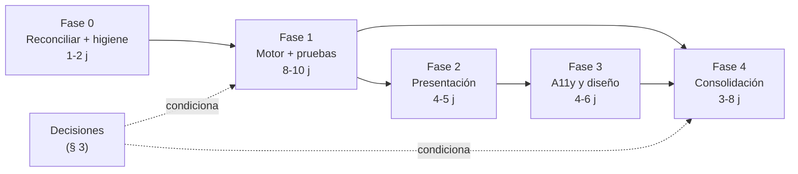

# Deuda técnica y plan de remediación

Este documento traduce los 130 hallazgos confirmados de la auditoría en un plan de trabajo ordenado: qué hacer, en qué orden, con qué criterio de finalización y qué decisiones hay que tomar antes de escribir código.

> **Estado:** vigente · **Última revisión:** 1 de agosto de 2026 · **Versión auditada:** v3.1, árbol local `main @ 264c1db` · **Versión publicada:** v4.0, `origin/main @ d0afa49` — **no auditada**

> ### ⚠️ Antes de ejecutar este plan: reproyectarlo sobre la v4.0
>
> Este plan se construyó íntegramente sobre el **árbol de trabajo local**, `main @ 264c1db` (v3.1). Ese no es el estado publicado del proyecto. Tras `git fetch`, `git status -sb` informa de que el local está **tres commits por detrás** de `origin/main`, que apunta a `d0afa49` (v4.0). Los tres commits que faltan son `a701308` (*Upgrade TransformLab v3.1 → v4.0: multi-screen platform with real data*), `72e8e13` (*fix: router timing, milestone normalization, SVG gradient IDs*) y el merge `d0afa49` (*Merge pull request #1 from dacarpena/claude/silly-yonath*).
>
> Consecuencias operativas:
>
> 1. **La primera tarea del proyecto ya no es una decisión de producto, sino una reconciliación de repositorio** (Fase 0, § 2.1). Nada de lo que sigue debe ejecutarse sobre `264c1db`.
> 2. **Los 130 hallazgos describen la v3.1.** No se han reejecutado contra la v4.0, salvo los dos que se citan abajo. Antes de abrir una tarea hay que comprobar si su hallazgo sigue vivo en el árbol actualizado.
> 3. **Los dos defectos que sí se han comprobado en v4.0 siguen ahí**, verificados ejecutando `git show origin/main:js/calculations.js` en Node: el clamp `Math.max(2, Math.min(10, calculatedOtherLean))` persiste (allí en la línea 387) y la prueba de identidad devuelve resultados idénticos a los de la v3.1 (§ 1.2); `case 'recomp'` sigue siendo rama muerta. **La prioridad número uno del plan no cambia.**
> 4. `js/calculations.js` cambió +282/−51 líneas entre v3.1 y v4.0, y `js/dynamic-data-generator.js` +108/−54. El resto de hallazgos del motor y del generador **no** puede darse por vigente en v4.0 sin releer el fichero.
>
> Ninguna afirmación sobre la v4.0 que no aparezca explícitamente en este documento debe darse por buena: verificarla con `git show origin/main:<fichero>` antes de escribirla.

Documentos relacionados: [README](../README.md) · [Arquitectura](ARQUITECTURA.md) · [Modelo de datos](MODELO-DE-DATOS.md) · [Metodología científica](METODOLOGIA-CIENTIFICA.md) · [Auditoría](AUDITORIA.md) · [Catálogo de hallazgos](CATALOGO-DE-HALLAZGOS.md) · [Guía de desarrollo](GUIA-DE-DESARROLLO.md)

Los identificadores `H-001` … `H-130` son **locales a este plan**: numeración correlativa sobre la lista confirmada, ordenada por severidad descendente. El [catálogo de hallazgos](CATALOGO-DE-HALLAZGOS.md) usa identificadores estables por área (`MOT-`, `GEN-`, `EST-`, `REN-`, `HIT-`, `FRO-`, `ING-`). La columna **Ficha** de la tabla de trazabilidad (§ 6) da la correspondencia completa entre ambos: es la tabla que hay que consultar para localizar la ficha de cualquier `H-nnn` citado en la columna «Cierra» de las tareas.

---

## 1. Cómo leer este plan

### 1.1 El criterio de priorización

El orden no es por severidad nominal ni por facilidad. Es por **daño al usuario**, en cuatro escalones:

1. **Lo que hace que la aplicación mienta.** Un número equivocado que se presenta con autoridad —peso objetivo, calorías, fecha de llegada— es peor que un fallo visible. Un `TypeError` en consola avisa de que algo va mal; un peso objetivo de 50,9 kg para un hombre de 80 kg no avisa de nada: se muestra centrado, con tipografía cuidada, y el usuario lo cree.
2. **Lo que la rompe.** Excepciones, estados congelados, botones que no hacen lo que dicen. Molesta, pero el usuario detecta el fallo y no toma decisiones sobre datos falsos.
3. **Lo que impide trabajar sobre ella con seguridad.** Ausencia de red de pruebas, de `.gitignore`, de versión fijada en la dependencia externa, código muerto que confunde a quien depura. No daña al usuario hoy; multiplica el coste de todo lo demás.
4. **Lo que la mejora.** Accesibilidad, responsive, consistencia visual, arquitectura. Importa, y no es urgente.

Ese orden se rompe una sola vez, y a propósito: la **Fase 0** (reconciliación e higiene del repositorio) va antes que todo, porque cuesta una o dos jornadas, elimina el riesgo de perder trabajo y porque hay un hecho que la hace obligatoria: el árbol local está tres commits por detrás del publicado, de modo que cualquier trabajo hecho aquí sin reconciliar antes es trabajo que habrá que rehacer o fusionar a mano (§ 2.1).

### 1.2 Por qué el modelo de composición corporal va primero

El defecto crítico no es un error de fórmula. Las fórmulas de libro están bien: `calculateBMR(80, 180, 30, 'male')` devuelve exactamente 1780 kcal, que es Mifflin-St Jeor correcta; los multiplicadores de actividad y las tasas de pérdida de grasa son los publicados. El defecto está un nivel por debajo: **el motor y el onboarding no están de acuerdo en qué significa la palabra "músculo"**.

`js/calculations.js:191` clampa el tejido magro no muscular al rango [2, 10] kg, un rango que sólo tiene sentido si `muscleKg` es músculo esquelético medido por bioimpedancia. Pero el onboarding autorrellena `muscleKg` con `estimateMuscleFromComposition()`, que devuelve el 48 % de la masa magra (`js/onboarding.js:521`, `js/onboarding.js:681`, `js/onboarding.js:790`). Con esa definición el resto magro real vale 22-35 kg y el clamp lo aplasta a 10.

La prueba de identidad —pedir como objetivo la composición **actual** debe devolver el peso **actual**— falla en todos los casos comprobados ejecutando el código en Node:

| Perfil | Peso real | Devuelto | Desvío | IMC resultante |
|---|---|---|---|---|
| Hombre 80 kg / 20 % grasa | 80,0 kg | 50,9 kg | −29,1 kg | 15,7 |
| Mujer 60 kg / 28 % grasa | 60,0 kg | 42,6 kg | −17,4 kg | — |
| Hombre 95 kg / 30 % grasa | 95,0 kg | 59,9 kg | −35,1 kg | — |
| Hombre 70 kg / 12 % grasa | 70,0 kg | 45,0 kg | −25,0 kg | — |

Es la ruta **por defecto**: le ocurre a todo usuario que no tenga báscula de bioimpedancia. Y contamina aguas abajo: `js/dynamic-data-generator.js:24` replica el mismo clamp y lo guarda en `this._otherLeanTissue`, con lo que la serie diaria completa se genera contra un objetivo irreal; `js/calculations.js:297` dimensiona las fases contra ese peso; `js/calculations.js:496` emite un error bloqueante que impide terminar el asistente.

Por eso va primero. **Cualquier trabajo de presentación construido sobre esta capa presenta datos falsos con más pulcritud.** No tiene sentido corregir el formato de un delta que muestra `↓ kg` (H-009) mientras la cifra que debería aparecer ahí es errónea de todos modos.

**El defecto sobrevive intacto en la v4.0.** Reejecutando la misma prueba de identidad sobre `git show origin/main:js/calculations.js` en Node, los cuatro perfiles devuelven exactamente los mismos valores de la tabla: 50,9 / 42,6 / 59,9 / 45,0 kg. El clamp sigue en `js/calculations.js:387` de `origin/main`. Que el fichero haya recibido +282/−51 líneas entre las dos versiones no ha tocado esta línea.

Conviene saber de dónde viene, porque explica por qué nadie lo ha revertido. El commit inicial `d424451` se titula *"TransformLab v3.1 — Fixed target calculations"*, y el clamp ya está en él: **el defecto crítico se introdujo al corregir otro defecto**. Los comentarios lo dicen sin ambigüedad — `js/calculations.js:166` («*FIXED: Now correctly handles measured muscle mass by preserving other lean tissue*») y `js/dynamic-data-generator.js:89`, `:123`, `:138` («*FIXED: Uses otherLeanTissue instead of incorrect 0.48 ratio*»). Se sustituyó el ratio 0,48 por `otherLeanTissue` con un clamp, sin advertir que el onboarding sigue alimentando `muscleKg` con ese mismo ratio 0,48 (`js/onboarding.js:521`, `:681`, `:790`). El arreglo y el punto que lo invalida conviven en el mismo commit. Cualquier corrección que toque sólo uno de los dos lados reproducirá el mismo error con distinto signo: por eso F1-2 y F1-3 son inseparables.

### 1.3 Por qué las pruebas van inmediatamente después

Porque no se puede arreglar aritmética sin poder comprobar que se arregló.

El único fichero que hoy se llama "test" —`test-calculation.js`— **no ejecuta `js/calculations.js`**: reimplementa las fórmulas en su propio cuerpo (H-072, H-082). Verifica su copia, no el código de producción. No tiene asserts. No puede detectar ninguna regresión. En la práctica, hoy el proyecto no tiene red de seguridad de ningún tipo.

El arreglo del modelo de composición no es un cambio de una línea: toca el estimador, el clamp, la validación, el generador y el onboarding a la vez, y cada uno de esos puntos alimenta a los demás. Sin una prueba de identidad ejecutable, la única forma de saber si un cambio mejoró o empeoró el resultado es abrir el navegador, rellenar el asistente y mirar un número. Eso no escala más allá de dos iteraciones.

La primera tarea de la Fase 1 es, por tanto, montar el ejecutor de pruebas. No hace falta ningún framework: `node:test` viene en la biblioteca estándar y `js/calculations.js` ya se exporta condicionalmente (`js/calculations.js:657-659` sólo asigna a `window` si `window` existe), de modo que basta añadir una exportación equivalente para Node.

### 1.4 Escala del trabajo

El plan está dimensionado para **una persona trabajando sola sobre un proyecto personal**, no para un equipo. Las estimaciones son jornadas de trabajo efectivo, no de calendario.

| Fase | Objetivo | Hallazgos | Jornadas |
|---|---|---|---|
| Fase 0 | Reconciliación e higiene del repositorio | 8 | 1 – 2 |
| Fase 1 | Modelo de composición y motor de cálculo | 40 | 8 – 10 |
| Fase 2 | Presentación y navegación | 28 | 4 – 5 |
| Fase 3 | Accesibilidad, responsive y sistema de diseño | 25 | 4 – 6 |
| Fase 4 | Consolidación y decisiones de producto | 25 | 3 – 8 (según decisiones) |
| Aceptado | No se corrige, con razón documentada | 4 | 0 |

Las cifras de la columna «Hallazgos» son las de la v3.1. La Fase 0 es la única que se puede planificar con certeza hoy; el reparto de las Fases 1 a 4 hay que revisarlo tras la reconciliación con `origin/main`, porque parte de los hallazgos puede haber cambiado de ubicación, de forma o de existencia en la v4.0.

---

## 2. El plan

### Fase 0 — Reconciliación e higiene del repositorio

**Objetivo:** trabajar sobre el código publicado, no sobre un snapshot atrasado, y dejar el repositorio en un estado desde el que no se pueda perder ni corromper trabajo.

**Criterio de finalización comprobable:**
- `git status -sb` no dice `behind` ni `ahead`: el árbol local y `origin/main` apuntan al mismo commit.
- La aplicación arranca desde el árbol reconciliado y las seis vistas que declara `js/router.js:9-16` de `origin/main` —`dashboard`, `checkin`, `nutrition`, `training`, `milestones`, `body`— se abren sin excepciones en consola.
- Existe una nota escrita —en este documento o en el registro de decisiones— que dice cuáles de los 130 hallazgos se han vuelto a comprobar sobre la v4.0 y cuáles no.
- `git status` en limpio: sin ficheros modificados sin decidir.
- `git check-ignore -v .DS_Store` y `git check-ignore -v .claude` devuelven ambos código 0.
- `git ls-files | grep -c DS_Store` devuelve `0`.
- `index.html` carga Chart.js con versión explícita y atributo `integrity`, una sola vez.
- Existe `LICENSE` en la raíz.

**Esfuerzo estimado:** 1 – 2 jornadas. La reconciliación en sí cuesta minutos; lo que cuesta es reproyectar el plan sobre el árbol resultante.

#### 2.1 Lo primero de todo: reconciliar el árbol local con el publicado

Hay un hecho que condiciona todo lo demás y que debe resolverse antes de tocar una sola línea. **El árbol de trabajo auditado no es el estado publicado del proyecto: va por detrás.**

- `git rev-parse HEAD` devuelve `264c1db`; `git rev-parse origin/main` devuelve `d0afa49`.
- `git status -sb` dice `## main...origin/main [behind 3]`.
- Los tres commits que faltan son `a701308` (*Upgrade TransformLab v3.1 → v4.0: multi-screen platform with real data*), `72e8e13` (*fix: router timing, milestone normalization, SVG gradient IDs*) y `d0afa49` (*Merge pull request #1 from dacarpena/claude/silly-yonath*).
- La diferencia completa entre ambos árboles es de 14 ficheros, 3.125 líneas añadidas y 282 eliminadas. Cinco módulos existen sólo aguas arriba: `js/router.js`, `js/checkin.js`, `js/nutrition.js`, `js/training.js`, `js/body-visualizer.js`.

La causa de que esto pasara inadvertido durante la auditoría es que `git status` decía "up to date with 'origin/main'", y era literalmente cierto: compara `HEAD` contra la caché local de la referencia remota, que sólo se refresca al hacer `fetch`. No es un fallo de git; es un fallo de flujo de trabajo. Un `git fetch` lo revela en un segundo.

Lo que esto cambia, en concreto:

- **La rama `claude/silly-yonath` no está huérfana ni en riesgo de perderse.** Se fusionó mediante el PR #1 y **es** el `main` publicado. Toda lectura de este plan que la trate como trabajo pendiente de destino es incorrecta; ver la decisión (c) de § 3, reformulada.
- **El subsistema de hitos no es código muerto en el producto publicado.** En `origin/main`, `index.html` carga trece scripts —`calculations.js`, `dynamic-data-generator.js`, `router.js`, `onboarding.js`, `app.js`, `dashboard.js`, `charts.js`, `insights.js`, `milestones.js`, `checkin.js`, `nutrition.js`, `training.js`, `body-visualizer.js`— y `js/milestones.js` es uno de ellos. El fichero recibió allí +102/−2 líneas. La recomendación ya no es «eliminar o reintegrar», sino **actualizarse: el trabajo de reintegración ya está hecho y publicado**. Ver Fase 4 y decisión (b).
- **Parte de los hallazgos de esta auditoría puede estar ya resuelta aguas arriba**, y otra parte puede haberse desplazado de línea. Ninguno se ha reejecutado contra la v4.0 salvo los dos citados en el aviso de cabecera, que **siguen vivos**.

El procedimiento es el ordinario y no tiene misterio: `git fetch --all --prune`, revisar `git log --oneline main..origin/main` y `git diff --stat main origin/main`, y después `git pull --ff-only` (que aquí basta, porque el local no tiene commits propios que rebasar). Nunca `--force` sobre `main`; si alguna vez hiciera falta sobrescribir, `--force-with-lease`.

Queda un detalle que hay que decidir antes del `pull`: **`.DS_Store` figura como modificado en el árbol local** (`git status --porcelain .DS_Store` devuelve ` M .DS_Store`). Es un fichero de metadatos de Finder, versionado por error en el commit inicial y todavía versionado en `origin/main`. No hay nada que conservar en él: `git checkout -- .DS_Store` antes del `pull`, y a continuación F0-2 y F0-3 lo sacan del control de versiones para siempre. Los directorios `.claude/`, `README.md` y `docs/` aparecen como no rastreados y no estorban al `pull`, pero conviene cerrarlos con F0-2 en el mismo paso.

Y una decisión de alcance, que es la salida de esta fase: **¿la remediación se aplica sobre la v4.0?** La respuesta razonable es sí —es lo que ven los usuarios—, y entonces hay que reproyectar el plan: releer los hallazgos del motor y del generador sobre los ficheros actualizados, y auditar de cero los cinco módulos nuevos, que no han sido examinados. La alternativa —seguir arreglando la v3.1— sólo tiene sentido si se va a descartar la v4.0, y nada indica que se quiera.

#### 2.2 Tareas

| ID | Descripción | Ficheros | Cierra | Esfuerzo |
|---|---|---|---|---|
| **F0-1** | **Reconciliar con `origin/main`.** `git checkout -- .DS_Store`; `git fetch --all --prune`; revisar `git log --oneline main..origin/main` y `git diff --stat main origin/main`; `git pull --ff-only` (el local no tiene commits propios). Configurar `git config fetch.prune true`. **Va antes que cualquier otra tarea de este documento, incluidas las de esta misma fase.** | — | H-020 | S |
| **F0-1b** | **Reproyectar el plan sobre la v4.0.** Con el árbol actualizado, recorrer los 130 hallazgos y marcar cuáles siguen vivos, cuáles se han desplazado de línea y cuáles han desaparecido. Anotar el resultado. Prioridad a los ficheros con más cambio: `js/calculations.js` (+282/−51) y `js/dynamic-data-generator.js` (+108/−54). Los cinco módulos nuevos (`js/router.js`, `js/checkin.js`, `js/nutrition.js`, `js/training.js`, `js/body-visualizer.js`) **no están auditados**: decidir si entran en el alcance ahora o en una segunda pasada. | — | — | M |
| F0-2 | Crear `.gitignore` en la raíz con, como mínimo: `.DS_Store`, `.claude/`, `node_modules/`, `*.log`. Comprometerlo antes que cualquier otro cambio. | `.gitignore` | H-068 | S |
| F0-3 | Dejar de versionar `.DS_Store`: `git rm --cached .DS_Store`. Es uno de los 15 ficheros versionados del repositorio. | `.DS_Store` | H-069 | S |
| F0-4 | Fijar Chart.js a una versión concreta y añadir `integrity` + `crossorigin="anonymous"`. Hoy `index.html:26` carga `https://cdn.jsdelivr.net/npm/chart.js` sin versión y en modo render-blocking: cualquier cambio mayor aguas arriba rompe la aplicación sin aviso. Considerar además `defer`. **Tras F0-1:** en `origin/main` la misma etiqueta aparece **dos veces**, en las líneas 26 y 238 de `index.html`; hay que dejar una sola. | `index.html` | H-015, H-021 | S |
| F0-5 | Añadir `README.md` (qué es, cómo se ejecuta, qué no hace) y `LICENSE`. Sin licencia, el repositorio público es "todos los derechos reservados" por defecto. **Parcialmente cerrado:** `README.md` y `docs/` se añadieron junto con esta documentación; queda pendiente únicamente `LICENSE`. | `README.md`, `LICENSE` | H-074 | S |
| F0-6 | Sustituir el dominio de ejemplo de `robots.txt:5` (`https://tudominio.com/sitemap.xml`) por el real, o eliminar la línea. Alinearlo con la decisión (e) de § 3. | `robots.txt` | H-114 | S |
| F0-7 | Añadir `.editorconfig`. **No** añadir linter ni CI en esta fase (ver § 5). El `package.json` sólo si la Fase 1 lo necesita para el ejecutor de pruebas. | `.editorconfig` | H-112 (parcial) | S |

> **Nota sobre F0-2.** El directorio `.claude/` contiene hoy un worktree registrado de la rama `claude/silly-yonath` en `.claude/worktrees/silly-yonath` (`72e8e13`), con su propio fichero `.git`. Sin `.gitignore`, un `git add -A` lo captura como repositorio embebido. Es ruidoso y reversible con `git rm --cached`, pero se evita en treinta segundos. Y una vez hecho F0-1 el worktree ya no aporta nada: ese commit está contenido en `origin/main` a través del merge `d0afa49`, así que se puede retirar sin perder trabajo con `git worktree remove .claude/worktrees/silly-yonath`.

---

### Fase 1 — Modelo de composición y motor de cálculo

**Objetivo:** que los números que la aplicación muestra sean los que dice ser, y que exista una forma automatizada de comprobarlo.

**Criterio de finalización comprobable:**
- `node --test` pasa en verde y cubre, como mínimo: identidad, conservación de masa, límites y determinismo.
- **Identidad:** para los cuatro perfiles de la tabla de § 1.2, `calculateTargetWeight(muscleActual, fatPctActual, composicionActual)` devuelve el peso actual con un margen de ±1 kg.
- **Conservación:** para cualquier día de la serie generada, `weight ≈ fatKg + muscleKg + otherLeanTissue` dentro de la tolerancia de la fluctuación diaria.
- **Límites:** ningún día de ninguna serie sale de rango — grasa dentro de `MIN_SAFE_FAT`/`MAX_FAT`, bienestar y rendimiento dentro de 0-10, calorías nunca por debajo del BMR.
- **Determinismo:** dos generaciones con el mismo perfil y la misma fecha producen series idénticas.
- El último día de la serie aterriza en la composición objetivo.

**Esfuerzo estimado:** 8 – 10 jornadas. Es la fase larga y no admite atajos.

#### 2.3 Tareas

| ID | Descripción | Ficheros | Cierra | Esfuerzo |
|---|---|---|---|---|
| **F1-1** | **Red de pruebas.** Ejecutor `node:test` sin dependencias externas. Exportar `Calculations` y `DynamicDataGenerator` también para Node (hoy `js/calculations.js:657` sólo exporta si existe `window`). Casos: identidad, conservación de masa, límites, determinismo. Retirar `test-calculation.js`, que reimplementa las fórmulas y no verifica el código de producción. | `test/*.test.js`, `js/calculations.js`, `js/dynamic-data-generator.js`, `test-calculation.js` | H-072, H-082 | L |
| F1-2 | **Unificar la definición de "músculo".** Marcar el origen del dato (`initial.muscleSource = 'measured' \| 'estimated'`) y, cuando sea estimado, usar la rama proporcional `targetMuscleKg / 0.48` sin clamp. Alternativa de fondo: que `estimateMuscleFromComposition` devuelva tejido magro blando (≈ masa magra − 3,5 kg) para que ambas rutas hablen del mismo tejido. Requiere la decisión (a) de § 3. | `js/calculations.js`, `js/onboarding.js` | H-001, H-003 | L |
| F1-3 | Sustituir el clamp absoluto `Math.max(2, Math.min(10, …))` por una comprobación **relativa** a la masa magra (p. ej. 35-65 %), y **avisar** al usuario en vez de corregir el dato en silencio. Aplicar el mismo cambio en los dos puntos que replican la lógica: `js/calculations.js:191` y `js/dynamic-data-generator.js:24`. | `js/calculations.js`, `js/dynamic-data-generator.js` | H-002 | M |
| F1-4 | Alinear la validación con el modelo corregido: comparar el músculo objetivo contra la **masa magra objetivo** en lugar de contra un 55 % fijo del peso (`js/calculations.js:493`), y sustituir el mínimo constante de 30 kg de `js/onboarding.js:802` por un mínimo relativo al usuario (p. ej. 0,7 × músculo actual). | `js/calculations.js`, `js/onboarding.js` | H-004, H-014, H-081 | M |
| F1-5 | Guarda de entrada en `calculatePhaseDurations`: si `!Number.isFinite(target.weight)` o `!Number.isFinite(initial.weight)`, devolver plan vacío con error explícito. Hoy `null * 15 / 100` evalúa a `0` y el motor concluye en silencio que hay que llegar al 0 % de grasa. En `validateInputs`, si el peso objetivo es `null`, empujar **error bloqueante**, no aviso, y no invocar el plan de fases. | `js/calculations.js` | H-005, H-080 | M |
| F1-6 | Corregir `case 'recomp'` de `calculateCaloricTarget` (`js/calculations.js:117`): es rama muerta. `js/dynamic-data-generator.js:181` invoca la función con `phase.type`, que vale `'recomposition'`. Comprobado: `calculateCaloricTarget(2759, 'recomp')` → déficit 138; `calculateCaloricTarget(2759, 'recomposition')` → déficit 0. La recomposición recibe hoy calorías de mantenimiento. | `js/calculations.js` | H-023 | S |
| F1-7 | Suelo de seguridad calórico: el objetivo no puede quedar por debajo del BMR (`js/calculations.js:104`). Añadir el suelo y una advertencia visible cuando se alcance. | `js/calculations.js` | H-024 | S |
| F1-8 | Corregir el sexo no reconocido: hoy `js/calculations.js:454` lee `this.MIN_SAFE_FAT[sex]` y, si es `undefined`, **toda** la validación de porcentaje de grasa se desactiva. Comprobado: un objetivo del 2 % pasa con `isValid: true` y cero errores. Normalizar el valor o rechazarlo. | `js/calculations.js` | H-075 | S |
| F1-9 | Eliminar la doble contabilidad de grasa entre recomposición y definición (`js/calculations.js:334`, `remainingFatToLose = fatToLose - 2`) y las restas mágicas de 2 kg de grasa / 0,5 kg de músculo. Las expectativas por fase deben sumar exactamente el objetivo. | `js/calculations.js` | H-019, H-077 | M |
| F1-10 | Determinismo: sustituir `Math.random()` de `addDailyFluctuation` (`js/calculations.js:651`) por ruido derivado del día (o una semilla guardada en el perfil), y garantizar que el último día aterriza en el objetivo. Sin esto, la prueba de conservación es inestable. | `js/calculations.js` | H-063, H-078 | M |
| F1-11 | Aritmética de fechas: unificar UTC / hora local. El cambio a horario de verano duplica un día y desplaza todas las fechas posteriores (`js/dynamic-data-generator.js:239`); en zonas con offset UTC negativo, `dateFormatted` y `dayOfWeek` van un día por detrás de `date` (`js/dynamic-data-generator.js:291`). Corregir el off-by-one del primer día de la serie. | `js/dynamic-data-generator.js` | H-016, H-064, H-105 | M |
| F1-12 | Hitos estéticos: `estimatedDay` sale `NaN` y, cuando no, se calcula por progresión lineal contradiciendo el día en que la serie cruza realmente el umbral. Derivar el día del cruce real sobre la serie generada. | `js/dynamic-data-generator.js` | H-017, H-018 | M |
| F1-13 | El generador sobrescribe el peso objetivo del usuario y **muta el perfil ya guardado** (`js/dynamic-data-generator.js:51`). Trabajar sobre una copia y, si hay corrección, informarla en la interfaz en vez de aplicarla en silencio. | `js/dynamic-data-generator.js` | H-060 | S |
| F1-14 | Coherencia de agregados: `phase` y `phaseType` pueden referirse a fases distintas en los datos mensuales; los meses son de calendario pero la navegación los indexa como bloques de 30 días; la última semana parcial se presenta como completa; las semanas que cruzan frontera de fase se etiquetan mal. | `js/dynamic-data-generator.js` | H-061, H-065, H-066, H-106 | M |
| F1-15 | Eliminar los valores hardcodeados de `strength` y `aesthetics` en `metadata.initialComposition` / `targetComposition` (`js/dynamic-data-generator.js:532`), que contradicen las series generadas. | `js/dynamic-data-generator.js` | H-062 | S |
| F1-16 | Guardarraíles de fase: hoy capan valores imposibles en silencio (`js/dynamic-data-generator.js:168`) y la fase de mantenimiento fuerza el objetivo de golpe. Convertir el capado silencioso en señal explícita. Corregir también que la fase de definición ignore `expectedMuscleGain` y aplique una pérdida fija del 2 %. | `js/dynamic-data-generator.js` | H-067, H-107 | M |
| F1-17 | Rangos de las métricas derivadas: rendimiento puede salir negativo (agilidad −8 sobre escala 0-10, `js/calculations.js:565`); bienestar puede superar el máximo (10,3 sobre 10, `js/calculations.js:628`). Clampar en el punto de cálculo y cubrirlo con la prueba de límites. | `js/calculations.js` | H-076, H-115 | S |
| F1-18 | Casos degenerados: perder músculo o estar ya en el objetivo produce un plan vacío de 58 días (`js/calculations.js:315`); la duración de la recomposición siempre da 90 días (`js/calculations.js:321`); `calculateWeeklyFatLoss` propaga `NaN` en silencio (`js/calculations.js:253`). | `js/calculations.js` | H-079, H-119, H-116 | M |
| F1-19 | Onboarding: retroceder al paso 2 y cambiar la composición no recalcula el músculo auto-estimado ni el peso objetivo — `js/onboarding.js:809` sólo recalcula `if (!this.userData.target.weight)`. Validar además la masa muscular introducida en el paso 2: hoy admite valores superiores a la masa magra o al propio peso. | `js/onboarding.js` | H-012, H-038 | M |
| F1-20 | Limpieza del motor: retirar `calculateComposition`, `calculateWeightFromComposition` y el clamp de déficit muertos (`js/calculations.js:236`); redondear el BMR en origen (`js/calculations.js:80`); eliminar el código muerto y el trabajo duplicado del pipeline (`js/dynamic-data-generator.js:101`). | `js/calculations.js`, `js/dynamic-data-generator.js` | H-110, H-120, H-121 | S |

> **Orden dentro de la fase.** F1-1 va primero, sin excepción. Después F1-2 → F1-3 → F1-4 → F1-5 como bloque único: son el mismo defecto visto desde cinco sitios y no se pueden validar por separado. El resto admite cualquier orden.

---

### Fase 2 — Presentación y navegación

**Objetivo:** que la interfaz refleje el estado real de la aplicación y que la navegación haga lo que promete.

**Criterio de finalización comprobable (recorrido manual, sin excepciones en consola):**
- Navegar día → semana → mes → día, adelante y atrás, hasta el final del plan y de vuelta: sin `TypeError`, con el indicador de fase correcto en las tres granularidades.
- Los insights cambian al navegar y al cambiar la fecha de inicio.
- El botón "Hoy" lleva a la fecha de hoy, no al punto medio del plan.
- Todas las tarjetas de métricas muestran un número en el delta; ninguna muestra `--`, `NaN` ni `↓ kg` sin cifra.
- Editar el perfil completo y volver al panel no duplica listeners ni bucles de animación (comprobable con `getEventListeners` o contando invocaciones).

**Esfuerzo estimado:** 4 – 5 jornadas.

| ID | Descripción | Ficheros | Cierra | Esfuerzo |
|---|---|---|---|---|
| F2-1 | `renderInsights()` sólo se invoca una vez en toda la vida de la aplicación (`js/app.js:407`). Colgarlo del mismo punto de re-render que el resto del panel, e invocarlo también al guardar una nueva fecha de inicio. Corregir además que en vista mensual desaparezcan todos los insights de bienestar y progreso acumulado (`js/insights.js:118`). | `js/insights.js`, `js/app.js` | H-006, H-029, H-092 | M |
| F2-2 | Indicador de fase: usa `currentDay`, que no se actualiza en granularidad semanal ni mensual (`js/dashboard.js:516`). Derivar el día efectivo de la granularidad activa. | `js/dashboard.js` | H-007 | M |
| F2-3 | `TypeError` en `renderNavigation` al entrar en vista mensual cerca del final del plan (`js/dashboard.js:259`): `getMonthData(currentMonth)` devuelve `undefined`. Acotar el índice. | `js/dashboard.js` | H-008 | S |
| F2-4 | Deltas de las tarjetas: `% Grasa` siempre muestra `--` porque los objetos de cambio no llevan `fatPct` (`js/dashboard.js:382`); la tarjeta Físico muestra `↓ kg` sin número (`js/dashboard.js:387`); `renderGoalProgress` imprime `NaN%` y `width: NaN%` cuando inicial e objetivo coinciden (`js/dashboard.js:651`). | `js/dashboard.js` | H-009, H-010, H-027 | M |
| F2-5 | `initializeApp()` no es idempotente (`js/app.js:396`): tras "Editar perfil completo" se duplican todos los listeners y se acumula un segundo bucle de animación. Separar el arranque (una vez) del re-render (n veces). | `js/app.js` | H-011, H-097 | M |
| F2-6 | Fallo de carga de Chart.js: hoy el usuario recibe "reconfigura tu perfil" y un botón que **borra todos sus datos** (`js/app.js:140`). Distinguir "falta la librería" de "falta el perfil" y no ofrecer nunca una acción destructiva como respuesta a un fallo de red. Complementa F0-4. | `js/app.js` | H-013 | S |
| F2-7 | Botón "Hoy": `navigateToToday()` (`js/app.js:615`) navega al punto medio del plan — el comentario del código lo admite: *"Simular día actual (mitad del proceso para demo)"*. Calcular el día real desde `AppState.startDate`. | `js/app.js` | H-035 | S |
| F2-8 | Interacción con el gráfico: el clic no navega en granularidad diaria (hit-test imposible con `pointRadius: 0`, `js/charts.js:403`); `handleChartClick` deja el estado de navegación parcialmente sincronizado; los hitos de fin de fase nunca se dibujan en vista mensual; el eje `y1` sólo se declara si conviven métricas de los dos grupos pero `yAxisID` lo asigna siempre. | `js/charts.js` | H-028, H-030, H-031, H-033, H-088 | M |
| F2-9 | Modal de ajustes: abrirlo dos veces genera IDs duplicados y deja un overlay huérfano que bloquea la interfaz (`js/app.js:257`). | `js/app.js` | H-039 | S |
| F2-10 | Fechas `YYYY-MM-DD` parseadas como UTC y mostradas en local: desfase de un día (`js/app.js:233`). Mismo origen que F1-11; corregir con el mismo criterio. | `js/app.js` | H-040 | S |
| F2-11 | Categorías de hitos estéticos: las que emite el generador no existen en el mapa de colores/iconos de la gráfica, y todos se pintan en gris con un punto genérico. | `js/charts.js`, `js/dynamic-data-generator.js` | H-086, H-108 | S |
| F2-12 | Exportación: `exportProjectData` informa `'Femenino'` por defecto y vuelca claves internas sin traducir (`js/dashboard.js:104`). | `js/dashboard.js` | H-089 | S |
| F2-13 | Onboarding, detalles de presentación: BMR sin redondear y barras sin limitar en la previsualización (`js/onboarding.js:655`); el botón "Comenzar" del paso 4 no hace nada ni informa cuando hay errores de validación; la fecha de inicio no se valida en ningún paso. | `js/onboarding.js` | H-093, H-094, H-099 | M |
| F2-14 | Helpers de formato: no cubren `NaN` ni cadenas y `formatChange` produce `'-0.00'` (`js/app.js:529`). Es el sustrato de F2-4: conviene hacerlo antes. | `js/app.js` | H-096 | S |
| F2-15 | Limpieza de `AppState`: campos que nadie escribe ni lee, y funciones de previsualización que mutan el estado (`js/app.js:26`). Retirar también el volcado del perfil del usuario a la consola con peso y objetivo (`js/app.js:132`). | `js/app.js` | H-098, H-113 | S |

---

### Fase 3 — Accesibilidad, responsive y sistema de diseño

**Objetivo:** que la aplicación se pueda usar sin ratón, sin visión y en una pantalla pequeña, y que su CSS tenga una sola fuente de verdad.

**Criterio de finalización comprobable:**
- Recorrido completo con teclado: todos los controles alcanzables con `Tab`, foco siempre visible, `Escape` cierra cualquier modal y devuelve el foco al disparador.
- Contraste: ningún texto por debajo de 4,5:1 (AA) sobre su fondo real, verificado con una herramienta de contraste.
- El `<canvas>` del gráfico tiene alternativa textual con los datos del punto seleccionado.
- Con `prefers-reduced-motion: reduce` activo, ninguna animación infinita ni efecto de seguimiento de cursor.
- A 320 px de ancho no hay desbordamiento horizontal **sin** recurrir a `overflow-x: hidden`.
- Cero colores hex fuera de `:root` en CSS, HTML y JS.

**Esfuerzo estimado:** 4 – 6 jornadas.

| ID | Descripción | Ficheros | Cierra | Esfuerzo |
|---|---|---|---|---|
| F3-1 | Foco de teclado: no existe ningún estilo de foco y se anula el `outline` nativo en cuatro puntos (`styles_new.css:106`). Definir un `:focus-visible` global antes de nada: sin él, el resto del trabajo de teclado no es verificable. | `styles_new.css` | H-058 | S |
| F3-2 | Modales: los cuatro overlays no capturan el foco, no se cierran con `Escape` y no lo devuelven al cerrarse (`styles_new.css:1525` y los disparadores en `js/app.js`). | `js/app.js`, `styles_new.css`, `index.html` | H-045 | M |
| F3-3 | Atajos de teclado: siguen activos con un modal abierto, se disparan al escribir en un `<select>` y sólo se desactivan sobre `INPUT` (`js/app.js:651`). Desactivarlos con el asistente o cualquier modal abierto. | `js/app.js` | H-046, H-095 | S |
| F3-4 | Barra de línea de tiempo: `div` clicable sin rol, sin `tabindex` y sin manejador de teclado (`index.html:64`). Convertirlo en control real (`role="slider"` o `<input type="range">`). | `index.html`, `js/app.js` | H-044 | M |
| F3-5 | Nombres accesibles: botones sin nombre y toggles sin `aria-pressed` / `aria-expanded` en la barra de navegación (`index.html:73`). | `index.html` | H-057 | S |
| F3-6 | Alternativa textual del gráfico: el `<canvas>` (`index.html:134`) no expone ningún dato. Añadir tabla oculta o región `aria-live` con los valores del punto activo. | `index.html`, `js/charts.js` | H-056 | M |
| F3-7 | Contraste: `--text-muted` está en 3,67:1 y es el color de casi todas las etiquetas (`styles_new.css:375`); las insignias de fase usan texto blanco sobre colores que bajan a 2,56:1 (`styles_new.css:540`). | `styles_new.css` | H-047, H-048 | M |
| F3-8 | `prefers-reduced-motion`: no existe ninguna media query pese a haber animaciones infinitas, transiciones globales y un efecto que sigue al cursor (`styles_new.css:53`). Añadirla y, dentro de ella, detener el bucle `requestAnimationFrame` perpetuo del cursor-glow, que anima `left`/`top` y fuerza layout en cada frame (`js/app.js:725`). | `styles_new.css`, `js/app.js` | H-051, H-100 | M |
| F3-9 | `color-scheme: dark` ausente (`styles_new.css:418`): los controles nativos (`select`, `date`) se pintan en modo claro sobre fondo oscuro. | `styles_new.css` | H-053 | S |
| F3-10 | Rejillas rotas: el panel declara 3 columnas y el HTML pinta 4 tarjetas, dejando la metabólica huérfana (`styles_new.css:725`); la fila de insights declara `2fr 1fr` con un solo hijo y deja un tercio vacío (`styles_new.css:1281`). | `styles_new.css`, `index.html` | H-041, H-052 | S |
| F3-11 | Media queries anuladas y sin efecto: el bloque de 480 px de `styles_new.css:1499-1520` lo pisa entero un segundo bloque de 480 px; el bloque de 900 px intenta apilar con `flex-direction` dos contenedores que son `grid` (`styles_new.css:2322`). | `styles_new.css` | H-049, H-050 | S |
| F3-12 | Móvil pequeño: el overlay del onboarding conserva 2 rem de padding a 320 px (`styles_new.css:1537`); `body { overflow-x: hidden }` (`styles_new.css:429`) enmascara desbordes en lugar de corregirlos — quitarlo y arreglar el desborde real. | `styles_new.css` | H-102, H-103 | M |
| F3-13 | Selectores que no casan con el marcado: el CSS espera `.quick-date-btn` y el JS genera `.quick-date` (`styles_new.css:143`); `.phase-name` está duplicado y la segunda definición degrada el título del indicador de fase (`styles_new.css:1972`); el panel de hover del gráfico emite marcado que la hoja no contempla (`js/charts.js:367`). | `styles_new.css`, `js/charts.js`, `js/onboarding.js` | H-042, H-043, H-090 | M |
| F3-14 | Unificar la paleta: hoy está triplicada — 33 hex fuera de `:root` en el CSS, 7 en atributos `style` del HTML y unos 25 más en el JS. Una única fuente en `:root`, consumida por variable desde los tres sitios. | `styles_new.css`, `index.html`, `js/*.js` | H-059 | M |
| F3-15 | Retirar las ~265 líneas de `styles_new.css` (≈10 %) que estilan clases que ningún fichero HTML o JS genera (`styles_new.css:294` y siguientes). Hacerlo **después** de F3-13, para no borrar reglas que en realidad sólo tenían el nombre mal. | `styles_new.css` | H-055 | M |
| F3-16 | Overlay de carga: se oculta con `display` en línea y sin semántica de estado ocupado (`index.html:34`). | `index.html`, `js/app.js` | H-104 | S |
| F3-17 | Rendimiento del gráfico: `calculateMilestonePositions` se recalcula por completo en cada frame de dibujo y en cada movimiento del tooltip (`js/charts.js:542`). Memoizar por serie. | `js/charts.js` | H-087 | S |

---

### Fase 4 — Consolidación y decisiones de producto

**Objetivo:** cerrar las decisiones pendientes de § 3 y hacer que el estado persistido sobreviva a un fallo, a un cambio de esquema y a un dato hostil.

**Criterio de finalización comprobable:**
- Ninguna clave de `localStorage` se lee o escribe fuera de un envoltorio con `try/catch`; en modo incógnito o con la cuota llena la aplicación degrada con mensaje, no se bloquea.
- Todo objeto persistido lleva `schemaVersion`; un perfil de versión anterior o corrupto se detecta y se ofrece migración o reinicio, sin `TypeError`.
- Un perfil con `` en cualquier campo de texto se muestra como texto literal en todas las vistas.
- La ruta de hitos de la v4.0 se abre, renderiza y navega sin excepciones en consola, con los hitos que genera realmente la aplicación.
- Si se decide activar CSP: `grep -rn "onclick=" js/*.js` devuelve 0; `index.html` declara la meta CSP con `script-src 'self' https://cdn.jsdelivr.net`; y los botones de exportar, ajustes, editar perfil y reiniciar siguen funcionando.

**Esfuerzo estimado:** 3 – 8 jornadas, según lo que se decida en § 3. El extremo alto es auditar y sanear por completo el subsistema de hitos ya integrado en la v4.0; el bajo, limitarse a los defectos que se reproduzcan allí.

| ID | Descripción | Ficheros | Cierra | Esfuerzo |
|---|---|---|---|---|
| **F4-1** | **Auditar la integración de hitos ya publicada.** La decisión «reintegrar o eliminar» ya está tomada aguas arriba: en `origin/main`, `index.html` carga `js/milestones.js`, `js/router.js:14` declara la ruta `milestones` y `js/app.js:434-435` invoca `MilestonesModule.render()` al entrar en ella (`MilestonesModule` se define en `js/milestones.js:916` y se exporta en `:994`). Lo que queda es **verificar esa integración**, no decidirla: recorrer la ruta con datos reales y comprobar cuáles de los defectos internos catalogados se reproducen (F4-2). **Requiere F0-1.** | `index.html`, `js/milestones.js`, `js/router.js`, `js/app.js` | H-022, H-025 | M |
| F4-1b | Los otros dos ficheros del subsistema **siguen huérfanos también en la v4.0**, comprobado sobre `origin/main`: `css/milestones.css` no está enlazado desde `index.html` —que sólo carga `styles_new.css`— y `aesthetic_milestones_complete.json` no lo referencia ningún `.js` ni `.html`. Decidir su destino con el mismo criterio de antes: enlazar la hoja si la ruta de hitos la necesita, o borrar ambos; y limpiar en cualquier caso las reglas huérfanas de `styles_new.css:1272`. | `css/milestones.css`, `aesthetic_milestones_complete.json`, `styles_new.css`, `index.html` | H-054, H-109, H-127, H-128 | M |
| F4-2 | Corregir los defectos internos del módulo que sigan vivos tras F4-1 — `TypeError` con los hitos que genera realmente la app (`js/milestones.js:688`), `totalDays` que cae siempre en el 485 hardcodeado, "102 hitos" hardcodeados del plan personal, estado `current` sin marcado ni CSS, `getCurrentDay()` obsoleto en vista mensual, array de hitos asumido ordenado sin ordenar, plugin que valida el índice contra `xScale.ticks.length`, `NaN%` con colección vacía, y las dos implementaciones competidoras de marcadores en el gráfico. **Las referencias de línea son de la v3.1**: el fichero recibió +102/−2 líneas en la v4.0 y el commit `72e8e13` menciona explícitamente *milestone normalization*, de modo que algunos de estos nueve hallazgos pueden estar ya resueltos. Comprobarlos uno a uno antes de tocar nada. | `js/milestones.js`, `js/charts.js` | H-083, H-084, H-085, H-122, H-123, H-124, H-125, H-126, H-130 | M / L |
| F4-3 | `aesthetic_milestones_complete.json` es la instancia de un plan personal concreto (fechas fijas 2026-02-02 → 2027-06-01, 485 días, métricas al centésimo), no un catálogo. Si se quiere conservar su valor editorial —102 descripciones anatómicas frente a las ~15 plantillas genéricas del generador—, despersonalizarlo: dejar `{category, muscle_group, title, description, visibility, fatPct_trigger, muscle_trigger}` y sustituir `day` por progreso relativo o umbrales de composición. | `aesthetic_milestones_complete.json`, `js/dynamic-data-generator.js` | H-026 | M |
| F4-4 | **Envoltorio de `localStorage`.** Ninguna de las lecturas/escrituras actuales está protegida: modo incógnito, cuota o JSON corrupto dejan al usuario atrapado. `Onboarding.complete()` escribe sin `try/catch` (`js/onboarding.js:866`) y bloquea la aplicación si falla. Un único módulo con `get`/`set`/`remove` protegidos, usado por las cuatro claves. | `js/app.js`, `js/onboarding.js` | H-036, H-070 | M |
| F4-5 | **Versionado de esquema.** No hay `schemaVersion` ni validación de forma del perfil guardado (`js/app.js:110`): un perfil antiguo rompe el arranque con `TypeError` o `RangeError`. Añadir versión a los cuatro objetos persistidos y una función de migración/rechazo. Especialmente relevante tras la Fase 1, que cambia la semántica de `muscleKg`. | `js/app.js`, `js/onboarding.js` | H-037 | M |
| F4-6 | **Escapado de HTML.** Los datos de `localStorage` se inyectan con `innerHTML` sin escapar en toda la capa de render (`js/dashboard.js:47`, `js/app.js:268`). El vector realista no es un atacante remoto —la app no hace ninguna llamada de red— sino contenido del mismo origen o un perfil importado. Introducir un helper `escapeHtml()` y aplicarlo a todo valor de origen no controlado. | `js/dashboard.js`, `js/app.js`, `js/insights.js`, `js/onboarding.js` | H-032, H-091, H-129 | M |
| F4-7 | Aviso de datos de salud: hoy se guardan en claro, sin cifrar, sin caducidad y accesibles a cualquier contenido del mismo origen (`js/onboarding.js:57`). Decidido (e) de § 3, documentarlo en la interfaz. Depende de si la aplicación se publica o se queda en local. | `js/onboarding.js`, `index.html`, `README.md` | H-071 | S |
| F4-8 | CSP: no hay cabecera, y los 15 manejadores `onclick` que el JavaScript genera dentro de cadenas HTML impedirían activarla de forma estricta. **No están en `index.html`, que no contiene ni uno**: están en `js/app.js:302`, `:305`, `:312`, `:387`; `js/dashboard.js:61`, `:64`; `js/onboarding.js:290`, `:900`; y siete más en `js/milestones.js`. Sustituirlos por `addEventListener` y añadir la meta-CSP. Sólo tiene sentido si la aplicación se publica. | `js/app.js`, `js/dashboard.js`, `js/onboarding.js`, `js/milestones.js`, `index.html` | H-073 | M |
| F4-9 | Metadatos de compartición: Open Graph incompleto en una página que `robots.txt` declara indexable (`index.html:14`). Alinear con la decisión (e). | `index.html` | H-101 | S |

---

## 3. Decisiones que hay que tomar antes de programar

Estas cinco preguntas condicionan el alcance del plan y van dirigidas al propietario del proyecto. Tres de ellas —(a), (d) y (e)— no son técnicas y no se pueden resolver leyendo el código. Las otras dos han cambiado de naturaleza al descubrirse el estado real del repositorio: **(b) está resuelta aguas arriba** y **(c) ha dejado de ser una decisión de producto para convertirse en una operación de reconciliación**. Ambas se reformulan abajo.

### (a) ¿El músculo se mide, se estima, o el modelo soporta ambos?

Es la raíz del defecto crítico. Hoy el motor asume una cosa (`muscleKg` medido por bioimpedancia, con un resto magro de 2-10 kg) y el onboarding hace otra (`muscleKg` = 48 % de la masa magra, resto magro de 22-35 kg). Las dos definiciones son defendibles; conviven mal.

| Opción | Consecuencia |
|---|---|
| **Siempre estimado** (eliminar el campo de bioimpedancia) | El modelo queda cerrado y coherente: el peso objetivo es `músculo / 0,48 / (1 − grasa/100)`. Se pierde precisión para quien sí tiene báscula, y su medición real se ignoraría. Es el arreglo más barato: una rama de código, no dos. |
| **Siempre medido** (exigir bioimpedancia) | Modelo fisiológicamente más fino, pero excluye a la mayoría de usuarios. El onboarding se vuelve inaccesible sin hardware. |
| **Ambos, con origen marcado** (`muscleSource`) | Es lo correcto y es lo que más cuesta: dos rutas de cálculo, dos rangos de validación, dos conjuntos de pruebas, y hay que evitar que un perfil guardado con una semántica se lea con la otra (ver F4-5). |

Sin esta decisión, F1-2 no se puede empezar.

### (b) ¿El subsistema de hitos se reintegra o se elimina? — **resuelta aguas arriba**

**Ya no hay nada que decidir sobre `js/milestones.js`: está reintegrado y publicado.** En `origin/main`, `index.html` lo carga junto a los otros doce scripts, `js/router.js:14` declara la ruta `milestones` y `js/app.js:434-435` invoca `MilestonesModule.render()` al navegar a ella. El fichero recibió allí +102/−2 líneas, y el commit `72e8e13` menciona *milestone normalization*, que es exactamente la incompatibilidad de esquema que esta decisión daba por bloqueante.

Lo que la sustituye no es una pregunta de producto sino trabajo de verificación: actualizarse (F0-1) y auditar la integración (F4-1, F4-2). Ninguno de los nueve defectos internos del módulo puede darse por vivo ni por muerto sin releer el fichero actualizado.

Queda un residuo real, y es menor. Dos de los tres ficheros del subsistema **siguen huérfanos en la v4.0**, comprobado sobre `origin/main`: `css/milestones.css` (1.381 líneas) no está enlazado desde `index.html`, que sólo carga `styles_new.css`; y `aesthetic_milestones_complete.json` (76 KB) no lo referencia ningún `.js` ni `.html`. Sobre esos dos sí hay que decidir —enlazar, rescatar el contenido editorial (F4-3) o borrar—, y es la decisión barata que describe F4-1b.

### (c) ¿Cómo se reconcilia el árbol local con el publicado sin perder trabajo?

La pregunta original de este apartado era qué hacer con la rama `claude/silly-yonath`. **Ya no aplica: la rama no está huérfana. Se fusionó mediante el PR #1 y es el `main` publicado** (`d0afa49`, *Merge pull request #1 from dacarpena/claude/silly-yonath*). Sus 3.125 líneas y sus cinco módulos —`js/router.js`, `js/checkin.js`, `js/nutrition.js`, `js/training.js`, `js/body-visualizer.js`— no están en riesgo de perderse: son la v4.0.

Lo que queda es la operación inversa, y es la que hay que planificar: **poner al día el árbol local, que va tres commits por detrás.**

| Opción | Consecuencia |
|---|---|
| **`git pull --ff-only`** (recomendada) | El local no tiene ningún commit propio, así que el avance rápido es limpio y no hay nada que fusionar ni rebasar. Único requisito previo: resolver el `.DS_Store` modificado (`git checkout -- .DS_Store`). Es la opción por defecto y la que asume F0-1. |
| **Seguir sobre `264c1db`** | Sólo tiene sentido si se va a descartar la v4.0, y nada indica que se quiera: es lo que ven los usuarios. Mantenerlo significa arreglar código que ya no es el publicado y pagar después una fusión divergente. |
| **Rehacer la v4.0 sobre un `main` remediado** | Reordena el trabajo al revés —remediar primero, reaplicar los tres commits después— a cambio de rehacer a mano una fusión que ya está hecha. No lo justifica nada. |

La decisión de fondo, que es la salida de la Fase 0: **si la remediación se aplica sobre la v4.0** —lo razonable— hay que reproyectar los 130 hallazgos sobre ella (F0-1b) y decidir si los cinco módulos nuevos, que **no están auditados**, entran en el alcance ahora o en una segunda pasada.

### (d) ¿La aplicación es una proyección o quiere ser un registro de seguimiento?

Hoy es inequívocamente una **proyección**: se introduce un perfil una vez, se genera una serie día a día hasta el final del plan, y no hay ningún mecanismo para registrar lo que realmente pasó. Las cuatro claves de `localStorage` guardan el perfil, los datos generados, las preferencias y la fecha de inicio; ninguna guarda una medición.

| Opción | Consecuencia |
|---|---|
| **Seguir siendo proyección** | El plan de este documento está completo tal y como está. La aplicación es una calculadora con gráfica; conviene que la interfaz lo diga con claridad, para que nadie confunda la curva con un registro. |
| **Convertirse en seguimiento** | Cambia el modelo de datos por completo: una quinta colección de mediciones reales, reconciliación entre proyectado y observado, replanificación cuando divergen. Es un producto distinto. |

Es la decisión de mayor alcance de las cinco, y ya no es enteramente hipotética: la v4.0 publicada incorpora `js/checkin.js`, `js/nutrition.js` y `js/training.js`, que apuntan en esa dirección. Lo que este documento puede afirmar de ellos es sólo que existen: **no están auditados** y su modelo de datos no se ha examinado. La pregunta, por tanto, es menos «¿qué queremos ser?» que «¿en qué se ha convertido ya la aplicación, y lo asumimos?». Sigue sin bloquear ninguna tarea del plan, pero conviene responderla antes de dimensionar el trabajo sobre la v4.0.

### (e) ¿Se publica en internet o se queda en local?

Condiciona cuatro cosas concretas: CSP (F4-8), licencia (F0-5), `robots.txt` (F0-6) y el aviso de datos de salud (F4-7).

| Opción | Consecuencia |
|---|---|
| **Local / uso propio** | F4-8 (CSP + retirada de los 15 `onclick` que genera el JavaScript) deja de ser necesario. `robots.txt` sobra. El aviso de datos de salud sigue teniendo sentido, pero como recordatorio, no como obligación. |
| **Publicada** | CSP pasa a ser obligatoria, y con ella la retirada de los `onclick` que el JavaScript inyecta en las cadenas de plantilla. Hace falta licencia explícita (sin ella, el repositorio público es "todos los derechos reservados"). Hace falta un aviso de que los datos de salud se guardan sin cifrar en el navegador y de que la aplicación no da consejo médico. Y `robots.txt` debe reflejar una decisión consciente, no un dominio de ejemplo sin sustituir. |

A favor de que la respuesta ya sea "publicada": el repositorio es público, hay `robots.txt`, hay Open Graph, el último commit del árbol local se titula *"Add robots.txt and SEO metadata for domain reputation"* y aguas arriba hay una v4.0 fusionada por pull request. Conviene confirmarlo antes de dimensionar la Fase 4.

---

## 4. Deuda estructural que no se cierra con una tarea

Cuatro patrones atraviesan todo el código. Ninguno se arregla con una entrada en una tabla: son consecuencia de decisiones de arquitectura, y cambiarlas es reescribir. Todos son **tolerables hoy**. Lo que sigue es, para cada uno, por qué lo son y cuál es la señal concreta que indicaría que dejaron de serlo.

### 4.1 `innerHTML` como motor de plantillas

**Qué hay:** 38 usos de `innerHTML` — `js/onboarding.js` 15, `js/milestones.js` 9, `js/dashboard.js` 8, `js/app.js` 2, `js/charts.js` 2, `js/insights.js` 2. Cero `eval`, cero `new Function`, cero `document.write`. Es el sistema de plantillas del proyecto: cadenas de plantilla con interpolación directa.

**Por qué es tolerable:** sin build no hay JSX ni compilador de plantillas, y la alternativa nativa (`createElement` + `append`) es notablemente más verbosa para el mismo resultado. La aplicación no hace ninguna llamada de red, así que no hay ningún dato de terceros entrando en el DOM: lo único interpolado son cifras calculadas y campos que el propio usuario escribió. El riesgo real es acotado y F4-6 lo cubre con un `escapeHtml()` puntual.

**Señal de que deja de serlo:** en cuanto entre en el sistema **cualquier** dato que el usuario no haya escrito él mismo en su propio navegador —importación de perfiles, sincronización, compartir un plan por URL, un backend—, el escapado deja de ser una mejora y pasa a ser obligatorio en todos los puntos, sin excepción.

### 4.2 Globals sin sistema de módulos

**Qué hay:** siete `<script>` clásicos en `index.html:156-162`, cargados en orden estricto, comunicándose por objetos globales (`window.Calculations`, `window.AppState`, …). El orden de carga es la única dependencia declarada.

**Por qué es tolerable:** son siete ficheros y el orden es correcto. Migrar a `type="module"` es mecánico pero toca los siete a la vez, y el beneficio inmediato —dependencias explícitas— no compensa el riesgo mientras nadie más toque el código. Además, cargar módulos ES desde `file://` está bloqueado por CORS: hoy la aplicación se abre con doble clic —para inspección; el desarrollo requiere un servidor estático de una línea, porque el comportamiento de `localStorage` bajo origen opaco varía entre navegadores—, y con módulos exigiría un servidor local siempre.

**Señal de que deja de serlo — y que ya se ha producido.** El umbral que este apartado fijaba era «el octavo o noveno fichero». En `origin/main` son **trece**, cargados en este orden: `calculations.js`, `dynamic-data-generator.js`, `router.js`, `onboarding.js`, `app.js`, `dashboard.js`, `charts.js`, `insights.js`, `milestones.js`, `checkin.js`, `nutrition.js`, `training.js`, `body-visualizer.js`. Con un enrutador —que declara seis vistas en `js/router.js:9-16`— y cuatro módulos de pantalla nuevos comunicándose por globales, el orden de carga deja de ser una convención cómoda y pasa a ser una dependencia implícita entre trece ficheros que nadie ha declarado. El commit `72e8e13` lleva *router timing* en el título, que es exactamente la forma que toma este problema cuando aparece.

Sigue faltando comprobar sobre el árbol actualizado si esa fricción se ha materializado en más sitios, pero el criterio ya está cumplido: **tras F0-1, la migración a módulos ES pasa de "no urgente" a candidata seria**, con el coste conocido de exigir un servidor local (`python3 -m http.server`) en lugar del doble clic.

### 4.3 Ausencia de tipos

**Qué hay:** JavaScript vanilla sin JSDoc consistente ni comprobación estática. Buena parte de los defectos del catálogo son de tipos en el fondo: `null * 15 / 100 === 0` (H-005), `this.MIN_SAFE_FAT[sex]` con `sex` desconocido (H-075), `changes.fatPct` inexistente (H-010), `getMonthData(currentMonth)` fuera de rango (H-008). Un comprobador los habría señalado todos.

**Por qué es tolerable:** el proyecto son ~5.500 líneas de JS y lo mantiene una persona. Introducir TypeScript exige un paso de compilación, y eso rompe la propiedad más valiosa que tiene hoy el proyecto: se abre con doble clic y se edita con cualquier editor.

**Señal de que deja de serlo:** el punto medio existe y es barato — `// @ts-check` con JSDoc en la cabecera de `js/calculations.js` y `js/dynamic-data-generator.js`, sin build y sin cambiar la extensión. Merece la pena en cuanto el arreglo de la Fase 1 introduzca dos semánticas distintas de `muscleKg` (decisión (a), opción "ambos"): a partir de ahí, distinguir `MeasuredComposition` de `EstimatedComposition` a mano es exactamente el tipo de error que un comprobador evita y una persona no.

### 4.4 Re-render completo en cada interacción

**Qué hay:** cada navegación reconstruye el panel entero por `innerHTML` (`js/dashboard.js:325`), recreando listeners y estilos en línea. H-034, catalogado como deuda y **aceptado** en § 6.

**Por qué es tolerable:** el panel son cuatro tarjetas y un gráfico. En una máquina de escritorio el re-render completo es imperceptible, y es la razón por la que el código no tiene ni una línea de gestión de estado incremental: se reconstruye y ya está. El coste real no es de rendimiento sino de corrección — los listeners duplicados de H-011 vienen de aquí.

**Señal de que deja de serlo:** que el re-render se note. En concreto: que la navegación diaria mantenida (flecha pulsada) tartamudee, o que el panel crezca hasta el punto de que reconstruirlo pierda el foco del teclado o la posición de scroll del usuario. Mientras el re-render sea imperceptible, el patrón compra simplicidad a un precio justo.

---

## 5. Lo que NO recomiendo hacer

Este apartado es tan importante como el plan. Un proyecto de ~9.900 líneas mantenido por una persona muere antes por exceso de infraestructura que por falta de ella.

### No migrar a un framework

React, Vue o Svelte resolverían el re-render completo (§ 4.4) y darían componentes reales. También añadirían: un `package.json` con decenas de dependencias transitivas, un paso de compilación obligatorio, actualizaciones periódicas que no aportan funcionalidad, y una reescritura completa de 5.500 líneas de JS.

El proyecto **no tiene los problemas que un framework resuelve**. No hay estado compartido complejo: hay un objeto `AppState` y cuatro claves de `localStorage`. No hay listas dinámicas grandes ni formularios con validación cruzada en tiempo real. El panel son cuatro tarjetas. La migración costaría más jornadas que las Fases 1, 2 y 3 juntas, y ninguno de los 130 hallazgos desaparecería por sí solo: el peso objetivo seguiría saliendo a 50,9 kg, sólo que renderizado con un DOM virtual.

Si algún día hace falta componentización, existe un camino intermedio sin build: Web Components nativos. Pero no antes de que las Fases 1 y 2 estén cerradas.

### No introducir un bundler

Vite, esbuild o Rollup no arreglan nada aquí. Siete ficheros JS cargados en orden —trece en la v4.0— no necesitan resolución de dependencias ni tree-shaking. Lo que un bundler sí haría es **destruir la propiedad más valiosa del proyecto**: hoy `index.html` se abre con doble clic y funciona —para inspección; el desarrollo requiere un servidor estático de una línea, porque el comportamiento de `localStorage` bajo origen opaco varía entre navegadores—. Sin `npm install`, sin `npm run dev`, sin build.

Esa propiedad importa más de lo que parece en un proyecto personal que se retoma cada varios meses. Un proyecto que arranca con doble clic se retoma; uno que exige reinstalar dependencias que llevan seis meses sin actualizarse, a menudo no.

La única razón legítima para un servidor local sería migrar a módulos ES (§ 4.2), y en ese caso basta `python3 -m http.server`, no un bundler.

### No montar integración continua pesada

Un pipeline con lint + tests + build + despliegue + comprobación de accesibilidad automatizada, en un repositorio de cinco commits mantenido por una persona, produce más avisos rojos que valor. Y un pipeline en rojo que se ignora es peor que no tener pipeline: enseña a ignorar señales.

Lo que sí vale la pena es exactamente una cosa: **que `node --test` se pueda ejecutar con un solo comando** (F1-1). Si más adelante apetece, una acción de GitHub de ocho líneas que ejecute ese comando en cada push cuesta diez minutos y no requiere nada más. Lo que no hace falta es matriz de versiones de Node, cachés de dependencias, despliegue automático ni informes de cobertura.

### No añadir un linter antes de la Fase 1

ESLint sobre este código produciría cientos de avisos, la mayoría irrelevantes, y la primera reacción sería silenciarlos en masa —con lo cual la herramienta queda inutilizada para siempre. El momento de añadirlo, si se añade, es **después** de la Fase 1, con una configuración mínima (`no-undef`, `no-unused-vars`, `eqeqeq`) y aceptando el ruido de una sola vez. `// @ts-check` con JSDoc (§ 4.3) aporta más y molesta menos.

### No arreglar `js/milestones.js` sobre el árbol local

Hay nueve hallazgos internos del módulo (F4-2). Arreglarlos **sobre este árbol** es trabajo tirado por dos motivos independientes. Primero, no se puede probar: en la v3.1 el módulo no lo carga `index.html`, así que ningún cambio tiene efecto observable en la aplicación. Segundo, y más grave, se estaría editando una versión obsoleta del fichero: aguas arriba recibió +102/−2 líneas y el commit `72e8e13` menciona *milestone normalization*, con lo que parte de esos nueve hallazgos puede estar ya resuelta y el resto puede haberse desplazado de línea.

Primero F0-1, después F4-1 —comprobar qué se reproduce realmente sobre la ruta de hitos de la v4.0— y sólo entonces F4-2, con la lista corta que salga de ahí. Lo que ya **no** hay que hacer es esperar a la decisión (b): está tomada.

### No reescribir el generador de datos desde cero

Es tentador: `js/dynamic-data-generator.js` acumula 16 hallazgos. Pero su estructura es correcta —fases → días → agregados semanales y mensuales— y los defectos son puntuales y localizados. Reescribirlo perdería las decisiones tácitas que sí están bien (guardarraíles por fase, arquitectura de agregación, formato de la serie que consumen el panel y el gráfico) y obligaría a reconstruir el contrato de datos que ya consumen `js/dashboard.js`, `js/charts.js` e `js/insights.js`. Con la red de pruebas de F1-1 puesta, arreglarlo pieza a pieza es más rápido y mucho menos arriesgado.

---

## 6. Trazabilidad: los 130 hallazgos

Cada hallazgo confirmado, con la fase que lo cierra. Los cuatro marcados **Aceptado** no se corrigen; su razón está justo debajo de la tabla.

Esta tabla es también el **anexo de correspondencia de identificadores**. La columna **Ficha** da, para cada `H-nnn` local a este plan, el identificador estable del [catálogo de hallazgos](CATALOGO-DE-HALLAZGOS.md), donde está la ficha completa con evidencia, reproducción e impacto. La correspondencia es biunívoca: 130 ↔ 130.

> **Alcance.** Ubicaciones, líneas y estados son los del árbol local `main @ 264c1db` (v3.1). No se han reverificado sobre la v4.0 publicada, salvo H-003/H-002/H-001 (el clamp de `otherLeanTissue`) y H-023 (`case 'recomp'`), que **siguen vivos allí**. Cuatro entradas describen además situaciones que la v4.0 ya modificó: H-020 —el desfase que este documento corrige—, H-022 y H-025 —el subsistema de hitos, que en `origin/main` sí se carga— y H-074, cuyo `README.md` ya existe. Ver el aviso de cabecera y F0-1b.

| ID | Ficha | Sev. | Tipo | Ubicación | Título | Cierra en |
|---|---|---|---|---|---|---|
| H-001 | `EST-01` | critica | BUG | `js/onboarding.js:562` | El peso objetivo mostrado y persistido es absurdamente bajo: el clamp de 'otras masas magras' a 10 kg contradice el modelo del 48% | Fase 1 |
| H-002 | `GEN-01` | critica | BUG | `js/dynamic-data-generator.js:24` | El clamp de otherLeanTissue a 2-10 kg destruye el modelo de composición y hunde toda la proyección | Fase 1 |
| H-003 | `MOT-01` | critica | BUG | `js/calculations.js:191` | calculateTargetWeight produce pesos objetivo absurdos (IMC ~15) en la ruta por defecto de la app | Fase 1 |
| H-004 | `MOT-02` | critica | BUG | `js/calculations.js:496` | Onboarding inalcanzable: sin bioimpedancia el usuario no puede fijar ningún objetivo de pérdida de grasa | Fase 1 |
| H-005 | `MOT-03` | critica | BUG | `js/calculations.js:297` | Si target.weight es null, el plan calcula que hay que perder el 100% de la grasa corporal | Fase 1 |
| H-006 | `REN-01` | alta | BUG | `js/insights.js:9` | Los insights se congelan: renderInsights() sólo se llama una vez en toda la vida de la app | Fase 2 |
| H-007 | `REN-02` | alta | BUG | `js/dashboard.js:516` | El indicador de fase no avanza al navegar en granularidad semanal o mensual (usa currentDay obsoleto) | Fase 2 |
| H-008 | `REN-03` | alta | BUG | `js/dashboard.js:259` | TypeError en renderNavigation al entrar en vista mensual cerca del final del plan | Fase 2 |
| H-009 | `REN-04` | alta | BUG | `js/dashboard.js:387` | La tarjeta Físico muestra el cambio de grasa sin número: '↓ kg' | Fase 2 |
| H-010 | `REN-05` | alta | BUG | `js/dashboard.js:382` | El delta de '% Grasa' siempre se muestra como '--' porque los objetos de cambio no tienen fatPct | Fase 2 |
| H-011 | `EST-02` | alta | BUG | `js/app.js:396` | initializeApp() no es idempotente: tras 'Editar perfil completo' se duplican todos los listeners y se acumula un segundo bucle de animación | Fase 2 |
| H-012 | `EST-03` | alta | BUG | `js/onboarding.js:525` | Retroceder al paso 2 y cambiar la composición no recalcula ni el músculo auto-estimado ni el peso objetivo | Fase 1 |
| H-013 | `EST-04` | alta | BUG | `js/app.js:140` | Si Chart.js del CDN no carga, el usuario recibe 'reconfigura tu perfil' y un botón que borra todos sus datos | Fase 2 |
| H-014 | `EST-05` | alta | BUG | `js/onboarding.js:802` | El mínimo de 30 kg de músculo objetivo impide completar el onboarding a usuarios de complexión pequeña | Fase 1 |
| H-015 | `FRO-01` | alta | RIESGO | `index.html:26` | Chart.js se carga desde un CDN sin versión fijada y sin integridad SRI, en modo render-blocking | Fase 0 |
| H-016 | `GEN-02` | alta | BUG | `js/dynamic-data-generator.js:239` | La aritmética de fechas mezcla UTC y hora local: el cambio a horario de verano duplica un día y desplaza todas las fechas posteriores | Fase 1 |
| H-017 | `GEN-03` | alta | BUG | `js/dynamic-data-generator.js:675` | Los hitos estéticos se generan con estimatedDay = NaN | Fase 1 |
| H-018 | `GEN-04` | alta | BUG | `js/dynamic-data-generator.js:675` | estimatedDay se calcula asumiendo progreso lineal y contradice el día en que la serie cruza realmente el umbral | Fase 1 |
| H-019 | `GEN-05` | alta | BUG | `js/calculations.js:334` | La pérdida de grasa se contabiliza dos veces entre recomposición y definición: el plan sobrepasa el objetivo y luego lo deshace | Fase 1 |
| H-020 | `ING-01` | alta | RIESGO | `.git/FETCH_HEAD` | El main local está desincronizado del main real de GitHub y git informa de que está al día | Fase 0 |
| H-021 | `ING-02` | alta | RIESGO | `index.html:26` | Chart.js se carga desde CDN sin versión fijada ni control de integridad (SRI) | Fase 0 |
| H-022 | `ING-03` | alta | DEUDA | `index.html:162` | El 35% del contenido versionado es código muerto que index.html nunca carga | Fase 4 |
| H-023 | `MOT-04` | alta | BUG | `js/calculations.js:117` | La fase de recomposición recibe calorías de mantenimiento: el case 'recomp' nunca se ejecuta | Fase 1 |
| H-024 | `MOT-05` | alta | RIESGO | `js/calculations.js:104` | El objetivo calórico puede quedar por debajo del metabolismo basal, sin suelo de seguridad | Fase 1 |
| H-025 | `HIT-01` | alta | DEUDA | `index.html:156` | Código huérfano confirmado: 2.276 líneas y 138 KB del sistema de hitos nunca se cargan ni se ejecutan | Fase 4 |
| H-026 | `HIT-02` | alta | DEUDA | `aesthetic_milestones_complete.json:1` | aesthetic_milestones_complete.json es el plan personal de un único usuario, con fechas de calendario fijas, incompatible con una app multi-perfil | Fase 4 |
| H-027 | `REN-06` | media | BUG | `js/dashboard.js:651` | renderGoalProgress imprime 'NaN%' y 'width: NaN%' cuando el valor inicial coincide con el objetivo | Fase 2 |
| H-028 | `REN-07` | media | BUG | `js/charts.js:403` | El clic sobre el gráfico no navega en granularidad diaria (hit-test imposible con pointRadius 0) | Fase 2 |
| H-029 | `REN-08` | media | BUG | `js/insights.js:118` | En vista mensual desaparecen todos los insights de bienestar y de progreso acumulado | Fase 2 |
| H-030 | `REN-09` | media | BUG | `js/charts.js:504` | Los hitos de fin de fase nunca se dibujan en granularidad mensual (monthly[] no tiene endDay) | Fase 2 |
| H-031 | `REN-10` | media | RIESGO | `js/charts.js:138` | El eje y1 sólo se declara si conviven métricas de los dos grupos, pero yAxisID lo asigna siempre | Fase 2 |
| H-032 | `REN-11` | media | RIESGO | `js/dashboard.js:47` | Toda la capa de render inyecta datos de localStorage con innerHTML sin escapar (XSS almacenado) | Fase 4 |
| H-033 | `REN-12` | media | BUG | `js/charts.js:402` | handleChartClick deja el estado de navegación parcialmente sincronizado | Fase 2 |
| H-034 | `REN-13` | media | DEUDA | `js/dashboard.js:325` | Re-render por innerHTML de todo el dashboard en cada interacción, con listeners y estilos inline recreados | **Aceptado** |
| H-035 | `EST-06` | media | BUG | `js/app.js:615` | El botón 'Hoy' navega al punto medio del plan en lugar de a la fecha actual | Fase 2 |
| H-036 | `EST-07` | media | RIESGO | `js/onboarding.js:866` | Ninguna escritura ni lectura de localStorage está protegida: modo incógnito, cuota o JSON corrupto dejan al usuario atrapado | Fase 4 |
| H-037 | `EST-08` | media | RIESGO | `js/app.js:110` | Sin versionado de esquema ni validación de forma del perfil guardado: un perfil antiguo rompe el arranque con TypeError o RangeError | Fase 4 |
| H-038 | `EST-09` | media | BUG | `js/onboarding.js:778` | El paso 2 no valida la masa muscular introducida: admite valores superiores a la masa magra o al propio peso | Fase 1 |
| H-039 | `EST-10` | media | RIESGO | `js/app.js:257` | Abrir dos veces el modal de ajustes genera IDs duplicados y deja un overlay huérfano que bloquea la interfaz | Fase 2 |
| H-040 | `EST-11` | media | BUG | `js/app.js:233` | Las fechas 'YYYY-MM-DD' se parsean como UTC y se muestran en horario local: desfase de un día | Fase 2 |
| H-041 | `FRO-02` | media | BUG | `styles_new.css:725` | La rejilla del dashboard tiene 3 columnas pero el HTML pinta 4 tarjetas: la tarjeta metabólica queda huérfana en una segunda fila | Fase 3 |
| H-042 | `FRO-03` | media | BUG | `styles_new.css:1972` | El selector .phase-name está duplicado en el mismo fichero y la segunda definición degrada el título del indicador de fase | Fase 3 |
| H-043 | `FRO-04` | media | BUG | `styles_new.css:143` | Los botones de fecha rápida del onboarding no reciben ningún estilo: el CSS espera .quick-date-btn y el JS genera .quick-date | Fase 3 |
| H-044 | `FRO-05` | media | BUG | `index.html:64` | La barra de línea de tiempo es un div clicable sin rol, sin tabindex y sin manejador de teclado: es inalcanzable sin ratón | Fase 3 |
| H-045 | `FRO-06` | media | BUG | `styles_new.css:1525` | Los cuatro overlays modales no capturan el foco, no se cierran con Escape y no devuelven el foco al cerrarse | Fase 3 |
| H-046 | `FRO-07` | media | BUG | `js/app.js:651` | Los atajos de teclado globales siguen activos con un modal abierto y se disparan al escribir en un `<select>` | Fase 3 |
| H-047 | `FRO-08` | media | BUG | `styles_new.css:375` | El color --text-muted no alcanza el contraste AA (3,67:1) y es el color de prácticamente todas las etiquetas de la interfaz | Fase 3 |
| H-048 | `FRO-09` | media | BUG | `styles_new.css:540` | Las insignias de fase usan texto blanco sobre colores de fase que no llegan al contraste mínimo (2,56:1 en el peor caso) | Fase 3 |
| H-049 | `FRO-10` | media | BUG | `styles_new.css:1499` | El bloque @media (max-width: 480px) de las líneas 1499-1520 está completamente anulado por el segundo bloque de 480px | Fase 3 |
| H-050 | `FRO-11` | media | DEUDA | `styles_new.css:2322` | El bloque de 900px intenta apilar con flex-direction dos contenedores que son grid: las declaraciones no hacen nada | Fase 3 |
| H-051 | `FRO-12` | media | RIESGO | `styles_new.css:53` | No existe ninguna media query prefers-reduced-motion pese a haber animaciones infinitas, transiciones globales y un efecto que sigue al cursor | Fase 3 |
| H-052 | `FRO-13` | media | BUG | `styles_new.css:1281` | La fila de insights declara dos columnas 2fr 1fr pero sólo tiene un hijo: un tercio del ancho queda vacío | Fase 3 |
| H-053 | `FRO-14` | media | RIESGO | `styles_new.css:418` | Falta la declaración color-scheme: dark, con lo que los controles nativos (select, date) se pintan en modo claro sobre fondo oscuro | Fase 3 |
| H-054 | `FRO-15` | media | DEUDA | `css/milestones.css:1` | css/milestones.css (1381 líneas, 26,8 KB) no está enlazado desde index.html: es una hoja completa muerta | Fase 4 |
| H-055 | `FRO-16` | media | DEUDA | `styles_new.css:294` | Unas 265 líneas de styles_new.css (≈10%) estilan clases que ningún fichero HTML ni JS genera | Fase 3 |
| H-056 | `FRO-17` | media | BUG | `index.html:134` | El `<canvas>` del gráfico principal no tiene ninguna alternativa textual: los datos son inaccesibles sin ratón y sin visión | Fase 3 |
| H-057 | `FRO-18` | media | BUG | `index.html:73` | Botones sin nombre accesible y toggles sin estado expuesto: la barra de navegación es ininteligible para un lector de pantalla | Fase 3 |
| H-058 | `FRO-19` | media | DEUDA | `styles_new.css:106` | No existe ningún estilo de foco de teclado y se anula el outline nativo en cuatro puntos | Fase 3 |
| H-059 | `FRO-20` | media | DEUDA | `index.html:116` | La paleta está triplicada: 33 hex fuera de :root en el CSS, 7 en atributos style del HTML y unos 25 más en el JS | Fase 3 |
| H-060 | `GEN-06` | media | BUG | `js/dynamic-data-generator.js:51` | generateTransformationData sobrescribe silenciosamente el peso objetivo del usuario y muta el perfil ya guardado | Fase 1 |
| H-061 | `GEN-07` | media | BUG | `js/dynamic-data-generator.js:461` | En los datos mensuales, `phase` y `phaseType` pueden referirse a fases distintas | Fase 1 |
| H-062 | `GEN-08` | media | BUG | `js/dynamic-data-generator.js:532` | metadata.initialComposition/targetComposition llevan strength y aesthetics hardcodeados que contradicen las series generadas | Fase 1 |
| H-063 | `GEN-09` | media | RIESGO | `js/calculations.js:651` | Math.random() en la fluctuación diaria hace la generación no determinista y el último día no aterriza en el objetivo | Fase 1 |
| H-064 | `GEN-10` | media | BUG | `js/dynamic-data-generator.js:291` | En zonas horarias con offset UTC negativo, dateFormatted y dayOfWeek van un día por detrás de date | Fase 1 |
| H-065 | `GEN-11` | media | RIESGO | `js/dynamic-data-generator.js:345` | La última semana parcial se presenta como una semana completa | Fase 1 |
| H-066 | `GEN-12` | media | RIESGO | `js/dynamic-data-generator.js:419` | Los meses son de calendario pero la navegación los indexa como bloques de 30 días | Fase 1 |
| H-067 | `GEN-13` | media | RIESGO | `js/dynamic-data-generator.js:168` | Los guardarraíles de fase capan valores imposibles en silencio y la fase de mantenimiento fuerza el objetivo de golpe | Fase 1 |
| H-068 | `ING-04` | media | RIESGO | `.claude/worktrees/silly-yonath` | Un `git add -A` incrustaría el worktree .claude/ como repositorio embebido | Fase 0 |
| H-069 | `ING-05` | media | DEUDA | `.DS_Store` | .DS_Store está versionado en el commit inicial y el repositorio no tiene .gitignore | Fase 0 |
| H-070 | `ING-06` | media | BUG | `js/onboarding.js:866` | Onboarding.complete() escribe en localStorage sin try/catch y deja la aplicación bloqueada si la escritura falla | Fase 4 |
| H-071 | `ING-07` | media | RIESGO | `js/onboarding.js:57` | Datos de salud almacenados en claro y expuestos a cualquier otro contenido del mismo origen | Fase 4 |
| H-072 | `ING-08` | media | DEUDA | `test-calculation.js:22` | test-calculation.js reimplementa las fórmulas en lugar de ejecutar calculations.js, por lo que no puede detectar ninguna regresión | Fase 1 |
| H-073 | `ING-09` | media | DEUDA | `index.html:3` | Sin cabecera CSP, y 15 atributos onclick en línea impedirían activarla de forma estricta | Fase 4 |
| H-074 | `ING-10` | media | DEUDA | `README.md` | El repositorio no tiene README, LICENSE ni ninguna documentación de cómo se ejecuta | Fase 0 |
| H-075 | `MOT-06` | media | BUG | `js/calculations.js:454` | Un sexo no reconocido desactiva por completo la validación de porcentaje de grasa | Fase 1 |
| H-076 | `MOT-07` | media | BUG | `js/calculations.js:565` | Las métricas de rendimiento pueden salir negativas: agilidad -8 sobre una escala 0-10 | Fase 1 |
| H-077 | `MOT-08` | media | BUG | `js/calculations.js:334` | Las expectativas por fase no suman el objetivo: restas mágicas de 2 kg de grasa y 0.5 kg de músculo | Fase 1 |
| H-078 | `MOT-09` | media | BUG | `js/calculations.js:651` | addDailyFluctuation no es determinista y rompe la conservación de masa diaria | Fase 1 |
| H-079 | `MOT-10` | media | BUG | `js/calculations.js:315` | Perder músculo o estar ya en el objetivo produce un plan vacío de 58 días | Fase 1 |
| H-080 | `MOT-11` | media | DEUDA | `js/calculations.js:501` | validateInputs no puede detectar un peso objetivo fuera de rango y muestra el texto 'nullkg' | Fase 1 |
| H-081 | `MOT-12` | media | DEUDA | `js/calculations.js:457` | Rangos de validación incoherentes entre el onboarding y el motor | Fase 1 |
| H-082 | `MOT-13` | media | DEUDA | `test-calculation.js:39` | test-calculation.js no ejecuta el código que dice verificar y no tiene asserts | Fase 1 |
| H-083 | `HIT-03` | media | BUG | `js/milestones.js:688` | Modelo de datos incompatible: milestones.js lanza TypeError con los hitos que genera realmente la app | Fase 4 |
| H-084 | `HIT-04` | media | DEUDA | `js/milestones.js:823` | Dos implementaciones competidoras de marcadores de hitos en el gráfico, con paletas de categorías incompatibles | Fase 4 |
| H-085 | `HIT-05` | media | RIESGO | `js/milestones.js:115` | getNextMilestone asume que el array de hitos está ordenado por día y no lo ordena | Fase 4 |
| H-086 | `REN-14` | baja | BUG | `js/charts.js:546` | Los hitos estéticos se pintan todos en gris con un punto: las categorías del renderizador no coinciden con las del generador | Fase 2 |
| H-087 | `REN-15` | baja | RIESGO | `js/charts.js:542` | calculateMilestonePositions se recalcula por completo en cada frame de dibujo y en cada movimiento del tooltip | Fase 3 |
| H-088 | `REN-16` | baja | BUG | `js/charts.js:450` | updateChartHighlight anula la optimización de pointRadius:0 en vista diaria y no restaura el estilo original | Fase 2 |
| H-089 | `REN-17` | baja | BUG | `js/dashboard.js:104` | exportProjectData informa 'Femenino' por defecto y vuelca claves internas sin traducir | Fase 2 |
| H-090 | `REN-18` | baja | DEUDA | `js/charts.js:367` | El panel de hover emite un marcado que la hoja de estilos no contempla | Fase 3 |
| H-091 | `EST-12` | baja | RIESGO | `js/app.js:268` | Datos procedentes de localStorage se inyectan con innerHTML sin escapar (XSS de origen almacenado) | Fase 4 |
| H-092 | `EST-13` | baja | BUG | `js/app.js:349` | Guardar una nueva fecha de inicio no re-renderiza el panel de insights | Fase 2 |
| H-093 | `EST-14` | baja | BUG | `js/onboarding.js:655` | La previsualización de composición muestra el metabolismo basal sin redondear y con barras sin limitar | Fase 2 |
| H-094 | `EST-15` | baja | DEUDA | `js/onboarding.js:813` | En el paso 4 con errores de validación, el botón 'Comenzar' no hace nada ni informa | Fase 2 |
| H-095 | `EST-16` | baja | DEUDA | `js/app.js:651` | Los atajos de teclado sólo se desactivan sobre INPUT: actúan sobre el dashboard con el wizard o los modales abiertos | Fase 3 |
| H-096 | `EST-17` | baja | DEUDA | `js/app.js:529` | Los helpers de formato no cubren NaN ni cadenas, y formatChange produce '-0.00' | Fase 2 |
| H-097 | `EST-18` | baja | DEUDA | `js/app.js:149` | regenerateData() genera los hitos dos veces y duplica la lógica de Onboarding.complete() | Fase 2 |
| H-098 | `EST-19` | baja | DEUDA | `js/app.js:26` | AppState declara campos que nadie escribe ni lee, y las funciones de previsualización mutan el estado | Fase 2 |
| H-099 | `EST-20` | baja | MEJORA | `js/onboarding.js:794` | La fecha de inicio no se valida en ningún paso: se aceptan fechas arbitrariamente pasadas o futuras | Fase 2 |
| H-100 | `FRO-21` | baja | RIESGO | `js/app.js:725` | El efecto cursor-glow mantiene un bucle requestAnimationFrame perpetuo que anima left/top, forzando layout en cada frame | Fase 3 |
| H-101 | `FRO-22` | baja | MEJORA | `index.html:14` | Open Graph incompleto y sin metadatos de compartición, en una página que robots.txt declara indexable | Fase 4 |
| H-102 | `FRO-23` | baja | DEUDA | `styles_new.css:1537` | El overlay del onboarding conserva 2rem de padding en móvil pequeño, comiendo un 20% del ancho de pantalla | Fase 3 |
| H-103 | `FRO-24` | baja | DEUDA | `styles_new.css:429` | body { overflow-x: hidden } enmascara desbordes horizontales en lugar de corregirlos | Fase 3 |
| H-104 | `FRO-25` | baja | MEJORA | `index.html:34` | El overlay de carga se oculta con display inline y sin ninguna semántica de estado ocupado | Fase 3 |
| H-105 | `GEN-14` | baja | BUG | `js/dynamic-data-generator.js:242` | El primer día de la proyección no representa la composición inicial (off-by-one en la interpolación) | Fase 1 |
| H-106 | `GEN-15` | baja | DEUDA | `js/dynamic-data-generator.js:362` | Las semanas que cruzan una frontera de fase se etiquetan con la fase equivocada respecto a sus datos de cierre | Fase 1 |
| H-107 | `GEN-16` | baja | DEUDA | `js/dynamic-data-generator.js:132` | La fase de definición ignora el expectedMuscleGain planificado y aplica una pérdida fija del 2% | Fase 1 |
| H-108 | `GEN-17` | baja | BUG | `js/dynamic-data-generator.js:657` | Las categorías de los hitos estéticos no existen en el mapa de colores/iconos de la gráfica | Fase 2 |
| H-109 | `GEN-18` | baja | DEUDA | `aesthetic_milestones_complete.json:1` | aesthetic_milestones_complete.json (76 KB) es un fichero huérfano que nadie carga | Fase 4 |
| H-110 | `GEN-19` | baja | DEUDA | `js/dynamic-data-generator.js:101` | Código muerto y trabajo duplicado en el pipeline | Fase 1 |
| H-111 | `GEN-20` | baja | MEJORA | `js/dynamic-data-generator.js:565` | La interpolación lineal dentro de fase es un modelo pobre para composición corporal | **Aceptado** |
| H-112 | `ING-11` | baja | MEJORA | `package.json` | Sin package.json, linter, formateador ni integración continua | Fase 0 (parcial) |
| H-113 | `ING-12` | baja | MEJORA | `js/app.js:132` | El perfil del usuario se escribe en la consola del navegador con peso y objetivo | Fase 2 |
| H-114 | `ING-13` | baja | MEJORA | `robots.txt:5` | robots.txt autoriza la indexación completa y conserva un dominio de ejemplo sin sustituir | Fase 0 |
| H-115 | `MOT-14` | baja | BUG | `js/calculations.js:628` | Las métricas de bienestar superan el máximo de la escala (10.3 sobre 10) | Fase 1 |
| H-116 | `MOT-15` | baja | RIESGO | `js/calculations.js:253` | calculateWeeklyFatLoss propaga NaN silenciosamente con una intensidad desconocida | Fase 1 |
| H-117 | `MOT-16` | baja | MEJORA | `js/calculations.js:371` | La duración de la definición se calcula con una tasa fija sobre el peso INICIAL | **Aceptado** |
| H-118 | `MOT-17` | baja | MEJORA | `js/calculations.js:34` | Las tasas de ganancia muscular son absolutas mientras las de grasa son relativas al peso | **Aceptado** |
| H-119 | `MOT-18` | baja | DEUDA | `js/calculations.js:321` | El cálculo de la duración de la recomposición siempre da 90 días | Fase 1 |
| H-120 | `MOT-19` | baja | DEUDA | `js/calculations.js:80` | BMR se devuelve sin redondear y se pinta con decimales en la interfaz | Fase 1 |
| H-121 | `MOT-20` | baja | DEUDA | `js/calculations.js:236` | Código muerto en el motor: calculateComposition, calculateWeightFromComposition y el clamp de déficit | Fase 1 |
| H-122 | `HIT-06` | baja | BUG | `js/milestones.js:165` | totalDays del timeline lee una ruta de metadata que no existe y cae siempre en el 485 hardcodeado | Fase 4 |
| H-123 | `HIT-07` | baja | BUG | `js/milestones.js:310` | El panel de próximo hito anuncia '102 hitos' hardcodeados del plan personal del JSON | Fase 4 |
| H-124 | `HIT-08` | baja | BUG | `js/milestones.js:122` | El estado 'current' se calcula pero ni el HTML ni el CSS lo contemplan: un hito alcanzado hoy se muestra como pendiente | Fase 4 |
| H-125 | `HIT-09` | baja | BUG | `js/milestones.js:130` | getCurrentDay() devuelve un día obsoleto en granularidad mensual porque usa currentWeek | Fase 4 |
| H-126 | `HIT-10` | baja | RIESGO | `js/milestones.js:859` | El plugin de gráfico de milestones.js valida el índice de dato contra xScale.ticks.length, que no es el número de puntos | Fase 4 |
| H-127 | `HIT-11` | baja | DEUDA | `styles_new.css:1272` | Reglas CSS muertas del sistema de hitos dentro de styles_new.css, la hoja que sí se carga | Fase 4 |
| H-128 | `HIT-12` | baja | DEUDA | `css/milestones.css:1095` | 25 de las 138 clases de milestones.css no las emite nadie, incluida la sección completa de popup de gráfico (234 líneas) | Fase 4 |
| H-129 | `HIT-13` | baja | RIESGO | `js/milestones.js:177` | Todo el contenido de los hitos se interpola sin escapar en innerHTML y en atributos HTML | Fase 4 |
| H-130 | `HIT-14` | baja | RIESGO | `js/milestones.js:401` | renderMilestoneStats produce 'NaN%' y 'undefined' si se invoca con la colección de hitos vacía | Fase 4 |

### Reparto

| Fase | Hallazgos |
|---|---|
| Fase 0 — Reconciliación e higiene del repositorio | 8 |
| Fase 1 — Modelo de composición y motor | 40 |
| Fase 2 — Presentación y navegación | 28 |
| Fase 3 — Accesibilidad, responsive y diseño | 25 |
| Fase 4 — Consolidación y decisiones | 25 |
| Aceptado (no se corrige) | 4 |
| **Total** | **130** |

### Los cuatro aceptados, con su razón

| ID | Ficha | Razón para no corregirlo |
|---|---|---|
| **H-034** — re-render completo por `innerHTML` | `REN-13` | Es una decisión de arquitectura, no un defecto (§ 4.4). Con cuatro tarjetas y un gráfico, el re-render es imperceptible y compra simplicidad: no hay una sola línea de gestión de estado incremental que mantener. Sus consecuencias corregibles —listeners duplicados— se cierran en F2-5. Se revisa si el re-render llega a notarse o a perder el foco del teclado. |
| **H-111** — interpolación lineal dentro de fase | `GEN-20` | Sustituirla por un modelo exponencial o sigmoide sería más fiel a la fisiología, pero la aplicación **es una proyección, no una predicción**: el valor que aporta es el orden de magnitud y el reparto por fases, no la forma exacta de la curva entre dos puntos. El coste (remodelar la interpolación, revalidar todas las series, rehacer las pruebas de conservación) no se justifica hasta que la decisión (d) de § 3 diga que la app quiere ser un registro real. |
| **H-117** — duración de la definición sobre el peso inicial | `MOT-16` | El error es del orden del 5-10 % en la duración de una sola fase, y se corrige solo si el usuario reajusta el plan. Corregirlo exige un cálculo iterativo (la tasa depende del peso, que depende de la duración, que depende de la tasa) cuya complejidad no compensa la ganancia. Se reconsidera si la app pasa a ser un registro con replanificación. |
| **H-118** — tasas musculares absolutas frente a tasas de grasa relativas | `MOT-17` | La asimetría es real, pero refleja la literatura de la que provienen: las tasas de ganancia muscular se publican en kg/mes absolutos (dependen del nivel de entrenamiento, no del peso) y las de pérdida de grasa en % del peso corporal (Aragon 2017). Homogeneizarlas por coherencia interna se apartaría de las fuentes. Ver [Metodología científica](METODOLOGIA-CIENTIFICA.md). |
