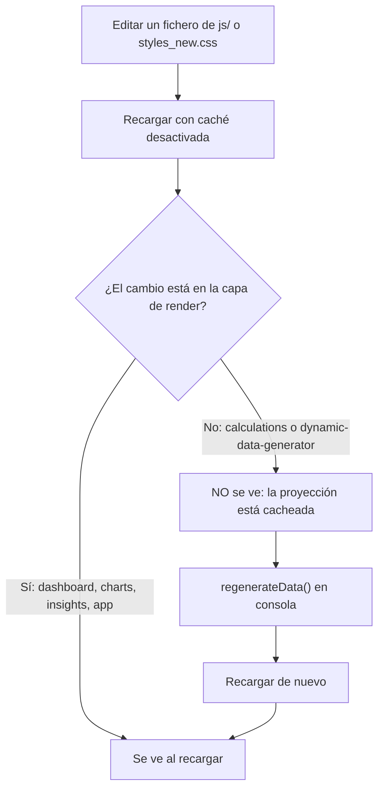
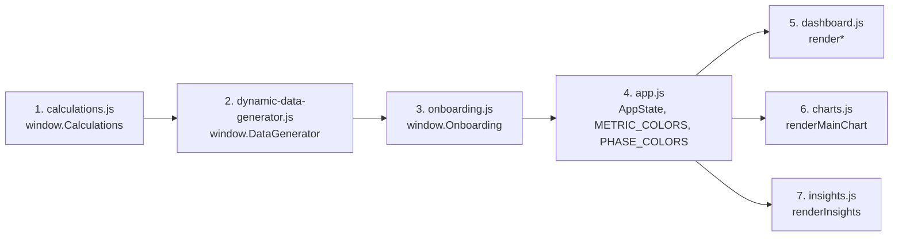

# Guía de desarrollo

Manual operativo para trabajar en el repositorio de TransformLab: cómo arrancarlo, cómo depurarlo, qué convenciones sigue el código realmente escrito, qué hay que tocar para añadir cada tipo de cosa, y qué trampas conocidas conviene conocer antes de perder una tarde con ellas.

> **Estado:** en desarrollo, sin build ni CI, con defectos críticos abiertos en el motor de cálculo · **Última revisión:** 1 de agosto de 2026 · **Versión auditada:** v3.1, commit `264c1db`

> **Alcance.** Esta guía describe el **árbol de trabajo local**, `main` @ `264c1db` (v3.1). **No** describe la v4.0 publicada en `origin/main` (`d0afa49`), que no se ha auditado: el local está **tres commits por detrás** (`git status -sb` → `## main...origin/main [behind 3]`). Todas las referencias `fichero:línea` de este documento apuntan al snapshot v3.1 que hay en disco y se desplazan al actualizar. Antes de dar por buena cualquier afirmación sobre la v4.0, verifícala con `git show origin/main:<fichero>`. Ver la [sección 6](#6-trabajo-con-git).

Documentos relacionados: [README](../README.md) · [Arquitectura](./ARQUITECTURA.md) · [Modelo de datos](./MODELO-DE-DATOS.md) · [Metodología científica](./METODOLOGIA-CIENTIFICA.md) · [Auditoría](./AUDITORIA.md) · [Catálogo de hallazgos](./CATALOGO-DE-HALLAZGOS.md) · [Deuda técnica](./DEUDA-TECNICA.md)

---

## 1. Puesta en marcha

### Requisitos

| Requisito | Necesario para | Notas |
|---|---|---|
| Un navegador moderno | Ejecutar la aplicación | Se usan `?.`, template literals, `Object.entries`, `Chart.js` v4 |
| Conexión a internet en la primera carga | Chart.js y la tipografía Outfit | `index.html:25-26`; sin red, el gráfico no se dibuja y la tipografía cae al `sans-serif` del sistema |
| Node.js (opcional) | Ejecutar el motor de cálculo fuera del navegador | Sólo para depuración y pruebas; la aplicación no lo usa |

No hay `package.json`, ni bundler, ni transpilación, ni dependencias que instalar. No hay backend: el proyecto es un conjunto de ficheros estáticos.

### Clonado

```bash
git clone https://github.com/dacarpena/transformLab.git
cd transformLab
git fetch --all --prune          # imprescindible: ver la sección 6
git log --oneline main..origin/main
```

Ojo con lo que obtienes: un clon recién hecho deja el árbol en `origin/main`, que hoy es `d0afa49` (**v4.0**, trece scripts y cinco módulos más). Esta guía describe el snapshot **v3.1**, `264c1db`. Para reproducirlo exactamente, en un directorio aparte y sin tocar el clon principal:

```bash
git worktree add ../transformLab-v3.1 264c1db
```

### Servir la aplicación

Como no existe ni una sola llamada de red propia (cero `fetch`, cero `XMLHttpRequest`) y todas las rutas de `index.html` son relativas, la aplicación funciona abriendo el fichero directamente:

```bash
open index.html          # macOS; equivale a hacer doble clic
```

Aun así, conviene servirla por HTTP para trabajar en condiciones parecidas a las de producción (el esquema `file://` tiene un origen opaco y `localStorage` se comporta de forma distinta según el navegador):

```bash
python3 -m http.server 8000     # http://localhost:8000
# o
npx serve .
```

No existe ninguna configuración de servidor en el repositorio (ni `netlify.toml`, ni `vercel.json`, ni `.github/`, ni `Dockerfile`), así que cualquiera de las dos opciones sirve por igual.

### Ciclo de trabajo real



Los ficheros JS y CSS se sirven sin huella de contenido en el nombre, de modo que el navegador los cachea con agresividad. Recarga siempre con las herramientas de desarrollo abiertas y la opción **Disable cache** activada (o `Cmd`+`Shift`+`R` / `Ctrl`+`Shift`+`R`).

**Por qué a veces hay que forzar la regeneración.** La proyección completa (`daily`, `weekly`, `monthly`, `phases`, `metadata`, `milestones`) se calcula **una sola vez**, al terminar el onboarding (`js/onboarding.js:859-866`), y se serializa en `localStorage['transformlab_generatedData']`. En cada arranque posterior, `loadAllData()` la relee tal cual (`js/app.js:114-124`) y sólo llama a `regenerateData()` si la clave no existe (`js/app.js:127`). Consecuencia práctica: **cualquier cambio en `js/calculations.js` o en `js/dynamic-data-generator.js` es invisible al recargar**, porque la aplicación no vuelve a ejecutar el motor. Hay que forzarlo desde la consola (sección 2) o borrar el estado.

### Restablecer el estado

Las cuatro claves que usa el proyecto son `transformlab_userProfile`, `transformlab_generatedData`, `transformlab_prefs` y `transformlab_startDate`. Snippet exacto para la consola del navegador:

```js
['transformlab_userProfile',
 'transformlab_generatedData',
 'transformlab_prefs',
 'transformlab_startDate'
].forEach(k => localStorage.removeItem(k));
location.reload();
```

Tras ejecutarlo, `Onboarding.hasCompletedOnboarding()` devuelve `false` (`js/onboarding.js:37-40`) y la aplicación arranca mostrando el asistente.

El botón «🗑️ Reiniciar todo» de la interfaz **no** hace exactamente esto: `resetProfile()` (`js/app.js:216-223`) borra `transformlab_userProfile`, `transformlab_generatedData` y `transformlab_prefs`, pero deja `transformlab_startDate` intacta. Ver la sección 9.

---

## 2. Depuración

Todo el estado y casi todas las funciones viven en el ámbito global, así que la consola del navegador es la herramienta principal. No hay ningún interruptor de depuración: las 20 llamadas a `console.*` de los siete ficheros cargados se emiten siempre.

### Inspeccionar el estado

```js
AppState                       // el objeto completo (js/app.js:8)
AppState.userProfile           // perfil guardado: initial, target, profile, startDate
AppState.navigation            // granularity, currentDay, currentWeek, currentMonth
AppState.ui.visibleMetrics     // métricas activas en el gráfico
AppState.data.phases           // fases con fechas, composiciones y calorías
AppState.data.daily.length     // duración total del plan en días
AppState.charts.main           // instancia viva de Chart.js
```

### Forzar la regeneración de datos

```js
regenerateData();   // js/app.js:149 — recalcula y reescribe transformlab_generatedData
location.reload();  // recargar es lo más seguro: initializeApp() no es idempotente
```

`regenerateData()` recalcula la proyección con `AppState.userProfile` y la persiste, pero **no** vuelve a pintar nada. Llamar después a `initializeApp()` funciona a medias y duplica listeners (ver sección 9); recargar es más limpio.

### Volver a lanzar el onboarding

```js
Onboarding.show();   // js/onboarding.js:71
```

`show()` reinicia `Onboarding.userData` a los valores por defecto (`js/onboarding.js:73-78`): **no** precarga el perfil guardado, aunque el botón que lo invoca se llame «Editar perfil completo» (`js/app.js:226-228`). Al completarlo se sobrescribe todo el perfil. Si sólo quieres empezar de cero, es preferible borrar las claves de la sección 1.

### Examinar los datos generados

```js
const d = JSON.parse(localStorage.getItem('transformlab_generatedData'));

d.daily.length;            // días totales
d.daily[0];                // primer punto: 15 claves
d.daily[0].physical;       // weight, fatPct, fatKg, muscleKg, leanMassKg
d.phases.map(p => [p.name, p.type, p.days, p.dailyCalories]);
d.metadata.metabolicData;  // BMR y TDEE inicial y objetivo
d.milestones.length;

// Tamaño real del payload en bytes
new Blob([localStorage.getItem('transformlab_generatedData')]).size;
```

### Ejecutar el motor de cálculo en Node

`js/calculations.js` sólo se exporta con `window.Calculations = Calculations` (`js/calculations.js:657-659`) y no tiene `module.exports`, así que no se puede `require`. La solución es inyectar un `window` falso y evaluar el fichero. Técnica verificada:

```js
// shim.js — ejecutar con: node shim.js
const fs = require('node:fs');
const path = require('node:path');

global.window = global;
eval(fs.readFileSync(path.join(__dirname, 'js', 'calculations.js'), 'utf8'));

const C = global.Calculations;

console.log(C.calculateBMR(80, 180, 30, 'male'));            // 1780
console.log(C.calculateTDEE(1780, 'moderate'));              // 2759
console.log(C.calculateCaloricTarget(2759, 'recomposition'));// { target: 2759, deficit: 0, ... }

const muscle = C.estimateMuscleFromComposition(80, 20);      // 30.7
console.log(C.calculateTargetWeight(muscle, 20, { weight: 80, fatPct: 20, muscleKg: muscle }));
// 50.9 — debería ser 80: ver el defecto del peso objetivo en el catálogo de hallazgos
```

El mismo shim sirve para auditar la versión publicada sin actualizar el árbol, volcando el fichero desde el remoto en lugar de leerlo del disco:

```bash
git show origin/main:js/calculations.js > /tmp/calculations-v4.js
```

y sustituyendo la ruta del `readFileSync`. Es como se comprobó que los dos defectos del motor sobreviven en la v4.0 (sección 6).

El mismo `shim` carga `js/dynamic-data-generator.js` a continuación (depende de `Calculations`, que ya estará en `global`), lo que permite generar una proyección completa fuera del navegador:

```js
eval(fs.readFileSync(path.join(__dirname, 'js', 'dynamic-data-generator.js'), 'utf8'));
const data = global.DataGenerator.generateTransformationData({
    initial: { weight: 85, fatPct: 25, muscleKg: 47.9 },
    target:  { weight: 75, fatPct: 15, muscleKg: 51 },
    profile: { age: 35, sex: 'male', height: 178, trainingStatus: 'intermediate', activityLevel: 'moderate' },
    startDate: '2026-09-01'
});
console.log(data.daily.length, data.phases.map(p => p.name));
```

Es la base de las pruebas propuestas en la sección 7.

---

## 3. Convenciones del código, tal y como son

Extraídas del código, no de ningún documento de estilo previo. No existe `.editorconfig`, ni ESLint, ni Prettier.

### Lo que se cumple de forma consistente

| Convención | Evidencia |
|---|---|
| Indentación de 4 espacios, sin tabuladores | Cero líneas comienzan por tabulador en los ocho ficheros de `js/` y en `styles_new.css` |
| Punto y coma al final de sentencia | Uniforme en todo `js/` |
| Identificadores en `camelCase` y en **inglés** | `calculateTargetWeight`, `otherLeanTissueKg`, `visibleMetrics`, `phaseProgress` |
| Textos de interfaz en **español** | `'Definición'`, `'Pérdida de grasa preservando masa muscular'`, `'Semana 1'` |
| Cabecera de fichero con separador de `=` | Las ocho primeras líneas de cada fichero de `js/`, p. ej. `js/charts.js:1-4` |
| Separadores de bloque dentro del fichero | `// ============================================` seguido del rótulo de sección, en mayúsculas y en español: `js/app.js:88-90`, `js/dashboard.js:322-324` |
| Objetos globales como espacio de nombres | `Calculations` (`js/calculations.js:18`), `DataGenerator` (`js/dynamic-data-generator.js:7`), `Onboarding` (`js/onboarding.js:6`), `AppState` (`js/app.js:8`) |
| Exportación al final con guarda de entorno | `if (typeof window !== 'undefined') { window.X = X; }` en `calculations.js:657`, `dynamic-data-generator.js:735` y `onboarding.js:961` |
| Funciones `render*` para la presentación | `renderHeader`, `renderNavigation`, `renderDashboard`, `renderMetricCards`, `renderPhaseIndicator`, `renderGoalProgress`, `renderMainChart`, `renderInsights`, `renderPhaseMarkers` |
| Presentación por template literal + `innerHTML` | 29 usos en los siete ficheros cargados (`onboarding.js` 15, `dashboard.js` 8, `app.js` 2, `charts.js` 2, `insights.js` 2) |
| Tablas de traducción como objetos literales | `getMetricLabel` (`js/charts.js:204`), `getPhaseIcon` (`js/dashboard.js:561`), `getTrainingStatusLabel` (`js/onboarding.js:938`) |
| Constantes en `UPPER_SNAKE_CASE` | `METRIC_COLORS` (`js/app.js:54`), `PHASE_COLORS` (`js/app.js:79`), `ACTIVITY_MULTIPLIERS`, `FAT_LOSS_RATES`, `MIN_SAFE_FAT` (`js/calculations.js:25-63`) |
| Redondeo explícito con el idioma `Math.round(x * 10) / 10` | Omnipresente en `calculations.js` y `dynamic-data-generator.js` |

### Dos estilos de módulo conviven

- **Objeto literal con métodos** (`calculations.js`, `dynamic-data-generator.js`, `onboarding.js`): estado y funciones encapsulados, acceso vía `this`.
- **Funciones sueltas en el ámbito global** (`app.js` 40, `charts.js` 16, `dashboard.js` 9, `insights.js` 3 = 68 funciones): sin espacio de nombres, todas visibles desde `window`.

Ambos estilos son coherentes internamente. La regla de facto es: **motor y captura de datos** usan objeto; **capa de render** usa funciones globales.

### Documentación en el código

`js/calculations.js` es el único fichero documentado en serio: 40 anotaciones `@param` y un bloque JSDoc completo por función, con unidades declaradas (`@param {number} weight - Body weight in kg`). `js/dynamic-data-generator.js` y `js/onboarding.js` tienen bloques `/** ... */` descriptivos pero prácticamente sin `@param` (1 y 0 respectivamente). `app.js`, `charts.js`, `dashboard.js` e `insights.js` no tienen JSDoc en absoluto: sólo comentarios de una línea, en español.

Los comentarios del código están mezclados: en inglés en `calculations.js` y `dynamic-data-generator.js`, en español en `app.js`, `dashboard.js`, `charts.js` e `insights.js`, y mezclados dentro del mismo fichero en `onboarding.js`.

### Incoherencias existentes, que conviene conocer antes de «arreglarlas»

1. **La versión no es única.** `index.html:150` muestra `TransformLab v3.0` en el pie; las cabeceras de `app.js:2`, `charts.js:2`, `dashboard.js:2` e `insights.js:2` dicen `v3.0`; `calculations.js:4` y `dynamic-data-generator.js:4` dicen `v3.1`; y `dynamic-data-generator.js:509` escribe `version: '3.2'` dentro de los metadatos, valor que acaba impreso en el informe exportado (`js/dashboard.js:210`). Son cuatro números distintos para el mismo estado del código.

2. **La paleta de fases está triplicada.** `PHASE_COLORS` en `js/app.js:79-86`, `Onboarding.getPhaseColor()` en `js/onboarding.js:947-957` y `categoryColors` en `js/charts.js:546-552` (esta última para categorías de hito, no de fase). Los iconos de fase están duplicados literalmente en `js/dashboard.js:561-571` e `js/insights.js:184-194`.

3. **Mezcla de idiomas en un mismo identificador.** `dateFormatted`, `dayOfWeek` y `monthName` conviven con valores en español (`'Miércoles'`, `'Septiembre 2026'`) dentro de la misma estructura.

4. **Ocho atributos `onclick` en línea** en los ficheros cargados (`app.js:302`, `:305`, `:312`, `:387`; `dashboard.js:61`, `:64`; `onboarding.js:290`, `:900`), frente al patrón mayoritario de `addEventListener`. Son 15 contando `js/milestones.js`, que en v3.1 no se carga (en la v4.0 publicada sí: ver la sección 6). Como los nombres de función viajan dentro de cadenas HTML, renombrar `exportProjectData`, `showSettingsModal`, `editProfile`, `resetProfile` o `closeSettingsOverlay` rompe la interfaz sin que ninguna herramienta lo detecte.

5. **`AppState` declara campos que nadie usa**: `navigation.currentPhase`, `navigation.currentIndex`, `ui.chartType`, `ui.theme`, `ui.sidebarOpen` (`js/app.js:26-41`).

---

## 4. Orden de carga y sus reglas

`index.html:156-162` carga siete scripts clásicos, sin `type="module"`, sin `defer` y sin `async`. Se ejecutan de forma síncrona y en orden, y todos comparten un único ámbito global.

> En la v4.0 publicada son **trece** scripts y el orden es distinto (`origin/main:index.html:239-251`). Este diagrama y la tabla de dependencias que le sigue describen la v3.1: ver el cierre de la sección 6.



### Qué depende de qué, realmente

| Fichero | Necesita ya cargado | Por qué |
|---|---|---|
| `calculations.js` | nada | No referencia ningún global del proyecto |
| `dynamic-data-generator.js` | `Calculations` | `Calculations.calculateTargetWeight` (`:39`), `calculateBMR` (`:179`), `calculatePhaseDurations` (`:55`) |
| `onboarding.js` | `Calculations`, `DataGenerator` | `Calculations.MIN_SAFE_FAT` (`:318`), `DataGenerator.generateTransformationData` (`:859`) |
| `app.js` | `Onboarding` | `Onboarding.hasCompletedOnboarding()` (`:96`) |
| `dashboard.js` | `AppState`, `PHASE_COLORS`, `METRIC_COLORS`, helpers de formato de `app.js` | `formatNumber`, `getChangeClass`, `getCurrentData` |
| `charts.js` | `AppState`, `METRIC_COLORS`, `PHASE_COLORS`, `Chart` (CDN) | `new Chart(...)` (`:74`) |
| `insights.js` | `AppState`, `formatNumber` | `js/insights.js:93` |

Matiz importante: la dependencia real es **en tiempo de ejecución**, no en tiempo de carga. Ningún fichero ejecuta código de otro durante su evaluación inicial; todo arranca desde `document.addEventListener('DOMContentLoaded', loadAllData)` (`js/app.js:742`), que se dispara cuando los siete ya están evaluados. Por eso el orden entre `dashboard.js`, `charts.js` e `insights.js` es indiferente, y sólo importa que `app.js` vaya después de `onboarding.js` en el sentido de que `AppState` y las constantes existan antes de la primera llamada.

### Reglas al añadir un fichero nuevo

1. **Añádelo a `index.html`**, entre las líneas 156 y 162. Si no aparece ahí, no se ejecuta: es exactamente lo que le pasa en este árbol a `js/milestones.js` y a `css/milestones.css` (en `origin/main`, `js/milestones.js` **sí** se carga; `css/milestones.css` sigue sin cargarse).
2. **Un módulo sólo puede usar globals declarados por scripts anteriores** *en el momento en que su código se ejecute*. Si tu fichero hace trabajo en el nivel superior (fuera de cualquier función), colócalo después de todo lo que use. Si sólo declara funciones, la posición es libre.
3. **Exporta con la misma guarda**: `if (typeof window !== 'undefined') { window.MiModulo = MiModulo; }`. Si además quieres poder probarlo en Node, añade en el mismo bloque `if (typeof module !== 'undefined' && module.exports) { module.exports = MiModulo; }`; no rompe el navegador.
4. **Comprueba que no colisionas.** Los siete ficheros actuales declaran 74 identificadores globales sin ninguna colisión. Antes de añadir uno nuevo: `grep -rn 'function nombrePropuesto\|const nombrePropuesto' js/`.
5. **Registra los listeners en `setupEventListeners()`** (`js/app.js:628`), no en el nivel superior del fichero, porque el DOM aún no existe cuando el script se evalúa.

---

## 5. Cómo añadir cosas

### 5.1 Una métrica nueva en la proyección y en la gráfica

Es la tarea con más puntos de contacto, y ninguno de ellos falla de forma ruidosa: si olvidas uno, la métrica aparece vacía, sin etiqueta o en el eje equivocado. Lista completa, verificada:

| # | Fichero y punto | Qué hacer |
|---|---|---|
| 1 | `js/dynamic-data-generator.js:306-314` | Emitir el campo en el bloque correspondiente (`physical`, `performance` o `wellbeing`) de cada entrada diaria |
| 2 | `js/dynamic-data-generator.js:377-394` | Si necesita media semanal, añadirla a `weeklyAverages`. `endOfWeek` copia `lastDay` entero (`:390-394`), así que ahí se propaga sola |
| 3 | `js/dynamic-data-generator.js:462-473` | Lo mismo para `monthlyAverages`; `endOfMonth` también copia el día completo |
| 4 | `js/app.js:54-76` | Añadir el color a `METRIC_COLORS`. Sin él, `charts.js:49` cae al blanco por defecto |
| 5 | `index.html:116-121` | Añadir el botón `<button class="metric-toggle" data-metric="miMetrica" style="--toggle-color: #xxxxxx">Etiqueta</button>`. El listener se engancha solo en `js/app.js:640-642` |
| 6 | `js/charts.js:172-202` | **Tres arrays**, uno por granularidad (`:175`, `:184`, `:193`), deciden de qué bloque se lee el valor. Si la métrica es física y no la añades a los tres, cae en el `else` de bienestar y devuelve `undefined` |
| 7 | `js/charts.js:204-220` | Añadir la etiqueta en español a `getMetricLabel`. Sin ella se muestra la clave cruda |
| 8 | `js/charts.js:222-227` | `getAxisForMetric`: si va en kilogramos, añadirla a la lista del eje `y`; en caso contrario irá al eje `y1` |
| 9 | `js/charts.js:67-68` | `needsSecondAxis` tiene dos listas literales que deciden si aparece el eje derecho. Una métrica no listada no lo activa |
| 10 | `js/charts.js:297-307` | `formatTooltipLabel` deduce la unidad buscando `'kg'` o `'%'` **dentro del texto de la etiqueta**. La etiqueta del punto 7 debe contenerlos para que el tooltip formatee bien |
| 11 | `js/dashboard.js:363-492` | Añadir el `.metric-item` a la tarjeta que corresponda (`physicalCard`, `performanceCard`, `wellbeingCard` o `metabolicCard`) |
| 12 | `js/app.js:37` y `js/app.js:424` | Si debe estar visible por defecto, añadirla a `AppState.ui.visibleMetrics` **y** al array de reserva de `loadPreferences` |
| 13 | consola | Ejecutar `regenerateData()` y recargar: los datos ya guardados no tienen el campo nuevo |

No hace falta tocar `styles_new.css` si reutilizas `.metric-item` / `.metric-value`.

### 5.2 Una fase nueva

| # | Fichero y punto | Qué hacer |
|---|---|---|
| 1 | `js/calculations.js:293-434` | En `calculatePhaseDurations`, hacer `phases.push({ name, type, days, description, expectedFatLoss, expectedMuscleGain })` y sumar `days` a `totalDays` |
| 2 | `js/dynamic-data-generator.js:112-165` | Añadir el `case` al `switch (phase.type)` que calcula `endWeight`, `endFatPct` y `endMuscleKg`. Sin él cae en `default` (`:161-164`) y la composición se queda congelada durante toda la fase |
| 3 | `js/calculations.js:104-127` | Añadir el `case` a `calculateCaloricTarget`. **La cadena debe coincidir exactamente con `phase.type`**: `dynamic-data-generator.js:181` invoca la función con `phase.type`, y hoy el `case 'recomp'` de `:117` es código muerto porque el tipo real es `'recomposition'`. La fase de recomposición recibe calorías de mantenimiento. Ver el [catálogo de hallazgos](./CATALOGO-DE-HALLAZGOS.md) |
| 4 | `js/calculations.js:588-625` | `calculateWellbeingMetrics`: sin `case` propio, la fase recibe la curva genérica del `default` |
| 5 | `js/calculations.js:552-557` | `calculatePerformanceMetrics` sólo modula la fuerza en `'cut'` y `'bulk'` |
| 6 | `js/app.js:79-86` | `PHASE_COLORS`: color del fondo del gráfico (`charts.js:269`), de la insignia de cabecera (`dashboard.js:53`) y del marcador de línea temporal (`dashboard.js:307`) |
| 7 | `js/onboarding.js:947-957` | `getPhaseColor`: segunda copia de la paleta, usada en el paso 4 del asistente |
| 8 | `js/dashboard.js:561-571` e `js/insights.js:184-194` | Las dos tablas de iconos, duplicadas |
| 9 | `js/dynamic-data-generator.js:210` | `neatTarget` distingue hoy sólo `'cut'` del resto |
| 10 | `js/dynamic-data-generator.js:628` | `generateMilestones` genera un hito de «fase completada» para todo tipo distinto de `'maintenance'` |

### 5.3 Un insight

El más barato de todos. Un único fichero:

1. En `generateInsights()` (`js/insights.js:42-182`), hacer `insights.push({ type, icon, text, detail })`.
2. `type` se emite como clase CSS sobre `.insight-item` (`js/insights.js:30`). Los únicos valores con estilo definido son `success`, `warning` e `info` (`styles_new.css:1314`, `:1318`, `:1322`). Cualquier otro valor deja la tarjeta sin color de acento.
3. El panel corta en cinco elementos (`js/insights.js:181`): un insight nuevo puede desplazar a otro fuera de la vista. El orden de `push` es el orden de prioridad.
4. Los bloques 2 y 4 del generador sólo se evalúan para granularidad `'weekly'` o `'daily'`; en vista mensual no se produce ninguno (ver sección 9).
5. `renderInsights()` se llama **una sola vez**, desde `initializeApp()` (`js/app.js:407`). Si quieres que el insight se actualice al navegar, tendrás que añadir la llamada a `navigateTo()` (`js/app.js:594-596`) y a `setGranularity()` (`js/app.js:570-573`).

### 5.4 Un paso del asistente de onboarding

| # | Fichero y punto | Qué hacer |
|---|---|---|
| 1 | `js/onboarding.js:10` | Subir `totalSteps` |
| 2 | `js/onboarding.js:103-125` | La barra de progreso está escrita a mano: cuatro `.progress-step` y tres `.progress-line`. Hay que añadir el par correspondiente |
| 3 | `js/onboarding.js:174-187` | Añadir el `case` al `switch (step)` de `renderStep` |
| 4 | nuevo método `renderXStep(container)` | Seguir el patrón de `renderInitialStep` (`:267`): `container.innerHTML = ...` y después llamar a su `setupXListeners()` |
| 5 | `js/onboarding.js:764-817` | Añadir el `case` a `validateStep`, devolviendo `false` y llamando a `this.showError(mensaje)` cuando algo falle |
| 6 | `js/onboarding.js:13-32` y `:73-78` | Declarar los campos nuevos en el esqueleto `userData` **y** en el objeto de reinicio de `show()`; son dos literales independientes que hay que mantener sincronizados |
| 7 | `js/onboarding.js:845-852` | Si el dato debe persistir, incluirlo en el objeto `userProfile` de `complete()` |
| 8 | `styles_new.css` | `.progress-steps` es un flex; con más de cuatro pasos conviene revisar el ancho en pantallas pequeñas |

El botón «Siguiente» cambia a «🚀 Comenzar» comparando `step === this.totalSteps` (`js/onboarding.js:172`), así que se ajusta solo.

---

## 6. Trabajo con Git

Es la sección que hay que leer antes que ninguna otra, porque determina si lo que estás editando es el proyecto o una foto vieja de él.

### Estado real del repositorio

Todo lo que sigue está comprobado **después** de ejecutar `git fetch --all --prune`.

| Hecho | Comprobación |
|---|---|
| El árbol de trabajo local está en `main` @ `264c1db` (**v3.1**), con **2 commits** de historia | `d424451` (inicial) y `264c1db` (robots.txt y SEO) |
| **El local está tres commits por detrás de `origin/main`** | `git status -sb` → `## main...origin/main [behind 3]` |
| Los tres commits que faltan | `a701308` «Upgrade TransformLab v3.1 → v4.0: multi-screen platform with real data», `72e8e13` «fix: router timing, milestone normalization, SVG gradient IDs», `d0afa49` «Merge pull request #1 from dacarpena/claude/silly-yonath» |
| **La rama `claude/silly-yonath` está fusionada y publicada**, no huérfana | `git merge-base --is-ancestor claude/silly-yonath origin/main` sale con código 0; `git branch -a --contains claude/silly-yonath` lista `remotes/origin/main`. Local y remoto apuntan al mismo `72e8e13` |
| `origin/main` (v4.0) añade cinco ficheros que no existen en local | `git diff --name-status main origin/main` → `A js/router.js`, `A js/checkin.js`, `A js/nutrition.js`, `A js/training.js`, `A js/body-visualizer.js` |
| Tamaño del salto v3.1 → v4.0 | `git diff --stat main origin/main` → 14 ficheros, **+3.125 / −282** líneas |
| **Worktree dentro de `.claude/`**, sobre la rama ya fusionada | `git worktree list` → `.claude/worktrees/silly-yonath` en `72e8e13` |
| **`.DS_Store` versionado** desde el commit inicial | `git ls-files -s .DS_Store` → blob `2bf913d`, 6.148 bytes; aparece como modificado en el árbol de trabajo |
| **No existe `.gitignore`** | `git check-ignore -v .claude` sale con código 1: nada está ignorado |
| `README.md` y `docs/` no están versionados ni existen en `origin/main` | `git status -sb` los lista como `??`; `git ls-tree -r origin/main --name-only` no los contiene |

### Por qué `git status` engañaba

Antes del `fetch`, `git status` decía «up to date with `origin/main`». No es un error de git: compara contra la referencia local `origin/main`, que es una caché y sólo se actualiza con `fetch`. Al actualizarla, la referencia pasó de `264c1db` a `d0afa49` y apareció el `[behind 3]`. **Ejecuta `git fetch --all --prune` antes de sacar cualquier conclusión sobre el estado del repositorio.**

Tres consecuencias que corrigen la lectura intuitiva del repositorio:

- La rama `claude/silly-yonath` **no** es trabajo pendiente de integrar ni está en riesgo de perderse: se fusionó por el PR #1 y **es** el `main` publicado. No hay nada que rescatar ni que decidir sobre ella.
- `js/milestones.js` **no** es código muerto en el producto publicado: `origin/main:index.html:247` lo carga, y `origin/main:js/app.js:434-435` invoca `MilestonesModule.render()` al navegar a la ruta `milestones`. Sólo está inerte en el snapshot v3.1 que hay en disco. La acción correcta no es eliminarlo ni reintegrarlo, sino **actualizar el árbol local**.
- Matiz verificado, porque no todo el subsistema resucita: `css/milestones.css` **sigue sin cargarse** también en v4.0 (`origin/main:index.html` sólo enlaza `styles_new.css`, línea 27; los estilos equivalentes se absorbieron en esa hoja), y ningún fichero de `origin/main` menciona `aesthetic_milestones_complete.json` — en v4.0, `loadMilestones()` lee los hitos de `AppState.data.milestones`, no del JSON.

### Los defectos del motor sobreviven a la v4.0

Comprobado volcando el fichero publicado y ejecutándolo con el shim de la sección 2:

- **El clamp del peso objetivo sigue presente.** `origin/main:js/calculations.js:387` (en local, `js/calculations.js:191`) mantiene `otherLeanTissue = Math.max(2, Math.min(10, calculatedOtherLean));`. El test de identidad da resultados **idénticos** a los de v3.1: 80 kg / 20 % → 50,9 kg (desvío −29,1); 60 kg / 28 % → 42,6 kg (−17,4); 95 kg / 30 % → 59,9 kg (−35,1); 70 kg / 12 % → 45,0 kg (−25,0).
- **La rama calórica muerta sigue igual.** `calculateCaloricTarget(2759, 'recomp')` → déficit 138; `calculateCaloricTarget(2759, 'recomposition')` → déficit 0. El `case 'recomp'` está en `origin/main:js/calculations.js:313` (en local, `js/calculations.js:117`).

Entre v3.1 y v4.0, `js/calculations.js` cambió **+333** líneas y `js/dynamic-data-generator.js` **+162**. Por tanto: **sólo esos dos defectos se han verificado contra la v4.0**. El resto de hallazgos del motor y del generador descritos en este corpus se comprobaron sobre v3.1 y **no pueden darse por válidos en v4.0** sin volver a verificarlos. Lo que sí queda establecido es que la prioridad número uno del plan de remediación —el peso objetivo— no cambia al actualizar.

### De dónde salió el defecto crítico

Vale la pena contarlo, porque explica por qué es fácil reintroducirlo. El commit inicial `d424451` se titula «TransformLab v3.1 - Fixed target calculations», y el clamp `[2, 10]` **ya está en ese commit**. Los comentarios `js/calculations.js:166` («FIXED: Now correctly handles measured muscle mass by preserving…») y `js/dynamic-data-generator.js:89`, `:123` y `:138` («FIXED: Uses otherLeanTissue instead of incorrect 0.48 ratio») identifican ese clamp como el arreglo que da nombre a la versión.

Es decir: el defecto crítico se introdujo **al corregir otro defecto**. Se sustituyó el ratio `0.48` por `otherLeanTissue` con un clamp, sin advertir que el onboarding sigue alimentando `muscleKg` con ese mismo ratio: `Calculations.estimateMuscleFromComposition()` (`js/calculations.js:222-225`) devuelve `leanMass * 0.48`, y se invoca desde `js/onboarding.js:521`, `:681` y `:790`. El arreglo y el punto que lo invalida conviven en el mismo commit. Cualquier corrección futura tiene que tocar los dos lados a la vez.

### Cómo reconciliar el árbol local

**Paso 0. Saber exactamente dónde estás.**

```bash
git fetch --all --prune
git status -sb                          # → ## main...origin/main [behind 3]
git log --oneline main..origin/main     # los tres commits que faltan
git log --oneline origin/main..main     # commits locales no publicados
git diff --stat main origin/main        # qué ficheros cambian
```

**Paso 1. Dejar el árbol limpio.** `.DS_Store` está versionado y modificado; `origin/main` no lo toca (`git rev-parse origin/main:.DS_Store` y `HEAD:.DS_Store` dan el mismo blob), así que no provocará conflicto, pero es ruido que conviene descartar antes de nada:

```bash
git checkout -- .DS_Store
git status --porcelain                  # debe quedar sólo lo que hayas decidido conservar
```

`README.md` y `docs/` están sin seguimiento y no existen en `origin/main`: la actualización no los toca ni los borra. Aun así, compromételos o guárdalos antes si te importan.

**Paso 2. Retirar el worktree.** `.claude/worktrees/silly-yonath` está en `72e8e13`, un commit que ya forma parte de `origin/main`: no se pierde nada al retirarlo.

```bash
git worktree remove .claude/worktrees/silly-yonath
git worktree prune
git branch -d claude/silly-yonath       # -d, no -D: git sólo la borra si está fusionada
```

**Paso 3. Actualizar.** `git log --oneline origin/main..main` no imprime nada: no hay ningún commit local que `origin/main` no tenga, de modo que la actualización es un **avance rápido puro** y `merge` y `rebase` producen exactamente el mismo resultado. En ese caso la orden más segura es la que se niega a hacer otra cosa:

```bash
git merge --ff-only origin/main
```

Si algún día sí hay commits locales, la disyuntiva importa: `git pull --rebase` los reaplica encima de `origin/main` y deja historia lineal (preferible mientras no estén publicados); `git pull --no-rebase` crea un commit de fusión (preferible si ya los ha visto alguien más). Configuración recomendada para no tener que decidirlo cada vez:

```bash
git config pull.ff only                 # o pull.rebase true, si sueles llevar commits locales
git config --global fetch.prune true
```

Nunca `git push --force` sobre `main`; si alguna vez hiciera falta sobrescribir, `git push --force-with-lease`.

> **Aviso: la actualización cambia el árbol bajo los pies de esta documentación.** `git merge --ff-only origin/main` reescribe `index.html`, `js/app.js`, `js/calculations.js`, `js/charts.js`, `js/dashboard.js`, `js/dynamic-data-generator.js`, `js/insights.js`, `js/milestones.js` y `styles_new.css`, y añade cinco ficheros nuevos. Desde ese momento, **ninguna referencia `fichero:línea` de este corpus apunta a lo que dice apuntar** (ejemplo comprobado: el clamp del peso objetivo pasa de `js/calculations.js:191` a `:387`). Si necesitas seguir la documentación al pie de la letra, actualiza el clon y trabaja el snapshot aparte: `git worktree add ../transformLab-v3.1 264c1db`.

**Paso 4. Crear el `.gitignore` y dejar de versionar `.DS_Store`.** Después de actualizar, para que el commit se apoye en `origin/main` y no genere una divergencia inútil:

```bash
# crea antes el fichero con el contenido de más abajo
git rm --cached .DS_Store
git add .gitignore
git commit -m "chore: añade .gitignore y deja de versionar .DS_Store"

# y evítalo en todos los repositorios de la máquina
printf '.DS_Store\n' >> ~/.gitignore_global
git config --global core.excludesfile ~/.gitignore_global
```

### Advertencia: `git add -A` con el worktree presente

Mientras `.claude/worktrees/silly-yonath` siga ahí y no exista `.gitignore`, `.claude/` está sin seguimiento y sin ignorar, de modo que cualquier `git add -A` o `git add .` lo captura. Comprobado con `git add -An .`:

```
warning: adding embedded git repository: .claude/worktrees/silly-yonath
...
add '.DS_Store'
add '.claude/worktrees/silly-yonath/'
```

El resultado sería un *gitlink* sin URL asociada: un submódulo fantasma que en cualquier clon posterior aparece como directorio vacío que git no sabe poblar, además de dejar el worktree simultáneamente registrado y seguido. Git avisa en voz alta y se deshace con `git rm --cached .claude/worktrees/silly-yonath`, pero el orden correcto es el del paso 2: retirar el worktree y crear el `.gitignore` **antes** de tu primer commit.

### `.gitignore` propuesto

```gitignore
# macOS
.DS_Store
**/.DS_Store
.AppleDouble
._*

# Herramientas de agentes y worktrees locales
.claude/

# Node (el proyecto no lo usa hoy, pero cualquier tooling puntual lo generaría)
node_modules/
npm-debug.log*
.npm/

# Editores
.vscode/
.idea/
*.swp
*~

# Temporales y volcados
*.log
tmp/
coverage/
```

### Aviso: qué deja de describir esta guía tras actualizar

Todo lo anterior a esta sección describe la **v3.1**. En cuanto ejecutes el paso 3, el árbol pasa a ser la **v4.0** y estas cuatro cosas dejan de ser ciertas:

1. **Hay cinco módulos más**: `js/router.js`, `js/checkin.js`, `js/nutrition.js`, `js/training.js` y `js/body-visualizer.js`. Ninguno está auditado ni documentado aquí, ni aparece en ninguna de las tablas de dependencias de la sección 4.
2. **El orden de carga de scripts es distinto.** `origin/main:index.html:239-251` carga **trece** scripts, no siete, en este orden: `calculations.js`, `dynamic-data-generator.js`, `router.js`, `onboarding.js`, `app.js`, `dashboard.js`, `charts.js`, `insights.js`, `milestones.js`, `checkin.js`, `nutrition.js`, `training.js`, `body-visualizer.js`. Nótese que `router.js` entra **antes** que `onboarding.js`, y que `milestones.js` pasa a formar parte de la cadena.
3. **`js/milestones.js` está vivo**: pasa de 895 a 995 líneas (`git diff --numstat main origin/main -- js/milestones.js` → `102 2`) y expone `window.MilestonesModule` (`origin/main:js/milestones.js:994`). Todo lo que esta guía dice sobre él como código inerte —secciones 3, 4, 8 y 9— sólo aplica al árbol local.
4. **Las referencias `fichero:línea` se desplazan**, incluidas las de los apartados de escollos y de pruebas.

Lo que **no** cambia: los dos defectos verificados más arriba siguen ahí. El orden de trabajo sensato es actualizar primero y corregir después, sobre la v4.0, reverificando cada hallazgo antes de tocarlo.

---

## 7. Pruebas

### Estado actual

No existe ninguna prueba automatizada. El único fichero con aspecto de test es `test-calculation.js` (182 líneas, en la raíz, no cargado por `index.html`), y **no prueba el código del producto**: no contiene ni una referencia a `Calculations.` ni ningún `require`. Un comentario en `test-calculation.js:22-23` lo reconoce —«Import the Calculations module (for Node.js testing) / In browser, this would be loaded via script tag»— y acto seguido reimplementa la fórmula a mano (masa magra en `:39`, tejido magro restante en `:45`, masa magra objetivo en `:51`, peso objetivo en `:57`).

Consecuencias:

- No tiene ni una aserción: imprime narrativa con `console.log` y termina con «✅ RESULT: 74.87 kg - CORRECT!» (`:69`). Siempre sale con código 0.
- Si alguien introduce una regresión en `Calculations.calculateTargetWeight()` —por ejemplo, invierte el signo de `otherLeanTissue`—, `node test-calculation.js` sigue imprimiendo su veredicto positivo, porque evalúa su propia copia de la fórmula. Da luz verde a un producto roto, que es peor que no tener prueba alguna.

### Enfoque mínimo viable propuesto

`node:test` y `node:assert` vienen con Node: cero dependencias, cero `package.json`, cero `node_modules`. El único obstáculo es que `calculations.js` sólo se exporta a `window`, y se resuelve con el mismo shim de la sección 2.

```bash
node --test test/calculations.test.js
```

Si más adelante se añade el export dual (`module.exports` junto a `window.Calculations`), el `eval` desaparece y se sustituye por un `require` normal, sin tocar los casos.

### Casos de prueba de ejemplo

Guardar como `test/calculations.test.js`. Ejecutables tal cual sobre el código actual: **tres de los cinco fallan**, que es precisamente su razón de ser; los dos de conservación de masa pasan y sirven de red de seguridad frente a regresiones futuras.

```js
const test = require('node:test');
const assert = require('node:assert');
const fs = require('node:fs');
const path = require('node:path');

// Carga del motor: calculations.js sólo se exporta a window, así que se le
// inyecta un window falso y se evalúa el fichero en este contexto.
global.window = global;
eval(fs.readFileSync(path.join(__dirname, '..', 'js', 'calculations.js'), 'utf8'));
const C = global.Calculations;

// Perfiles de prueba: peso y % de grasa plausibles, sin bioimpedancia.
const PERFILES = [
    { nombre: 'hombre 80 kg / 20 %', weight: 80, fatPct: 20, sex: 'male' },
    { nombre: 'mujer 60 kg / 28 %',  weight: 60, fatPct: 28, sex: 'female' },
    { nombre: 'hombre 95 kg / 30 %', weight: 95, fatPct: 30, sex: 'male' },
    { nombre: 'hombre 70 kg / 12 %', weight: 70, fatPct: 12, sex: 'male' }
];

test('identidad: pedir como objetivo la composición actual devuelve el peso actual', () => {
    for (const p of PERFILES) {
        const muscleKg = C.estimateMuscleFromComposition(p.weight, p.fatPct);
        const actual = { weight: p.weight, fatPct: p.fatPct, muscleKg };
        const objetivo = C.calculateTargetWeight(muscleKg, p.fatPct, actual);
        assert.ok(objetivo !== null, `${p.nombre}: calculateTargetWeight devolvió null`);
        assert.ok(
            Math.abs(objetivo - p.weight) < 1,
            `${p.nombre}: objetivo ${objetivo} kg frente a peso actual ${p.weight} kg`
        );
    }
});

test('conservación de masa: grasa + músculo + resto de tejido magro = peso', () => {
    for (const p of PERFILES) {
        const c = C.calculateComposition(p.weight, p.fatPct);
        const suma = c.fatKg + c.muscleKg + c.otherLeanTissueKg;
        assert.ok(Math.abs(suma - p.weight) < 0.05, `${p.nombre}: suma ${suma} != ${p.weight}`);
    }
});

test('conservación de masa: calculateWeightFromComposition invierte a calculateComposition', () => {
    for (const p of PERFILES) {
        const c = C.calculateComposition(p.weight, p.fatPct);
        const w = C.calculateWeightFromComposition(c.muscleKg, p.fatPct, c.otherLeanTissueKg);
        assert.ok(Math.abs(w - p.weight) < 0.05, `${p.nombre}: reconstruido ${w} != ${p.weight}`);
    }
});

test('todos los tipos de fase que produce el plan tienen rama calórica propia', () => {
    const initial = { weight: 85, fatPct: 25, muscleKg: C.estimateMuscleFromComposition(85, 25) };
    const target  = { weight: 75, fatPct: 15, muscleKg: initial.muscleKg + 3 };
    const profile = { trainingStatus: 'intermediate', sex: 'male', age: 30 };
    const plan = C.calculatePhaseDurations(initial, target, profile);
    const tipos = [...new Set(plan.phases.map(f => f.type))];
    const conAjuste = ['cut', 'bulk', 'recomposition'];

    for (const tipo of tipos.filter(t => conAjuste.includes(t))) {
        const r = C.calculateCaloricTarget(2759, tipo);
        assert.notStrictEqual(
            r.deficit, 0,
            `la fase '${tipo}' recibe calorías de mantenimiento: no hay case para ese valor`
        );
    }
});

test('la validación de % de grasa no se desactiva con un sexo no reconocido', () => {
    const initial = { weight: 80, fatPct: 20, muscleKg: 30.7 };
    const target  = { weight: 60, fatPct: 2,  muscleKg: 32 };
    const r = C.validateInputs(initial, target, { sex: 'hombre', age: 30 });
    assert.strictEqual(r.isValid, false, 'un objetivo del 2 % de grasa se aceptó como válido');
});
```

Salida sobre el código actual:

```
✖ identidad: pedir como objetivo la composición actual devuelve el peso actual
  → hombre 80 kg / 20 %: objetivo 50.9 kg frente a peso actual 80 kg
✔ conservación de masa: grasa + músculo + resto de tejido magro = peso
✔ conservación de masa: calculateWeightFromComposition invierte a calculateComposition
✖ todos los tipos de fase que produce el plan tienen rama calórica propia
  → la fase 'recomposition' recibe calorías de mantenimiento: no hay case para ese valor
✖ la validación de % de grasa no se desactiva con un sexo no reconocido
  → un objetivo del 2 % de grasa se aceptó como válido
ℹ tests 5   ℹ pass 2   ℹ fail 3
```

Los tres fallos corresponden, en el mismo orden, al defecto del peso objetivo (`js/calculations.js:191`), a la rama muerta `case 'recomp'` (`js/calculations.js:117`) y a la desactivación de la validación de grasa con un `sex` no reconocido (`js/calculations.js:454`). Los tres están descritos en detalle en el [catálogo de hallazgos](./CATALOGO-DE-HALLAZGOS.md) y en la [metodología científica](./METODOLOGIA-CIENTIFICA.md).

Si más adelante se añade integración continua, un único workflow que ejecute `node --test test/` cubre el caso. No introducir bundler ni framework: eliminaría la principal ventaja operativa del proyecto, que se abre con doble clic.

---

## 8. Despliegue

### Cómo se publica hoy

No hay despliegue automatizado ni configuración de host en el repositorio. El proyecto son ficheros estáticos: basta con copiar la raíz a cualquier servidor web, GitHub Pages o Netlify. No hay paso de compilación, ni variables de entorno, ni backend. Los metadatos de `index.html:8-17` y `robots.txt` indican que la intención era publicarlo (`Allow: /`, `<meta name="robots" content="index, follow">`), y el commit `264c1db` se titula «Add robots.txt and SEO metadata for domain reputation».

Ficheros que **no** hace falta publicar **desde el árbol local (v3.1)**: `test-calculation.js`, `aesthetic_milestones_complete.json`, `js/milestones.js` y `css/milestones.css`, porque `index.html:156-162` no carga ninguno.

Esa lista no vale para la versión publicada. En `origin/main` (v4.0), `index.html:247` **sí** carga `js/milestones.js`, así que ahí sólo son prescindibles `test-calculation.js`, `aesthetic_milestones_complete.json` y `css/milestones.css` —los dos últimos siguen sin estar referenciados desde ningún fichero de `origin/main`—. Ver la sección 6.

### Comprobaciones antes de publicar

| Punto | Estado hoy | Qué hacer |
|---|---|---|
| **Corrección del motor** | El peso objetivo se desvía entre 17 y 35 kg por debajo del real para todo usuario sin bioimpedancia (`js/calculations.js:191`) | Bloqueante para un uso real: se estaría publicando una herramienta de salud que devuelve objetivos por debajo del rango saludable |
| **Licencia** | No existe `LICENSE` | Un repositorio público sin licencia queda bajo copyright completo del autor: nadie puede usarlo ni contribuir legalmente. Añadir una (MIT si se quiere uso libre) o decir explícitamente en el README que no se concede licencia |
| **Aviso de datos de salud** | No hay ninguno en la interfaz | La aplicación recoge edad, sexo biológico, altura, peso y % de grasa (art. 9 del RGPD). Bastan una o dos frases visibles: los datos se guardan sólo en este navegador, no se envían a ningún servidor, y se borran con «Reiniciar todo» |
| **Origen compartido** | `localStorage` se comparte por origen completo, no por ruta | Publicar en `usuario.github.io/transformLab` deja el perfil legible por cualquier otra página de esa misma cuenta. Un dominio o subdominio propio lo aísla |
| **`robots.txt`** | La línea 5 conserva `# Sitemap: https://tudominio.com/sitemap.xml`, un marcador de ejemplo comentado, y no existe ningún `sitemap.xml` | Sustituir por el dominio real o borrar las líneas 4-5 |
| **Chart.js sin versión** | `index.html:26` carga `https://cdn.jsdelivr.net/npm/chart.js` sin versión ni `integrity`; el CDN sirve hoy la 4.5.1 con caché de 7 días | Fijar versión y SRI, o descargar `chart.umd.min.js` a `vendor/` y versionarlo |
| **CSP** | No hay ninguna. Añadirla en modo estricto rompería los **8 atributos `onclick` de los ficheros cargados** (15 contando `js/milestones.js`, hoy inerte) sin más señal que un aviso en consola | Migrar primero los `onclick` a `addEventListener`, **después** añadir la CSP |
| **`.DS_Store`** | Versionado | Ver sección 6 |

### Orden correcto para activar la CSP

1. Sustituir los ocho `onclick` de los ficheros cargados (`app.js:302`, `:305`, `:312`, `:387`; `dashboard.js:61`, `:64`; `onboarding.js:290`, `:900`) por delegación de eventos sobre el contenedor.
2. Sólo entonces, añadir a `index.html`:

```html
<meta http-equiv="Content-Security-Policy" content="
  default-src 'self';
  script-src 'self' https://cdn.jsdelivr.net;
  style-src 'self' 'unsafe-inline' https://fonts.googleapis.com;
  font-src https://fonts.gstatic.com;
  img-src 'self' data:;
  connect-src 'none';
  base-uri 'none';
  form-action 'none'">
```

`connect-src 'none'` es especialmente valioso aquí: la aplicación no hace ninguna petición de red, así que la política impide por diseño cualquier futura exfiltración de los datos de salud. `'unsafe-inline'` en `style-src` es necesario por los atributos `style="--phase-color: ..."` generados en las plantillas.

### Cabeceras recomendadas si se sirve desde servidor propio

```nginx
add_header Content-Security-Policy "default-src 'self'; script-src 'self' https://cdn.jsdelivr.net; style-src 'self' 'unsafe-inline' https://fonts.googleapis.com; font-src https://fonts.gstatic.com; img-src 'self' data:; connect-src 'none'; base-uri 'none'; form-action 'none'" always;
add_header X-Content-Type-Options "nosniff" always;
add_header Referrer-Policy "no-referrer" always;
add_header Permissions-Policy "geolocation=(), camera=(), microphone=(), payment=()" always;

# Sin huella de contenido en los nombres de fichero, no se puede cachear a largo plazo
location ~* \.(js|css|html)$ {
    add_header Cache-Control "no-cache, must-revalidate";
}
```

---

## 9. Escollos conocidos

Los que hacen perder una tarde a quien toque el proyecto sin saberlos.

1. **Creer que el árbol local es el proyecto publicado.** No lo es. El `main` local está en `264c1db` (v3.1) y `origin/main` en `d0afa49` (v4.0): **tres commits por detrás**, con cinco módulos y seis scripts de diferencia. Y mientras no ejecutes `git fetch`, `git status` afirma tranquilamente que estás al día, porque compara contra una referencia local cacheada. Lo que se pierde por no saberlo: se corrigen defectos ya resueltos aguas arriba, se da por muerto código que en producción sí se ejecuta (`js/milestones.js`), se planifica «reintegrar» una rama que lleva fusionada desde el PR #1, y se prepara un `push` que será rechazado. **`git fetch --all --prune` y `git status -sb` antes de tocar nada.** Ver la sección 6, que también explica qué defectos sobreviven a la actualización y cuáles habrá que reverificar.

2. **La proyección está cacheada y no se recalcula sola.** Cambiar `calculations.js` o `dynamic-data-generator.js` y recargar no produce ningún efecto visible: `loadAllData()` relee `transformlab_generatedData` de `localStorage` (`js/app.js:114-124`) y sólo regenera si la clave falta. Hay que ejecutar `regenerateData()` o borrar el estado. Es la causa número uno de «he arreglado el bug y no cambia nada».

3. **`js/milestones.js` y `css/milestones.css` están inertes aquí, pero `milestones.js` no lo está en producción.** En este árbol (v3.1) son 895 + 1.381 líneas muertas, más un `aesthetic_milestones_complete.json` de 76 KB que nadie lee: `index.html:156-162` no los carga y ninguna de las nueve funciones que `milestones.js` exporta a `window` (`js/milestones.js:887-895`) se invoca desde ningún fichero cargado. Los hitos que sí se muestran los genera `DataGenerator.generateMilestones()` (`js/dynamic-data-generator.js:573`) en tiempo de ejecución y los dibuja `js/charts.js:535`. **En `origin/main` (v4.0) la situación se invierte para el JS**: `index.html:247` carga `js/milestones.js` y `js/app.js:434-435` llama a `MilestonesModule.render()`. Así que editar `milestones.js` aquí es tocar código que no se ejecuta *en este árbol* pero sí *en el publicado*: actualiza antes (sección 6). El CSS y el JSON siguen sin cargarse en ambas versiones.

4. **`initializeApp()` no es idempotente.** `js/app.js:396-416` llama a `setupEventListeners()` y `setupVisualEffects()`, y ninguna de las dos retira registros previos. La ruta «Editar perfil completo» → `Onboarding.show()` → `complete()` → `initializeWithGeneratedData()` → `initializeApp()` las vuelve a ejecutar en la **misma carga de página**, sobre los mismos nodos del DOM. Resultado: los botones con listener anónimo (`#navPrev`, `#navNext`, granularidad, toggles de métrica) se disparan dos veces —el botón «›» avanza dos posiciones— y arranca un segundo bucle `requestAnimationFrame` perpetuo del efecto de cursor, que ya no se puede cancelar. El listener de teclado sí se descarta, porque `js/app.js:645` usa la misma referencia de función. Después de tocar el estado desde la consola, **recarga la página** en lugar de llamar a `initializeApp()`.

5. **Las fechas mezclan UTC y hora local.** Una cadena `'YYYY-MM-DD'` de un `<input type="date">` se interpreta como medianoche **UTC** al pasarla a `new Date(...)`, pero `setDate()`/`getDate()`, `getDay()` y `toLocaleDateString('es-ES')` operan en hora **local**, y la salida vuelve a producirse con `toISOString()` (UTC). Puntos afectados: `js/dynamic-data-generator.js:238-239` y `:291`, `:298-299`; `js/app.js:233-238` y `:265`; `js/onboarding.js:599`. Efectos observables: desfase de un día en husos con desplazamiento negativo, `dateFormatted`/`dayOfWeek` inconsistentes con `date`, y un día duplicado al cruzar el cambio a horario de verano en Europe/Madrid.

6. **Hay reglas CSS que no se aplican porque el selector no coincide con la clase que emite el JS.** Los tres botones de fecha rápida del onboarding se generan con `class="quick-date"` (`js/onboarding.js:351-353`), mientras la hoja estiliza `.quick-date-btn` (`styles_new.css:143`, `:155`, `:161`): se pintan con los estilos por defecto del navegador —fondo claro, texto negro— sobre un modal casi negro. Lo mismo pasa con el panel de hover del gráfico, que emite `.hover-content` y `.hover-title` (`js/charts.js:367-369`), clases que no aparecen ni una vez en `styles_new.css`, mientras la hoja define `.hover-header`, `.hover-date`, `.hover-period` y `.hover-phase`, que nadie genera. Antes de dar por buena una regla CSS, comprueba con `grep` que la clase existe en el JS.

7. **`.dashboard-row` declara tres columnas y el HTML pinta cuatro tarjetas.** `styles_new.css:725` fija `grid-template-columns: repeat(3, 1fr)` mientras `index.html:86-97` coloca `physicalCard`, `performanceCard`, `wellbeingCard` y `metabolicCard`: la cuarta cae sola a una segunda fila. La regla de cuatro columnas existe (`styles_new.css:729-731`) pero exige la clase `.nomad-dashboard`, que nadie añade.

8. **`.phase-name` está definido dos veces en la misma hoja** (`styles_new.css:925` y `:1972`). Gana la segunda. Editar la primera no produce ningún efecto.

9. **La clave `transformlab_startDate` se lee pero no la escribe nadie.** `loadPreferences()` la relee y sobrescribe `AppState.startDate` (`js/app.js:431-434`), pero la única función que la escribe, `saveStartDate()` (`js/app.js:445-448`), no se invoca desde ningún punto del proyecto. Además, `resetProfile()` (`js/app.js:216-223`) no la borra: si quedó un valor de una sesión anterior, sobrevive al «Reiniciar todo» y desplaza la fecha de inicio de la nueva proyección. Bórrala siempre a mano con el snippet de la sección 1.

10. **Los insights no se actualizan al navegar.** `renderInsights()` sólo se llama desde `initializeApp()` (`js/app.js:407`). Ni `navigateTo()` ni `setGranularity()` ni el guardado de una nueva fecha de inicio lo reinvocan. El panel muestra siempre los insights de la posición en la que arrancó la aplicación. Y en granularidad mensual, `generateInsights()` no produce ninguno de bienestar ni de progreso acumulado, porque los bloques correspondientes (`js/insights.js:118-119` y `:153-154`) sólo contemplan `'daily'` y `'weekly'`.

11. **El botón «Hoy» no lleva a hoy.** `navigateToToday()` (`js/app.js:615-623`) navega al punto medio del plan: `Math.floor(getTotalDays() / 2)`, con el comentario «Simular día actual (mitad del proceso para demo)». La posición real sí se calcula, en `calculateCurrentPosition()` (`js/app.js:180-196`), pero el botón no la usa.

12. **`addDailyFluctuation` usa `Math.random()`** (`js/calculations.js:647-652`). La proyección no es reproducible entre generaciones y el último día no aterriza exactamente en la composición objetivo. Cualquier prueba que compare series completas fallará de forma intermitente; compara agregados o composiciones de fase, no valores diarios.

13. **No hay ni un solo `try`/`catch` en `js/onboarding.js`.** Si `localStorage.setItem` falla en `complete()` (`js/onboarding.js:866`) —Safari en navegación privada, cuota agotada—, la excepción sube sin capturar, el overlay del asistente nunca se oculta y la aplicación queda bloqueada sin ningún mensaje. Al recargar, el perfil sí está guardado y la aplicación entra en un bucle de error permanente.
