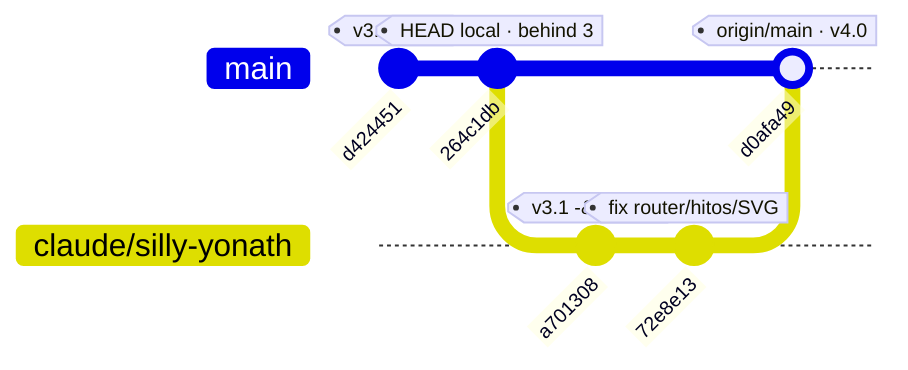

# Historial y ramas

Este documento sitúa el proyecto en el tiempo y en el grafo de git: dónde está el árbol de trabajo que se auditó, dónde está el código publicado, qué separa a uno de otro y cómo reconciliarlos sin perder trabajo.

> **Estado:** vigente · **Última revisión:** 2 de agosto de 2026 · **Versión descrita:** árbol local `main @ 264c1db` (v3.1) frente a `origin/main @ d0afa49` (v4.0)

Documentos relacionados: [README](../README.md) · [Arquitectura](ARQUITECTURA.md) · [Auditoría](AUDITORIA.md) · [Deuda técnica](DEUDA-TECNICA.md) · [Metodología científica](METODOLOGIA-CIENTIFICA.md) · [Guía de desarrollo](GUIA-DE-DESARROLLO.md)

> ### ⚠️ Alcance
>
> Todo el corpus documental —incluida la auditoría de 130 hallazgos— describe el **árbol de trabajo local**, `main @ 264c1db` (v3.1). La versión publicada, `origin/main @ d0afa49` (v4.0), **no está auditada**. En este documento se describe la v4.0 a partir de lo que se ha leído con `git show origin/main:<fichero>`, y se marca explícitamente cada sección que es descripción y no auditoría. Ninguna afirmación sobre la v4.0 que no aparezca aquí debe darse por comprobada.

---

## 1. Estado actual en una tabla

Todo lo que sigue está verificado con `git` en el momento de escribir este documento, después de un `git fetch`.

| Concepto | Valor |
| --- | --- |
| Remoto | `origin` → `https://github.com/dacarpena/transformLab.git` |
| Rama local activa | `main` |
| `HEAD` local | `264c1db` — *Add robots.txt and SEO metadata for domain reputation* (24 ene 2026, 18:27 +0100) |
| Versión del árbol local | v3.1 (ver § 3) |
| `origin/main` | `d0afa49` — *Merge pull request #1 from dacarpena/claude/silly-yonath* (4 mar 2026, 17:16 +0100) |
| Versión publicada | v4.0 |
| Relación con el remoto | `git status -sb` → `## main...origin/main [behind 3]` — **tres commits por detrás, cero por delante** |
| Ramas locales | `main` (`264c1db`), `claude/silly-yonath` (`72e8e13`) |
| Ramas remotas | `origin/main` (`d0afa49`), `origin/claude/silly-yonath` (`72e8e13`), `origin/HEAD → origin/main` |
| `git branch --merged origin/main` | `main` y `claude/silly-yonath` — **ambas están contenidas en `origin/main`** |
| Ficheros modificados sin commitear | `.DS_Store` (` M`) — único fichero rastreado con cambios |
| Sin rastrear | `.claude/`, `README.md`, `docs/` |
| Alijos (`git stash list`) | ninguno |
| `.gitignore` | **no existe** |

### 1.1 Worktrees presentes

`git worktree list` devuelve dos:

| Ruta | Commit | Rama |
| --- | --- | --- |
| `/Users/dani/Documents/PROYECTOS/transformLab` | `264c1db` | `main` |
| `/Users/dani/Documents/PROYECTOS/transformLab/.claude/worktrees/silly-yonath` | `72e8e13` | `claude/silly-yonath` |

Dos consecuencias operativas:

1. El segundo worktree vive **dentro** del primero, bajo `.claude/`, y `.claude/` está sin rastrear porque no hay `.gitignore`. Cualquier `git add -A` o `git add .` ejecutado en la raíz intentará añadir al índice el contenido de un worktree ajeno. **No usar `git add -A` en este repositorio hasta que exista un `.gitignore`.**
2. `claude/silly-yonath` **no es una rama huérfana ni pendiente de fusionar**. Se fusionó mediante el PR #1 y forma parte de `origin/main`. `git branch --merged origin/main` la lista. Nada de lo que hay en ella corre riesgo de perderse.

### 1.2 La corrección más importante de este documento

Buena parte del corpus se redactó asumiendo que el árbol de trabajo local *era* el proyecto. No lo es. El proyecto publicado va tres commits por delante, y el trabajo que en algún momento pudo parecer una rama suelta en riesgo —`claude/silly-yonath`— es exactamente el `main` publicado. La lectura correcta es la inversa de la intuitiva: **no hay trabajo pendiente de integrar; hay trabajo integrado pendiente de descargar.**

---

## 2. El grafo de commits



Leído de izquierda a derecha: el árbol de trabajo local está anclado en el segundo commit de la historia. Los tres restantes —los dos de la rama y el merge que los publica— existen en el repositorio local únicamente como objetos descargados por `git fetch`, referenciados por `origin/main`; ningún fichero del disco los refleja.

Los cinco commits, en orden cronológico:

| Commit | Fecha | Título |
| --- | --- | --- |
| `d424451` | 24 ene 2026 | *Initial commit: TransformLab v3.1 — Fixed target calculations, improved responsive design and milestone chart visualization* |
| `264c1db` | 24 ene 2026 | *Add robots.txt and SEO metadata for domain reputation* |
| `a701308` | 4 mar 2026 | *Upgrade TransformLab v3.1 → v4.0: multi-screen platform with real data* |
| `72e8e13` | 4 mar 2026 | *fix: router timing, milestone normalization, SVG gradient IDs* |
| `d0afa49` | 4 mar 2026 | *Merge pull request #1 from dacarpena/claude/silly-yonath* |

`d424451` introduce el proyecto completo de una sola vez: 14 ficheros, 12 515 líneas. `264c1db` añade `robots.txt` y metadatos SEO, y toca **solo** `index.html` (+16) y `robots.txt` (+5): no modifica una sola línea de JavaScript. Es decir, **el motor de cálculo del árbol local es, byte a byte, el del commit inicial**.

---

## 3. Historial de versiones

En el código conviven cuatro números de versión distintos, sin ninguna fuente única de verdad. La tabla recoge dónde aparece cada uno.

| Versión | Dónde aparece (árbol local `264c1db`) | Dónde aparece (`origin/main`) |
| --- | --- | --- |
| **v3.0** | `index.html:150`, pie de página: *«TransformLab v3.0 · Cálculos: Mifflin-St Jeor, Aragon 2017, McDonald/Helms · Plan personalizado»* | sustituido por v4.0 |
| **v3.1** | cabecera de `js/calculations.js:4` (*«v3.1 - Fixed target weight calculation bug»*) y de `js/dynamic-data-generator.js:4` (*«v3.1 - Fixed weight calculation to use measured muscle mass»*) | sustituido por v4.0 |
| **v3.2** | literal `version: '3.2'` en la metadata que genera `js/dynamic-data-generator.js:509`; el mismo valor aparece como respaldo en la exportación a Markdown de `js/dashboard.js:210` (`metadata.version \|\| '3.2'`) | **sigue siendo `'3.2'`** en `origin/main:js/dynamic-data-generator.js:563` |
| **v4.0** | no aparece | cabeceras de `js/calculations.js:4` y `js/dynamic-data-generator.js:4`; pie del sidebar en `origin/main:index.html:77`; pie de página en `origin/main:index.html:171` |

### 3.1 Qué separa realmente cada número

- **v3.0 → v3.1.** No hay commit que documente esta transición: `d424451` es el commit inicial y ya llega etiquetado como v3.1 en las cabeceras de los dos ficheros del motor, mientras el pie de `index.html` sigue diciendo v3.0. El v3.0 del pie es, por tanto, un residuo: nunca se actualizó. Lo que el título del commit inicial identifica como el contenido de la v3.1 es *«Fixed target calculations»*, y esa corrección es la que se analiza en § 4.
- **v3.1 → v3.2.** No existe como versión del producto. El `'3.2'` es un literal escrito a mano dentro del objeto `metadata` que se serializa junto a cada plan generado, sin relación con ninguna otra marca de versión del código. Sobrevive intacto en la v4.0, donde ya contradice a las cabeceras de su propio fichero.
- **v3.1 → v4.0.** Es la única transición respaldada por commits: `a701308` (+3 061/−280 líneas sobre 14 ficheros) y el arreglo posterior `72e8e13` (+77/−15 sobre 3 ficheros). El título de `a701308` la resume como *multi-screen platform with real data*: se pasa de una pantalla única a una aplicación con barra lateral, seis vistas enrutadas y registro de datos reales. El detalle está en § 5.

La conclusión práctica es que **el número de versión no es fiable como indicador de estado**: para saber qué código se está ejecutando hay que mirar el commit, no la cadena.

---

## 4. La v3.1 y el defecto que introdujo

Esta sección reconstruye, con `git`, cómo el defecto crítico del proyecto entró en el código. La reconstrucción importa porque explica por qué el defecto es difícil de ver: **está escrito como un arreglo, y lo era.**

### 4.1 La evidencia documental

El commit inicial se titula *«Initial commit: TransformLab v3.1 — **Fixed target calculations**, improved responsive design and milestone chart visualization»*. No existe un commit anterior en el que ver el estado previo: el repositorio nace ya con la corrección aplicada. Lo que sí queda es el rastro que el propio autor dejó en los comentarios, presente idéntico en `d424451` y en el árbol local:

| Ubicación | Comentario |
| --- | --- |
| `js/calculations.js:166` | *«FIXED: Now correctly handles measured muscle mass by preserving the "other lean tissue" (bones, organs, water) from current composition.»* |
| `js/dynamic-data-generator.js:89` | *«FIXED: Uses otherLeanTissue instead of incorrect 0.48 ratio»* |
| `js/dynamic-data-generator.js:123` | *«FIXED: Use otherLeanTissue instead of dividing by 0.48»* |
| `js/dynamic-data-generator.js:138` | *«FIXED: Calculate weight using otherLeanTissue»* |

Los cuatro apuntan a lo mismo y con el mismo vocabulario: se sustituyó el uso de una proporción fija de 0.48 por el manejo explícito del *otro tejido magro*. Ese es el arreglo que da nombre a la v3.1.

### 4.2 Qué se intentaba arreglar

Antes del arreglo, el peso correspondiente a una composición objetivo se derivaba dividiendo el músculo entre 0.48, es decir, asumiendo que el músculo es siempre el 48 % de la masa magra y que el resto (huesos, órganos, agua, piel) escala proporcionalmente con él. Ese supuesto es falso: el tejido magro no muscular es aproximadamente **constante** en un mismo individuo. Si alguien gana 5 kg de músculo, no gana también 5,4 kg de huesos y vísceras. Derivar el peso con una proporción fija infla o desinfla el resultado según cuánto músculo se pida.

El arreglo es el correcto conceptualmente: en lugar de escalar, **preservar**. Se calcula el tejido magro no muscular actual y se mantiene constante al proyectar el objetivo. En `js/calculations.js:174`, `calculateTargetWeight` hace exactamente eso:

```js
const currentLeanMass = currentComposition.weight * (1 - currentComposition.fatPct / 100);
const calculatedOtherLean = currentLeanMass - currentComposition.muscleKg;

// Clamp otherLeanTissue to physiologically reasonable range (2-10 kg)
otherLeanTissue = Math.max(2, Math.min(10, calculatedOtherLean));   // js/calculations.js:191
```

El recorte `[2, 10]` es una defensa razonable **para la entrada prevista**. El comentario que lo acompaña lo dice sin ambigüedad: *«Bones alone are 3-5 kg, organs add another 3-5 kg»*. Si `muscleKg` procede de una báscula de bioimpedancia —que mide *masa muscular esquelética*—, el resto magro real cae en torno a 8-12 kg, el recorte casi nunca actúa y, cuando actúa, señala datos incoherentes. La función incluso avisa por consola cuando corrige más de 1 kg (`js/calculations.js:193-194`). El valor por defecto de la variable, `otherLeanTissue = 5` en `js/calculations.js:181`, es coherente con esa misma lectura.

### 4.3 Por qué falla

El arreglo asume que `muscleKg` es músculo esquelético medido. En la ruta por defecto de la aplicación no lo es: es masa magra estimada con la misma proporción 0.48 que el arreglo venía a eliminar.

```js
// js/calculations.js:222-225
estimateMuscleFromComposition(weight, fatPct) {
    const leanMass = weight * (1 - fatPct / 100);
    return Math.round(leanMass * 0.48 * 10) / 10;
},
```

El onboarding llama a esa función en cinco puntos y rellena con ella `initial.muscleKg` siempre que el usuario no introduzca un valor propio —`js/onboarding.js:270`, `:521`, `:623`, `:681` y `:790`—. Los tres decisivos son los que **escriben** el dato o alimentan la validación:

- `js/onboarding.js:521` — autorrelleno del campo de músculo mientras el usuario teclea peso y grasa.
- `js/onboarding.js:681` — relleno defensivo antes de validar y dibujar la vista previa de la línea temporal.
- `js/onboarding.js:790` — relleno final al validar el paso 2, que es el que se persiste.

El resultado es que `calculateTargetWeight` recibe, como si fuera músculo medido, un número que ya vale el 48 % de la masa magra. El «otro tejido magro» calculado no vale 8-12 kg sino el 52 % restante: entre 22 y 35 kg. El recorte lo trunca a 10 y **destruye la diferencia**. Para un hombre de 80 kg y 20 % de grasa: masa magra 64,00 kg, músculo estimado 30,7 kg, resto real 33,30 kg, recortado a 10 kg. Se han borrado 23,3 kg de tejido que existe.

El arreglo y el punto que lo invalida conviven en el mismo commit. Ninguno de los dos es descuidado por separado: `estimateMuscleFromComposition` es una heurística razonable, y el recorte `[2, 10]` es una defensa razonable. Lo que falta es la pieza que los une —una definición única de qué significa «músculo» en este sistema— y esa pieza nunca se escribió. Es exactamente el argumento por el que la unificación del modelo de composición corporal encabeza el plan de remediación: ver [METODOLOGIA-CIENTIFICA.md](METODOLOGIA-CIENTIFICA.md) y [DEUDA-TECNICA.md](DEUDA-TECNICA.md).

### 4.4 El defecto sigue vivo en la v4.0

Comprobado ejecutando en Node el fichero obtenido con `git show origin/main:js/calculations.js`:

- El recorte sigue presente, ahora en `origin/main:js/calculations.js:387`, con el mismo texto: `otherLeanTissue = Math.max(2, Math.min(10, calculatedOtherLean));`.
- La rama de respaldo con la proporción fija sigue en `origin/main:js/calculations.js:396` (`targetLeanMass = targetMuscleKg / 0.48;`).
- `estimateMuscleFromComposition` sigue devolviendo el 48 % de la masa magra, en `origin/main:js/calculations.js:418-421`, sin un solo cambio.
- `js/onboarding.js` **no aparece en el diff `264c1db..origin/main`**: el onboarding de la v4.0 es idéntico al auditado, incluidos los cinco puntos de autorrelleno.
- La prueba de identidad devuelve valores idénticos a los de la v3.1: 80 kg / 20 % → **50,9 kg** (desvío −29,1); 60 kg / 28 % → 42,6 kg (−17,4); 95 kg / 30 % → 59,9 kg (−35,1); 70 kg / 12 % → 45,0 kg (−25,0).
- El segundo defecto comprobado también persiste: `calculateCaloricTarget(2759, 'recomp')` devuelve un déficit de 138 kcal y `calculateCaloricTarget(2759, 'recomposition')` devuelve 0, de modo que la rama `'recomp'` sigue siendo código inalcanzable desde el resto del sistema.

Estos son los **únicos** hallazgos reejecutados contra la v4.0. El resto de la auditoría describe la v3.1 y no puede darse por vigente en la versión publicada sin releer el fichero: entre ambas, `js/calculations.js` cambió +282/−51 líneas y `js/dynamic-data-generator.js` +108/−54.

---

## 5. La versión publicada (v4.0)

> **Aviso: esta sección es descripción, no auditoría.** Lo que sigue se ha obtenido leyendo los ficheros con `git show origin/main:<fichero>`. No se ha ejecutado la v4.0, no se ha revisado su corrección, y ningún hallazgo del catálogo se ha reproyectado sobre ella salvo los dos citados en § 4.4.

### 5.1 Los cinco módulos nuevos

| Fichero | Líneas | Qué hace |
| --- | --- | --- |
| `js/router.js` | 112 | Enrutador de vistas del lado del cliente. Declara seis vistas con etiqueta e icono (`dashboard`, `checkin`, `nutrition`, `training`, `milestones`, `body`), alterna la clase `active` entre los contenedores `.app-view` y los botones de la barra lateral, y persiste la vista activa en `localStorage` bajo `transformlab_activeView`. Cada navegación emite un `CustomEvent('viewchange')` con `{ from, to }`, que es el mecanismo por el que los demás módulos saben cuándo renderizarse. Gestiona además el botón hamburguesa en móvil. |
| `js/checkin.js` | 325 | Registro semanal de datos reales. Guarda los check-ins en `localStorage` (`transformlab_checkins`) y, en `_analyseDeviation`, compara el peso registrado con el proyectado para esa semana. Si la desviación supera ±1,5 kg emite una recomendación de ajuste del plan —cruzando la desviación con la adherencia declarada— y la clasifica como `ok`, `warning` o `alert`. Incluye formulario con deslizadores, historial y superposición de los puntos reales sobre la gráfica principal. |
| `js/nutrition.js` | 250 | Calculadora de macronutrientes adaptada a la fase. Deriva las calorías de `Calculations.calculateBMR` → `calculateTDEE` → `calculateCaloricTarget`, reparte proteína a 2,2 g/kg en definición y 1,8 g/kg en el resto, fija las grasas en el 22 % de las calorías y asigna a hidratos el remanente. Dibuja un donut SVG propio, ajusta los macros en días de refeed o *diet break*, y propone plantillas de comidas por fase con fracciones de calorías y sugerencias concretas. |
| `js/training.js` | 256 | Generador de programa de entrenamiento. Cruza nivel (`beginner`/`intermediate`/`advanced`) con tipo de fase para elegir división y frecuencia —Full Body 3 días, Upper/Lower 4, PPL 5—, y compone la semana a partir de una biblioteca de ejercicios con series, repeticiones e incremento de carga por ejercicio. Registra las cargas en `localStorage` (`transformlab_trainingLog`) y sugiere el peso siguiente por sobrecarga progresiva. |
| `js/body-visualizer.js` | 191 | Comparador visual de silueta. `buildSilhouetteSVG` genera un cuerpo esquemático en SVG cuya capa de grasa varía en opacidad con el porcentaje graso (0 → 0,7 entre el 8 % y el 40 %) y cuyos grupos musculares varían en saturación con el progreso muscular normalizado a [0, 1]. `render` pinta tres siluetas —inicio, actual y objetivo— cada una con un identificador de gradiente propio (`fatGrad_start`, `fatGrad_current`, `fatGrad_target`). |

### 5.2 El cambio de `index.html`

De **164 a 253 líneas**. La estructura pasa de una página única a un *app shell*: una barra lateral (`.app-sidebar`) con los seis botones de navegación y un pie con la marca `v4.0`, un botón hamburguesa para móvil, y un área principal que contiene los seis contenedores `id="view-dashboard"`, `view-checkin`, `view-nutrition`, `view-training`, `view-milestones` y `view-body`.

Los scripts pasan de **siete a trece**, en este orden:

| # | v3.1 (local) | v4.0 (`origin/main`) |
| --- | --- | --- |
| 1 | `js/calculations.js` | `js/calculations.js` |
| 2 | `js/dynamic-data-generator.js` | `js/dynamic-data-generator.js` |
| 3 | `js/onboarding.js` | **`js/router.js`** |
| 4 | `js/app.js` | `js/onboarding.js` |
| 5 | `js/dashboard.js` | `js/app.js` |
| 6 | `js/charts.js` | `js/dashboard.js` |
| 7 | `js/insights.js` | `js/charts.js` |
| 8 | — | `js/insights.js` |
| 9 | — | **`js/milestones.js`** |
| 10 | — | **`js/checkin.js`** |
| 11 | — | **`js/nutrition.js`** |
| 12 | — | **`js/training.js`** |
| 13 | — | **`js/body-visualizer.js`** |

### 5.3 Crecimiento de los ficheros existentes

Diferencia entre `264c1db` y `origin/main`:

| Fichero | v3.1 | v4.0 | Diferencia |
| --- | --- | --- | --- |
| `styles_new.css` | 2 704 | 3 719 | +1 016 / −1 |
| `js/calculations.js` | 659 | 890 | +282 / −51 |
| `js/dynamic-data-generator.js` | 737 | 791 | +108 / −54 |
| `index.html` | 164 | 253 | +188 / −99 |
| `js/dashboard.js` | 686 | 786 | +140 / −40 |
| `js/milestones.js` | 895 | 995 | +102 / −2 |
| `js/app.js` | 742 | 785 | +75 / −32 |
| `js/charts.js` | 607 | 644 | +40 / −3 |
| `js/insights.js` | 194 | 234 | +40 / −0 |

Según el mensaje de `a701308`, el crecimiento del motor y del generador corresponde a curvas no lineales (logarítmica para pérdida de grasa, sigmoide para ganancia muscular), un PRNG determinista (`mulberry32`) para que las fluctuaciones diarias sean reproducibles, modelado de semanas de estancamiento, días de refeed y *diet breaks*, retención hídrica por ciclo menstrual y semanas de descarga. El de `styles_new.css`, a la barra lateral, las vistas nuevas y sus puntos de ruptura responsive. **Nada de esto se ha verificado leyendo el código: es el mensaje del commit.**

### 5.4 El subsistema de hitos ya no es código muerto en el producto

En el árbol local, `js/milestones.js` (895 líneas) y `css/milestones.css` (1 381 líneas) no están referenciados desde `index.html`: el navegador nunca los carga. En `origin/main` eso cambió a medias, y conviene ser preciso:

- **`js/milestones.js` sí se carga**, en la posición 9 de la lista de scripts. `a701308` le añadió un envoltorio `MilestonesModule` (`origin/main:js/milestones.js:916`, expuesto en `window` en la línea 994) para integrarlo con el enrutador, y `72e8e13` añadió una función `_normalize()` que adapta la forma de los datos que produce el generador nuevo a las funciones de render antiguas.
- **`css/milestones.css` sigue sin cargarse.** Verificado sobre `origin/main`: ningún fichero `.html` ni `.js` menciona `milestones.css`; el único `<link rel="stylesheet">` local es `styles_new.css`.
- **`aesthetic_milestones_complete.json` (76 KB) sigue sin referenciarse.** Verificado igual: ningún `.js`, `.html` ni `.css` de `origin/main` contiene la cadena `aesthetic_milestones`.

La recomendación del corpus para estos tres activos —«eliminarlos o reintegrarlos»— por tanto **queda sustituida**: en el caso de `js/milestones.js` la reintegración ya está hecha y publicada, y lo que corresponde es actualizar el árbol local con `git pull`. Para `css/milestones.css` y el JSON de hitos, la observación de la auditoría sigue en pie también en la v4.0.

---

## 6. Cómo reconciliar el árbol local

> Este procedimiento se ejecuta desde `/Users/dani/Documents/PROYECTOS/transformLab`.

### 6.1 Antes de tocar nada

**Paso 1 — Guardar el estado actual por escrito.**

```sh
git status -sb > /tmp/transformlab-estado-previo.txt
git rev-parse HEAD >> /tmp/transformlab-estado-previo.txt
git worktree list >> /tmp/transformlab-estado-previo.txt
```

Si algo sale mal, `git reset --hard 264c1db` devuelve el árbol al punto de partida; el fichero anterior sirve para confirmar cuál era.

**Paso 2 — Resolver el `.DS_Store` modificado.** Es el único fichero rastreado con cambios, y su contenido es metadato de Finder sin ningún valor para el proyecto. Ninguno de los tres commits entrantes lo toca, de modo que no habrá conflicto, pero conviene limpiarlo antes:

```sh
git restore .DS_Store        # descarta la modificación local
```

Que este fichero esté versionado es en sí un hallazgo: la creación de un `.gitignore` que excluya `.DS_Store` y `.claude/` es tarea del plan de remediación ([DEUDA-TECNICA.md](DEUDA-TECNICA.md)), y hacerla **antes** de la reconciliación evita repetir el problema.

**Paso 3 — Poner a salvo la documentación.** `README.md` y `docs/` están **sin rastrear**. Los ficheros sin rastrear no se ven afectados por `merge`, `rebase` ni `checkout`, así que no corren riesgo; aun así, lo prudente es dejarlos en un commit antes de mover `HEAD`, para que sean recuperables:

```sh
git add README.md docs/
git commit -m "docs: corpus documental de la auditoría (v3.1)"
```

> ⚠️ **No usar `git add -A` ni `git add .`** mientras no exista un `.gitignore`: `.claude/worktrees/silly-yonath` es un worktree de git completo y acabaría en el índice.
>
> Nótese que si se ejecuta este paso, el árbol local pasa a estar *un commit por delante y tres por detrás*, y deja de ser posible el avance rápido de § 6.3. Es una decisión consciente: o se commitea antes y se fusiona, o se actualiza primero y se commitea después sobre la v4.0.

### 6.2 Comparar antes de traer nada

```sh
git fetch origin                                  # actualizar referencias remotas
git log --oneline --graph --decorate --all        # ver la topología completa
git diff --stat 264c1db origin/main               # qué ficheros cambian y cuánto
git diff 264c1db origin/main -- js/calculations.js   # revisar el motor línea a línea
git show origin/main:index.html                   # inspeccionar sin modificar el árbol
```

`git show origin/main:<fichero>` es la herramienta clave: permite leer cualquier fichero de la versión publicada sin tocar el disco. Es la que se ha usado para escribir § 5.

### 6.3 Traer los commits

Con el estado actual —**cero commits por delante, tres por detrás**— no hay divergencia real, y por tanto no hay que elegir entre fusionar y rebasar: la operación correcta es un avance rápido, que no crea ningún commit nuevo y deja el árbol local exactamente igual a `origin/main`.

```sh
git merge --ff-only origin/main
```

Si `--ff-only` falla, significa que existen commits locales que no están en el remoto —por ejemplo, el commit de documentación del paso 3—. Entonces sí hay dos opciones:

| Opción | Orden | Consecuencia |
| --- | --- | --- |
| **Fusión** | `git merge origin/main` | Crea un commit de fusión. Conserva la historia local tal cual, con su fecha y su forma. La historia queda ramificada pero es un registro fiel de lo ocurrido. Es la opción segura. |
| **Rebase** | `git rebase origin/main` | Reescribe los commits locales encima de `d0afa49`. La historia queda lineal, pero los commits cambian de identificador. **No hacerlo nunca sobre commits ya publicados**; aquí sería aceptable porque el commit local de documentación no se ha subido a ninguna parte. |

Para un único commit de documentación que no toca ningún fichero de código, el rebase produce un historial más limpio y no puede generar conflictos con los ficheros de la v4.0, porque los conjuntos de ficheros son disjuntos.

### 6.4 Qué pasa con el worktree de `.claude/`

Nada, mientras no se actúe sobre él. `git merge --ff-only` solo mueve `main` en el worktree principal; el worktree secundario sigue anclado a `claude/silly-yonath` @ `72e8e13` y no se ve afectado.

Una vez actualizado `main`, ese worktree ya no aporta nada: su rama está íntegramente contenida en `origin/main` (`git branch --merged origin/main` lo confirma). Si se quiere retirar:

```sh
git worktree remove .claude/worktrees/silly-yonath   # ⚠️ borra ese directorio del disco
git branch -d claude/silly-yonath                    # -d, nunca -D: falla si no está fusionada
```

Usar `-d` y no `-D` es deliberado: `-d` se niega a borrar una rama no fusionada, de modo que la propia orden sirve de comprobación. Si `git worktree remove` se queja de cambios locales dentro del worktree, revisar qué hay ahí antes de forzar nada; puede haber trabajo sin commitear que no está en `72e8e13`.

### 6.5 Verificar que la aplicación arranca

No hay build ni tests automáticos, así que la verificación es manual (el guion completo está en [VERIFICACION-MANUAL.md](VERIFICACION-MANUAL.md)). El mínimo tras actualizar:

```sh
git status -sb                       # debe decir: ## main...origin/main  (sin behind/ahead)
git rev-parse HEAD                   # debe devolver d0afa49...
ls js/                               # deben aparecer router.js, checkin.js, nutrition.js, training.js, body-visualizer.js
python3 -m http.server 8000          # servir por HTTP, no abrir con file://
```

Con `http://localhost:8000` abierto y la consola del navegador visible:

1. Los trece scripts de `index.html` deben cargarse sin 404. La barra lateral debe mostrar los seis elementos y el pie `v4.0`.
2. Completar el onboarding y comprobar que el dashboard renderiza.
3. Navegar por las seis vistas y confirmar que ninguna lanza excepción. Recargar la página: el enrutador debe restaurar la última vista visitada (es justamente lo que arregla `72e8e13`).
4. `localStorage` debe contener `transformlab_activeView` tras la primera navegación.

> ⚠️ **Actualizar invalida parte de esta documentación.** El corpus entero describe la v3.1. En cuanto `HEAD` sea `d0afa49`, las referencias `fichero:línea` de los documentos dejarán de apuntar al código que hay en disco —el recorte, por ejemplo, pasa de `js/calculations.js:191` a `js/calculations.js:387`—, y los ficheros que la auditoría describe como no cargados pasarán a estarlo. La reconciliación es correcta y necesaria; la documentación es lo que hay que reproyectar después, no un motivo para no actualizar.

---

## 7. Qué significa esto para el plan de remediación

El plan está en [DEUDA-TECNICA.md](DEUDA-TECNICA.md) y su primera fase ya recoge esta reconciliación. Tres consecuencias:

1. **Nada debe arreglarse sobre `264c1db`.** Cualquier corrección escrita sobre el árbol local es trabajo que habrá que rehacer o fusionar a mano contra una versión del motor que cambió +282/−51 líneas. La reconciliación va primero.
2. **Los 130 hallazgos hay que reproyectarlos, hallazgo a hallazgo.** Describen la v3.1. Antes de abrir cualquier tarea del plan hay que releer el fichero en su versión actualizada y comprobar si el hallazgo sigue vivo, si cambió de línea o si desapareció.
3. **La prioridad número uno no se mueve.** Los dos defectos que sí se comprobaron sobre `origin/main` —el recorte del tejido magro y la rama muerta del objetivo calórico— sobreviven intactos en la versión publicada, y el onboarding que los alimenta no cambió una sola línea. El modelo de composición corporal sigue siendo lo primero que hay que arreglar, y ahora se sabe que hay que arreglarlo en la v4.0.
