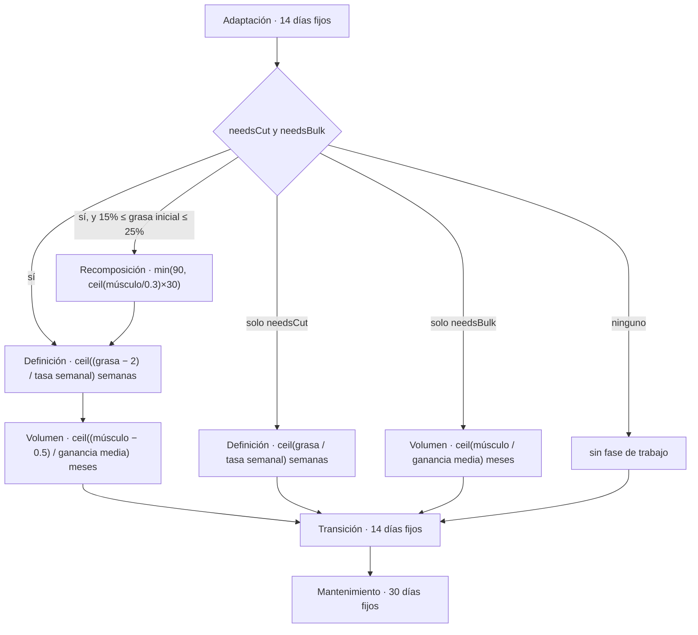

# Metodología científica

Este documento describe el modelo fisiológico que implementa TransformLab, función por función, y separa lo que está implementado con fidelidad de lo que no lo está.

> **Estado:** vigente — describe el comportamiento real del motor en el árbol de trabajo local.
> **Última revisión:** 1 de agosto de 2026.
> **Versión auditada:** v3.1, commit `264c1db`.

> **Alcance de esta descripción.** El motor que se documenta aquí, función por función, constante por constante y línea por línea, es el del **árbol de trabajo local, `main` @ `264c1db` (v3.1)**. No es el motor publicado. `origin/main` está tres commits por delante, en `d0afa49`, y corresponde a la v4.0; allí `js/calculations.js` tiene 890 líneas frente a las 659 de v3.1 (282 añadidas y 51 eliminadas, 333 líneas tocadas en total), y `js/dynamic-data-generator.js` acumula otras 162 líneas modificadas. Por tanto **ninguna referencia `fichero:línea` de este documento es válida en v4.0**, y ningún estado de fidelidad de las tablas de §4 y §6 puede darse por vigente allí sin volver a comprobarlo. Los dos defectos que sí se han verificado sobre la versión publicada —el clamp de composición corporal y la rama muerta `'recomp'`— están recogidos en [§9](#9-estado-en-la-versión-publicada-v40).

Todo el modelo vive en un único fichero, `js/calculations.js` (659 líneas), que se expone como objeto global `Calculations` (`js/calculations.js:657-659`). Su consumidor principal es `js/dynamic-data-generator.js`, que traduce el plan en una serie diaria. Documentos relacionados: [arquitectura](ARQUITECTURA.md), [modelo de datos](MODELO-DE-DATOS.md), [catálogo de hallazgos](CATALOGO-DE-HALLAZGOS.md).

---

## 1. Alcance y advertencia

Lo que el modelo **es**: una proyección determinista por fases. A partir de cinco datos de perfil (edad, sexo, altura, nivel de actividad, estado de entrenamiento) y de una composición corporal inicial y objetivo, calcula un gasto energético, decide una secuencia de fases con duraciones en días y **interpola linealmente** la composición corporal entre los extremos de cada fase. Todas las tasas de cambio provienen de medias poblacionales publicadas; ninguna se ajusta con datos reales del usuario, porque la aplicación no registra ninguna medición posterior al alta.

Lo que el modelo **no es**:

- No es un plan nutricional. No hay reparto de macronutrientes más allá de una constante de proteína de 2.2 g/kg (`js/dynamic-data-generator.js:327`), ni recomendación de alimentos, ni ajuste por patología, medicación o alergia.
- No es un plan de entrenamiento. Ninguna función del motor modela volumen, intensidad ni frecuencia de entrenamiento.
- No es un seguimiento. Las cifras diarias que muestra el panel no son medidas: son el resultado de evaluar fórmulas sobre el número de día. Véase §7.
- No es una predicción individual. Las tasas son medias de grupo aplicadas a una persona concreta.

Además, el modelo de composición corporal contiene un defecto de calibración que, en la ruta por defecto de la aplicación (usuario sin báscula de bioimpedancia), produce pesos objetivo entre 17 y 35 kg por debajo del valor coherente con el propio modelo, llegando a IMC de 15-16. El detalle está en §5. Mientras ese defecto no se corrija, ninguna cifra de peso objetivo, duración de plan o trayectoria diaria debería usarse para tomar una decisión de salud.

---

## 2. Referencias declaradas

Las referencias se declaran en tres sitios: la cabecera de `js/calculations.js:10-16`, el pie de `index.html:150` y el bloque `methodology` de los metadatos (`js/dynamic-data-generator.js:552-558`), que se reexporta en el Markdown del panel (`js/dashboard.js:201-203`).

| Referencia | Qué aporta al modelo | Implementación | Fidelidad |
|---|---|---|---|
| Mifflin-St Jeor (1990) | Ecuación de metabolismo basal | `js/calculations.js:79-82` | **Fiel.** La expresión coincide término a término con la ecuación publicada. Verificado: `calculateBMR(80, 180, 30, 'male')` = 1780 kcal. |
| Aragon (2017) | Tasas seguras de pérdida de grasa como % del peso corporal semanal | `js/calculations.js:41-45`, aplicadas en `js/calculations.js:252-261` | **Fiel en el valor, simplificada en la aplicación.** Los tres valores (0.5 / 0.75 / 1 % PC/semana) son correctos, pero la tasa se evalúa una sola vez sobre el peso inicial y se usa constante durante toda la fase (`js/calculations.js:336` y `:371`), cuando por definición decrece al adelgazar. |
| McDonald (2008) | Expectativa de ganancia muscular por antigüedad de entrenamiento | `js/calculations.js:34-38` | **Parcial.** El orden de magnitud (1.15 / 0.675 / 0.325 kg/mes de media) es coherente con el modelo citado, pero se expresa en kilogramos absolutos, no relativos al tamaño corporal. |
| Helms (2014) | Tasas del practicante avanzado | `js/calculations.js:34-38` (mismo objeto que la anterior; el comentario de `:33` cita ambas fuentes) | **Parcial.** El modelo de Helms expresa la ganancia como porcentaje del peso corporal por mes; aquí es absoluta, de modo que un usuario de 50 kg y otro de 110 kg reciben la misma expectativa en kg. |
| Trexler (2014) | Disponibilidad energética y efectos hormonales | **Ninguna.** | **No se usa.** `Trexler` aparece exactamente una vez en todo el árbol, en el comentario de cabecera `js/calculations.js:15`. No existe ninguna constante, rama ni cálculo que modele disponibilidad energética, adaptación metabólica ni efecto hormonal. La cita es decorativa. |

Un dato adicional sin referencia declarada: el multiplicador `0.5` que reduce a la mitad la ganancia muscular esperada en mujeres (`js/calculations.js:272`) no está atribuido a ninguna fuente en el código.

---

## 3. Constantes del modelo

### `ACTIVITY_MULTIPLIERS` — `js/calculations.js:25-31`

| Clave | Valor | Unidad | Descripción en el código |
|---|---|---|---|
| `sedentary` | 1.2 | factor sobre BMR | Poco o ningún ejercicio |
| `light` | 1.375 | factor sobre BMR | Ejercicio ligero, 1-3 días/semana |
| `moderate` | 1.55 | factor sobre BMR | Ejercicio moderado, 3-5 días/semana |
| `active` | 1.725 | factor sobre BMR | Ejercicio intenso, 6-7 días/semana |
| `veryActive` | 1.9 | factor sobre BMR | Ejercicio muy intenso o trabajo físico |

Procedencia: escala clásica de niveles de actividad asociada al cálculo de TDEE. Los valores son los estándar. Con una clave desconocida se aplica `1.55` (`js/calculations.js:92`).

### `MUSCLE_GAIN_RATES` — `js/calculations.js:34-38`

| Estado | min | max | avg | Unidad |
|---|---|---|---|---|
| `beginner` (año 1) | 0.9 | 1.4 | 1.15 | kg/mes |
| `intermediate` (años 2-3) | 0.45 | 0.9 | 0.675 | kg/mes |
| `advanced` (año 4+) | 0.2 | 0.45 | 0.325 | kg/mes |

Procedencia declarada: McDonald 2008 y Helms 2014 (`js/calculations.js:33`). Se multiplican por 0.5 si el sexo es `female` (`js/calculations.js:272`). No dependen del peso corporal.

### `FAT_LOSS_RATES` — `js/calculations.js:41-45`

| Clave | Valor | Unidad |
|---|---|---|
| `conservative` | 0.005 | fracción del peso corporal / semana (0.5 %) |
| `moderate` | 0.0075 | fracción del peso corporal / semana (0.75 %) |
| `aggressive` | 0.01 | fracción del peso corporal / semana (1 %) |

Procedencia declarada: Aragon 2017 (`js/calculations.js:40`). En el código actual solo se usa `moderate`: los dos únicos invocantes (`js/calculations.js:336` y `:371`) pasan el literal, y no existe ningún selector de intensidad en la interfaz. A diferencia de las otras dos búsquedas por clave del módulo, esta no tiene valor por defecto (`js/calculations.js:253`), de modo que una clave desconocida devolvería `NaN` en los tres campos.

### `ESSENTIAL_FAT` — `js/calculations.js:48-51`

| Sexo | Valor | Unidad |
|---|---|---|
| `male` | 3 | % de grasa corporal |
| `female` | 12 | % de grasa corporal |

Procedencia: valores convencionales de grasa esencial. **No se usa en ninguna parte del proyecto**: `ESSENTIAL_FAT` solo aparece en su declaración.

### `MIN_SAFE_FAT` — `js/calculations.js:54-57`

| Sexo | Valor | Unidad |
|---|---|---|
| `male` | 8 | % de grasa corporal |
| `female` | 16 | % de grasa corporal |

Procedencia: mínimos convencionales sostenibles. Se usan como suelo de error en `validateInputs` (`js/calculations.js:454`, `:457`, `:461`) y como `min` de los campos del asistente (`js/onboarding.js:318`, `:796`).

### `MAX_FAT` — `js/calculations.js:60-63`

| Sexo | Valor | Unidad |
|---|---|---|
| `male` | 40 | % de grasa corporal |
| `female` | 45 | % de grasa corporal |

Procedencia: techo convencional. Se aplica como error sobre el `%grasa` **inicial** —que es una medición, no un objetivo— y como aviso sobre el objetivo (`js/calculations.js:457`, `:465`).

> **Nota de defecto.** Los rangos del asistente y los del motor no coinciden: el paso 2 admite un `%grasa` inicial de 5 a 50 (`js/onboarding.js:784`) y el motor exige 8-40 (varón) o 16-45 (mujer). Un varón con un 7 % medido supera el paso 2 y luego recibe un error bloqueante sobre un dato que no puede cambiar porque es su medición real. Además, un valor de `sex` que no sea exactamente `'male'` o `'female'` convierte `minFat` y `maxFat` en `undefined` y **desactiva toda la validación de grasa**: comprobado, un objetivo del 2 % de grasa corporal devuelve `isValid: true` y cero errores. Ese camino no es alcanzable desde la interfaz (el asistente solo ofrece dos valores), pero sí desde un `localStorage` manipulado o corrupto. Véase el [catálogo de hallazgos](CATALOGO-DE-HALLAZGOS.md).

---

## 4. Cálculos, uno por uno

### 4.1 Metabolismo basal — `calculateBMR` (`js/calculations.js:79-82`)

```
BMR = 10·peso(kg) + 6.25·altura(cm) − 5·edad(años) + s
s = +5   si sexo = 'male'
s = −161 en cualquier otro caso
```

Rango de validez: la ecuación de Mifflin-St Jeor está validada para adultos con normopeso y sobrepeso; pierde precisión en obesidad severa y en composiciones extremas. El código no restringe ese rango.

Estado: **correcto**. Verificado contra la ecuación publicada. Dos matices menores: la rama `else` captura cualquier sexo que no sea `'male'`, y el valor se devuelve sin redondear, de modo que la vista previa del asistente muestra decimales espurios (`js/onboarding.js:655` interpola el valor crudo; `calculateBMR(60, 165, 40, 'female')` = 1270.25). El generador sí redondea antes de persistir (`js/dynamic-data-generator.js:520-521`).

### 4.2 Gasto total — `calculateTDEE` (`js/calculations.js:91-94`)

```
TDEE = round(BMR × ACTIVITY_MULTIPLIERS[nivel])
```

Con nivel desconocido se usa 1.55. Estado: **correcto** para lo que pretende ser. Es un modelo de factor único: no separa NEAT, termogénesis inducida por la dieta ni gasto del entrenamiento.

### 4.3 Objetivo calórico — `calculateCaloricTarget` (`js/calculations.js:104-127`)

```
cut       déficit  = min(round(TDEE × pct/100), 1000);  objetivo = TDEE − déficit
bulk      superávit = round(TDEE × min(pct,15)/100);    objetivo = TDEE + superávit
recomp    déficit  = round(TDEE × 0.05);                objetivo = TDEE − déficit
default   déficit  = 0;                                 objetivo = TDEE
```

El único invocante es `js/dynamic-data-generator.js:181`, que pasa `phase.type` y nunca pasa `pct`, por lo que `deficitPercent` vale siempre 20. Correspondencia real entre tipo de fase y rama:

| `phase.type` | Rama que toma | Resultado (TDEE = 2759) |
|---|---|---|
| `adaptation` | `default` | 2759 kcal, déficit 0 |
| `recomposition` | `default` | 2759 kcal, déficit 0 |
| `cut` | `cut` | 2207 kcal, déficit 552 |
| `bulk` | `bulk` | 3173 kcal, superávit 414 |
| `transition` | `default` | 2759 kcal, déficit 0 |
| `maintenance` | `default` | 2759 kcal, déficit 0 |

> **Nota de defecto (rama muerta).** El `case 'recomp'` de `js/calculations.js:117` **nunca se ejecuta**: el tipo de fase que genera el planificador es `'recomposition'` (`js/calculations.js:324`). Comprobado ejecutando el módulo: `calculateCaloricTarget(2759, 'recomp')` devuelve déficit 138, y `calculateCaloricTarget(2759, 'recomposition')` devuelve déficit 0. La fase de recomposición recibe calorías de mantenimiento mientras ella misma declara una pérdida esperada de 4.5 kg de grasa en 90 días.

> **Nota de defecto (sin suelo calórico).** El tope `Math.min(deficit, 1000)` de `js/calculations.js:110` solo actuaría con un TDEE superior a 5000 kcal: es inalcanzable en la práctica y aparenta una salvaguarda que no existe. No hay ningún suelo absoluto. Mujer de 50 kg, 155 cm, 60 años, sedentaria (datos todos admitidos por el asistente): BMR = 1007.75, TDEE = 1209 y el objetivo calculado es **967 kcal/día**, por debajo de su propio metabolismo basal y del suelo de 1200 kcal habitual en pautas clínicas, sin ningún aviso.

Un dato importante para interpretar el resto del documento: **el objetivo calórico no interviene en la trayectoria corporal**. Se calcula por fase, se guarda en `phase.dailyCalories` (`js/dynamic-data-generator.js:209`) y se copia a cada día en `nutrition.targetCalories` (`:326`), pero ninguna función lo lee después —una búsqueda de `nutrition.` en `js/` no devuelve ninguna lectura— y no existe en todo el proyecto ninguna constante de equivalencia energética (tipo 7700 kcal/kg) que conecte calorías con kilos. La tarjeta de metabolismo del panel muestra BMR y TDEE inicial y objetivo (`js/dashboard.js:470-484`), no el objetivo calórico de la fase.

### 4.4 Descomposición corporal — `calculateComposition` (`js/calculations.js:141-161`) y `estimateMuscleFromComposition` (`js/calculations.js:222-225`)

```
grasa(kg)        = peso × %grasa/100
masa magra(kg)   = peso − grasa
músculo(kg)      = medido, si se aporta;  en otro caso  masa magra × 0.48
otro tejido(kg)  = masa magra − músculo
```

`calculateComposition` es **código muerto**: no se invoca desde ningún fichero. La que sí está en uso es `estimateMuscleFromComposition`, que aplica el mismo factor 0.48 y redondea a un decimal; el asistente la usa para autorrellenar el músculo en tres puntos (`js/onboarding.js:521`, `:681`, `:790`, más el prellenado de `:270` y la vista previa de `:623`).

Estado: **el 0.48 es una simplificación defendible en sí misma** —la masa muscular esquelética ronda el 45-50 % de la masa libre de grasa en adultos— **pero convive con una segunda definición incompatible de "músculo"**, y ahí es donde el modelo se rompe. Véase §5.

### 4.5 Peso objetivo — `calculateTargetWeight` (`js/calculations.js:174-213`)

Guardas de entrada (`js/calculations.js:176`): devuelve `null` si el músculo objetivo es menor de 20 kg o el `%grasa` objetivo menor de 5.

```
Rama A (hay composición actual con músculo):
    otro = clamp( magra_actual − músculo_actual , 2 , 10 )      ← js/calculations.js:191
    magra_obj = músculo_obj + otro

Rama B (fallback, sin composición actual):
    magra_obj = músculo_obj / 0.48                              ← js/calculations.js:200

peso_obj = magra_obj / (1 − %grasa_obj/100)
```

Guarda de salida (`js/calculations.js:207-210`): si el resultado cae fuera de [40, 150] kg devuelve `null`.

Estado: **incorrecto en la ruta por defecto de la aplicación**. La rama A asume que el músculo procede de una bioimpedancia; la rama B asume el modelo del 48 %. Todos los invocantes reales pasan la composición actual, de modo que siempre se toma la rama A, incluso cuando el músculo lo ha estimado la propia aplicación con el 48 %. Detalle completo y demostración aritmética en §5.

> **Nota de defecto colateral.** Como `calculateTargetWeight` ya garantiza por construcción devolver `null` o un valor en [40, 150], la comprobación `targetWeight < 40 || targetWeight > 150` de `js/calculations.js:501` solo puede activarse cuando el valor es `null` (`null < 40` es cierto), y el aviso resultante se interpola literalmente como `"El peso objetivo calculado (nullkg) parece inusual"`. Al ser aviso y no error, el asistente deja continuar con `target.weight` nulo.

### 4.6 Tasas — `calculateWeeklyFatLoss` y `calculateMonthlyMuscleGain` (`js/calculations.js:252-279`)

```
pérdida semanal(kg) = peso × FAT_LOSS_RATES[intensidad]
pérdida diaria(kg)  = pérdida semanal / 7

ganancia mensual(kg) = MUSCLE_GAIN_RATES[estado] × (sexo === 'female' ? 0.5 : 1)
```

Estado: **valores correctos, aplicación asimétrica**. La pérdida de grasa es relativa al peso y la ganancia muscular es absoluta, de modo que el tamaño del usuario afecta a la velocidad de una y no a la de la otra. Verificado: `calculateMonthlyMuscleGain('intermediate','male')` devuelve `{min: 0.45, max: 0.9, avg: 0.68}` tanto para 50 kg como para 110 kg, mientras la pérdida semanal pasa de 0.38 a 0.83 kg. La función de ganancia muscular ni siquiera recibe el peso como parámetro.

### 4.7 Planificación de fases — `calculatePhaseDurations` (`js/calculations.js:293-434`)

Entradas: `initial {weight, fatPct, muscleKg}`, `target {weight, fatPct, muscleKg}`, `profile {trainingStatus, sex}`.

```
grasa a perder  = peso_ini × %grasa_ini/100 − peso_obj × %grasa_obj/100     ← js/calculations.js:297
músculo a ganar = músculo_obj − músculo_ini

needsCut  = %grasa_ini > %grasa_obj + 2         ← js/calculations.js:315
needsBulk = músculo_obj > músculo_ini + 1       ← js/calculations.js:316
```



| Fase | `type` | Duración | `expectedFatLoss` (kg) | `expectedMuscleGain` (kg) |
|---|---|---|---|---|
| Adaptación | `adaptation` | 14 días fijos | 0.3 | +0.2 |
| Recomposición | `recomposition` | `min(90, ceil(músculo/0.3)×30)` | días/30 × 1.5 | días/30 × 0.3 |
| Definición (combinada) | `cut` | `ceil(max(0, grasa−2) / tasa) × 7` | grasa − 2 | −0.5 |
| Definición (pura) | `cut` | `ceil(grasa / tasa) × 7` | grasa completa | −(días/30 × 0.2) |
| Volumen (combinado) | `bulk` | `ceil(max(0, músculo−0.5) / avg) × 30` | −(días/30 × 0.4) | músculo − 0.5 |
| Volumen (puro) | `bulk` | `ceil(músculo / avg) × 30` | −(días/30 × 0.3) | músculo completo |
| Transición | `transition` | 14 días fijos | 0 | +0.1 |
| Mantenimiento | `maintenance` | 30 días fijos | 0 | +0.1 |

Rango de validez: el planificador solo cubre las direcciones "perder grasa" y "ganar músculo". Estado: **incorrecto en varios puntos**, todos verificados ejecutando el código:

- **La duración de la recomposición es siempre 90 días.** `min(90, ceil(músculo/0.3)×30)` solo bajaría de 90 si el músculo a ganar fuese ≤ 0.9 kg, pero la rama exige `needsBulk`, es decir más de 1 kg. Comprobado para 1.01, 2, 5 y 10 kg: 90 días en los cuatro casos. La expresión aparenta adaptarse al objetivo y no lo hace.
- **Las restas de 2 kg de grasa y 0.5 kg de músculo** (`js/calculations.js:334` y `:353`) no se corresponden con lo que las fases previas declaran haber conseguido, y ninguna fase compensa la grasa que el volumen declara ganar. La suma de expectativas de todas las fases no cuadra con el objetivo declarado, unas veces por exceso y otras por defecto. El efecto visible no es incumplir la meta —el generador fuerza el último día al objetivo exacto (`js/dynamic-data-generator.js:154-159`)— sino una trayectoria intermedia incoherente, con la definición hundiendo el `%grasa` hasta el tope inferior de 5 % para luego rebotar.
- **No existe rama para perder músculo ni para diferencias pequeñas de grasa.** Un usuario que quiera pasar de 20 % a 18.5 % de grasa, o que quiera perder masa muscular, obtiene un plan de 58 días compuesto solo por Adaptación + Transición + Mantenimiento, con cambio declarado cero en todas ellas, mientras el resumen sigue reportando la grasa a perder. El caso "ya estoy en el objetivo" produce el mismo plan de 58 días sin decir nada.
- **`target.weight` nulo no se detecta.** En JavaScript `null × 15 / 100` es 0, no `NaN`, de modo que `js/calculations.js:297` concluye en silencio que la grasa objetivo es 0 kg y dimensiona una fase de definición para llegar al 0 % de grasa corporal.

### 4.8 Métricas de rendimiento — `calculatePerformanceMetrics` (`js/calculations.js:547-571`)

```
%ganancia muscular = (músculo − músculo_ini) / músculo_ini × 100
bono adaptación    = min(20, día × 0.1)
modificador        = 0.95 en cut · 1.1 en bulk · 1 en el resto

fuerza    = min(100, round((30 + bono + %ganancia × 2) × modificador))
%pérdida grasa = (%grasa_ini − %grasa) / %grasa_ini × 100
agilidad  = min(10, round((4 + %pérdida grasa × 0.08) × 10) / 10)
movilidad = min(10, round((4 + día × 0.01) × 10) / 10)
```

Estado: **incorrecto por escala**. Ninguna de las tres tiene cota inferior. Verificado por llamada directa: un usuario que pasa del 10 % al 25 % de grasa obtiene `agility: -8` sobre una escala declarada de 0 a 10, y el valor negativo llega al panel, donde se pinta como anchura de barra `(agility × 10)%` y como texto `"-8/10"` (`js/dashboard.js:411-414`). En planes generados realmente el desbordamiento observado es menor (hasta ≈ −0.6 durante fases de volumen), pero existe. Obsérvese además que `movilidad` depende únicamente del número de día: es una recta, idéntica para cualquier usuario.

### 4.9 Métricas de bienestar — `calculateWellbeingMetrics` (`js/calculations.js:582-638`)

Seis series —energía, claridad mental, autoestima, calidad del sueño, estética y sensación general— derivadas de una base por tipo de fase más un bono de progreso:

```
bono progreso = %progreso × 0.03
variación     = sin(día × 0.5) × 0.3          ← js/calculations.js:628
```

| Fase | energía | claridad | autoestima | sueño | estética | ánimo |
|---|---|---|---|---|---|---|
| `cut` | 6 + fatiga + bono | 5 + bono | 5 + 1.5·bono | 6 + bono | 4 + 0.06·progreso | 5.5 + bono |
| `bulk` | 7 + bono | 6 + bono | 5 + bono | 7 + bono | 5 + 0.03·progreso | 7 + bono |
| `recomposition` | 6 + bono | 6 + bono | 5 + 1.2·bono | 6.5 + bono | 4.5 + 0.05·progreso | 6 + bono |
| resto | 6.5 + bono | 6 + bono | 5 + bono | 7 + bono | 5 + 0.04·progreso | 6.5 + bono |

La tabla recoge el valor base; todas las expresiones se topan además con `Math.min(10, ...)`, y en la fase `cut` cuatro de las seis métricas tienen también un suelo explícito (`Math.max(3, ...)` para la energía, `Math.max(4, ...)` para claridad y ánimo, `Math.max(5, ...)` para el sueño). En `cut`, `fatiga` vale −1.5 en las semanas 2 a 4 de la fase y −0.5 en el resto (`js/calculations.js:591`).

Estado: **simplificado, y con un desbordamiento menor**. Los topes `Math.min(10, ...)` se aplican dentro del `switch`, pero la variación diaria se suma **después**, en el objeto de retorno (`js/calculations.js:630-637`), de modo que una métrica saturada puede llegar a 10.3 sobre una escala de 10. Verificado: barriendo 400 días en fase de volumen con progreso 100, la energía máxima devuelta es 10.3. Es un defecto cosmético; el problema de fondo de estas seis series es otro y está en §7: no son datos del usuario.

### 4.10 Fluctuación diaria — `addDailyFluctuation` (`js/calculations.js:647-653`)

```
fluctuación = sin(día × 0.7) × 0.4 + sin(día × 1.3) × 0.3 + (random() − 0.5) × 0.4
peso mostrado = peso interpolado + fluctuación
```

Amplitud máxima ±0.9 kg, con la intención declarada de simular retención de líquidos. Estado: **simplificado y no determinista**. Tres llamadas consecutivas con los mismos argumentos devuelven tres valores distintos. La serie se genera una sola vez y se persiste, de modo que el peso "de hoy" no cambia al recargar; pero cualquier regeneración (reinicio de perfil) reescribe todo el histórico con otros valores, y dos usuarios con datos idénticos obtienen gráficas distintas.

Hay además un efecto de segundo orden: el ruido se aplica solo al peso, mientras `%grasa` y `muscleKg` se interpolan limpios (`js/dynamic-data-generator.js:254-267`). Como después `fatKg = peso_mostrado × %grasa/100` y `leanMassKg = peso_mostrado − fatKg` (`:269-270`), la masa magra hereda el ruido pero el músculo no, y el "otro tejido magro" diario oscila ±0.5 kg — justo la magnitud que el arreglo de la v3.1 se propuso mantener constante y que los metadatos anuncian como parte de la metodología (`js/dynamic-data-generator.js:557`).

---

## 5. El modelo de composición corporal

Este es el defecto central del producto y merece explicación completa.

### Dos definiciones incompatibles de "músculo"

El motor maneja el mismo campo, `muscleKg`, con dos significados distintos según de dónde venga el dato:

| Origen | Definición implícita | Magnitud típica (varón 80 kg, 20 % grasa) | "Otro tejido magro" que implica |
|---|---|---|---|
| Estimación propia (`estimateMuscleFromComposition`, `js/calculations.js:222-225`) | 48 % de la masa magra ≈ músculo esquelético | 30.7 kg | 33.3 kg (todo lo demás: agua, órganos, hueso, piel, tejido conjuntivo) |
| Lectura de bioimpedancia doméstica | masa magra menos el mineral óseo | ≈ 60.5 kg | ≈ 3.5 kg (solo el hueso) |

Ambas definiciones son legítimas por separado. El problema es que `calculateTargetWeight` está calibrada **solo para la segunda**: el clamp de `js/calculations.js:191` restringe el "otro tejido magro" al rango [2, 10] kg, que es exactamente el rango que tiene sentido si `muscleKg` es una lectura de báscula. El comentario que lo acompaña (`js/calculations.js:189-190`) lo dice explícitamente: "los huesos solos son 3-5 kg, los órganos añaden otros 3-5 kg".

Y sin embargo, la aplicación autorrellena `muscleKg` con la primera definición siempre que el usuario no aporte una medición (`js/onboarding.js:521`, `:681`, `:790`). Es decir: **la ruta por defecto entra siempre por el camino calibrado para la otra definición**, y el clamp aplasta un valor real de 22-35 kg hasta 10 kg. Todo lo que se descuenta ahí desaparece del peso objetivo.

El mismo clamp está duplicado en el generador (`js/dynamic-data-generator.js:24`), donde gobierna además el cálculo de los pesos de fin de fase de recomposición y volumen (`:124` y `:139`), de modo que el error se propaga a toda la trayectoria, no solo al número final.

### La prueba: test de identidad

Un modelo de composición corporal debe cumplir una propiedad trivial: si pides como objetivo exactamente tu composición actual, debe devolverte tu peso actual. Ejecutando el módulo real en Node (véase el apéndice), con el músculo autorrellenado por la propia aplicación:

| Perfil de entrada | Masa magra | Músculo estimado (48 %) | Otro tejido magro real | Tras el clamp | Peso devuelto | Desvío |
|---|---|---|---|---|---|---|
| Hombre 80 kg / 20 % | 64.00 kg | 30.7 kg | 33.30 kg | 10 kg | **50.9 kg** | −29.1 kg |
| Mujer 60 kg / 28 % | 43.20 kg | 20.7 kg | 22.50 kg | 10 kg | **42.6 kg** | −17.4 kg |
| Hombre 95 kg / 30 % | 66.50 kg | 31.9 kg | 34.60 kg | 10 kg | **59.9 kg** | −35.1 kg |
| Hombre 70 kg / 12 % | 61.60 kg | 29.6 kg | 32.00 kg | 10 kg | **45.0 kg** | −25.0 kg |

Para el primer caso, con 180 cm de altura, 50.9 kg corresponden a un IMC de 15.7.

### La aritmética, paso a paso

Primer caso: hombre de 80 kg con un 20 % de grasa que deja vacío el campo de masa muscular y pide como objetivo su propia composición actual.

1. Masa magra actual: `80 × (1 − 0.20)` = **64.00 kg**.
2. El asistente rellena el músculo con `estimateMuscleFromComposition(80, 20)` = `round(64.00 × 0.48, 1)` = **30.7 kg** (`js/calculations.js:224`).
3. Con esa definición, el tejido magro no muscular vale `64.00 − 30.7` = **33.30 kg**. Es un valor correcto: incluye agua extracelular, órganos, hueso, piel y tejido conjuntivo.
4. Se llama a `calculateTargetWeight(30.7, 20, {weight: 80, fatPct: 20, muscleKg: 30.7})`. Dentro:
   - `calculatedOtherLean` = `64.00 − 30.7` = 33.30
   - `otherLeanTissue` = `max(2, min(10, 33.30))` = **10** (`js/calculations.js:191`). El módulo emite por consola `"Other lean tissue adjusted from 33.30 to 10 kg"`.
   - `targetLeanMass` = `30.7 + 10` = **40.7 kg**
   - `targetWeight` = `40.7 / (1 − 0.20)` = `40.7 / 0.8` = 50.875 → **50.9 kg**
5. El resultado es 50.9 kg cuando la respuesta obligada era 80 kg. Se han descontado 23.3 kg de tejido que existe.

Dos comprobaciones cruzadas que aíslan la causa:

- Si se fuerza la rama de proporción (`js/calculations.js:200`), coherente con la definición del 48 %: `30.7 / 0.48 = 63.96`, dividido por 0.8 da **79.9 kg** ≈ el peso de partida. La rama B es consistente; la rama A, para este dato, no.
- Si el músculo procede de una bioimpedancia real (60.5 kg para este mismo perfil): `calculatedOtherLean = 64.00 − 60.5 = 3.5`, dentro del clamp, `targetLeanMass = 64.0` y el resultado es **80.0 kg exactos**. El camino con medición funciona.

### Consecuencias en cadena

- El peso objetivo mostrado al usuario, y contra el que se dimensionan todas las fases, es entre 17 y 35 kg más bajo de lo que el propio modelo implica.
- La validación no lo detecta: para el caso de 50.6 kg del perfil masculino con objetivo 15 % / 33 kg, `validateInputs` devuelve `isValid: true`, cero errores y cero avisos.
- La comprobación `target.muscleKg > targetWeight × 0.55` de `js/calculations.js:493` se evalúa contra ese peso artificialmente bajo, por lo que casi cualquier objetivo lo supera. Combinado con el mínimo de 30 kg de músculo objetivo que exige el asistente (`js/onboarding.js:802`) —una constante pensada para varones, cuando el músculo estimado de una mujer ronda los 20 kg—, el resultado es un error bloqueante que impide terminar el asistente. Para el perfil femenino de referencia (60 kg, 28 %), el `%grasa` objetivo mínimo que la validación acepta es 27 %, un punto por debajo del actual, insuficiente incluso para activar la fase de definición (`needsCut` exige más de 2 puntos, `js/calculations.js:315`).

### De dónde viene el clamp: el arreglo que introdujo el defecto

El origen del defecto está documentado en el propio repositorio y conviene contarlo, porque explica por qué un error de esta magnitud pudo pasar la revisión de quien lo escribió.

El primer commit del historial, `d424451`, se titula **"Initial commit: TransformLab v3.1 — Fixed target calculations, improved responsive design and milestone chart visualization"**. El arreglo que da nombre a la versión es precisamente el clamp: `git show d424451:js/calculations.js` lo sitúa ya en la línea 191, con el mismo texto que hoy. No es un resto heredado ni un parche posterior; es la corrección deliberada que define la v3.1.

Los comentarios lo declaran sin ambigüedad. En el motor, sobre la propia `calculateTargetWeight`:

- `js/calculations.js:166-167` — *"FIXED: Now correctly handles measured muscle mass by preserving the 'other lean tissue' (bones, organs, water) from current composition."*

Y en el generador, tres veces, cada una sobre un cálculo distinto:

- `js/dynamic-data-generator.js:89` — *"FIXED: Uses otherLeanTissue instead of incorrect 0.48 ratio"*, en la cabecera de `generatePhases`.
- `js/dynamic-data-generator.js:123` — *"FIXED: Use otherLeanTissue instead of dividing by 0.48"*, sobre el peso de fin de fase de recomposición (`:124`).
- `js/dynamic-data-generator.js:138` — *"FIXED: Calculate weight using otherLeanTissue"*, sobre el peso de fin de fase de volumen (`:139`).

La secuencia es, por tanto, reconstruible: en la versión anterior el peso objetivo se derivaba dividiendo el músculo por 0.48. Alguien identificó ese ratio como incorrecto —y lo es, para un usuario con bioimpedancia: dividir por 0.48 una lectura de báscula de 60.5 kg da 126 kg de masa magra, un disparate— y lo sustituyó por el tejido magro conservado de la composición actual, con un clamp [2, 10] kg que acota el resultado al rango plausible de hueso más órganos. La sustitución se aplicó de forma consistente en los cuatro puntos donde aparecía el ratio.

**Lo que no se advirtió es que el 0.48 no había desaparecido del sistema.** Seguía —y sigue— alimentando la entrada: el asistente autorrellena `muscleKg` llamando a `estimateMuscleFromComposition`, que es exactamente ese mismo ratio, en `js/onboarding.js:521`, `:681` y `:790` (más el prellenado de `:270` y la vista previa de `:623`). Se eliminó el 0.48 del consumidor y se dejó intacto en el productor.

El resultado es que **el arreglo y el punto que lo invalida conviven en el mismo commit**. `d424451` contiene a la vez el clamp calibrado para lecturas de bioimpedancia y las tres llamadas del asistente que garantizan que, por defecto, no llegue ninguna.

La lección técnica es precisa y merece enunciarse separada del caso:

1. **El arreglo era correcto para su entrada prevista.** No hay ningún error dentro de `calculateTargetWeight`. Dada una lectura real de bioimpedancia, la función devuelve el peso exacto: para el perfil de 80 kg / 20 % con 60.5 kg medidos, `80.0 kg` (comprobación cruzada de la sección anterior). Revisar la función aislada —leerla, razonarla, incluso probarla con el dato para el que se escribió— no habría revelado nada.
2. **El defecto no está en ninguna función, sino en el contrato entre dos módulos.** `js/onboarding.js` produce un `muscleKg` que significa "músculo esquelético"; `js/calculations.js` consume un `muscleKg` que significa "masa magra menos hueso". Ambos módulos son internamente coherentes. La incompatibilidad sólo existe en la frontera, y la frontera no está documentada: `muscleKg` es un `number` sin unidad declarada, sin origen declarado y sin validación de rango que distinga un caso del otro.
3. **Por eso el clamp falla en silencio en lugar de romper.** Al recibir 33.30 kg donde esperaba 3.5, no puede distinguir un dato de otra definición de un dato corrupto, y hace lo que se le pidió: acotarlo. El aviso de `js/calculations.js:193-195` se emite —`"Other lean tissue adjusted from 33.30 to 10 kg"`— pero va a `console.warn`, donde ningún usuario lo lee, y el cálculo continúa.

De ahí que la primera recomendación de §8 no sea "quitar el clamp" sino marcar el origen del dato: el problema no es el rango, es que el motor no sabe qué le están pasando.

---

## 6. Fidelidad del modelo

| Componente | Estado | Comentario |
|---|---|---|
| BMR (Mifflin-St Jeor) | **Correcto** | Coincide término a término con la ecuación publicada. Solo falta redondear el retorno para ser coherente con `calculateTDEE`. |
| TDEE (multiplicadores de actividad) | **Correcto** | Valores estándar, con valor por defecto ante clave desconocida. Modelo de factor único, sin desglose. |
| Tasas de pérdida de grasa | **Correcto** en valor, **simplificado** en aplicación | 0.5 / 0.75 / 1 % PC/semana es fiel a Aragon 2017; se evalúan una sola vez sobre el peso inicial y se usan constantes durante toda la fase. |
| Tasas de ganancia muscular | **Simplificado** | Magnitudes plausibles, pero absolutas en kg/mes en lugar de relativas al peso, con lo que un usuario de 50 kg y otro de 110 reciben la misma expectativa. El factor 0.5 para mujeres no está atribuido. |
| Modelo de composición corporal | **Incorrecto** | Dos definiciones incompatibles de "músculo" y un clamp calibrado solo para una de ellas. Es el defecto central. Véase §5. |
| Cálculo del peso objetivo | **Incorrecto** | Falla el test de identidad por 17-35 kg en la ruta por defecto; exacto cuando hay bioimpedancia. |
| Objetivo calórico | **Incorrecto** | Rama de recomposición muerta, tope de déficit inalcanzable, ningún suelo sobre BMR, y sin conexión con la trayectoria corporal. |
| Planificación de fases | **Incorrecto** | Restas mágicas que descuadran el reparto, duración de recomposición fija de facto, sin rama para pérdida muscular ni para objetivos pequeños, y sin guarda ante `target.weight` nulo. |
| Trayectoria día a día | **Simplificado** | Interpolación lineal entre extremos de fase; la pérdida de grasa real no es lineal. |
| Fluctuación diaria de peso | **Simplificado** e irreproducible | Dos senos más ruido aleatorio no sembrado; rompe la constancia del tejido magro no muscular que la propia metodología declara. |
| Métricas de rendimiento | **Incorrecto** | Fórmulas sin cota inferior que producen valores negativos sobre escalas 0-10 y 0-100. La movilidad depende solo del número de día. |
| Métricas de bienestar | **Simplificado**, con desbordamiento menor | Valores plausibles por fase; la variación diaria se suma después del tope y permite llegar a 10.3 sobre 10. |
| Validación de entradas | **Incorrecto** | Rangos incoherentes con el asistente, error duro aplicado a mediciones, y desactivación completa de la validación de grasa ante un sexo no reconocido. |
| Balance energético (kcal ↔ kg) | **Ausente** | No existe ninguna equivalencia energética en el código. Calorías y composición se calculan por separado y pueden contradecirse. |

---

## 7. Simplificaciones asumidas

Estas no son defectos: son decisiones de modelado. Conviene tenerlas explícitas porque acotan lo que las cifras pueden significar.

1. **Interpolación lineal dentro de cada fase.** El generador calcula la composición de fin de fase y reparte el cambio en línea recta entre el primer y el último día (`js/dynamic-data-generator.js:248-264`, con el ayudante `interpolate` de `:565-567`). La pérdida de grasa real es más rápida al principio y se aplana después.

2. **Sin adaptación metabólica.** Verificado en el código: el BMR y el TDEE se recalculan **una vez por fase**, usando el peso al inicio de esa fase (`js/dynamic-data-generator.js:179-180`, con `currentWeight` actualizado al cerrar cada fase en `:218`). Dentro de una fase —que puede durar 200 días o más— el gasto energético es constante aunque el usuario pierda 15 kg. Y en ningún punto se modela la adaptación metabólica propiamente dicha: la reducción del gasto por encima de lo que explica la pérdida de masa, que es precisamente el fenómeno que trata la referencia de Trexler citada en la cabecera y nunca implementada.

3. **Tasas poblacionales medias aplicadas a un individuo.** Todas las velocidades del modelo son promedios de grupo. No hay intervalo de confianza, ni banda de escenarios, ni ajuste posterior con datos reales: la aplicación no registra ninguna medición después del alta, de modo que la proyección nunca se corrige.

4. **Las métricas de bienestar y rendimiento son sintéticas.** Conviene decirlo sin rodeos: **energía, claridad mental, autoestima, calidad del sueño, estética, sensación general, fuerza, agilidad y movilidad no son datos del usuario**. Nadie los ha medido ni preguntado. Son el resultado de evaluar las fórmulas de `js/calculations.js:547-638` sobre el número de día, el tipo de fase y el porcentaje de progreso. El panel las presenta con el mismo formato y la misma jerarquía visual que el peso y el porcentaje de grasa (`js/dashboard.js:405-445`, y como series graficables en `js/charts.js`), sin ninguna marca que las distinga. Un lector razonable las interpretará como un registro. No lo son.

5. **Variables ausentes.** El modelo no contempla sueño, estrés, adherencia a la pauta, genética, historial de peso, medicación, ciclo menstrual, ni ninguna forma de entrenamiento concreto. La adherencia es la variable que más peso tiene en el resultado real de una transformación y aquí se asume perfecta e implícita: el plan describe lo que ocurriría si el usuario cumpliese exactamente.

6. **Constantes nutricionales sin fuente.** El objetivo de proteína es fijo, 2.2 g por kg de peso mostrado (`js/dynamic-data-generator.js:327`), y el objetivo de NEAT es 10 000 pasos en definición y 8 000 en el resto (`:210`). Ninguna de las dos aparece en la lista de referencias. Ambas se persisten y ninguna se muestra en la interfaz.

7. **Sexo binario.** Todo el modelo (BMR, mínimos de grasa, tasas de ganancia muscular, umbrales estéticos) se bifurca en dos valores. No hay un tercer camino ni un modo de introducir datos medidos que lo sustituyan.

---

## 8. Qué haría falta para que el modelo fuese defendible

Ordenado por impacto, de mayor a menor.

1. **Unificar la definición de "músculo".** Es la corrección de la que depende todo lo demás. Mínimo: marcar el origen del dato (`initial.muscleSource = 'measured' | 'estimated'`) y elegir la rama de `calculateTargetWeight` en consecuencia, usando la proporción sin clamp cuando el dato es estimado. Preferible: que `estimateMuscleFromComposition` devuelva tejido magro no óseo (≈ masa magra − 3.5 kg), de modo que las dos rutas hablen del mismo tejido y el clamp [2, 10] sea válido en ambas. Añadir el test de identidad —pedir la composición actual como objetivo debe devolver el peso actual— como prueba automática de no regresión.

2. **Sustituir la corrección silenciosa por un aviso.** Un clamp que altera un dato del usuario en 23 kg y sigue adelante es peor que un error. Cuando el tejido magro calculado quede fuera del rango, el usuario debe verlo y decidir, no descubrir un peso objetivo de IMC 15.

3. **Poner un suelo calórico real.** Sustituir el `Math.min(deficit, 1000)` inoperante por `max(objetivo, BMR, 1200 mujeres / 1500 hombres)`, y ajustar proporcionalmente la duración de la fase cuando el suelo recorte el déficit, para que calorías y plazos no se contradigan. Requiere pasar el BMR o el sexo a `calculateCaloricTarget`.

4. **Conectar calorías y composición.** Hoy son dos cálculos independientes que pueden decir cosas opuestas. Derivar el déficit de la pérdida de grasa esperada de la propia fase, o al revés, con una equivalencia energética explícita, elimina de raíz esa clase de incoherencia y de paso resuelve la rama muerta `'recomp'`.

5. **Cerrar el balance del plan de fases.** Sustituir las constantes de 2 kg y 0.5 kg por un acumulador real de lo ya conseguido en las fases anteriores, y añadir una comprobación de cierre que verifique que la suma de expectativas cuadra con el objetivo dentro de una tolerancia. Añadir la rama de pérdida de masa muscular y el caso "ya estás en el objetivo".

6. **Acotar todas las escalas por ambos lados** y aplicar los topes después de sumar la variación diaria, para que ninguna métrica publicada salga de su rango declarado.

7. **Sembrar la fluctuación diaria** con un PRNG determinista dependiente del perfil y del día, y aplicarla de forma que conserve el tejido magro no muscular, que es la premisa que el modelo declara.

8. **Distinguir medición de objetivo en la validación**, normalizar el sexo antes de indexar las constantes, y centralizar los rangos en un único lugar del que beban tanto el asistente como el motor.

9. **Marcar en la interfaz las métricas sintéticas**, de modo que el usuario pueda distinguir una proyección de un registro. Es la corrección más barata de todas y la que más cambia lo que el producto comunica.

10. **Expresar la ganancia muscular como porcentaje del peso corporal**, igual que ya se hace con la pérdida de grasa, y calcular la duración de la definición integrando la tasa sobre el peso decreciente en lugar de sobre el peso inicial.

---

## 9. Estado en la versión publicada (v4.0)

Todo lo anterior describe `main` @ `264c1db` (v3.1), la copia que hay en disco. La versión publicada es `origin/main` @ `d0afa49` (v4.0), tres commits por delante. En ella `js/calculations.js` pasa de 659 a 890 líneas y `js/dynamic-data-generator.js` cambia otras 162, de modo que la reescritura es sustancial y **el motor de v4.0 no está auditado**.

Sí se han comprobado dos cosas, y las dos son las que sostienen la prioridad del plan de remediación.

### El clamp sigue presente

El clamp de composición corporal sobrevive intacto a la migración. En v4.0 está en `js/calculations.js:387` (era `:191` en v3.1), con el mismo texto:

```js
otherLeanTissue = Math.max(2, Math.min(10, calculatedOtherLean));
```

### El test de identidad da exactamente los mismos desvíos

Cargando en Node el fichero de la rama publicada (`git show origin/main:js/calculations.js`) y repitiendo el test de §5 sin cambiar un solo valor de entrada, los cuatro resultados son idénticos dígito a dígito a los de v3.1:

| Perfil de entrada | Músculo estimado (48 %) | Peso devuelto | Desvío |
|---|---|---|---|
| Hombre 80 kg / 20 % | 30.7 kg | **50.9 kg** | −29.1 kg |
| Mujer 60 kg / 28 % | 20.7 kg | **42.6 kg** | −17.4 kg |
| Hombre 95 kg / 30 % | 31.9 kg | **59.9 kg** | −35.1 kg |
| Hombre 70 kg / 12 % | 29.6 kg | **45.0 kg** | −25.0 kg |

El aviso `"Other lean tissue adjusted from … to 10 kg"` se sigue emitiendo por `console.warn` en los cuatro casos.

### La rama `'recomp'` sigue muerta

En v4.0 el `switch` de `calculateCaloricTarget` mantiene el `case 'recomp'` (`js/calculations.js:313` en `origin/main`) mientras el planificador sigue generando fases de tipo `'recomposition'` (`:520`), que caen en otro `case` (`:825`). Ejecutado sobre el fichero publicado:

```
calculateCaloricTarget(2759, 'recomp')         → { target: 2621, deficit: 138 }
calculateCaloricTarget(2759, 'recomposition')  → { target: 2759, deficit: 0 }
```

### Lo que esto significa, y lo que no

Significa que **el defecto central de §5 y la rama muerta de §4.3 están vivos en el producto publicado**, con las mismas cifras, y que la prioridad número uno del plan de §8 no cambia por el hecho de que el árbol local esté desactualizado.

No significa nada más. El resto de hallazgos de este documento —las restas mágicas del planificador, la ausencia de suelo calórico, las métricas sin cota inferior, el desbordamiento de bienestar, la fluctuación no sembrada, los rangos de validación incoherentes— **se han verificado únicamente sobre v3.1 y no se han vuelto a comprobar contra v4.0**. Con 333 líneas tocadas en el motor y 162 en el generador, cualquiera de ellos puede haber sido corregido, haber cambiado de forma o haber empeorado. Antes de afirmar cualquier cosa sobre el motor publicado hay que comprobarla con `git show origin/main:<fichero>` y, si es un comportamiento, reejecutarla en Node con el shim del apéndice.

Para trabajar sobre el código publicado, actualizar primero el árbol local (`git pull`).

---

## Apéndice: reproducir estas comprobaciones

`js/calculations.js` no exporta nada en formato CommonJS ni ESM: se registra en `window` (`js/calculations.js:657-659`). Para ejecutarlo desde Node basta un shim de dos líneas.

```js
// verify.js
global.window = {};
require('/ruta/al/proyecto/js/calculations.js');
const C = global.window.Calculations;

// Test de identidad con músculo estimado por la propia aplicación
const [peso, grasa] = [80, 20];
const musculo = C.estimateMuscleFromComposition(peso, grasa);   // 30.7
const objetivo = C.calculateTargetWeight(musculo, grasa, {
    weight: peso, fatPct: grasa, muscleKg: musculo
});
console.log(musculo, objetivo);   // 30.7  50.9   (debería ser 80)

// Rama muerta del objetivo calórico
console.log(C.calculateCaloricTarget(2759, 'recomp'));         // deficit 138
console.log(C.calculateCaloricTarget(2759, 'recomposition'));  // deficit 0
```

```bash
node verify.js
```

Para repetir las mismas comprobaciones sobre el motor publicado (§9) sin actualizar el árbol de trabajo, basta volcar el fichero de la rama remota y apuntar el shim a la copia:

```bash
git fetch
git show origin/main:js/calculations.js > /tmp/calc-v40.js
# en verify.js: require('/tmp/calc-v40.js')
node verify.js
```

Nota: `test-calculation.js`, en la raíz del repositorio, **no** sirve para esto. No carga el módulo: reimplementa la fórmula a mano, no contiene ningún `assert` y termina siempre con código de salida 0. Detalles en [deuda técnica](DEUDA-TECNICA.md).

---

Ver también: [README](../README.md) · [Arquitectura](ARQUITECTURA.md) · [Modelo de datos](MODELO-DE-DATOS.md) · [Auditoría](AUDITORIA.md) · [Catálogo de hallazgos](CATALOGO-DE-HALLAZGOS.md) · [Deuda técnica](DEUDA-TECNICA.md) · [Guía de desarrollo](GUIA-DE-DESARROLLO.md)
