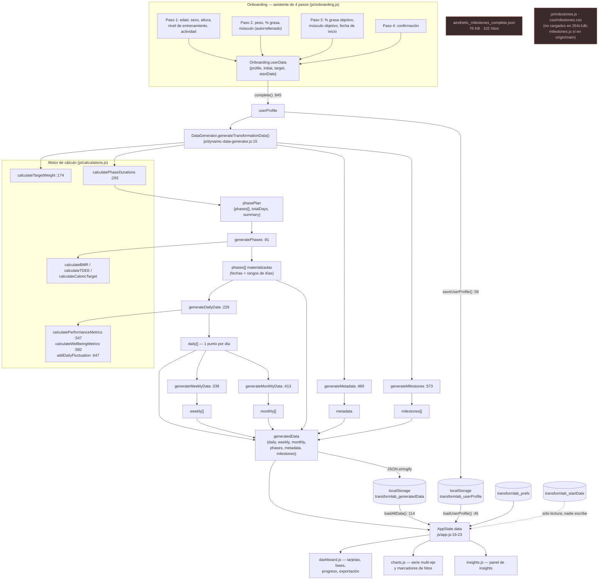
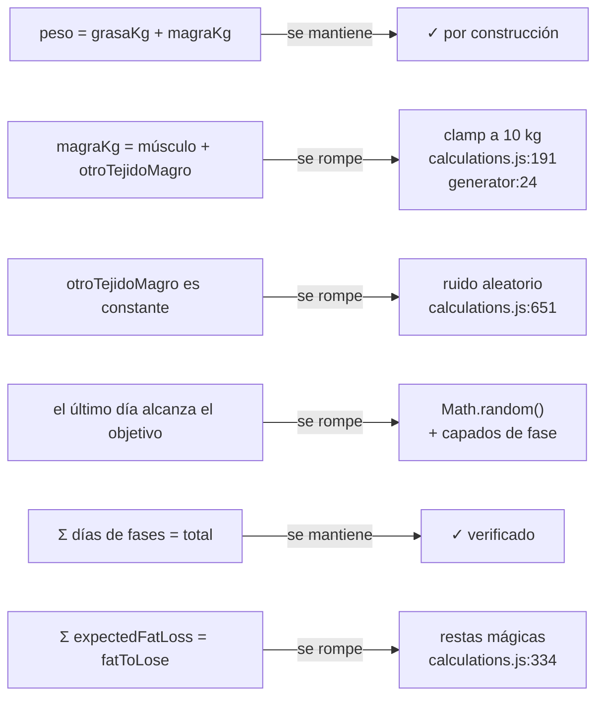

# Modelo de datos

Referencia exacta de todas las estructuras de datos de TransformLab: qué campos tiene cada objeto, quién los crea, quién los consume, en qué unidades están y en qué puntos concretos del código el modelo deja de ser coherente consigo mismo.

> **Estado**: descriptivo del código del árbol de trabajo local, sin cambios pendientes de aplicar.
> **Última revisión**: 1 de agosto de 2026.
> **Versión documentada**: v3.1, `main` @ `264c1db`.

> **Alcance — lea esto antes de usar el documento como referencia de esquema.**
> Todas las estructuras descritas aquí son las del **árbol de trabajo local**, `main` @ `264c1db` (v3.1). Ese árbol está **tres commits por detrás de `origin/main`**, que apunta a `d0afa49` (v4.0, resultado del PR #1). **La v4.0 publicada no se ha auditado** y su modelo de datos difiere del documentado.
>
> Diferencias comprobadas ejecutando `git diff 264c1db origin/main -- js/dynamic-data-generator.js` (+162 líneas, 108 inserciones y 54 supresiones, todas en `generateTransformationData` y `generateDailyData`):
>
> - **La forma del punto diario sí cambió.** En v4.0 el objeto lleva cuatro campos nuevos que no aparecen en §2.5: `isRefeedDay` (`boolean`), `refeedType` (`string | null`), `refeedLabel` (`string | null`) e `isPlateauDay` (`boolean`). El resto de claves de §2.5 (`day`, `date`, `dateFormatted`, `dayOfWeek`, `phase`, `phaseType`, `dayInPhase`, `weekInPhase`, `week`, `physical`, `performance`, `wellbeing`, `dailyChange`, `cumulativeChange`, `nutrition`) se conserva con los mismos nombres, unidades y precisiones.
> - **Cambia también cómo se rellenan dos campos.** `physical.weight` deja de interpolarse linealmente (`interpolate`) y pasa por `Calculations.interpolateCurved` con curva por tipo de fase, más un desplazamiento de agua por meseta y por día de recarga; `nutrition.targetProtein` deja de ser `peso · 2,2` fijo y usa 2,2 g/kg sólo en `cut` y 1,8 g/kg en el resto. `nutrition.targetCalories` deja de ser constante dentro de la fase: se multiplica por el factor de la recarga del día.
> - **El objeto raíz `generatedData` gana una séptima clave**, `refeedSchedule`, y `metadata.version` pasa a `'4.0'` por asignación explícita después de `generateMetadata`.
> - **Lo demás del generador no cambió**: `generatePhases`, `generateWeeklyData`, `generateMonthlyData`, `generateMetadata` y `generateMilestones` son idénticos entre `264c1db` y `origin/main`, de modo que §2.4, §2.6, §2.7, §2.8 y §2.9 describen también la v4.0 en cuanto a forma. Ninguna otra afirmación de este documento se ha verificado contra la v4.0.
> - **El defecto crítico de §2.1 y §5.2 sigue vivo en v4.0.** `git show origin/main:js/calculations.js` conserva el clamp `Math.max(2, Math.min(10, calculatedOtherLean))`, y la prueba de identidad sobre v4.0 devuelve los mismos desvíos que la tabla de §2.1. La prioridad de remediación no cambia.

Documentos relacionados: [README](../README.md) · [Arquitectura](./ARQUITECTURA.md) · [Metodología científica](./METODOLOGIA-CIENTIFICA.md) · [Auditoría](./AUDITORIA.md) · [Catálogo de hallazgos](./CATALOGO-DE-HALLAZGOS.md) · [Deuda técnica](./DEUDA-TECNICA.md) · [Guía de desarrollo](./GUIA-DE-DESARROLLO.md)

---

## 1. Panorama

Todo el modelo nace de un único objeto (`userProfile`, cuatro claves) y se expande a una serie temporal completa (`generatedData`) que la capa de render consume sin transformarla más.



Los dos nodos marcados en rojo no están conectados a nada **en este árbol**: ni `index.html` ni ningún módulo de `264c1db` los referencia. Se documentan aquí (§2.10) porque están versionados y su esquema difiere del que la aplicación genera realmente.

> **Corrección de alcance.** Que estén desconectados es un hecho del snapshot v3.1, no del producto publicado. En `origin/main` (v4.0), `index.html:247` carga `js/milestones.js` como uno de los trece scripts de la página, de modo que **ese módulo está vivo**: la reintegración pendiente que sugiere este diagrama ya se hizo y se fusionó por el PR #1. Verificado con `git show origin/main:index.html`. Siguen sin cargarse, también en `origin/main`: `css/milestones.css` (`index.html` sólo enlaza `styles_new.css`, que no tiene ningún `@import`) y `aesthetic_milestones_complete.json` (sin una sola referencia en ningún `.js` ni `.html` de la rama).

---

## 2. Estructuras

### 2.1 `userProfile`

**Propósito.** Único dato de entrada del sistema. Todo lo demás se deriva de él.

**Dónde se crea.** `js/onboarding.js:845-852` (`Onboarding.complete()`), a partir del acumulador `Onboarding.userData` declarado en `js/onboarding.js:13-32` y reinicializado con valores por defecto en `js/onboarding.js:74-78`.

**Dónde se persiste.** `js/onboarding.js:56-58` (`saveUserProfile`) en la clave `transformlab_userProfile`.

**Dónde se consume.** `js/app.js:103-111` (`loadAllData`), `js/dynamic-data-generator.js:16` (desestructurado en el generador), `js/app.js:266` (modal de ajustes), `js/dashboard.js:83` (exportación a Markdown).

```js
{
  profile:   { age, sex, height, trainingStatus, activityLevel },
  initial:   { weight, fatPct, muscleKg },
  target:    { weight, fatPct, muscleKg },
  startDate: 'YYYY-MM-DD'
}
```

#### `userProfile.profile`

| Campo | Tipo | Unidad | Valores | Descripción | Notas |
|---|---|---|---|---|---|
| `age` | `number \| null` | años | 16–80 (validado en `js/onboarding.js:768`) | Edad. Entra en Mifflin-St Jeor y en el factor de recuperación por edad | `parseInt`; `null` si el campo queda vacío |
| `sex` | `string` | — | `'male'` \| `'female'` | Sexo biológico | Sin valor por defecto seguro: cualquier otra cadena desactiva la validación de grasa (`js/calculations.js:454`) |
| `height` | `number \| null` | cm | 140–220 (`js/onboarding.js:772`) | Altura. Sólo se usa en `calculateBMR` | `parseInt` |
| `trainingStatus` | `string` | — | `'beginner'` \| `'intermediate'` \| `'advanced'` | Determina la tasa de ganancia muscular (`MUSCLE_GAIN_RATES`, `js/calculations.js:34-38`) | Por defecto `'beginner'` |
| `activityLevel` | `string` | — | `'sedentary'` \| `'light'` \| `'moderate'` \| `'active'` \| `'veryActive'` | Multiplicador de TDEE (1.2 / 1.375 / 1.55 / 1.725 / 1.9) | Por defecto `'moderate'`; valor desconocido cae a 1.55 (`js/calculations.js:92`) |

#### `userProfile.initial`

| Campo | Tipo | Unidad | Rango | Descripción | Notas |
|---|---|---|---|---|---|
| `weight` | `number \| null` | kg | 40–200 (`js/onboarding.js:780`) | Peso corporal de partida | `parseFloat`, un decimal en el formulario |
| `fatPct` | `number \| null` | % | 5–50 (`js/onboarding.js:784`) | Porcentaje de grasa corporal | El motor valida además contra `MIN_SAFE_FAT`/`MAX_FAT` por sexo (`js/calculations.js:457`) |
| `muscleKg` | `number \| null` | kg | 20–100 en el `<input>` (`js/onboarding.js:295`) | Masa muscular | **Autorrellenado** con `estimateMuscleFromComposition()` = 48 % de la masa magra, en `js/onboarding.js:521`, `:681` y `:790`. Sólo es una medida real si el usuario dispone de bioimpedancia y la sobrescribe. El paso 2 no comprueba que sea menor que la masa magra |

#### `userProfile.target`

| Campo | Tipo | Unidad | Rango | Descripción | Notas |
|---|---|---|---|---|---|
| `weight` | `number \| null` | kg | 40–150 | Peso objetivo. **Campo derivado**, `readonly` en el formulario (`js/onboarding.js:342`) | Calculado por `calculateTargetWeight()`; `null` cuando la función devuelve `null`. Ver la nota de abajo |
| `fatPct` | `number \| null` | % | `MIN_SAFE_FAT[sex]`–40 (`js/onboarding.js:798`) | Porcentaje de grasa objetivo | 8 % mínimo en hombres, 16 % en mujeres |
| `muscleKg` | `number \| null` | kg | 30–100 (`js/onboarding.js:802`) | Masa muscular objetivo | El mínimo fijo de 30 kg impide completar el asistente a personas de complexión pequeña |

> **Defecto conocido — el peso objetivo es sistemáticamente erróneo por la vía por defecto.**
> `calculateTargetWeight()` (`js/calculations.js:174-213`) reconstruye el peso objetivo como `(músculoObjetivo + otroTejidoMagro) / (1 − grasa/100)` y limita `otroTejidoMagro` al rango `[2, 10]` kg en `js/calculations.js:191`, asumiendo que `muscleKg` procede de bioimpedancia. Como el onboarding autorrellena `muscleKg` con el 48 % de la masa magra, el tejido magro no muscular real vale 22–35 kg y el clamp lo aplasta a 10. Prueba de identidad ejecutada sobre el código (pedir como objetivo la composición actual debería devolver el peso actual):
>
> | Perfil | Peso real | Peso devuelto | Desvío |
> |---|---|---|---|
> | Hombre 80 kg / 20 % grasa | 80,0 kg | 50,9 kg | −29,1 kg (IMC 15,7) |
> | Mujer 60 kg / 28 % grasa | 60,0 kg | 42,6 kg | −17,4 kg |
> | Hombre 95 kg / 30 % grasa | 95,0 kg | 59,9 kg | −35,1 kg |
> | Hombre 70 kg / 12 % grasa | 70,0 kg | 45,0 kg | −25,0 kg |
>
> Consecuencia sobre el modelo: `target.weight` no es coherente con `target.muscleKg` ni con `target.fatPct` salvo para usuarios con báscula de bioimpedancia. Ver [Catálogo de hallazgos](./CATALOGO-DE-HALLAZGOS.md), entradas críticas sobre `calculations.js:191`, `dynamic-data-generator.js:24` y `onboarding.js:562`.

> **Defecto conocido — `target.weight` puede quedar en `null` y nadie lo detecta.**
> Si `calculateTargetWeight()` devuelve `null` (peso fuera de 40–150 kg), `js/onboarding.js:568` guarda `null` y `calculatePhaseDurations` sigue adelante: en `js/calculations.js:297`, `null * fatPct / 100` da `0` en JavaScript, de modo que el plan concluye que la grasa objetivo es 0 kg.

#### `userProfile.startDate`

| Campo | Tipo | Formato | Descripción | Notas |
|---|---|---|---|---|
| `startDate` | `string` | `'YYYY-MM-DD'` | Fecha de inicio del plan | Generada con `new Date().toISOString().split('T')[0]` (`js/onboarding.js:77`). No se valida en ningún paso: se aceptan fechas arbitrariamente pasadas o futuras. Al releerse con `new Date(...)` se interpreta como medianoche **UTC** (§6) |

> **Efecto secundario documentado.** `generateTransformationData()` **muta** el `userProfile` recibido: si el peso objetivo recalculado difiere en más de 0,5 kg, reasigna `target.weight` en `js/dynamic-data-generator.js:51`. Como `Onboarding.complete()` persiste el perfil **antes** de generar (`js/onboarding.js:855` frente a `:859`), el perfil guardado y los datos generados pueden contener pesos objetivo distintos.

---

### 2.2 `composition` — salida de `calculateComposition`

**Propósito.** Descomponer un par (peso, % grasa) en sus cuatro compartimentos.

**Dónde se crea.** `js/calculations.js:141-161`.

**Dónde se consume.** En ningún sitio. `grep` sobre todo el árbol (`js/`, `index.html`, `test-calculation.js`) sólo devuelve la definición: **es código muerto**. Se documenta porque describe el modelo de composición que el resto del motor reproduce de forma dispersa y porque es la única definición explícita de `otherLeanTissueKg`.

| Campo | Tipo | Unidad | Rango | Descripción | Notas |
|---|---|---|---|---|---|
| `weight` | `number` | kg | 40–200 | Peso pasado como argumento | Sin redondear |
| `fatPct` | `number` | % | 5–50 | Porcentaje de grasa pasado como argumento | Sin redondear |
| `fatKg` | `number` | kg | — | `weight * fatPct / 100` | 2 decimales |
| `leanMassKg` | `number` | kg | — | `weight − fatKg` | 2 decimales |
| `muscleKg` | `number` | kg | — | Músculo medido si se pasa el tercer argumento; si no, `leanMassKg * 0.48` | 2 decimales |
| `otherLeanTissueKg` | `number` | kg | — | `leanMassKg − muscleKg`: huesos, órganos, agua, piel, sangre | 2 decimales. Con la estimación por defecto vale el 52 % de la masa magra, es decir 22–35 kg en adultos — muy por encima del techo de 10 kg que impone `js/calculations.js:191` |

---

### 2.3 `phasePlan` y `phase` (elemento del plan)

**Propósito.** Decidir qué fases componen el plan, en qué orden y cuántos días dura cada una. Es el plan *sin fechas*: sólo duraciones y expectativas.

**Dónde se crea.** `js/calculations.js:293-434` (`calculatePhaseDurations`).

**Dónde se consume.** `js/dynamic-data-generator.js:55` (para materializar las fases) y `:70` (para la metadata); `js/onboarding.js:395` y `:712` (previsualización del asistente); `js/calculations.js:506` (dentro de `validateInputs`, que lo devuelve en el campo `phases`).

#### `phasePlan`

| Campo | Tipo | Unidad | Descripción | Notas |
|---|---|---|---|---|
| `phases` | `phase[]` | — | Secuencia ordenada de fases | Entre 3 y 5 elementos |
| `totalDays` | `number` | días | Suma de `days` de todas las fases | Es el valor que viaja a `metadata.timeline.totalDays` |
| `summary.fatToLose` | `number` | kg | `pesoInicial·grasaInicial − pesoObjetivo·grasaObjetivo` | 1 decimal. Depende de `target.weight`, con el defecto de §2.1 |
| `summary.muscleToGain` | `number` | kg | `target.muscleKg − initial.muscleKg` | 1 decimal |
| `summary.estimatedWeeks` | `number` | semanas | `ceil(totalDays / 7)` | — |
| `summary.estimatedMonths` | `number` | meses | `totalDays / 30`, 1 decimal | No coincide con `monthly.length`, que cuenta meses de calendario |

#### `phase` (elemento de `phasePlan.phases`)

| Campo | Tipo | Unidad | Valores | Descripción | Notas |
|---|---|---|---|---|---|
| `name` | `string` | — | `'Adaptación'`, `'Recomposición'`, `'Definición'`, `'Volumen'`, `'Transición'`, `'Mantenimiento'` | Etiqueta visible | Español; es la clave con la que `getPhaseData()` busca fases (`js/app.js:487`) |
| `type` | `string` | — | `'adaptation'`, `'recomposition'`, `'cut'`, `'bulk'`, `'transition'`, `'maintenance'` | Discriminante de todo el sistema | Determina colores, calorías y reglas de progresión |
| `days` | `number` | días | 14 / 30·n / 7·n | Duración | Adaptación y transición son siempre 14; mantenimiento siempre 30 |
| `description` | `string` | — | — | Texto descriptivo en español | Se muestra tal cual en el asistente |
| `expectedFatLoss` | `number` | kg | positivo = pérdida, negativo = ganancia | Grasa que la fase espera mover | **`generatePhases` lo ignora** para todas las fases salvo `recomposition` y `cut` |
| `expectedMuscleGain` | `number` | kg | positivo = ganancia, negativo = pérdida | Músculo que la fase espera mover | **Ignorado en `cut`**, que aplica una pérdida fija del 2 % (`js/dynamic-data-generator.js:132`) |

**Reglas de composición del plan** (`js/calculations.js:314-422`):

- Siempre empieza con `adaptation` (14 días) y termina con `transition` (14) + `maintenance` (30). Mínimo estructural: 58 días.
- `needsCut = initial.fatPct > target.fatPct + 2`; `needsBulk = target.muscleKg > initial.muscleKg + 1`.
- `recomposition` sólo aparece si hay que perder grasa **y** ganar músculo **y** la grasa inicial está entre 15 % y 25 %. Su duración es `min(90, ceil(muscleToGain/0.3)·30)`, que en la práctica es siempre 90 días.
- Si no se cumple `needsCut` ni `needsBulk`, el plan queda con sólo tres fases y 58 días.

> **Defecto conocido.** La fase de definición se dimensiona con `fatToLose − 2` (`js/calculations.js:334`) sin descontar la grasa que la recomposición ya ha eliminado, de modo que la suma de `expectedFatLoss` de las fases no coincide con `summary.fatToLose`. El `2` y el `0.5` de `muscleToGain − 0.5` (`js/calculations.js:353`) son constantes sin correspondencia con lo que declaran las fases anteriores.

---

### 2.4 `phase` materializada (elemento de `data.phases`)

**Propósito.** La fase del plan convertida en un tramo concreto del calendario, con fechas, rango de días globales, composición de entrada y de salida y objetivo calórico.

**Dónde se crea.** `js/dynamic-data-generator.js:183-213`, dentro de `generatePhases()` (`:91`).

**Dónde se consume.** `js/dynamic-data-generator.js:233` (para generar la serie diaria) y `:362` (etiquetado semanal); `js/dashboard.js:291` (marcadores de fase de la línea de tiempo) y `:499` (indicador de fase); `js/charts.js` (fondos de fase del gráfico); `js/app.js:487` (`getPhaseData`).

| Campo | Tipo | Unidad | Rango / valores | Descripción | Notas |
|---|---|---|---|---|---|
| `id` | `number` | — | 1..N | Índice de la fase, **base 1** | `index + 1` |
| `name` | `string` | — | ver §2.3 | Nombre heredado del plan | — |
| `type` | `string` | — | ver §2.3 | Tipo heredado del plan | — |
| `description` | `string` | — | — | Descripción heredada del plan | — |
| `startDay` | `number` | día global | 1..N | Primer día de la fase | Base 1; contiguo con la fase anterior |
| `endDay` | `number` | día global | — | `startDay + days − 1` | Sin huecos ni solapes entre fases |
| `days` | `number` | días | — | Duración | Heredada del plan |
| `totalWeeks` | `number` | semanas | — | `ceil(days / 7)` | La suma de `totalWeeks` de las fases no equivale a `weekly.length` |
| `startDate` | `string` | `'YYYY-MM-DD'` | — | Fecha de inicio | `toISOString()` sobre una fecha manipulada con `setDate()` local (§6) |
| `endDate` | `string` | `'YYYY-MM-DD'` | — | Fecha de fin | Idem |
| `startComposition` | `object` | — | `{weight, fatPct, muscleKg}` | Composición al empezar la fase | 1 decimal. Es la `endComposition` de la fase anterior |
| `endComposition` | `object` | — | `{weight, fatPct, muscleKg}` | Composición al terminar | 1 decimal. Calculada por la regla de `type` |
| `totalChange` | `object` | — | `{weight, fatKg, muscleKg}` | Diferencia entre extremos | 1 decimal. Puede contradecir `expectedFatLoss`/`expectedMuscleGain` |
| `dailyCalories` | `number` | kcal/día | — | `calculateCaloricTarget(tdee, phase.type).target` | Ver la nota de abajo |
| `neatTarget` | `number` | pasos/día | 10000 \| 8000 | Objetivo de actividad no deportiva | `10000` si `type === 'cut'`, `8000` en el resto. No se muestra en ninguna vista |
| `expectedFatLoss` | `number` | kg | — | Heredado del plan | Puede contradecir `totalChange.fatKg` |
| `expectedMuscleGain` | `number` | kg | — | Heredado del plan | Idem |

**Reglas de progresión por tipo** (`js/dynamic-data-generator.js:112-165`):

| `type` | Peso final | % grasa final | Músculo final |
|---|---|---|---|
| `adaptation` | `−0,5 kg` fijos | `−0,3 pp` fijos | `+expectedMuscleGain` |
| `recomposition` | `(músculo + otherLeanTissue) / (1 − grasa/100)` | `−expectedFatLoss/peso·100` | `+expectedMuscleGain` |
| `cut` | `−expectedFatLoss` | recalculado desde la grasa restante | `× 0,98` (pérdida fija del 2 %) |
| `bulk` | `músculo + otherLeanTissue + grasaKg` | derivado del peso | `+expectedMuscleGain`, con `+0,3 kg` de grasa por kg de músculo |
| `transition` | cierra el **50 %** del hueco hasta el objetivo | idem | idem |
| `maintenance` | `= target.weight` exacto | `= target.fatPct` | `= target.muscleKg` |

> **Defecto conocido.** `otherLeanTissue` se calcula una sola vez en `js/dynamic-data-generator.js:20-24` con el mismo clamp `[2, 10]` de §2.1, así que las fases `recomposition` y `bulk` reconstruyen el peso a partir de una masa magra no muscular de 10 kg cuando la real ronda los 30. Si el resultado se sale de rango, `js/dynamic-data-generator.js:168-176` lo capa a `[40, 200] kg` y `[5, 50] %` con un `console.warn` y sigue, propagando el valor capado a la fase siguiente. La fase de mantenimiento absorbe toda la incoherencia acumulada asignando el objetivo de golpe (`:156-158`).

---

### 2.5 Punto de la serie diaria (elemento de `data.daily`)

**Propósito.** Estado proyectado del usuario en un día concreto. Es la única serie con datos primarios: semanas y meses se derivan de ella.

**Dónde se crea.** `js/dynamic-data-generator.js:296-329`, dentro de `generateDailyData()` (`:229`).

**Longitud del array.** `sum(phases[].days)` = `metadata.timeline.totalDays`. Para un plan típico, 400–500 elementos.

**Dónde se consume.** `js/app.js:458` y `:475` (`getCurrentData`, `getDayData` — indexado **base 0** sobre un número de día **base 1**); `js/dashboard.js:345` y `:371-443`; `js/charts.js:173-181` (series) y `:478` (posición de hitos); `js/insights.js:118-158`.

| Campo | Tipo | Unidad | Rango / valores | Descripción | Notas |
|---|---|---|---|---|---|
| `day` | `number` | día global | 1..N | Índice del día en el plan completo | Base 1; se accede como `daily[day − 1]` |
| `date` | `string` | `'YYYY-MM-DD'` | — | Fecha del día | Producida con `toISOString()` (**UTC**) |
| `dateFormatted` | `string` | — | p. ej. `'12 may'` | Etiqueta corta | `toLocaleDateString('es-ES')` (**hora local**): puede diferir un día de `date` (§6) |
| `dayOfWeek` | `string` | — | `'Domingo'`…`'Sábado'` | Día de la semana | `getDay()` (**hora local**); mismo desfase |
| `phase` | `string` | — | ver §2.3 | Nombre de la fase a la que pertenece el día | — |
| `phaseType` | `string` | — | ver §2.3 | Tipo de fase | Clave para colores y clases CSS |
| `dayInPhase` | `number` | días | 1..`phase.days` | Día dentro de la fase | Base 1 |
| `weekInPhase` | `number` | semanas | 1..`ceil(days/7)` | Semana dentro de la fase | `ceil(dayInPhase / 7)`; se usa para el bajón de energía de la definición |
| `week` | `number` | semanas | 1..`ceil(N/7)` | Semana global | `ceil(day / 7)` |
| `physical.weight` | `number` | kg | — | Peso mostrado | 2 decimales. **Incluye ruido**: interpolación + `addDailyFluctuation` (`js/calculations.js:647-653`), que contiene `Math.random()` |
| `physical.fatPct` | `number` | % | — | Porcentaje de grasa | 2 decimales. Interpolado limpio, **sin** ruido |
| `physical.fatKg` | `number` | kg | — | `weightConRuido · fatPct / 100` | 2 decimales. Hereda el ruido del peso |
| `physical.muscleKg` | `number` | kg | — | Masa muscular | 2 decimales. Interpolada limpia, **sin** ruido |
| `physical.leanMassKg` | `number` | kg | — | `weightConRuido − fatKg` | 2 decimales. Hereda el ruido |
| `performance.strength` | `number` | escala 0–100 | ≤ 100 | Índice de fuerza | Entero. `30 + adaptación + ganancia muscular·2`, modulado por fase (`js/calculations.js:559-561`) |
| `performance.agility` | `number` | escala 0–10 | ≤ 10 | Índice de agilidad | 1 decimal. **Sin suelo**: puede salir negativa si la grasa sube (`js/calculations.js:565`) |
| `performance.mobility` | `number` | escala 0–10 | ≤ 10 | Índice de movilidad | 1 decimal. Sólo depende del día: `4 + day·0.01` |
| `wellbeing.energy` | `number` | escala 0–10 | — | Energía percibida | 1 decimal |
| `wellbeing.mentalClarity` | `number` | escala 0–10 | — | Claridad mental | 1 decimal |
| `wellbeing.selfEsteem` | `number` | escala 0–10 | — | Autoestima | 1 decimal |
| `wellbeing.sleepQuality` | `number` | escala 0–10 | — | Calidad del sueño | 1 decimal |
| `wellbeing.aesthetics` | `number` | escala 0–10 | — | Percepción estética | 1 decimal |
| `wellbeing.generalFeeling` | `number` | escala 0–10 | — | Sensación general | 1 decimal |
| `dailyChange.weight` | `number` | kg | — | Diferencia con el peso del día anterior | 2 decimales. `{0,0,0}` en el día 1 |
| `dailyChange.fatKg` | `number` | kg | — | Diferencia de masa grasa | 2 decimales |
| `dailyChange.muscleKg` | `number` | kg | — | Diferencia de músculo | 2 decimales |
| `cumulativeChange.weight` | `number` | kg | — | Diferencia con `initial.weight` | 2 decimales. **No es 0 en el día 1** |
| `cumulativeChange.fatKg` | `number` | kg | — | Diferencia con la masa grasa inicial | 2 decimales |
| `cumulativeChange.muscleKg` | `number` | kg | — | Diferencia con `initial.muscleKg` | 2 decimales |
| `nutrition.targetCalories` | `number` | kcal/día | — | Copiado de `phase.dailyCalories` | Constante dentro de la fase |
| `nutrition.targetProtein` | `number` | g/día | — | `round(pesoConRuido · 2,2)` | Fluctúa a diario por el ruido del peso. No se muestra en ninguna vista |

Notas sobre los campos que **no** existen y que la capa de render busca:

- No hay `dailyChange.fatPct` ni `cumulativeChange.fatPct`; `js/dashboard.js:383` los pide y muestra `--` de forma permanente. Dos líneas más abajo, `js/dashboard.js:388` interpola el icono de cambio pero **no** el valor, produciendo un `↓ kg` sin número.
- Las escalas de `performance` son heterogéneas: `strength` es 0–100 y `agility`/`mobility` son 0–10, y el dashboard las pinta con el mismo componente de barra (`js/dashboard.js:405-414`).

> **Defecto conocido — el día 1 no es el punto de partida.** `phaseProgress = dayInPhase / daysInPhase` con `dayInPhase` empezando en 1 (`js/dynamic-data-generator.js:242`), de modo que el primer punto ya está avanzado 1/N del cambio de la fase y `startComposition` nunca se emite. Ejecutado con un perfil de 80 kg, el día 1 devuelve un peso en torno a 80,3–80,7 kg y un `cumulativeChange.weight` de 0,3–0,7 kg —el valor exacto varía en cada generación por el ruido de `addDailyFluctuation` (§5.3)—, cuando debería ser 80,00 y 0,00.

---

### 2.6 Punto de la serie semanal (elemento de `data.weekly`)

**Propósito.** Agregación de la serie diaria en bloques de 7 posiciones consecutivas del array.

**Dónde se crea.** `js/dynamic-data-generator.js:367-404`, dentro de `generateWeeklyData()` (`:339`).

**Longitud del array.** `ceil(daily.length / 7)`. La última semana contiene entre 1 y 7 días.

**Cómo se agrega.** Se promedian **cinco** magnitudes (`weight`, `fatPct`, `muscleKg`, `strength`, `energy`, `js/dynamic-data-generator.js:354-359`). Todo lo demás se toma del **último día** del bloque (`endOfWeek`) o del **primero** (`phase`, `phaseType`, `startDate`).

| Campo | Tipo | Unidad | Descripción | Diferencia con el punto diario |
|---|---|---|---|---|
| `week` | `number` | semanas | Índice de semana, base 1 | Sustituye a `day` |
| `startDay` / `endDay` | `number` | día global | Primer y último día del bloque | No existen en el punto diario |
| `startDate` / `endDate` | `string` | `'YYYY-MM-DD'` | Fechas de los días extremos | Copiadas de `daily[].date` |
| `startDateFormatted` / `endDateFormatted` | `string` | — | Etiquetas cortas | Copiadas de `daily[].dateFormatted` |
| `phase` / `phaseType` | `string` | — | Fase de la semana | Tomados del **primer** día (`js/dynamic-data-generator.js:362`) |
| `weeklyAverages.physical` | `object` | — | `{weight, fatPct, muscleKg}`, medias de los días del bloque | **Sin `fatKg` ni `leanMassKg`** |
| `weeklyAverages.performance` | `object` | — | `{strength}` únicamente, redondeado a entero | Sin `agility` ni `mobility` |
| `weeklyAverages.wellbeing` | `object` | — | `{energy}` únicamente, 1 decimal | Faltan las otras cinco métricas de bienestar |
| `endOfWeek.physical` | `object` | — | Objeto `physical` **del último día**, completo | Es una **referencia**, no una copia: comparte identidad con `daily[endDay−1].physical` |
| `endOfWeek.performance` | `object` | — | `performance` del último día, completo | Referencia |
| `endOfWeek.wellbeing` | `object` | — | `wellbeing` del último día, completo | Referencia |
| `weeklyChange` | `object` | kg | `{weight, fatKg, muscleKg}`: último día de esta semana frente al último de la anterior | `{0,0,0}` en la semana 1, no el cambio respecto a la composición inicial |
| `range.weightMin` / `range.weightMax` | `number` | kg | Mínimo y máximo de peso del bloque | No existe equivalente diario. Refleja principalmente el ruido aleatorio |

La capa de render prefiere sistemáticamente `endOfWeek` sobre `weeklyAverages` (`js/charts.js:183`, `js/dashboard.js:347`, `js/insights.js:119`), de modo que las medias semanales apenas se usan: sólo entran en juego como respaldo si `endOfWeek` falta.

> **Defectos conocidos.** (a) La última semana puede contener 1–6 días y se emite con la misma forma que el resto, sin ningún campo que la marque como parcial (`js/dynamic-data-generator.js:345`). En el plan de ejemplo de §3, la semana 62 tiene 6 días. (b) Una semana que cruza una frontera de fase se etiqueta con la fase del primer día pero muestra los datos del último, que ya puede pertenecer a la fase siguiente.

---

### 2.7 Punto de la serie mensual (elemento de `data.monthly`)

**Propósito.** Agregación por **mes de calendario**, no por bloques de 30 días.

**Dónde se crea.** `js/dynamic-data-generator.js:453-479`, dentro de `generateMonthlyData()` (`:413`).

**Longitud del array.** Número de meses de calendario distintos que toca el plan. El primero y el último son parciales.

**Cómo se agrega.** Se agrupa por `day.date.substring(0, 7)` (`js/dynamic-data-generator.js:419`). Se promedian **tres** magnitudes (`weight`, `fatPct`, `muscleKg`); el resto se toma del último día (`endOfMonth`).

| Campo | Tipo | Unidad | Descripción | Diferencia con el punto semanal |
|---|---|---|---|---|
| `month` | `number` | meses | Índice secuencial, base 1 | Sustituye a `week` |
| `monthKey` | `string` | `'YYYY-MM'` | Clave de agrupación | No tiene equivalente semanal |
| `monthName` | `string` | — | `'Mayo de 2026'`, capitalizado | `toLocaleDateString('es-ES', {month:'long', year:'numeric'})` |
| `startDate` / `endDate` | `string` | `'YYYY-MM-DD'` | Primer y último día **del plan** dentro del mes | — |
| `daysInMonth` | `number` | días | Días del **plan** en ese mes, no días del mes natural | 28–31 en meses completos, menos en los extremos |
| `phase` | `string` | — | Fase **dominante** por número de días (`js/dynamic-data-generator.js:442-448`) | La semana usa el primer día |
| `phaseType` | `string` | — | Tipo de fase del **primer** día (`js/dynamic-data-generator.js:461`) | **Criterio distinto al de `phase`**: en meses con cambio de fase, ambos campos describen fases diferentes |
| `monthlyAverages.physical` | `object` | — | `{weight, fatPct, muscleKg}` | **No hay `monthlyAverages.performance` ni `.wellbeing`** (la semana sí los tiene, aunque reducidos) |
| `endOfMonth.physical` / `.performance` / `.wellbeing` | `object` | — | Objetos del último día, completos | Referencias, igual que en la semana |
| `monthlyChange` | `object` | kg | `{weight, fatKg, muscleKg}` frente al último día del mes anterior | `{0,0,0}` en el primer mes |

No existe `endDay` en el punto mensual. `js/charts.js:504` lo usa para posicionar los hitos de fin de fase, con lo que esos marcadores nunca aparecen en la vista mensual.

> **Defecto conocido.** Los meses son de calendario, pero la navegación los indexa como bloques de 30 días: `js/app.js:193` calcula `currentMonth = ceil(currentDay / 30)` y `metadata.timeline.totalMonths` es `totalDays / 30`. En el plan de ejemplo de §3, `monthly.length` es 15 y `totalMonths` es 14,4.

---

### 2.8 Hito generado en tiempo de ejecución (elemento de `data.milestones`)

**Propósito.** Marcar puntos notables de la transformación para el gráfico y la exportación.

**Dónde se crea.** `js/dynamic-data-generator.js:573-682` (`generateMilestones`). Se invoca **dos veces** por generación: dentro de `generateTransformationData` (`:73`) y de nuevo desde `js/app.js:154` o `js/onboarding.js:862`; prevalece la segunda.

**Dónde se consume.** `js/charts.js:464-530` (`calculateMilestonePositions`, marcadores del gráfico) y `js/dashboard.js:184-192` (exportación a Markdown). `js/milestones.js` esperaría un esquema distinto, pero en este árbol no está cargado.

> **Corrección de alcance.** En `origin/main` (v4.0) `js/milestones.js` **sí está cargado** (`index.html:247`) y consume precisamente esta estructura: `loadMilestones()` parte de `AppState.data.milestones`, no del JSON de §2.10. La incompatibilidad de esquema entre esta forma y la del fichero huérfano no se resolvió eliminando una de las dos, sino añadiendo un traductor: `MilestonesModule._normalize()` mapea `estimatedDay` → `day`, `name` → `title` y `subtle`/`notable`/`very_notable` → `sutil`/`notable`/`muy_notable`. Verificado con `git show origin/main:js/milestones.js`. La forma descrita en esta sección no cambió en v4.0: `generateMilestones` es idéntico en `264c1db` y en `origin/main`.

El array **no es homogéneo**: contiene tres formas de objeto.

**(a) Hitos de grasa y de músculo** (`js/dynamic-data-generator.js:592-601` y `:613-622`)

| Campo | Tipo | Unidad | Rango / valores | Descripción | Notas |
|---|---|---|---|---|---|
| `id` | `number` | — | 1..N | Identificador secuencial | Asignado en orden de creación, **antes** de ordenar |
| `category` | `string` | — | `'definition'` \| `'size'` | Familia del hito | `'definition'` para grasa, `'size'` para músculo |
| `name` | `string` | — | `'18% grasa corporal'`, `'34kg masa muscular'` | Etiqueta | — |
| `description` | `string` | — | — | Texto descriptivo | De `getFatMilestoneDescription` / `getMuscleMilestoneDescription` |
| `triggerType` | `string` | — | `'fatPct'` \| `'muscleKg'` | Métrica que dispara el hito | — |
| `triggerValue` | `number` | % o kg | — | Umbral. Grasa cada 2 pp, músculo cada 1,5 kg | — |
| `progressRequired` | `number` | % | 0–100 | Porcentaje del cambio total que representa | Sin redondear |
| `visibility` | `string` | — | `'subtle'` \| `'notable'` \| `'very_notable'` | Grado de visibilidad | Umbrales en 30 % y 60 % de `progressRequired` |
| `estimatedDay` | `number` | día global | 1..N | `round(progressRequired/100 · totalDays)` | Asume progreso **lineal**; el gráfico usa otro criterio (ver nota) |

**(b) Hitos de fin de fase** (`js/dynamic-data-generator.js:629-638`)

Mismos campos, con `category: 'phase'`, `triggerType: 'day'`, `triggerValue = phase.endDay`, `visibility: 'notable'` y `estimatedDay = triggerValue`. Se generan para todas las fases salvo `maintenance`.

**(c) Hitos estéticos** (`js/dynamic-data-generator.js:654-663`)

| Campo | Tipo | Valores | Notas |
|---|---|---|---|
| `id` | `number` | 1..N | — |
| `category` | `string` | `'abs'` \| `'vascularity'` \| `'face'` \| `'arms'` | Estas cuatro categorías **no existen** en el mapa de colores del gráfico, que las pinta todas en gris |
| `name` | `string` | `'Abdominales: Notable'` | Niveles: Inicial / Notable / Avanzado / Elite |
| `description` | `string` | — | De `getAestheticDescription`, con variantes por sexo |
| `triggerType` | `string` | `'fatPct'` | — |
| `triggerValue` | `number` | umbral de grasa | En mujeres se le suman 6 pp (`fatVisibilityOffset`, `js/dynamic-data-generator.js:582`) |
| `visibility` | `string` | `'subtle'` \| `'notable'` \| `'very_notable'` | Por posición en el array de umbrales |
| `sexAdjusted` | `boolean` | `true` si `sex === 'female'` | Campo exclusivo de esta forma |
| `estimatedDay` | `NaN` → `null` | — | **No llevan `progressRequired`**, así que `js/dynamic-data-generator.js:675` calcula `NaN / 100 · totalDays` = `NaN`, que se convierte en `null` al serializar a localStorage |

> **Defectos conocidos.** (a) Los hitos estéticos salen con `estimatedDay` inválido y, al ordenarse con `a.progressRequired || 0` (`js/dynamic-data-generator.js:669`), quedan todos al principio del array, antes del primer hito de la fase de adaptación. Comprobado sobre el plan de §3: el orden resultante es `abs, abs, vascularity, vascularity, face, face, arms, arms, phase(14), phase(104), definition(108)…`. (b) `estimatedDay` y la posición del marcador en el gráfico se calculan por caminos distintos: `js/charts.js:469-520` busca el **primer punto de la serie que cruza `triggerValue`**, mientras que `estimatedDay` reparte los hitos linealmente. El mismo hito tiene dos días diferentes según dónde se consulte.

---

### 2.9 `metadata`

**Propósito.** Ficha resumen del plan: metabolismo, composiciones de partida y de llegada, calendario y metodología declarada.

**Dónde se crea.** `js/dynamic-data-generator.js:508-559` (`generateMetadata`).

**Dónde se consume.** `js/dashboard.js:10`, `:83-210` (exportación), `:451-452` (tarjeta metabólica), `:576-641` (barras de progreso hacia el objetivo); `js/insights.js:151-158`.

| Campo | Tipo | Unidad | Valores | Descripción | Notas |
|---|---|---|---|---|---|
| `version` | `string` | — | `'3.2'` | Versión del formato | Literal fijo. No coincide con la v3.1 de `js/calculations.js` ni con la v3.0 del pie del HTML |
| `generatedAt` | `string` | ISO 8601 | — | Instante de generación | `new Date().toISOString()`, UTC |
| `userProfile.age` / `.sex` / `.height` / `.trainingStatus` / `.activityLevel` | — | — | ver §2.1 | Copia del perfil | Duplica lo que ya hay en `transformlab_userProfile` |
| `userProfile.ageRecoveryFactor` | `number` | factor | 1.0 / 0.95 / 0.85 / 0.75 | Factor de recuperación por edad (cortes en 30, 40 y 50 años) | Se calcula y se guarda, pero **no lo lee nadie** |
| `metabolicData.initialBMR` | `number` | kcal/día | — | Mifflin-St Jeor con el peso inicial | Redondeado aquí, pero `calculateBMR` devuelve decimales |
| `metabolicData.targetBMR` | `number` | kcal/día | — | Con el peso objetivo | Hereda el error de `target.weight` |
| `metabolicData.initialTDEE` / `.targetTDEE` | `number` | kcal/día | — | BMR × multiplicador de actividad | Ya redondeados por `calculateTDEE` |
| `metabolicData.muscleGainPotential` | `object` | kg/mes | `{minKg, maxKg, avgKg}` | Tasas por nivel y sexo (×0,5 en mujeres) | — |
| `initialComposition` | `object` | — | `{weight, fatPct, fatKg, muscleKg, leanMassKg, strength, aesthetics}` | Composición de partida | `fatKg` y `leanMassKg` a 1 decimal |
| `initialComposition.strength` / `.aesthetics` | `number` | 0–100 / 0–10 | **`20` y `3` fijos** | Punto de partida de las barras de progreso | Constantes escritas a mano en `js/dynamic-data-generator.js:532-533`; no proceden de `calculatePerformanceMetrics` ni de `calculateWellbeingMetrics`, que son las funciones que generan realmente esas métricas en la serie |
| `targetComposition` | `object` | — | mismos campos | Composición objetivo | — |
| `targetComposition.strength` / `.aesthetics` | `number` | — | **`80` y `8` fijos** | Extremo superior de las barras | Idem (`:541-542`) |
| `timeline.startDate` | `string` | `'YYYY-MM-DD'` | — | Copiada del perfil | — |
| `timeline.endDate` | `string` | `'YYYY-MM-DD'` | — | `startDate + totalDays − 1` | Calculada con `setDate()` local + `toISOString()` (§6) |
| `timeline.totalDays` | `number` | días | — | `phasePlan.totalDays` | Coincide con `daily.length` |
| `timeline.totalWeeks` | `number` | semanas | — | `ceil(totalDays / 7)` | Coincide con `weekly.length` |
| `timeline.totalMonths` | `number` | meses | 1 decimal | `totalDays / 30` | **No coincide con `monthly.length`** |
| `summary` | `object` | — | `{fatToLose, muscleToGain, estimatedWeeks, estimatedMonths}` | Copia de `phasePlan.summary` | — |
| `methodology` | `string[]` | — | 5 cadenas en español | Metodología declarada | Texto informativo; ver [Metodología científica](./METODOLOGIA-CIENTIFICA.md) |

---

### 2.10 `aesthetic_milestones_complete.json` — fichero huérfano

**Propósito declarado.** Catálogo detallado de 102 hitos estéticos con fechas de calendario y métricas asociadas.

**Estado.** 76 KB versionados que **nadie carga**: no aparece en `index.html` ni en ningún `fetch`/`import`, ni en este árbol ni en `origin/main` (comprobado sobre todos los `.js` y `.html` de la rama publicada). Su esquema **no es compatible** con el de §2.8 (`title` frente a `name`, `day` frente a `estimatedDay`, `'sutil'/'notable'/'muy_notable'` frente a `'subtle'/'notable'/'very_notable'`) — incompatibilidad que la v4.0 no elimina sino que traduce en tiempo de ejecución con `MilestonesModule._normalize()` (§2.8), de modo que este esquema sobrevive como formato interno de la vista de hitos aunque el fichero siga sin leerse. Además está construido sobre un plan personal concreto, con fechas absolutas fijas (2026-02-02 → 2027-06-01) y fases que la aplicación no genera (`'Corte 1'`, `'Bulking 1'`, `'Mini-corte'`, `'Bulking 2'`, `'Definición Final'`).

**Estructura de nivel superior**: `{ metadata, milestones, summary }`.

#### `metadata`

| Campo | Tipo | Valor real en el fichero |
|---|---|---|
| `generatedAt` | `string` | `'2026-01-23T18:18:30.505787'` (sin zona horaria) |
| `version` | `string` | `'1.0'` |
| `type` | `string` | `'aesthetic_milestones'` |
| `totalMilestones` | `number` | `102` |
| `period` | `object` | `{startDate: '2026-02-02', endDate: '2027-06-01', totalDays: 485}` |
| `categories` | `object` | Diccionario de 13 categorías → descripción en español |
| `visibility_scale` | `object` | `{sutil, notable, muy_notable}` → descripción |

#### Forma de un hito (`milestones[]`, 102 elementos)

| Campo | Tipo | Unidad | Rango / valores | Descripción |
|---|---|---|---|---|
| `id` | `number` | — | 1–102 | Identificador |
| `day` | `number` | día global | 7–485 | Día del plan en que se alcanza |
| `date` | `string` | `'YYYY-MM-DD'` | 2026-02-08 – 2027-06-01 | Fecha absoluta |
| `dateFormatted` | `string` | — | `'19/09/2026'` | Formato `DD/MM/YYYY`, distinto del `'12 may'` de la serie diaria |
| `dayOfWeek` | `string` | — | `'Domingo'`…`'Sábado'` | Día de la semana |
| `week` | `number` | semanas | 1–70 | Semana del plan |
| `category` | `string` | — | 13 valores (ver tabla siguiente) | Zona corporal o tipo |
| `muscle_group` | `string \| null` | — | `null` en 20 hitos; 26 valores distintos en el resto (`pectorales`, `dorsales`, `bíceps`, `cuádriceps`…) | Grupo muscular concreto |
| `title` | `string` | — | — | Título del hito |
| `description` | `string` | — | — | Descripción larga |
| `visibility` | `string` | — | `'sutil'` (21) \| `'notable'` (45) \| `'muy_notable'` (36) | Escala en **español**, incompatible con la de §2.8 |
| `fatPct_trigger` | `number \| null` | % | 54 valores no nulos, 10,0–26,0 | Umbral de grasa |
| `muscle_trigger` | `number \| null` | kg | 58 valores no nulos, 56,8–65,x | Umbral de músculo |
| `phase` | `string` | — | 8 nombres de fase | Fase del plan personal original |
| `phaseType` | `string` | — | `cut` (42) \| `bulk` (37) \| `recomposition` (16) \| `adaptation` (4) \| `maintenance` (3) | Tipo de fase |
| `metricsAtMilestone` | `object` | — | `{weight, fatPct, muscleKg, strength, aesthetics, selfEsteem}` | Métricas congeladas en ese día |

#### Recuento por categoría

| Categoría | Hitos | Descripción declarada |
|---|---|---|
| `espalda` | 15 | Dorsales, trapecios, erectores |
| `piernas` | 15 | Cuádriceps, femorales, glúteos, gemelos |
| `core` | 13 | Abdominales, oblicuos, serrato |
| `general` | 10 | Cambios generales de apariencia |
| `vascularidad` | 10 | Venas visibles |
| `torso` | 9 | Pectorales y torso frontal |
| `hombros` | 9 | Deltoides (3 cabezas) |
| `brazos` | 8 | Bíceps, tríceps, braquial |
| `proporciones` | 5 | Ratios y simetría |
| `milestone` | 4 | Hitos principales del proceso |
| `antebrazos` | 2 | Músculos del antebrazo |
| `postura` | 1 | Cambios posturales |
| `cuello` | 1 | Músculos del cuello |

**Rango temporal cubierto**: 485 días, del 2 de febrero de 2026 al 1 de junio de 2027 (hitos entre el día 7 y el día 485, semanas 1 a 70).

#### `summary`

Tres diccionarios de recuento precalculados: `by_category` (13 entradas, las de la tabla anterior), `by_phase` (`Adaptación` 4, `Recomposición` 16, `Corte 1` 19, `Bulking 1` 21, `Mini-corte` 8, `Bulking 2` 16, `Definición Final` 15, `Mantenimiento` 3) y `by_visibility` (`sutil` 21, `notable` 45, `muy_notable` 36).

---

## 3. Ejemplos reales

Salida obtenida **ejecutando el código del árbol local** (`js/calculations.js` + `js/dynamic-data-generator.js` de `264c1db`, cargados en Node, sin modificaciones) con este perfil. Con los ficheros de `origin/main` los valores serían distintos: la interpolación por curvas y el modelo de meseta de la v4.0 cambian la trayectoria diaria, aunque no el peso objetivo de partida.

```json
{
  "profile": { "age": 30, "sex": "male", "height": 180,
               "trainingStatus": "intermediate", "activityLevel": "moderate" },
  "initial": { "weight": 80, "fatPct": 22, "muscleKg": 30 },
  "target":  { "weight": 51.2, "fatPct": 14, "muscleKg": 34 },
  "startDate": "2026-02-02"
}
```

`initial.muscleKg = 30` es exactamente lo que autorrellena el onboarding (48 % de 62,4 kg de masa magra) y `target.weight = 51.2` es lo que devuelve `calculateTargetWeight(34, 14, initial)`. El plan resultante tiene 433 días, 62 semanas, 15 meses, 6 fases y 19 hitos.

### 3.1 Punto diario (día 100)

```json
{
  "day": 100,
  "date": "2026-05-11",
  "dateFormatted": "12 may",
  "dayOfWeek": "Martes",
  "phase": "Recomposición",
  "phaseType": "recomposition",
  "dayInPhase": 86,
  "weekInPhase": 13,
  "week": 15,
  "physical": {
    "weight": 50.34,
    "fatPct": 16.25,
    "fatKg": 8.18,
    "muscleKg": 31.06,
    "leanMassKg": 42.16
  },
  "performance": { "strength": 47, "agility": 6.1, "mobility": 5 },
  "wellbeing": {
    "energy": 6.6,
    "mentalClarity": 6.7,
    "selfEsteem": 5.8,
    "sleepQuality": 7.2,
    "aesthetics": 5.7,
    "generalFeeling": 6.7
  },
  "dailyChange":      { "weight": -0.58, "fatKg": -0.13, "muscleKg": 0.01 },
  "cumulativeChange": { "weight": -29.66, "fatKg": -9.42, "muscleKg": 1.06 },
  "nutrition": { "targetCalories": 2751, "targetProtein": 111 }
}
```

Tres anomalías visibles en este único punto, todas reales:

1. `weight: 50.34` en el día 100 de un usuario que partía de 80 kg. La fase de recomposición reconstruye el peso como `(músculo + 10) / (1 − grasa/100)` con el `otherLeanTissue` aplastado a 10 kg (§2.4).
2. `date` es `2026-05-11` pero `dateFormatted` es `12 may` y `dayOfWeek` es `Martes` (el 12 de mayo de 2026 es martes; el 11 es lunes). El mismo objeto `Date` se formatea en UTC para un campo y en hora local para los otros dos (§6).
3. `leanMassKg − muscleKg` = 11,10 kg: el tejido magro no muscular, que debería ser constante, ha caído desde los 32,7 kg del día 1.

### 3.2 Hitos

Hito de fin de fase, forma (b):

```json
{
  "id": 7,
  "category": "phase",
  "name": "Fase completada: Adaptación",
  "description": "Has completado la fase de adaptación exitosamente",
  "triggerType": "day",
  "triggerValue": 14,
  "progressRequired": 3.233256351039261,
  "visibility": "notable",
  "estimatedDay": 14
}
```

Hito estético, forma (c), tal y como queda tras pasar por `JSON.stringify` hacia localStorage:

```json
{
  "id": 12,
  "category": "abs",
  "name": "Abdominales: Inicial",
  "description": "Contorno abdominal visible",
  "triggerType": "fatPct",
  "triggerValue": 20,
  "visibility": "subtle",
  "sexAdjusted": false,
  "estimatedDay": null
}
```

En memoria ese `estimatedDay` es `NaN`; `null` es lo que queda al serializar. Nótese también que le falta `progressRequired`, presente en las otras dos formas.

---

## 4. Persistencia en localStorage

Cuatro claves, todas bajo el origen de la página, en texto plano, sin cifrar, sin caducidad y **sin número de versión de esquema**.

| Clave | Qué guarda | Quién escribe | Quién lee | Tamaño típico | Cuándo se invalida |
|---|---|---|---|---|---|
| `transformlab_userProfile` | `userProfile` completo (§2.1) | `js/onboarding.js:57` (`saveUserProfile`), invocado desde `complete()` (`:855`) y desde el modal de ajustes (`js/app.js:339`) | `js/onboarding.js:38` (`hasCompletedOnboarding`), `:46` (`loadUserProfile`), `js/app.js:103` | ~233 bytes | `Onboarding.clearUserProfile()` (`js/onboarding.js:63`), invocado por `resetProfile()` (`js/app.js:216`) |
| `transformlab_generatedData` | Objeto completo `{daily, weekly, monthly, phases, metadata, milestones}` | `js/onboarding.js:866` (`complete`), `js/app.js:166` (`regenerateData`) | `js/app.js:114` (`loadAllData`) | **~330 KB** para 433 días (medido) | `clearUserProfile()` (`js/onboarding.js:65`) y `resetProfile()` (`js/app.js:219`). Se sobrescribe entero cada vez que se cambia la fecha de inicio |
| `transformlab_prefs` | `{granularity, visibleMetrics}` | `js/app.js:442` (`savePreferences`) | `js/app.js:419` (`loadPreferences`) | ~72 bytes | `resetProfile()` (`js/app.js:220`) |
| `transformlab_startDate` | Fecha ISO completa (`toISOString()`) | `js/app.js:447` (`saveStartDate`) — **función que no se invoca desde ningún punto del árbol** | `js/app.js:431` (`loadPreferences`), donde **pisa** el `AppState.startDate` ya calculado desde el perfil | ~24 bytes | Nunca: `resetProfile()` no la borra |

### Tamaño frente al límite del navegador

Medición directa sobre el plan de §3 (433 días):

| Fragmento | Bytes de JSON | Proporción |
|---|---|---|
| `daily` (433 puntos) | 265 672 | 81 % |
| `weekly` (62 puntos) | 44 108 | 13 % |
| `monthly` (15 puntos) | 8 909 | 3 % |
| `phases` + `metadata` + `milestones` | ~8 300 | 3 % |
| **Total** | **327 018** | — |

Son ~614 bytes por punto diario. Extrapolado a un plan de 500 días (unas 72 semanas y 17 meses), el objeto ronda los **375 KB**. Frente al límite habitual de ~5 MB por origen, eso es un 7–8 %; si el navegador contabiliza la cuota en unidades UTF-16 (2 bytes por carácter), sube a ~15 %. No hay riesgo inmediato de `QuotaExceededError` por el tamaño, pero sí por el modo de escritura: el objeto entero se serializa y se escribe de una sola vez con `localStorage.setItem`, **sin `try/catch`** (`js/onboarding.js:866`). En navegación privada de Safari o con el almacenamiento deshabilitado, la excepción se propaga antes de cerrar el asistente y deja al usuario bloqueado en el paso 4 sin ningún mensaje.

### Ausencia de versionado de esquema

Ni `userProfile` ni `generatedData` llevan campo `version` propio (el `metadata.version: '3.2'` está *dentro* de los datos generados y es un literal fijo que nadie compara con nada). No existe ninguna función de migración ni de validación de forma. Consecuencias concretas al cambiar la forma de los datos con datos antiguos ya guardados:

- `js/app.js:117-124` copia los seis arrays del objeto guardado sin comprobar que existan. Si un esquema anterior no tenía `weekly` o `monthly`, `AppState.data.weekly` queda `undefined` y la primera llamada a `getTotalWeeks()` (`js/app.js:496`) lanza `TypeError`.
- `js/app.js:130` accede a `AppState.data.daily.length` y `:132` a `userProfile.profile.trainingStatus` directamente. Cualquier perfil sin esas rutas rompe el arranque.
- `js/app.js:111` construye `new Date(userProfile.startDate)` sin validar; si la fecha es inválida, `js/app.js:265` (`AppState.startDate.toISOString()`) lanza `RangeError` al abrir el modal de ajustes.
- El único camino de recuperación es el `catch` de `js/app.js:140`, que muestra «Error cargando datos. Por favor, reconfigura tu perfil» y un botón que borra todo (`resetProfile`). No hay migración: hay borrado.

Cualquier cambio en la forma de estas estructuras exige, hoy, asumir que los usuarios existentes perderán su plan. Ver [Deuda técnica](./DEUDA-TECNICA.md).

---

## 5. Invariantes del modelo y dónde se rompen

El modelo declara seis relaciones. Dos se sostienen (§5.1 y §5.4) y cuatro se rompen (§5.2, §5.3, §5.5 y §5.6). Esta sección es la explicación de por qué las cifras que muestra la aplicación no cuadran entre sí.



### 5.1 `peso = grasaKg + masaMagraKg`

**Se mantiene.** En el punto diario, `fatKg = weight · fatPct/100` y `leanMassKg = weight − fatKg` (`js/dynamic-data-generator.js:269-270`), así que la identidad es aritmética. Comprobado sobre los 433 puntos del plan de §3: desviación máxima 0,0000 kg.

Salvedad teórica: los tres valores se redondean a 2 decimales de forma independiente, de modo que la suma podría desviarse hasta 0,01 kg. Irrelevante para la presentación.

### 5.2 `masaMagraKg = muscleKg + otroTejidoMagro`, con `otroTejidoMagro` constante

**Se rompe en dos puntos distintos, y es la raíz de todos los números absurdos.**

**Punto de rotura 1 — el clamp.** `js/calculations.js:191` y `js/dynamic-data-generator.js:24` limitan `otherLeanTissue` a `[2, 10]` kg. En una persona real ese compartimento (huesos, órganos, agua, piel, sangre) es aproximadamente la mitad de la masa magra: 22–35 kg en adultos. Como el onboarding estima el músculo como el 48 % de la masa magra (`js/calculations.js:224`), el valor calculado es **siempre** ~52 % de la masa magra y el clamp **siempre** se activa. El propio código lo detecta y lo registra en consola —`⚠️ Other lean tissue adjusted from 32.40 to 10 kg`— pero continúa.

A partir de ahí, cada vez que una fase reconstruye el peso desde la composición (`recomposition` en `js/dynamic-data-generator.js:124-125`, `bulk` en `:139-142`, y `calculateTargetWeight` en `js/calculations.js:197-204`), el resultado es entre 17 y 35 kg más bajo que el real. En el plan de §3, la fase de recomposición hace caer el peso de 79,5 kg a 49,0 kg en 90 días sin que ninguna regla de negocio lo pida.

**Punto de rotura 2 — el ruido asimétrico.** `js/dynamic-data-generator.js:267` aplica `addDailyFluctuation` **sólo al peso**, mientras `fatPct` y `muscleKg` se interpolan limpios (`:254-264`). Como `leanMassKg` se deriva del peso con ruido y `muscleKg` no, el tejido magro no muscular diario (`leanMassKg − muscleKg`) oscila de un día para otro sin ninguna razón fisiológica.

Medido sobre el plan de §3: ese compartimento arranca en **≈32,8 kg** (día 1) y desciende hasta **≈7,4 kg** en el mínimo de la serie. Debería ser una constante.

### 5.3 El último día alcanza el objetivo

**Se rompe, aunque por poco margen y por dos causas distintas.**

La fase de mantenimiento asigna `endWeight = target.weight`, `endFatPct = target.fatPct` y `endMuscleKg = target.muscleKg` de forma explícita (`js/dynamic-data-generator.js:154-159`), de modo que la composición *de la fase* sí aterriza exactamente en el objetivo. Pero:

1. El punto diario final añade ruido al peso (`js/calculations.js:647-653`, con un término `Math.random()`), así que `daily[N−1].physical.weight` **nunca** coincide con `target.weight`. Dos ejecuciones consecutivas del mismo perfil devolvieron 51,44 kg y 51,63 kg frente a un objetivo de 51,2 kg.
2. Ese mismo `Math.random()` hace la generación **no determinista**: como `regenerateData()` (`js/app.js:149`) se ejecuta cada vez que el usuario cambia la fecha de inicio y sobrescribe `transformlab_generatedData`, el «histórico» ya consultado cambia bajo los pies del usuario.

Además, el objetivo al que se aterriza es el objetivo *erróneo* de §5.2: la aplicación llega con precisión a un peso que no corresponde a la composición que el usuario pidió.

> **Corrección de alcance.** El punto 2 —la no determinación— es específico de este árbol. En `origin/main` (v4.0), `addDailyFluctuation` sustituye `Math.random()` por `this.seededRandom(day * 97 + 13)`, es decir, ruido pseudoaleatorio sembrado con el número de día, de modo que dos generaciones del mismo perfil producen la misma serie. Verificado con `git show origin/main:js/calculations.js`. El punto 1 se mantiene: el peso del último día sigue llevando fluctuación y sigue sin coincidir con `target.weight`. El objetivo al que se aterriza sigue siendo el erróneo, porque el clamp de §5.2 no se ha tocado.

### 5.4 La suma de los días de las fases es el total del plan

**Se mantiene.** `generatePhases` asigna `startDay` y `endDay` contiguos con un contador acumulado (`js/dynamic-data-generator.js:188-189`, `:217`), y `generateDailyData` emite exactamente `phase.days` puntos por fase. Verificado sobre el plan de §3: `sum(phases[].days)` = 433 = `daily.length` = `metadata.timeline.totalDays`.

Rompen la correspondencia, en cambio, las **agregaciones**:

- `weekly.length` = `ceil(433/7)` = 62, pero la última semana tiene 6 días y se presenta como completa (`js/dynamic-data-generator.js:345`).
- `monthly.length` = 15 (meses de calendario) frente a `metadata.timeline.totalMonths` = 14,4 (`totalDays/30`) y frente al índice de navegación `ceil(currentDay/30)` (`js/app.js:193`). Los tres criterios sólo coinciden por casualidad.
- La suma de `phases[].totalWeeks` (`ceil(days/7)` por fase) tampoco equivale a `weekly.length`, porque cada fase redondea por su cuenta.

### 5.5 Lo planificado por fase suma lo prometido en el resumen

**Se rompe.** `js/calculations.js:334` dimensiona la definición con `fatToLose − 2` sin descontar la grasa que la recomposición ya declaró eliminar (`recompDays/30 · 1,5` kg, hasta 4,5 kg), y `:353` hace lo mismo con `muscleToGain − 0,5`. Ninguna fase compensa la grasa que la fase de volumen declara ganar (`expectedFatLoss` negativo). Resultado: `Σ phases[].expectedFatLoss ≠ summary.fatToLose`.

En la práctica el plan sobrepasa el objetivo y luego lo deshace. En el plan de §3 la fase de definición baja hasta un **−1,4 % de grasa** teórico, que el guardarraíl de `js/dynamic-data-generator.js:173-176` capa al 5 % con un `console.warn`, y desde ahí el volumen vuelve a subir. La fase de transición sólo cierra el 50 % del hueco restante (`:148-151`), así que los 30 días de mantenimiento absorben de golpe toda la incoherencia acumulada como una rampa lineal.

### 5.6 Coherencia entre `metadata` y las series

**Se rompe en las métricas no físicas.** `metadata.initialComposition.strength = 20` y `.aesthetics = 3`, `metadata.targetComposition.strength = 80` y `.aesthetics = 8` son constantes escritas a mano (`js/dynamic-data-generator.js:532-533`, `:541-542`). `js/dashboard.js:631-641` las usa como extremos de las barras de progreso de «Fuerza» y «Estética», mientras que el valor actual de esas barras sale de la serie diaria, que las calcula con fórmulas completamente distintas (`calculatePerformanceMetrics` arranca en 30, no en 20). Las barras miden un progreso entre dos escalas que no son la misma.

---

## 6. Unidades y convenciones

### Unidades

| Magnitud | Unidad | Precisión almacenada | Dónde |
|---|---|---|---|
| Peso, masa grasa, masa magra, músculo | kg | 2 decimales en la serie diaria; 1 decimal en fases y `metadata` | `physical.*`, `startComposition`, `endComposition` |
| Porcentaje de grasa | % (puntos porcentuales) | 2 decimales en la serie; 1 en fases | `fatPct`. Un cambio de «2 %» en los hitos son 2 **puntos porcentuales**, no un 2 % relativo |
| Altura | cm | entero | `profile.height` |
| Edad | años | entero | `profile.age` |
| Energía | kcal/día | entero | `dailyCalories`, `targetCalories`, `BMR`, `TDEE` |
| Proteína | g/día | entero | `nutrition.targetProtein` |
| Actividad no deportiva | pasos/día | entero | `neatTarget` (8000 / 10000) |
| Progreso | % | sin redondear | `progressRequired`, `overallProgress` |

### Escalas

Conviven **dos escalas distintas** en el mismo objeto `performance`, sin ninguna marca que las distinga:

- **0–100**: `performance.strength`. Techo duro en 100 (`js/calculations.js:559`), sin suelo explícito.
- **0–10**: `performance.agility`, `performance.mobility` y las seis métricas de `wellbeing`. Techo aplicado con `Math.min(10, …)` **antes** de sumar la variación diaria (`js/calculations.js:628-636`), por lo que los valores finales pueden superar el máximo declarado: se han observado valores de 10,3 sobre 10. `agility` puede además salir **negativa** si la grasa sube respecto a la inicial (`js/calculations.js:565`), lo que ocurre durante la fase de volumen.

### Índices: base 1 frente a base 0

| Concepto | Base | Dónde |
|---|---|---|
| `day`, `week`, `month`, `phase.id`, `dayInPhase`, `weekInPhase`, `milestone.id` | **1** | Todos los campos del modelo de datos |
| `AppState.navigation.currentDay` / `currentWeek` / `currentMonth` | **1** | `js/app.js:27-32` |
| Índices de los arrays `daily` / `weekly` / `monthly` | **0** | Acceso siempre con `−1`: `js/app.js:458-462`, `:476-485` |
| `milestone.dataIndex` (posición del marcador en el gráfico) | **0** | `js/charts.js:524-527` |

La conversión se hace a mano en cada punto de acceso. `getDayData(n)` devuelve `daily[n − 1]`; `getDateForDay(n)` suma `n − 1` días a la fecha de inicio (`js/app.js:236`).

### Fechas: UTC y hora local mezclados

El sistema usa tres APIs de fecha con semánticas distintas sobre los mismos objetos `Date`:

1. `new Date('YYYY-MM-DD')` interpreta la cadena como **medianoche UTC**. Es como se construye la fecha de inicio en `js/dynamic-data-generator.js:93` y `:231`, y en `js/app.js:111`.
2. `setDate()` / `getDate()` / `getDay()` operan en **hora local** del navegador. Es como se avanza día a día (`js/dynamic-data-generator.js:107`, `:216`, `:239`) y como se obtiene el nombre del día (`:291`).
3. `toISOString()` vuelve a **UTC** para producir el campo `date` (`:298`), mientras `toLocaleDateString('es-ES')` produce `dateFormatted` en **hora local** (`:299`).

Tres consecuencias observables, todas reproducidas:

- **`date` y `dateFormatted` pueden diferir un día.** En el ejemplo de §3.1, `date: "2026-05-11"` con `dateFormatted: "12 may"` y `dayOfWeek: "Martes"`. En husos con offset positivo el desfase aparece tras el cambio a horario de verano; en husos con offset negativo, desde el primer día.
- **El cambio de horario duplica o salta un día.** Al sumar días con `setDate()` sobre una hora local próxima a medianoche, cruzar el último domingo de marzo desplaza todas las fechas posteriores. Afecta a `generatePhases` (`js/dynamic-data-generator.js:107`, `:216`), a `generateDailyData` (`:239`) y a `generateMetadata` (`:493`).
- **La agrupación mensual arrastra el error.** `generateMonthlyData` agrupa por `day.date.substring(0, 7)` (`js/dynamic-data-generator.js:419`), es decir, por el campo UTC. Un día cuya etiqueta visible dice «1 de junio» puede contarse en el bucket de mayo.

**Formatos de cadena en uso**, todos distintos y ninguno intercambiable:

| Formato | Ejemplo | Dónde |
|---|---|---|
| `'YYYY-MM-DD'` | `2026-05-11` | `startDate`, `date`, `startDate`/`endDate` de fases, semanas y meses |
| Etiqueta corta es-ES | `12 may` | `dateFormatted`, `startDateFormatted`, `endDateFormatted` |
| `'YYYY-MM'` | `2026-05` | `monthKey` |
| Nombre de mes es-ES | `Mayo de 2026` | `monthName` |
| ISO 8601 completo | `2026-08-01T21:22:59.930Z` | `metadata.generatedAt`, `transformlab_startDate` |
| `'DD/MM/YYYY'` | `19/09/2026` | Sólo en `aesthetic_milestones_complete.json` (§2.10) |

### Idioma

Los **valores** de datos están en español (`phase`, `name`, `description`, `dayOfWeek`, `monthName`), mientras que las **claves** y los discriminantes están en inglés (`phaseType`, `category`, `visibility`, `triggerType`). Esa frontera es estable en toda la aplicación y conviene respetarla: los nombres de fase en español se usan como clave de búsqueda en `getPhaseData()` (`js/app.js:487`), de modo que traducirlos rompería el emparejamiento.
